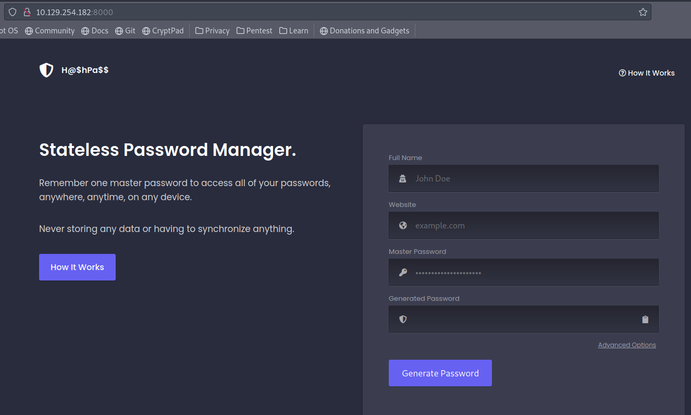

# Hancliffe

This is the writeup guided for Hancliffe Hack the Box machine.

# Port Scan

We’ve started with a full port scan on host.

```bash
─[us-dedivip-1]─[10.10.14.63]─[th3g3ntl3m4n@htb]─[~/htb/Hancliffe]
└──╼ [★]$ sudo nmap -v -sS -Pn -p- --min-rate=300 --min-rate=500 10.129.254.182

PORT     STATE SERVICE
80/tcp   open  http
8000/tcp open  http-alt
9999/tcp open  abyss
```

Next we’ve performed a versioned detailed port scan.

```bash
─[us-dedivip-1]─[10.10.14.63]─[th3g3ntl3m4n@htb]─[~/htb/Hancliffe]                                                                                                                            
└──╼ [★]$ sudo nmap -vv -A -sC -Pn -p 80,8000,9999 -oA nmap/hancliffe 10.129.254.182

PORT     STATE SERVICE REASON          VERSION                                                                                                                                                
80/tcp   open  http    syn-ack ttl 127 nginx 1.21.0                                                                                                                                           
| http-methods:                                                                                                                                                                               
|_  Supported Methods: GET HEAD                                                                                                                                                               
|_http-title: Welcome to nginx!                                                                                                                                                               
|_http-server-header: nginx/1.21.0                                                                                                                                                            
8000/tcp open  http    syn-ack ttl 127 nginx 1.21.0                                                                                                                                           
|_http-title: HashPass | Open Source Stateless Password Manager                                                                                                                               
| http-methods:                                                                                                                                                                               
|_  Supported Methods: GET HEAD POST                                                                                                                                                          
|_http-server-header: nginx/1.21.0                                                                                                                                                            
9999/tcp open  abyss?  syn-ack ttl 127                                                                                                                                                        
| fingerprint-strings:                                                                                                                                                                        
|   DNSStatusRequestTCP, DNSVersionBindReqTCP, FourOhFourRequest, GenericLines, GetRequest, HTTPOptions, Help, JavaRMI, Kerberos, LANDesk-RC, LDAPBindReq, LDAPSearchReq, LPDString, NCP, Note
sRPC, RPCCheck, RTSPRequest, SIPOptions, SMBProgNeg, SSLSessionReq, TLSSessionReq, TerminalServer, TerminalServerCookie, X11Probe:                                                            
|     Welcome Brankas Application.                                                                                                                                                            
|     Username: Password:                                                                                                                                                                     
|   NULL:                                                                                                                                                                                     
|     Welcome Brankas Application.                                                                                                                                                            
|_    Username:
```

We’ve found three open ports on host with the details above. We can see that the port 80 there is a Nginx default home page. On port 8000 we have the following.



# Enumeration

Checking the source-code page we’ve discovered that the page runs PHP.


Accessing the port 9999 we’ve got.


Let’s perform a brute-force directories on web service running on port 80.

```bash
─[us-dedivip-1]─[10.10.14.63]─[th3g3ntl3m4n@htb]─[~/htb/Hancliffe]
└──╼ [★]$ gobuster-ippsec dir -d -e -u "http://10.129.146.136/" -w "/opt/SecLists/Discovery/Web-Content/raft-large-directories-lowercase.txt" -t 50 -x txt,php -o gobuster/hancliffe_root

http://10.129.146.136/maintenance
```

Accessing the URL above we’ve got a redirection to.


Searching on Google for “nuxeo” we’ve got its repository on GitHub and there we could see that it is developed in Java.


Let’s perform a gobuster on this directory found.

```bash
─[us-dedivip-1]─[10.10.14.63]─[th3g3ntl3m4n@htb]─[~/htb/Hancliffe]
└──╼ [★]$ gobuster dir -e -u "http://10.129.96.116/maintenance/" -w "/opt/SecLists/Discovery/Web-Content/raft-small-words-lowercase.txt" -x txt,jsp -o gobuster/hancliffe_maintenance

http://10.129.96.116/maintenance/index.jsp            (Status: 200) [Size: 714]
http://10.129.96.116/maintenance/.xhtml               (Status: 401) [Size: 221]
http://10.129.96.116/maintenance/.                    (Status: 200) [Size: 714]
http://10.129.96.116/maintenance/.jsf                 (Status: 200) [Size: 117]
http://10.129.96.116/maintenance/.seam                (Status: 401) [Size: 221]
http://10.129.96.116/maintenance/.faces               (Status: 401) [Size: 221]
```

Trying to access the URL as [http://10.129.96.116/mainten](http://10.129.96.116/maintenance)ance/index.jsp we’ve got.


Let’s execute a brute-force directories on service running on the port 8000.

```bash
─[us-dedivip-1]─[10.10.14.63]─[th3g3ntl3m4n@htb]─[~/htb/Hancliffe]
└──╼ [★]$ gobuster-ippsec dir -d -e -u "http://10.129.254.182:8000/" -w "/opt/SecLists/Discovery/Web-Content/raft-large-directories-lowercase.txt" -t 50 -x txt,php -o gobuster/hancliffe_root

http://10.129.254.182:8000/includes (Status: 301)
http://10.129.254.182:8000/assets (Status: 301)
http://10.129.254.182:8000/license (Status: 200)
```

Let’s capture the request from service on port 8000 using burp suite.


Now, let’s burping the maintenance request.


We know we have a nginx and a possible Tomcat server running on this host, so let’s try to bypass the URL in order to access `/manager/html` endpoint.

First we go to nuxeo.


And then to `/nuxeo/nxstartup.faces`.


Let’s try to bypass this last request.


And we’ve got the login page.


Doing bypass again.


We’ve got the login page.

