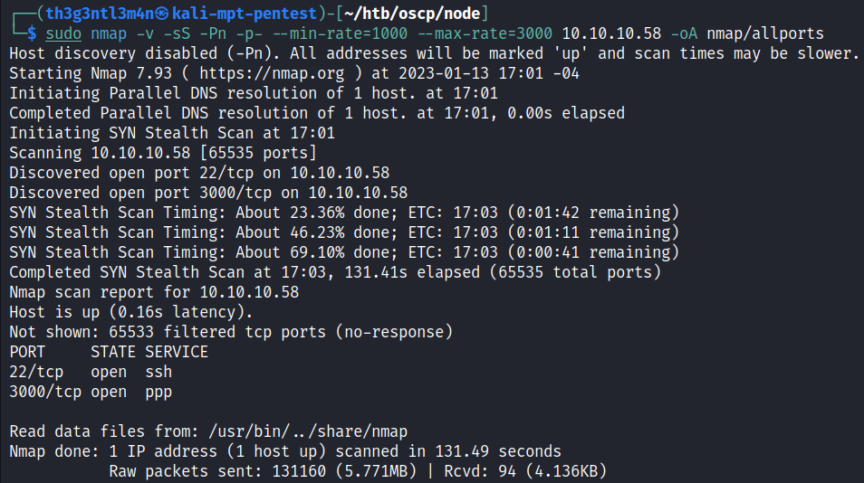

# Node

We’ve started executing a full port scan on the host.



Now let’s execute a port scan on the open ports on the host.


Accessing the webserver running on port 3000 we got the following on our browser.


Running a brute-force directory we got the following:


Analyzing the page’s source code we got the following JavaScript files.


By accessing those files we could get the API for the user’s path resource of the application.


Accessing the endpoint [`http://10.10.10.58:3000/api/users`](http://10.10.10.58:3000/api/users) we got the users that are save on the application.


With JohnTheRipper we could crack three hashes:

| **USERNAME** | **PASSWORD** | **ADMIN** |
| --- | --- | --- |
| myP14ceAdm1nAcc0uNT | manchester | True |
| tom | spongebob | False |
| mark | snowflake | False |

Log into the application using the administrator user, we got the following:


Downloading the backup file.

By examining the backup file we notice this is encoded on the base64 algorithm.


We first decrypt this file and save the output on myplace file. Checking the myplace file we got that the file is a ZIP file, so we try to unzip it.


The ZIP file needs a password in order to unzip it. Using `zip2john` tool we extracted the hash and save it on a file in order to crack this hash using the JohnTheRipper tool.


The hash file is:


Cracking it with john:


The password from ZIP file is **magicword**.


We noticed that the file unzipped was the backup of the whole site running on port 3000.

 Open the file we’ve got something like a password from user mark where there is a login URL using MongoDB database.


We tried to log in on to the SSH service using this password and we were successful.


| **USERNAME** | **PASSWORD** | **SERVICE** |
| --- | --- | --- |
| mark | 5AYRft73VtFpc84k | SSH |

## Privilege Escalation - Lateral Moviment

We searched around the host and executing the `ps` command we could check what process are running under user `tom`.


Checking the app.js in /var/scheduler/ we’ve got:


The code above is executing a system command. Knowing that we insert a command in `tasks` collection on MongoDB. We copy the `bash` to `/tmp` directory and set the SUID bit for it.


Executing the `test` bash.


## Privilege Escalation - root

Searching for some privilege escalation as root, we found an application that is set the SUID bit.


Checking this application on its directory


We have to set up priviously our copy of bash user tom on group admin. We’ve do it using the tasks scheduler function on MongoDB.


Our copy of bash now is


Executing our malicious bash


We copied, via `netcat`, the `backup` binary to our local machine in order to analyze it.


Executing `strings` command to `backup` binary we’ve got the interesting part of the binary.


Executing the binary under strace tool we’ve got

```bash
╭─[us-vip-21]-[10.10.14.2]-[th3g3ntl3m4n@kali-mpt-pentest]-[~/htb/oscp/images/exploitation/privesc/backup]                                                                                    
╰─ $ strace ./backup 1 2 3                                                                                                                                                                  
execve("./backup", ["./backup", "1", "2", "3"], 0x7ffdb6de1ce8 /* 56 vars */) = 0                                                                                                           
[ Process PID=36146 runs in 32 bit mode. ]
```


Checking this directory on the host.


We created the `keys` file on `/etc/myplace` directory. Back on the `app.js` file there is a line where the application get the `backup_key` from this file.


And the variable `backup_key` on the code is the second one on the `keys` file.


In the file `keys`:


Executing the `backup` tool like it shows on the `app.js`:


So, after analyzing the backup’s tool code we could inject bash commands by breaking the `zip` command flow and change `>/dev/null` into `/bin/bash`.

