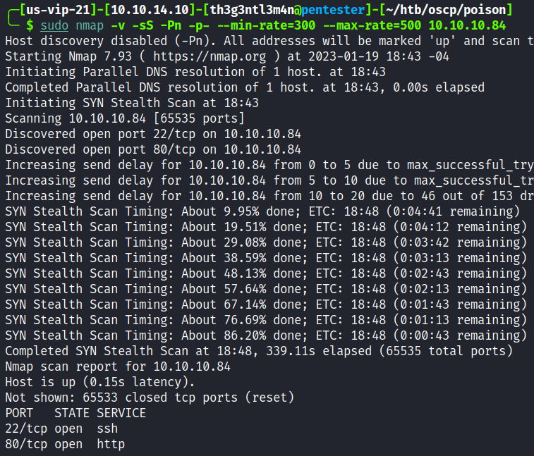

# Poison

We started with the full port scan on the host.

We found two ports open. We executed a detailed port scan on that open ports.

Accessing the webpage on port 80 we got the following page.

On the page, we could test some PHP scripts. Testing one of the was suggested we got.

The `pwdbackup.txt` file is interesting and we write the name of the file on the parameter `?file=pwdbackup.txt` and we got.

In the file, there is a note saying the password was encoded 13 times. On the CyberChef site we could decrypt the encoded password by applying 13 times Base64 decoded.

As we could read the `pwdbackup` file we could have a Local File Inclusion vulnerability. Trying to read the `/etc/passwd` file from the system, we got.

We have the user `charix` on the system. Tried to log in via SSH with that decrypted password we were successful.

## Privilege Escalation

In the crarix’s home directory, we found a ZIP file called `secret.zip`.

Trying to unzip the file, we got a message that the zip file needs a passphrase.

We downloaded the file to our local machine and extract the hash and try to crack this hash.

Trying to use the same password of the user charix, we could unzip the file.

Running the [LinPEAS](https://github.com/carlospolop/PEASS-ng/tree/master/linPEAS) script we got the interesting VNC process running as root user.

Checking the ports are open on the host.

We port forwarding the 5901 from the server to our local machine:

Doing some research we have found a tool that cracks VNC passwords. We tried to crack that secret file we downloaded from the server and we were successful.

Trying to connect to the VNC service that is running on our local machine using the `vncviewer` we were successful.

We could compromise the root user.

## Persistence root Access

Now we have access as root, we copied our public key to the host via SSH `scp`command.

And we write our public key in authorized_keys file in root SSH directory.

Now we have access to the host as root user.

