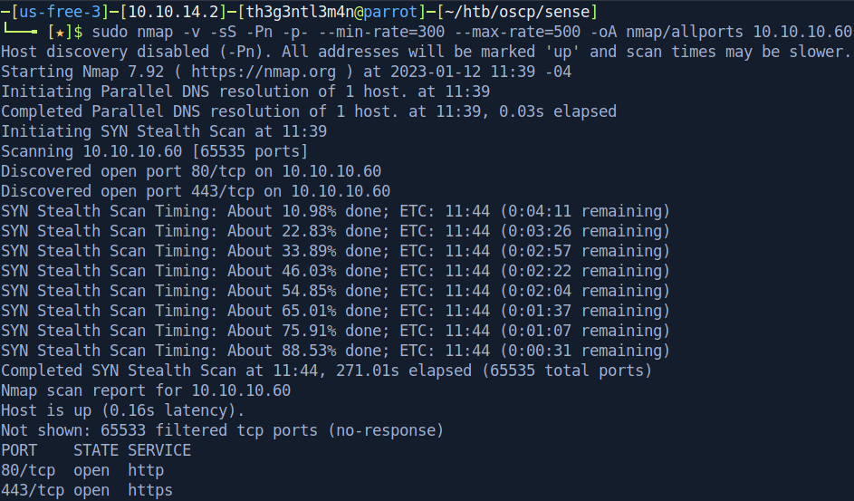

# Sense

## Reconnaissance

We’ve begun executing a full port scan on the host.

Now let’s execute a port scan on the open ports found.

We found two ports open, 80 and 443, which run both web servers. Accessing the webpage shows us a pfsense page login.

We’ve executed a brute-force directory in order to find some hidden directories.

After running the brute-force attack we’ve found a text file containing the following:

We tested the credentials `rohit:pfsense` because when we search about pfsense default credentials we’ve got the admin user with the password `pfsense`. Log into the pfsense we got the dashboard of the system and got the pfsense’s version and the operating system that it is running on.

Searching for some public exploits on the Web we could find that:

Executing the exploit like it asks we’ve got a shell on the host.

We’ve got access as root and get both files containing the evidence.

